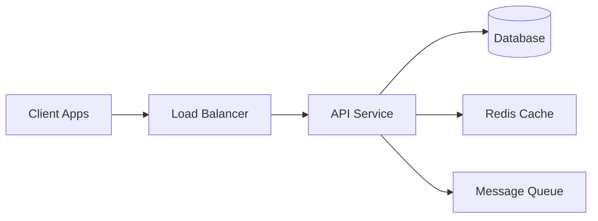

# System Design Case Study Generation Prompt

You are a senior software engineer and system architect. Generate a system design case study suitable for a GitHub portfolio.

---

## 🎯 CHOOSE YOUR LEVEL

### 🟢 PHASE 1 - Interview Ready (Recommended)
- **Time**: 2-3 hours generation
- **Output**: 2,000-3,000 words
- **Depth**: High-level architecture, trade-offs, **NO CODE**
- **Best For**: Interview prep, initial portfolio, learning fundamentals
- **Includes**: Architecture diagram, component breakdown, API design, scaling strategy, trade-offs

### 🔵 PHASE 2 - Production Grade (Advanced)
- **Time**: 5-8 hours generation
- **Output**: 8,000-15,000 words
- **Depth**: Code snippets (7-10), database schemas, deployment, monitoring, cost analysis
- **Best For**: Senior positions, comprehensive portfolio, deep technical showcase
- **Includes**: Everything from Phase 1 + implementation code, CI/CD, security, testing, cost estimation

---

## 📥 INPUT PARAMETERS

Fill in these values before generation:

```
System Type: [INSERT - e.g., URL Shortener, Chat App, Ride-Sharing]
Phase: [PHASE 1 or PHASE 2]
Scale:
  - Users: [e.g., 1M DAU, 10K concurrent]
  - Throughput: [e.g., 50K req/s]
  - Latency: [e.g., <100ms p99]
  - Availability: [e.g., 99.9%]
Constraints: [e.g., GDPR compliance, cost optimization]
```

---

# 🟢 PHASE 1 GENERATION INSTRUCTIONS

## 1. System Overview (300 words)

Provide:
- **Problem Statement**: What problem does this solve? (2-3 sentences)
- **Functional Requirements**: 5-7 core features
- **Non-Functional Requirements**: 3-4 items (scalability, availability, latency)
- **Success Metrics**: 3-4 KPIs to measure

## 2. Scale & Constraints (200 words)

Define:
- **Users**: DAU, concurrent users
- **Throughput**: Requests/sec, messages/sec, transactions/day
- **Latency**: p95 or p99 targets
- **Availability**: Target uptime
- **Data Volume**: Storage requirements
- **Key Constraints**: Cost, compliance, geographic distribution

## 2.1. Capacity Estimation (150 words)

Provide back-of-envelope calculations:

### Storage Calculation
- **Users**: 10M users × 1KB profile data = 10GB
- **Content**: 100M posts × 5KB each = 500GB
- **Media**: 10M images × 500KB = 5TB
- **Total**: ~5.5TB (add 30% buffer = 7TB)

### Bandwidth Calculation
- **Daily Active Users**: 1M DAU × 50 requests/day = 50M requests/day
- **QPS**: 50M / 86,400 seconds ≈ 580 QPS average
- **Peak**: 580 × 3 (peak multiplier) = 1,740 QPS
- **Bandwidth**: 580 QPS × 10KB response = 5.8 MB/s average

### Infrastructure Sizing
- **Servers**: 1,740 QPS / 500 QPS per server = 4 servers (minimum)
- **Database**: 7TB storage + replication (×2) = 14TB total
- **Cache**: 20% hot data = 1.4TB Redis cluster

## 3. High-Level Architecture Diagram

Create a **Mermaid.js flowchart** showing:
- Client (web/mobile)
- API Gateway / Load Balancer
- Backend Services (3-5 main services)
- Database (SQL/NoSQL)
- Cache (Redis/Memcached)
- Message Queue (Kafka/RabbitMQ)
- External Services

**Example:**


## 4. Component Breakdown (800 words)

For each component, answer: **What? Why? How?**

### Backend Service
- **Language/Framework**: Choice and rationale (Python/Flask, Node.js/Express, Go, Java/Spring)
- **Architecture**: Monolith vs Microservices (justify for this scale)
- **API Type**: REST, GraphQL, or gRPC (why?)
- **Companies Using This**: (e.g., "WhatsApp uses Erlang for concurrency, Uber uses Go for performance")

### Database
- **Type**: SQL (PostgreSQL, MySQL) vs NoSQL (MongoDB, Cassandra) - why?
- **Core Tables**: List 3-5 main tables with purpose and relationships
  - Example: `users` (1) → `posts` (many) → `comments` (many)
- **Indexes**: What fields to index and why?
- **Scaling**: Replication (master-slave) or sharding approach
- **CAP Theorem Choice**: CP (consistency) or AP (availability) and why?

### Caching Layer
- **Technology**: Redis, Memcached, or CDN
- **What to Cache**: Which data and why?
- **Eviction Policy**: LRU, LFU, or TTL-based
- **Invalidation**: When and how to invalidate

### Message Queue
- **Use Case**: Async tasks, event processing, notifications
- **Technology**: Kafka (high throughput) vs RabbitMQ (simpler)
- **Topics/Queues**: Main topics and their purpose

### Load Balancing
- **Type**: L4 (TCP) vs L7 (HTTP)
- **Algorithm**: Round-robin, least-connections, consistent hashing
- **Scaling**: Horizontal scaling triggers

## 5. API Design (400 words)

Define **3-5 core endpoints**:

### Endpoint Template:
```
POST /api/v1/resource
Headers: Authorization: Bearer <token>
Request Body:
{
  "field1": "value",
  "field2": 123
}

Response: 201 Created
{
  "id": "xyz",
  "field1": "value",
  "created_at": "2025-10-31T12:00:00Z"
}
```

Include:
- HTTP method (GET, POST, PUT, DELETE)
- Endpoint path
- Request example
- Response example
- Status codes (200, 201, 400, 401, 500)

## 6. Data Flow (300 words)

Describe the flow for **2-3 key operations**:

### Write Operation Example:
1. Client sends POST request → Load Balancer
2. LB routes to API server via round-robin
3. API validates request, checks auth
4. API writes to Database
5. API invalidates cache for affected keys
6. API publishes event to Message Queue
7. API returns 201 response to client
8. Background worker processes event from queue

### Read Operation Example:
1. Client sends GET request
2. API checks Redis cache
## 7. Scaling Strategy (300 words)

### Horizontal Scaling
- **Application Tier**: Stateless services, add more instances behind LB
- **Database**: Read replicas for read-heavy workload
- **Cache**: Distributed Redis cluster with consistent hashing
- **Queue**: Partition/shard messages across multiple brokers

### Bottleneck Prevention
- **Database**: Connection pooling, query optimization, indexes
- **Network**: CDN for static assets, gzip compression
- **Memory**: Cache hot data, evict cold data

## 7.1. Failure Scenarios & Mitigation (250 words)

### Scenario 1: Database Failure
## 8. Security Considerations (200 words)

### Authentication & Authorization
- **Mechanism**: JWT tokens with 24-hour expiration
- **Why**: Stateless, scalable across multiple servers
- **Flow**: User login → Generate JWT → Include in Authorization header

### Data Encryption
- **In Transit**: TLS 1.3 for all API calls (HTTPS)
- **At Rest**: AES-256 encryption for sensitive data (passwords, payment info)
- **Key Management**: AWS KMS or HashiCorp Vault

### Protection Mechanisms
- **Rate Limiting**: 100 requests/min per user, 1000/min per IP (token bucket algorithm)
- **DDoS Protection**: Cloudflare or AWS Shield at edge
- **Input Validation**: Sanitize all inputs to prevent SQL injection, XSS
- **CORS**: Whitelist trusted domains only

## 9. Monitoring & Observability (200 words)

### Key Metrics to Track
- **Latency**: p50, p95, p99 response times (target: <100ms p99)
- **Error Rate**: 4xx and 5xx errors (target: <0.1%)
- **Throughput**: Requests per second (QPS)
- **Saturation**: CPU, memory, disk usage (alert at 80%)

### Alerting Thresholds
- **Critical**: Error rate >1%, p99 latency >500ms, any service down
- **Warning**: Error rate >0.5%, p99 latency >200ms, CPU >80%

### Health Checks
- **Liveness**: `/health` endpoint (service is running)
- **Readiness**: `/ready` endpoint (service can handle traffic)
- **Dependencies**: Check DB, cache, queue connections

### Logging
- **Structured Logs**: JSON format with request_id, user_id, timestamp
- **Log Levels**: ERROR, WARN, INFO, DEBUG
- **Retention**: 30 days hot, 90 days cold storage

## 10. Trade-offs & Design Decisions (400 words)

### Key Decision 1: [e.g., SQL vs NoSQL]
- **Choice**: PostgreSQL
## 11. Future Enhancements (200 words)

List **3-5 improvements** for later phases:
1. **Auto-scaling**: Horizontal pod autoscaling based on CPU/memory
2. **Multi-region**: Deploy to 3+ regions with geo-routing
3. **Advanced Caching**: Cache warming, predictive loading
4. **Real-time Features**: WebSocket support for live updates
5. **Advanced Observability**: Distributed tracing with Jaeger, detailed metricsres

### Key Decision 3: [e.g., Monolith vs Microservices]
- **Choice**: Start with modular monolith
- **Why**: Simpler to deploy/debug at current scale
- **Trade-off**: Will need to split as team/scale grows

### Key Decision 4: [e.g., Consistency Model]
- **Choice**: Strong consistency for critical data (payments, inventory), eventual consistency for non-critical (likes, views)
- **Why**: Balance between performance and correctness
- **Trade-off**: Increased complexity managing different consistency models

### Known Limitations
- Single region deployment
- Manual scaling (no auto-scaling)
- Basic security (no advanced rate limiting)a

## 8. Trade-offs & Design Decisions (400 words)

### Key Decision 1: [e.g., SQL vs NoSQL]
- **Choice**: PostgreSQL
- **Why**: ACID guarantees needed for transactions
- **Trade-off**: NoSQL would give better horizontal scaling, but we prioritize consistency

### Key Decision 2: [e.g., Sync vs Async]
- **Choice**: Async processing for non-critical operations
- **Why**: Improves response time, decouples services
- **Trade-off**: Eventual consistency, need to handle failures

### Key Decision 3: [e.g., Monolith vs Microservices]
- **Choice**: Start with modular monolith
- **Why**: Simpler to deploy/debug at current scale
- **Trade-off**: Will need to split as team/scale grows

### Known Limitations
- Single region deployment
- Manual scaling (no auto-scaling)
- Basic security (no advanced rate limiting)

## 9. Future Enhancements (200 words)

List **3-5 improvements** for later phases:
1. **Auto-scaling**: Horizontal pod autoscaling
2. **Multi-region**: Deploy to 3+ regions
3. **Advanced Caching**: Cache warming, predictive loading
4. **Real-time Features**: WebSocket support
5. **Observability**: Distributed tracing, detailed metrics

---

## ✅ PHASE 1 OUTPUT FORMAT

- **Markdown**: GitHub-ready with proper headers
- **Diagrams**: Mermaid.js only (renderable on GitHub)
- **Length**: 2,500-3,500 words (expanded with new sections)
- **Tone**: Professional, interview-appropriate
- **Focus**: Architectural decisions, trade-offs, capacity planning, failure handling

## ✅ PHASE 1 MUST INCLUDE

1. System Overview with requirements
2. Scale & Constraints + **Capacity Estimation**
3. Architecture Diagram (Mermaid)
4. Component Breakdown (with CAP theorem choice)
5. API Design
6. Data Flow
7. Scaling Strategy + **Failure Scenarios**
8. **Security Considerations** (auth, encryption, protection)
9. **Monitoring & Observability** (metrics, alerts, health checks)
10. Trade-offs (now includes consistency model)
11. Future Enhancements

## ❌ SKIP FOR PHASE 1

- Detailed code implementation (no actual code)
- Complete database DDL (just table names and relationships)
- Security implementation details (no JWT library code)
- Deployment/CI/CD configurations (no Kubernetes YAML)
- Cost breakdown with pricing (just mention cost considerations)
- Testing code and frameworks (just mention test approach)
- Monitoring tool configurations (no Prometheus config)

---

# 🔵 PHASE 2 GENERATION INSTRUCTIONS

## Additional Sections for Phase 2

### 1. Detailed Database Schema

Provide complete DDL:
```sql
CREATE TABLE users (
  id UUID PRIMARY KEY,
  username VARCHAR(50) UNIQUE NOT NULL,
  email VARCHAR(255) UNIQUE NOT NULL,
  password_hash VARCHAR(255) NOT NULL,
  created_at TIMESTAMP DEFAULT NOW(),
  INDEX idx_username (username),
  INDEX idx_email (email)
);
```

Include:
- All tables with relationships
- Indexes with justification
- Partitioning strategy
- Migration approach

### 2. Code Snippets (7-10 Examples)

Provide **complete, runnable code** with comments:

1. **Backend API Endpoint** - Full CRUD operation
2. **Real-Time Handler** - WebSocket server
3. **Database Query** - Complex query with ORM
4. **Caching Logic** - Cache-aside pattern
5. **Message Queue** - Producer and consumer
6. **Authentication Middleware** - JWT validation
7. **Error Handling** - Global error handler
8. **Configuration** - Docker Compose or K8s manifest
9. **Rate Limiting** - Token bucket implementation
10. **Health Check** - Liveness and readiness probes

**Language**: [Specify: Python, Node.js, Go, Java]

### 3. Security Implementation

#### Authentication
```javascript
// JWT middleware example
function authenticateJWT(req, res, next) {
  const token = req.headers.authorization?.split(' ')[1];
  if (!token) return res.status(401).json({ error: 'No token' });
  
  jwt.verify(token, SECRET_KEY, (err, user) => {
    if (err) return res.status(403).json({ error: 'Invalid token' });
    req.user = user;
    next();
  });
}
```

Include:
- Authentication mechanism (JWT, OAuth 2.0)
- Authorization (RBAC)
- Encryption (at rest and in transit)
- Secrets management
- Input validation
- SQL injection/XSS prevention

### 4. Deployment & CI/CD

#### Dockerfile
```dockerfile
FROM node:18-alpine
WORKDIR /app
COPY package*.json ./
RUN npm ci --only=production
COPY . .
EXPOSE 3000
CMD ["node", "server.js"]
```

#### Kubernetes Deployment
```yaml
apiVersion: apps/v1
kind: Deployment
metadata:
  name: api-service
spec:
  replicas: 3
  selector:
    matchLabels:
      app: api-service
  template:
    metadata:
      labels:
        app: api-service
    spec:
      containers:
      - name: api
        image: myapp/api:1.0.0
        ports:
        - containerPort: 3000
        resources:
          requests:
            memory: "256Mi"
            cpu: "250m"
          limits:
            memory: "512Mi"
            cpu: "500m"
```

Include:
- CI/CD pipeline (GitHub Actions, Jenkins)
- Blue-green or canary deployment
- Infrastructure as Code (Terraform)
- Auto-scaling configuration

### 5. Monitoring & Observability

#### Prometheus Metrics
```javascript
const promClient = require('prom-client');

const httpRequestDuration = new promClient.Histogram({
  name: 'http_request_duration_seconds',
  help: 'Duration of HTTP requests in seconds',
  labelNames: ['method', 'route', 'status_code']
});

// Middleware to track request duration
app.use((req, res, next) => {
  const end = httpRequestDuration.startTimer();
  res.on('finish', () => {
    end({ method: req.method, route: req.route?.path, status_code: res.statusCode });
  });
  next();
});
```

Include:
- Metrics collection (Prometheus)
- Distributed tracing (Jaeger)
- Logging (ELK Stack)
- Alert rules
- Dashboards

### 6. Testing Strategy

```javascript
// Integration test example
describe('POST /api/urls', () => {
  it('should create a shortened URL', async () => {
    const response = await request(app)
      .post('/api/urls')
      .send({ url: 'https://example.com/very-long-url' })
      .expect(201);
    
    expect(response.body).toHaveProperty('short_code');
    expect(response.body.short_code).toHaveLength(7);
  });
});
```

Include:
- Unit tests
- Integration tests
- E2E tests
- Load testing (k6, JMeter)
- Test automation in CI

### 7. Cost Estimation

#### Infrastructure Costs
| Component | Monthly Cost |
|-----------|-------------|
| EC2 Instances (3 x t3.medium) | $150 |
| RDS PostgreSQL (db.t3.medium) | $100 |
| ElastiCache Redis (cache.t3.micro) | $50 |
| Load Balancer | $20 |
| S3 Storage (100GB) | $2 |
| CloudWatch Logs | $10 |
| **Total** | **$332/month** |

Include:
- Compute costs
- Storage costs
- Network costs
- Managed services
- Cost per user/request
- Optimization opportunities

### 8. Repository Structure

```
project-name/
├── README.md                 # This case study
├── docs/
│   ├── architecture.md       # Detailed architecture
│   ├── api-spec.md          # API documentation
│   └── deployment.md        # Deployment guide
├── diagrams/
│   ├── architecture.mmd     # Mermaid diagrams
│   └── data-flow.mmd
├── src/
│   ├── backend/
│   │   ├── api/             # API endpoints
│   │   ├── models/          # Data models
│   │   ├── services/        # Business logic
│   │   └── utils/           # Utilities
│   ├── frontend/            # Frontend application
│   └── shared/              # Shared code
├── infrastructure/
│   ├── terraform/           # IaC files
│   ├── kubernetes/          # K8s manifests
│   └── docker/              # Dockerfiles
├── tests/
│   ├── unit/
│   ├── integration/
│   └── e2e/
└── scripts/                 # Utility scripts
```

---

## ✅ PHASE 2 OUTPUT FORMAT

- **Markdown**: GitHub-ready, well-structured
- **Diagrams**: Mermaid.js (3-5 diagrams)
- **Code**: 7-10 complete, runnable snippets
- **Length**: 8,000-15,000 words
- **Tone**: Production-grade, comprehensive
- **Focus**: Implementation details, deployment, cost, testing

---

## 🎓 USAGE EXAMPLE

### Input:
```
System Type: URL Shortener Service
Phase: PHASE 1
Scale:
  - Users: 10M DAU
  - Throughput: 100K req/s
  - Latency: <10ms p99
  - Availability: 99.9%
Constraints: Global CDN, cost optimization
```

### Output:
- 2,500 word case study
- 1 architecture diagram (Mermaid)
- 3 API endpoints documented
- Trade-offs explained (SQL vs NoSQL, sync vs async)
- Scaling strategy outlined
- Interview-ready in 2-3 hours

---

## 📝 FINAL CHECKLIST

### Phase 1 Must-Haves:
- [ ] System overview with requirements
- [ ] Scale and constraints defined
- [ ] Architecture diagram (Mermaid)
- [ ] Component breakdown (5 sections)
- [ ] API design (3-5 endpoints)
- [ ] Data flow (2-3 operations)
- [ ] Scaling strategy
- [ ] Trade-offs (3-5 decisions)
- [ ] Future enhancements
- [ ] 2,000-3,000 words total

### Phase 2 Must-Haves (in addition to Phase 1):
- [ ] Complete database schema with DDL
- [ ] 7-10 code snippets (runnable)
- [ ] Security implementation
- [ ] Deployment configuration (Docker + K8s)
- [ ] CI/CD pipeline
- [ ] Monitoring setup (Prometheus + Grafana)
- [ ] Testing strategy with examples
- [ ] Cost estimation breakdown
- [ ] 8,000-15,000 words total
