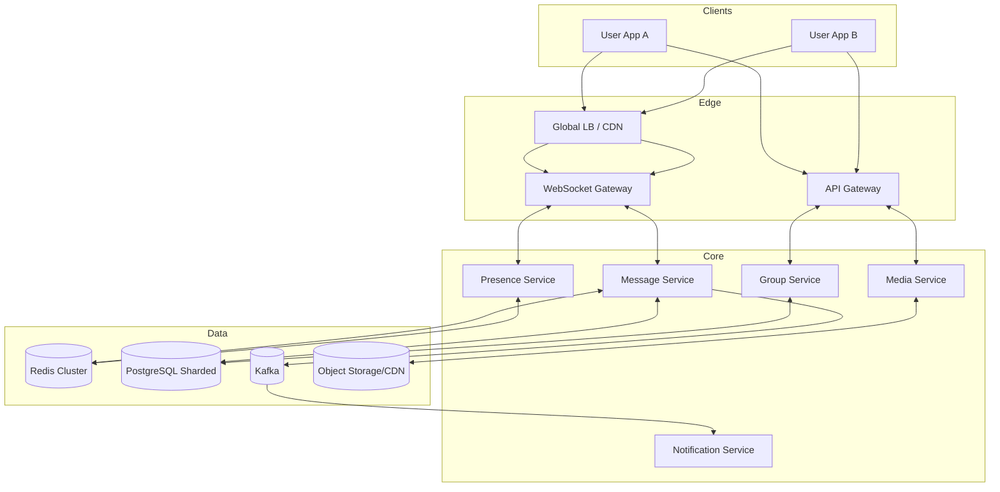
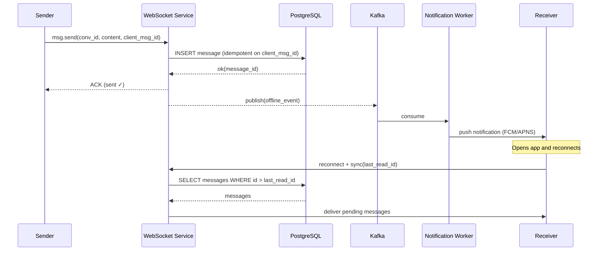
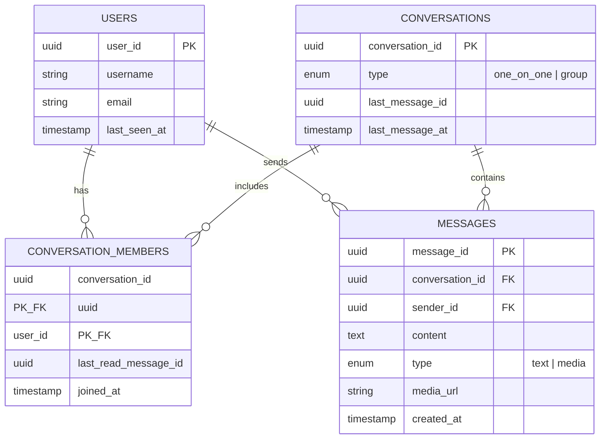
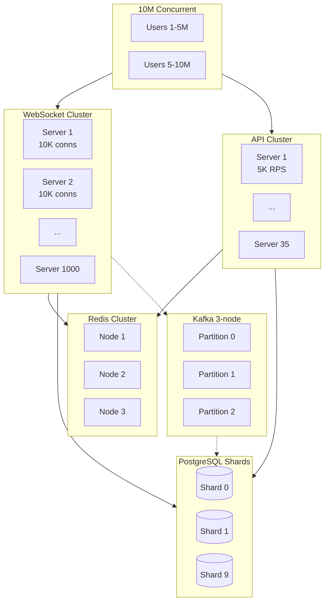
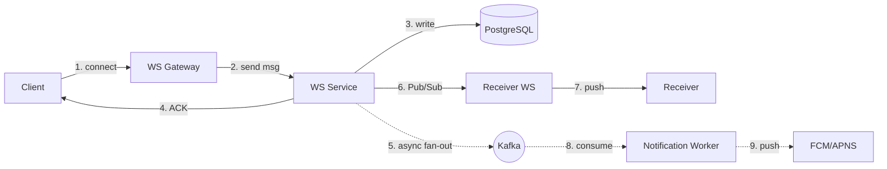

# 2) High-Level Architecture (Most Detailed)



## Data Flow (Send Message) in 8 steps

1) User A sends a message via WebSocket; gateway authenticates JWT and enforces rate limits.
2) Gateway calls Message Service with {conversation_id, sender_id, content, client_msg_id}.
3) Message Service validates membership; checks Redis for dedup on client_msg_id (TTL 5m).
4) Persist: insert message, update conversation.last_message_at in PostgreSQL (shard by conversation_id).
5) ACK sender with {message_id, server_timestamp, status: "sent"}.
6) Publish to Redis Pub/Sub channel conv:{conversation_id} for cross-server fanout.
7) Receiver's WS server delivers to User B; Message Service tracks delivery/read receipts.
8) Async: emit Kafka event for notifications (offline users), indexing, analytics.

## Connection Management

- WebSocket lifecycle: connect → JWT auth → register {user_id: ws_server, conn_id} in Redis (TTL 60s).
- Heartbeat: client PING every 30s; server PONG; close if no response within 60s.
- Reconnect: exponential backoff (1s, 2s, 4s, max 30s); fetch missed messages since last_seen_ts.
- Server restart: LB redirects to healthy nodes; clients reconnect; fetch missed messages from DB.
- Multi-device: multiple WS connections per user_id; fanout to all devices.

## Message Routing (Cross-Server Delivery)

Problem: User A is on WS-Server-1, User B is on WS-Server-3.

Solution: Redis Pub/Sub fanout.
- Message Service publishes to channel: user:{recipient_id}:messages.
- Each WS server subscribes for its connected users; delivers locally if user is connected.
- Latency: ~50–80ms end-to-end (DB write + Pub/Sub + delivery).

## Core Data Model (minimal)

See '3. Data Model & Storage Design' for the authoritative schema and storage plan.

### Critical Path and Latency

- Path: validate → DB write → ACK → cross-server delivery
- Typical latency: ~40ms p50; <100ms p99 (WS 5ms, DB 20ms, Pub/Sub 10ms, delivery 5ms)

### Offline Recipient Flow (sequence)



## Group Message Fanout

1:N delivery for groups (example: 100 members):
- Persist one message to DB (status: sent)
- Publish to Kafka topic `group.messages` with the member list
- Consumer workers fan out per member:
  - If online (presence in Redis): publish to user's Pub/Sub channel for instant delivery
  - If offline: enqueue to `offline_messages` (Kafka) → Notification Service → push notification
- Async: track per-recipient delivery/read status (e.g., last_read_message_id)

## ML Augmentations (Optional)

Targeted enhancements that don’t change core guarantees:

1) Content Moderation (sync)
- Text classification for spam/profanity before DB write
- Model: Distilled BERT, p99 <10ms, deployed as a sidecar
- Action: Block high-confidence violations; flag borderline for review

2) Notification Ranking (async)
- Prioritize push notifications by sender affinity, recency, engagement
- Features: message frequency, relationship strength, time-of-day
- Model: Gradient boosting, retrained weekly, features in feature store

3) Semantic Search (async)
- Generate embeddings post-write; store in vector index (pgvector/OpenSearch k-NN)
- Query via cosine similarity; fallback to SQL full-text when needed

### Edge-Case Handling

| Scenario | Strategy |
|----------|----------|
| Connection flap | Exponential backoff (1s,2s,4s…30s max); resume from last_read_id |
| Celebrity group (1M members) | Hybrid fanout: push only to online + mentioned; others fetch on open |
| Hot shard | Detect write skew; re-shard hot conversations; per-conversation rate limits |
| Kafka lag | Alert when lag >10K; scale consumers; DLQ for poison messages |
| Redis down | Cache-miss fallback to DB; presence may degrade gracefully |

Operational notes:
- All ML paths have simple rule-based fallbacks
- Shadow deploy models; A/B test impact before full rollout
- SLOs: Moderation p99 <10ms; ranking nDCG@10 >0.7; embedding drift <5%

## 3. Data Model & Storage Design


### Database Schema (PostgreSQL)



**Indexes:**
- `messages(conversation_id, created_at DESC)` — pagination
- `conversation_members(user_id)` — user's conversations
- `messages(client_msg_id)` — idempotency lookup (unique)

**Sharding:**
- **Key:** `conversation_id` (hash-based, 10 shards initially)
- **Why:** Keeps all messages for a conversation on one shard; enables local ordering and pagination
- **When to re-shard:** Write throughput >8K/s per shard or storage >1TB per shard

### Specialized Storage

| Store | Purpose | Data | TTL/Retention |
|-------|---------|------|---------------|
| **Redis Cache** | Hot reads | Recent 50 msgs per conversation | 1h |
| **Redis Presence** | Online status | `user:{id}:presence` | 60s auto-expire |
| **Redis Pub/Sub** | Cross-server routing | Ephemeral channels | N/A |
| **Object Storage (S3)** | Media files | Images, videos, docs | Permanent (CDN 90d cache) |
| **Kafka (log)** | Event stream | Offline msgs, analytics | 7 days |

### SQL vs NoSQL Trade-offs

| Criterion | PostgreSQL (Chosen) | Cassandra (Alternative) |
|-----------|---------------------|-------------------------|
| **Ordering** | Strong (ACID, single-shard) | Eventual (race conditions) |
| **Transactions** | ACID per shard | Limited (LWT slow) |
| **Write throughput** | 10K/s per shard | 100K/s+ |
| **Sharding complexity** | Manual re-shard | Auto-distribute |
| **Ops familiarity** | Mature tooling | Steeper learning curve |

**Decision:** PostgreSQL for correctness (ordering critical); shard proactively before bottlenecks.

### API surface (minimal)

- GET /conversations/{id}/messages?limit=50&before=cursor
- POST /messages { conversation_id, content, type, client_msg_id }
- POST /groups { name, member_ids[] }
- PUT /users/me/presence { status: online|away|offline }

### Redis keys (examples)

```
user:{id}:presence → online|offline (TTL 60s)
conv:{id}:messages → recent list (TTL 1h)
user:{id}:conn → ws_server:conn_id (TTL 5m)
channels: user:{id} / group:{id}
```

---

## 4. Scaling, Fault Tolerance & Observability

### Monitoring Cheat-Sheet

- WebSocket: Connection churn (reconnects/min); heartbeat timeouts; per-server connection count
- Message Service: Send latency p50/p95/p99; duplicate rate; DB write errors; Redis Pub/Sub lag
- Presence: Update lag (time since last heartbeat); stale connections (missed cleanup)
- Kafka: Consumer lag per topic; DLQ size; rebalance frequency
- PostgreSQL: Per-shard write QPS; replication lag; connection pool saturation; query p99
- Redis: Memory usage; eviction rate; Pub/Sub channel subscribers; command latency

### Scaling Strategy



**Scaling Rules:**
- **WebSocket:** Add server when avg conns >8K (target 10K max)
- **API:** Add when p95 >100ms or CPU >70%
- **Redis:** Add nodes when memory >80%; use cluster mode for >100GB
- **PostgreSQL:** Add shards when writes >8K/s per shard or storage >1TB
- **Kafka:** 3 partitions × 3 replicas; add partitions for >100K msg/s

### Fault Tolerance

| Failure | Impact | Recovery | Mitigation |
|---------|--------|----------|------------|
| **WS server crash** | 10K users disconnect | Auto-reconnect (exp backoff) | Health checks; rolling deploys |
| **Redis node down** | Cache misses → DB load | Cluster failover (5s) | Cache-aside fallback; alert on hit ratio drop |
| **DB primary down (shard)** | Writes fail for shard | Promote replica (30-60s) | Per-shard isolation; write retries |
| **Kafka lag** | Delayed notifications | Scale consumers; DLQ | Alert on lag >10K; idempotent consumers |

**Idempotency & Retries:**
```python
@retry(max_attempts=3, backoff=exponential_jitter)
def publish_to_kafka(event):
    kafka.send(topic="offline_messages", key=event.user_id, value=event, idempotent=True)
```

**Circuit Breaker (for downstream DB):**
```python
@circuit_breaker(failure_threshold=5, timeout=30s)
def write_to_db(message):
    return db.execute(INSERT_QUERY, message)
    # If 5 failures in 30s → open circuit → fail fast
```

**Content Moderation (synchronous gate):**
```python
def moderation_gate(text: str) -> bool:
    """
    Synchronous text classification; p99 < 10ms.
    Blocks only high-confidence violations (profanity, spam).
    Model: distilled BERT classifier; deployed as sidecar inference service.
    """
    score = model.predict(text)  # 0.0–1.0
    return score < THRESHOLD_HIGH  # e.g., 0.85
```

**Notification Prioritization (asynchronous):**
```python
def compute_priority(event: dict) -> float:
    """
    Rank notification importance post-ACK; published async to push queue.
    Features: sender_relationship, recency, message_length, user_engagement.
    Model: gradient boosting regression; updated weekly via batch training.
    """
    features = feature_store.get_online(event['recipient_id'])
    priority = ranking_model.predict(features + event_data)
    return priority  # 0.0 (low) → 1.0 (high)
```

### Observability

**Metrics (RED/USE):**
- **Rate:** msg/s, active connections, API RPS
- **Errors:** 5xx rate, failed sends, consumer retries
- **Duration:** p50/p95/p99 send latency, DB query time
- **Saturation:** CPU/mem per pod, Redis memory, DB connections, Kafka lag

**Logging:**
```json
{
  "timestamp": "2025-11-02T10:15:30Z",
  "level": "INFO",
  "service": "websocket-service",
  "trace_id": "abc123",
  "event": "message_sent",
  "conversation_id": "conv_456",
  "latency_ms": 42,
  "recipient_online": true
}
```

**Tracing (OpenTelemetry spans):**
- WS receive → validate → DB write → Redis update → Kafka publish → recipient deliver

**Alerts:**
- p99 latency >150ms (2 min sustained)
- WS reconnect spike >10% (5 min)
- Cache hit ratio <85%
- Kafka consumer lag >50K messages
- DLQ growth >100 msgs/min

**Model metrics (if ML enabled):**
- Moderation p99 <10ms; false-positive rate <2%
- Notification ranking: nDCG@10 >0.7 (engagement proxy)
- Embedding drift: cosine similarity vs baseline >0.95
- Feature freshness: <1h lag for online features

### Production hardening checklist

- Edge controls: global + per-user rate limits; request timeouts; circuit breakers; server-side authZ checks.
- Backpressure: cap WS send buffers; shed non-critical updates under load; producer backoff with jitter.
- Data integrity: idempotent writes (client_msg_id); monotonic message_id per conversation; cursor pagination.
- Messaging: idempotent consumers; DLQ with SLO for drain; partition by conversation_id when order matters.
- Cache: TTL by object type; negative caching where useful; warm hot rooms; always safe cache-miss path.
- Deploy/migrate: rolling deploys with conn draining; expand→migrate→contract schema changes; flags/canary/rollback.
- Observability: end-to-end traces; RED/USE dashboards; alerts on p95/p99, errors, WS reconnect spikes, cache hit drop, lag, DLQ growth.
- Resilience/DR: graceful degradation (fallback to polling); backups + restore drills; per-shard RPO/RTO targets.
- Security/compliance: secret rotation; PII minimization; retention + deletion (GDPR/CCPA); encryption in-transit/at-rest.

---

## Operational runbooks (concise)

1) Graceful WebSocket drain during deploy
- Mark instance as draining (remove from LB for new connections).
- Continue serving existing conns; send "server_maintenance" hint to clients to reconnect.
- After max grace (e.g., 2 minutes) or <50 active conns, close remaining with retry-after header; ensure reconnect backoff on client.

2) Kafka DLQ replay (offline notifications)
- Verify fix deployed and idempotency keys cover replay.
- Snapshot consumer group offsets; pause live consumers for topic.
- Re-consume DLQ to original topic/consumer with a small batch size; monitor error rate and lag; resume normal consumption.

3) Hot shard mitigation (PostgreSQL)
- Detect skew: write latency > p95 target or storage > threshold.
- Apply per-conversation rate limits; move read-heavy traffic to replicas.
- Split hotspot: create new shard and migrate targeted conversations (by hash range); update routing table; backfill asynchronously.

4) Cache warm-up (Redis)
- Identify top N conversations by recent activity.
- Preload last 50 messages into conv:{id}:messages.
- Enable negative caching for recent misses to reduce DB thundering herd.

5) Safe schema change (expand → migrate → contract)
- Expand: add nullable columns/new tables (no breaking changes).
- Migrate: backfill data in batches with throttling; dual-write temporarily.
- Contract: switch reads to new schema; remove legacy fields after soak period.

## 5. Security, Trade-offs & Summary

### Security

| Layer | Mechanism |
|-------|-----------|
| **Authentication** | JWT tokens (15-min TTL); refresh tokens (7-day, httpOnly cookie) |
| **Authorization** | Conversation membership check on every message send/read |
| **Encryption** | TLS 1.3 in transit; AES-256 at rest; future: E2EE (Signal protocol) |
| **Rate limiting** | Token bucket: 50 msgs/min per user; 10 RPS per IP |
| **PII protection** | Generic push payloads; scrub logs; GDPR delete API |
| **Compliance** | GDPR (data portability, deletion); store consent; audit logs |

### Trade-offs Summary

| Decision | Why Chosen | Alternative | When to Reconsider |
|----------|------------|-------------|-------------------|
| **WebSocket** | <100ms latency, bi-directional | Long polling, SSE | HTTP-only env (firewall) |
| **PostgreSQL** | Strong ordering, ACID | Cassandra | Extreme write scale (>100K/s global) |
| **Kafka** | Replay, high throughput | RabbitMQ, SQS | Low-latency <10ms; simple queues |
| **Redis Pub/Sub** | Cross-server routing | Direct WS mesh | Multi-region active-active |
| **Sharding by conversation** | Locality, ordering | Shard by user | Read-heavy user timelines |

### End-to-End Flow (Summary)



**Key insights:**
1. **Sync path:** WS → DB → ACK (40ms p50, 80ms p99)
2. **Async path:** Kafka → workers → notifications (eventual)
3. **Ordering:** Single-shard write + sortable `message_id` (ULID)
4. **Idempotency:** `client_msg_id` prevents duplicates on retries
5. **Presence:** Redis TTL keys auto-expire; Pub/Sub broadcasts updates

### Future Enhancements

- **Performance optimizations:**
    - Heuristic pre-caching (anticipate likely conversations based on recent activity)
    - Smart batching for large groups (priority and time-window based)
- **Advanced features:**
    - End-to-end encryption (Signal protocol integration)
    - Full-text search (Elasticsearch)
    - Multi-region active-active (CRDTs for conflict resolution)
    - Voice/video calling (WebRTC + SFU)

---

## Capacity Planning (Quick Reference)

| Metric | Calculation | Result |
|--------|-------------|--------|
| **Avg QPS** | 100M × 50 / 86,400 | 58K/s |
| **Peak QPS** | 58K × 3 | 174K/s |
| **Daily storage** | 5B × 1KB (text) + 0.5B × 50KB (media) | 5TB + 25TB |
| **WS servers** | 10M / 10K | 1,000 |
| **API servers** | 174K / 5K | 35 |
| **Redis** | 10% hot (1.2TB × 0.1) | 120GB |
| **DB shards** | Start 10; grow | 10 × 4 replicas |

---

## References

- **Patterns:** DDIA (Kleppmann), ByteByteGo (Alex Xu), Educative Modern System Design
- **Real-world:** Discord (scaling WS to billions), Uber/LinkedIn (Kafka), WhatsApp (Erlang + MySQL)
- **Standards:** WebSocket RFC 6455, ULID spec, Signal protocol (E2EE)


