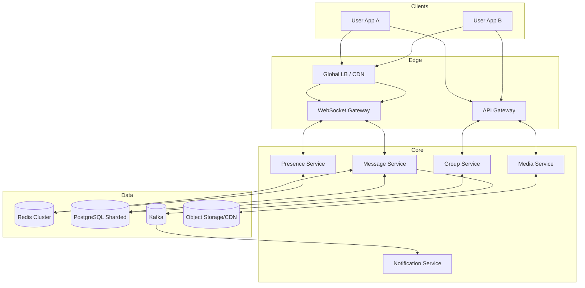
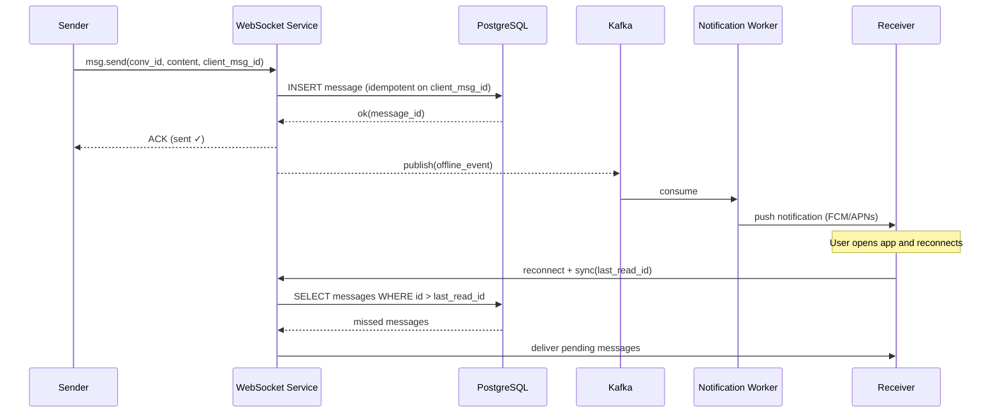
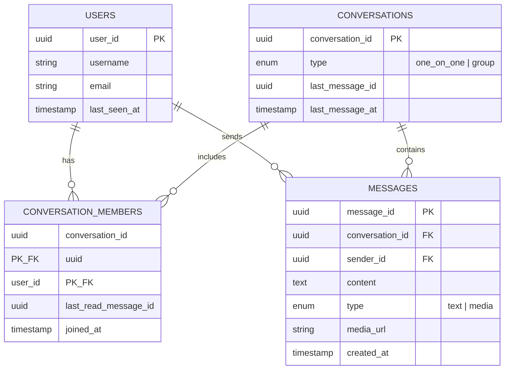
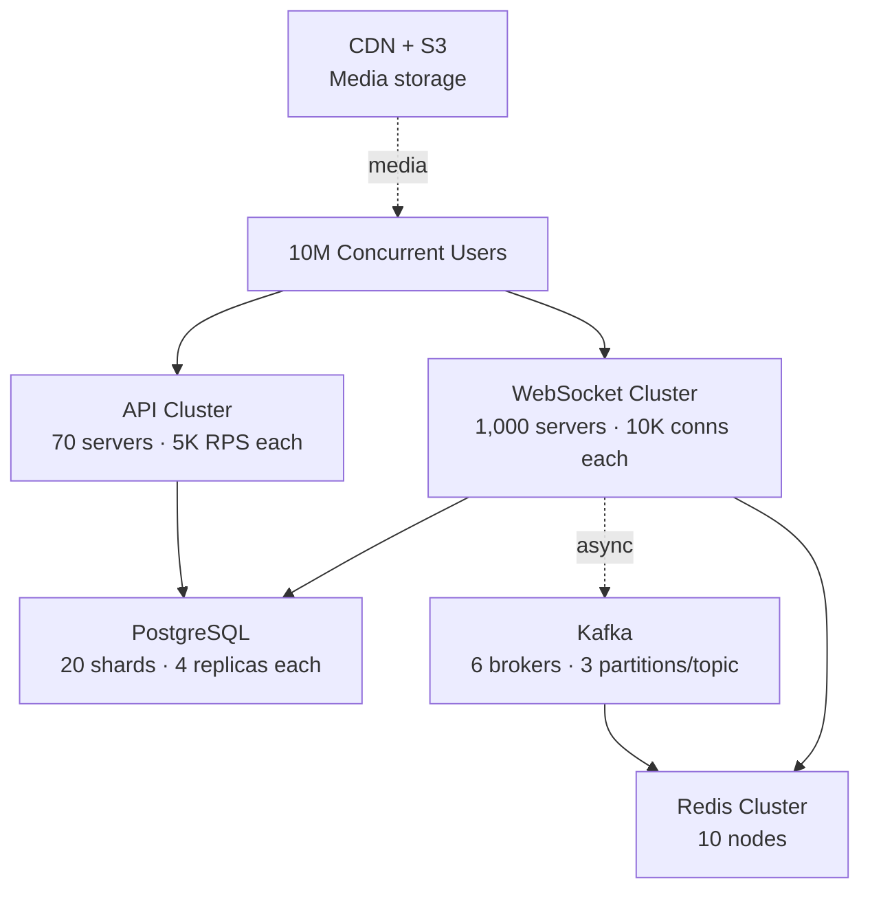
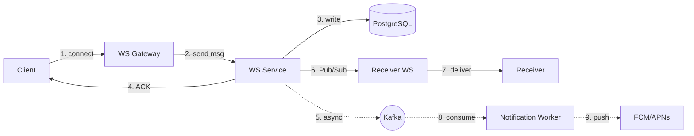

# Chapter 2 — Architecture Design

## Contents

1. [System Overview](#1-system-overview)
2. [Data Flow — Sending a Message](#2-data-flow--sending-a-message)
3. [Connection Management](#3-connection-management)
4. [Message Routing](#4-message-routing)
5. [Group Message Fan-Out](#5-group-message-fan-out)
6. [Offline Delivery Flow](#6-offline-delivery-flow)
7. [ML Augmentations (Optional)](#7-ml-augmentations-optional)
8. [Edge-Case Handling](#8-edge-case-handling)
9. [Data Model & Storage Design](#9-data-model--storage-design)
10. [API Design](#10-api-design)
11. [Scaling & Capacity](#11-scaling--capacity)
12. [Fault Tolerance](#12-fault-tolerance)
13. [Observability](#13-observability)
14. [Security](#14-security)
15. [Trade-Offs Summary](#15-trade-offs-summary)

---

## 1. System Overview

The diagram below shows the high-level system components and how traffic flows between them. Real-time message traffic enters through the WebSocket Gateway; REST traffic (history, settings, media) enters through the API Gateway. The Message Service owns the synchronous write path; Kafka decouples all async work.


```mermaid
flowchart TB
    subgraph Clients
        UserA[User App A]
        UserB[User App B]
    end

    subgraph Edge
        LB[Global LB / CDN]
        WS[WebSocket Gateway]
        API[API Gateway]
    end

    subgraph Core
        MsgSvc[Message Service]
        PresenceSvc[Presence Service]
        GroupSvc[Group Service]
        NotifySvc[Notification Service]
        MediaSvc[Media Service]
    end

    subgraph Data
        Redis[(Redis Cluster)]
        PG[(PostgreSQL Sharded)]
        Kafka[(Kafka)]
        S3[(Object Storage/CDN)]
    end

    UserA --> LB --> WS
    UserB --> LB --> WS
    UserA & UserB --> API
    WS <--> MsgSvc
    WS <--> PresenceSvc
    API <--> GroupSvc
    API <--> MediaSvc
    MsgSvc <--> Redis
    MsgSvc <--> PG
    MsgSvc --> Kafka
    PresenceSvc <--> Redis
    GroupSvc <--> PG
    Kafka --> NotifySvc
    MediaSvc <--> S3
```

**Figure 1 — High-level component overview.** Solid arrows are synchronous calls; all async work flows through Kafka.

---

## 2. Data Flow — Sending a Message

The critical path from sender to recipient in 8 steps:

1. User A sends a message via WebSocket; the gateway authenticates the JWT and enforces per-user rate limits.
2. Gateway forwards `{conversation_id, sender_id, content, client_msg_id}` to the Message Service.
3. Message Service validates conversation membership; checks Redis for deduplication on `client_msg_id` (TTL 5m).
4. Persist: insert the message row and update `conversation.last_message_at` in PostgreSQL (shard key: `conversation_id`).
5. ACK the sender with `{message_id, server_timestamp, status: "sent"}`.
6. Publish to Redis Pub/Sub channel `user:{recipient_id}:messages` for cross-server fan-out to online recipients.
7. Receiver's WS server delivers to User B; Message Service tracks delivery and read receipts.
8. Async: emit a Kafka event for offline notifications, search indexing, and analytics.

**Critical path latency:** ~40 ms p50; <100 ms p99 (WebSocket 5 ms + DB write 20 ms + Pub/Sub 10 ms + delivery 5 ms)

---

## 3. Connection Management

- **WebSocket lifecycle**: connect → JWT auth → register `{user_id: ws_server, conn_id}` in Redis (TTL 60s).
- **Heartbeat**: client PING every 30s; server PONG; close connection if no response within 60s.
- **Reconnect**: exponential backoff (1s, 2s, 4s, max 30s); fetch missed messages using `since={last_seen_ts}`.
- **Server restart**: LB redirects to healthy nodes; clients reconnect and fetch missed messages from DB.
- **Multi-device**: multiple WS connections per `user_id`; Message Service fans out to all registered connections.

---

## 4. Message Routing

**Problem:** User A is on WS-Server-1; User B is on WS-Server-3. WS-Server-1 must deliver through WS-Server-3.

**Solution:** Redis Pub/Sub fan-out.

1. Message Service publishes to channel `user:{recipient_id}:messages`.
2. Each WS server subscribes for its currently connected users; delivers locally on receipt.
3. Typical end-to-end: ~50–80 ms (DB write + Pub/Sub + delivery).

If no WS server has a subscriber for the recipient (user is offline), the Kafka event triggers push notification delivery instead (see Section 6).

---

## 5. Group Message Fan-Out

1:N delivery for groups (up to 1,000 members):

1. Persist one message row to DB with `status: sent`.
2. Publish to Kafka topic `group.messages` with the full member list.
3. Consumer workers fan out per recipient:
   - **Online**: publish to `user:{recipient_id}:messages` for instant delivery via Pub/Sub.
   - **Offline**: enqueue to `offline_messages` → Notification Service → FCM/APNs push.
4. Track per-recipient delivery and read status via `last_read_message_id` in `conversation_members`.

**Celebrity groups (>1,000 online members):** Switch to pull-dominant fan-out — push only to @mentioned users; others fetch on open.

---

## 6. Offline Delivery Flow

The sequence below shows the full path when the recipient is offline at send time. The message is durably stored before the ACK is sent; the push notification is fired async via Kafka so it never blocks the sender.


```mermaid
sequenceDiagram
    participant S as Sender
    participant WS as WebSocket Service
    participant DB as PostgreSQL
    participant K as Kafka
    participant W as Notification Worker
    participant R as Receiver

    S->>WS: msg.send(conv_id, content, client_msg_id)
    WS->>DB: INSERT message (idempotent on client_msg_id)
    DB-->>WS: ok(message_id)
    WS-->>S: ACK (sent ✓)
    WS-->>K: publish(offline_event)
    K->>W: consume
    W->>R: push notification (FCM/APNs)
    Note over R: User opens app and reconnects
    R->>WS: reconnect + sync(last_read_id)
    WS->>DB: SELECT messages WHERE id > last_read_id
    DB-->>WS: missed messages
    WS->>R: deliver pending messages
```

**Figure 2 — Offline delivery sequence.** On reconnect the client syncs from its last-known message ID, so no messages are missed regardless of how long the user was offline.

---

## 7. ML Augmentations (Optional)

Targeted enhancements that do not change core delivery guarantees. All ML paths have rule-based fallbacks; shadow-deploy before full rollout.

**Content Moderation (synchronous gate)**

Classify message text for spam and profanity before the DB write. Deployed as a sidecar inference service next to each Message Service instance.

```python
# Implementation sketch — synchronous moderation gate (p99 < 10 ms)
def moderation_gate(text: str) -> bool:
    score = model.predict(text)          # distilled BERT classifier, 0.0–1.0
    return score < THRESHOLD_HIGH        # block only high-confidence violations (e.g. 0.85)
```

**Notification Ranking (asynchronous)**

Rank push notification importance post-ACK using sender affinity, recency, and engagement signals.

```python
# Implementation sketch — async notification ranking
def compute_priority(event: dict) -> float:
    features = feature_store.get_online(event['recipient_id'])
    return ranking_model.predict(features)   # gradient boosting, returns 0.0–1.0
```

**Semantic Search (asynchronous)**

Generate message embeddings post-write; store in a vector index (pgvector or OpenSearch k-NN). Query via cosine similarity; fall back to SQL full-text when needed.

**ML SLOs:**
- Moderation: p99 <10 ms; false-positive rate <2%
- Notification ranking: nDCG@10 >0.7
- Embedding drift: cosine similarity vs baseline >0.95

---

## 8. Edge-Case Handling

| Scenario | Strategy |
|---|---|
| Connection flap | Exponential backoff (1s, 2s, 4s … 30s max); resume from `last_read_id` |
| Celebrity group (>1M members) | Push only to online + @mentioned; others pull on open |
| Hot shard | Detect write skew; re-shard hot conversations; rate-limit per conversation (100 msg/min) |
| Kafka consumer lag | Alert when lag >10K; scale consumers; DLQ for poison messages |
| Redis unavailable | Cache-miss fallback to DB; presence degrades to "last seen X minutes ago" |

---

## 9. Data Model & Storage Design

### Database Schema (PostgreSQL)

The ER diagram below shows the four core tables. Messages are sharded by `conversation_id` so all rows for a conversation land on one shard, keeping ordering and pagination local.


```mermaid
erDiagram
    USERS ||--o{ CONVERSATION_MEMBERS : has
    USERS ||--o{ MESSAGES : sends
    CONVERSATIONS ||--o{ CONVERSATION_MEMBERS : includes
    CONVERSATIONS ||--o{ MESSAGES : contains

    USERS {
        uuid user_id PK
        string username
        string email
        timestamp last_seen_at
    }

    CONVERSATIONS {
        uuid conversation_id PK
        enum type "one_on_one | group"
        uuid last_message_id
        timestamp last_message_at
    }

    CONVERSATION_MEMBERS {
        uuid conversation_id PK_FK
        uuid user_id PK_FK
        uuid last_read_message_id
        timestamp joined_at
    }

    MESSAGES {
        uuid message_id PK
        uuid conversation_id FK
        uuid sender_id FK
        text content
        enum type "text | media"
        string media_url
        timestamp created_at
    }
```

**Figure 3 — Core entity-relationship diagram.** `last_read_message_id` per member drives delivery receipts without per-message state; media is stored as a URL pointing to S3/CDN.

**Indexes:**
- `messages(conversation_id, created_at DESC)` — conversation history pagination
- `conversation_members(user_id)` — fetch a user's conversation list
- `messages(client_msg_id)` — idempotency deduplication (unique constraint)

**Sharding:**
- **Key:** `conversation_id` (hash-based, 10 shards initially)
- **Why:** All messages for a conversation land on one shard; ordering and pagination are local; no distributed transactions for group sends
- **Re-shard trigger:** Write throughput >8K/s per shard or storage >1 TB per shard

### Specialized Storage

| Store | Key Pattern | TTL / Retention | Purpose |
|---|---|---|---|
| Redis (hot cache) | `conv:{id}:messages` | 1h | Recent message reads (~90% of reads) |
| Redis (presence) | `user:{id}:presence` | 60s (heartbeat resets) | Online status; auto-expires on disconnect |
| Redis (routing) | `user:{id}:conn` | 60s | WS server mapping for cross-server delivery |
| Redis (Pub/Sub) | `user:{id}:messages` | Ephemeral | Cross-server routing channel |
| Object Storage (S3) | Media objects | Permanent (CDN 90-day cache) | Images, videos, documents |
| Kafka | `offline_messages`, `group.messages`, `analytics` | 7 days | Async fan-out, notifications, indexing |

### SQL vs NoSQL Trade-Offs

| Criterion | PostgreSQL (chosen) | Cassandra (alternative) |
|---|---|---|
| Ordering | Strong (ACID, single shard) | Eventual (race conditions) |
| Transactions | Full ACID per shard | Limited (LWT slow) |
| Write throughput | ~10K/s per shard | ~100K/s+ |
| Sharding model | Manual re-shard | Auto-distribute |
| Ops maturity | High | Steeper learning curve |

**Decision:** PostgreSQL for correctness — ordering and atomic deletes are hard requirements. Add shards proactively before bottlenecks hit.

---

## 10. API Design

| Method | Path | Key Parameters | Response |
|---|---|---|---|
| `GET` | `/conversations/{id}/messages` | `limit`, `before` (cursor) | Paginated message list |
| `POST` | `/messages` | `conversation_id`, `content`, `type`, `client_msg_id` | Created message + `{message_id, status}` |
| `POST` | `/groups` | `name`, `member_ids[]` | Group conversation object |
| `PUT` | `/users/me/presence` | `status: online\|away\|offline` | 204 No Content |
| `POST` | `/media/upload-url` | `content_type`, `file_size` | Pre-signed S3 upload URL |

All endpoints require JWT authentication. Rate limits: 100 req/min per user; 10K req/sec per IP at the load balancer.

**Media upload flow:** client calls `POST /media/upload-url` → receives pre-signed S3 URL → uploads directly to S3 (bypasses app servers) → sends the returned `media_url` in a `POST /messages` payload.

---

## 11. Scaling & Capacity

The diagram below shows the target steady-state cluster layout at 100M DAU. Dashed lines are async paths; solid lines are synchronous.


```mermaid
flowchart TB
    U["10M Concurrent Users"]

    WS["WebSocket Cluster\n1,000 servers · 10K conns each"]
    API["API Cluster\n70 servers · 5K RPS each"]
    Redis["Redis Cluster\n10 nodes"]
    PG["PostgreSQL\n20 shards · 4 replicas each"]
    Kafka["Kafka\n6 brokers · 3 partitions/topic"]
    CDN["CDN + S3\nMedia storage"]

    U --> WS & API
    WS --> Redis
    WS --> PG
    WS -.->|async| Kafka
    API --> PG
    Kafka --> Redis
    CDN -.->|media| U
```

**Figure 4 — Steady-state cluster layout at 100M DAU.**

**Scaling rules:**

| Component | Add capacity when… |
|---|---|
| WebSocket | Avg connections >8K per server |
| API | p95 latency >100 ms or CPU >70% |
| Redis | Memory >80%; enable cluster mode above 100 GB |
| PostgreSQL | Writes >8K/s per shard or storage >1 TB per shard |
| Kafka | Sustained throughput >100K msg/s |

### Capacity Quick Reference

| Metric | Calculation | Result |
|---|---|---|
| Avg QPS | 100M × 100 / 86,400 | 115K/s |
| Peak QPS | 115K × 3 | 345K/s |
| Daily storage (text) | 10B × 1 KB | 10 TB |
| Daily storage (media) | 1B × 50 KB | 50 TB |
| WebSocket servers | 10M / 10K | 1,000 |
| API servers | 345K / 5K | 70 |
| Redis hot cache | ~10% of daily text | ~120 GB |
| DB shards | Start 10; grow to 20+ | 10–20 × 4 replicas |

---

## 12. Fault Tolerance

| Failure | Impact | Recovery | Mitigation |
|---|---|---|---|
| WS server crash | 10K users disconnect | Auto-reconnect (exp backoff) | Health checks; rolling deploys with drain |
| Redis node down | Cache misses → higher DB load | Cluster failover (5–10s) | Cache-aside fallback; alert on hit ratio |
| DB primary down (shard) | Writes fail for that shard | Promote replica (30–60s) | Per-shard isolation; write retries |
| Kafka consumer lag | Delayed notifications | Scale consumers; DLQ | Alert on lag >10K; idempotent consumers |

**Idempotency & retries:**

```python
@retry(max_attempts=3, backoff=exponential_jitter)
def publish_to_kafka(event):
    kafka.send(topic="offline_messages", key=event.user_id, value=event, idempotent=True)
```

**Circuit breaker on DB writes:**

```python
@circuit_breaker(failure_threshold=5, timeout=30)
def write_to_db(message):
    return db.execute(INSERT_QUERY, message)
    # After 5 failures in 30s: open circuit → fail fast to caller
```

**Production hardening checklist:**
- Rate limits per-user and per-IP; request timeouts; circuit breakers on all downstream calls
- Backpressure: cap WS send buffers; shed non-critical updates under load; producer jitter on retries
- Idempotent writes (`client_msg_id`); ULID `message_id` for monotonic ordering per conversation
- Idempotent Kafka consumers; DLQ with drain SLO; partition by `conversation_id` where order matters
- TTL-keyed cache entries; negative caching for cold reads; warm hot conversations on startup
- Rolling deploys with connection draining; expand → migrate → contract schema changes; canary + rollback

---

## 13. Observability

**Metrics (RED / USE):**
- **Rate:** msg/s, active connections, API RPS
- **Errors:** 5xx rate, failed sends, consumer retries
- **Duration:** p50/p95/p99 send latency, DB query time
- **Saturation:** CPU/mem per pod, Redis memory, DB connections, Kafka consumer lag

**Structured log example:**

```json
{
  "timestamp": "2025-11-02T10:15:30Z",
  "level": "INFO",
  "service": "websocket-service",
  "trace_id": "abc123",
  "event": "message_sent",
  "conversation_id": "conv_456",
  "latency_ms": 42,
  "recipient_online": true
}
```

**Distributed trace spans (OpenTelemetry):**

```
WS receive → validate → DB write → Redis update → Kafka publish → recipient deliver
```

**Alert thresholds:**
- p99 latency >150 ms sustained for 2 min
- WS reconnect spike >10% over 5 min
- Cache hit ratio <85%
- Kafka consumer lag >50K messages
- DLQ growth >100 msgs/min

**Monitoring cheat-sheet:**
- WebSocket: connection churn (reconnects/min); heartbeat timeouts; per-server connection count
- Message Service: send latency p50/p95/p99; duplicate rate; DB write errors; Redis Pub/Sub lag
- Presence: update lag (time since last heartbeat); stale connections (missed cleanup)
- Kafka: consumer lag per topic; DLQ size; rebalance frequency
- PostgreSQL: per-shard write QPS; replication lag; connection pool saturation; query p99
- Redis: memory usage; eviction rate; Pub/Sub channel subscribers; command latency

---

## 14. Security

| Layer | Mechanism |
|---|---|
| Authentication | JWT tokens (15-min TTL); refresh tokens (7-day, httpOnly cookie) |
| Authorization | Conversation membership check on every message send and read |
| Encryption in transit | TLS 1.3 for all connections |
| Encryption at rest | AES-256 for PostgreSQL, S3, and Redis |
| Optional E2EE | Signal Protocol (Double Ratchet) for 1-on-1 chats |
| Rate limiting | Token bucket: 100 msgs/min per user; 10K RPS per IP |
| PII protection | Generic push notification payloads; scrub PII from logs |
| Compliance | GDPR delete API; data portability export; 30-day hard retention; audit logs |

---

## 15. Trade-Offs Summary

| Decision | Why Chosen | Alternative | When to Reconsider |
|---|---|---|---|
| WebSocket | <100 ms latency, bidirectional | Long polling / SSE | HTTP-only environments (firewall) |
| PostgreSQL | Strong ordering, ACID | Cassandra | Global write volume routinely >1M/s |
| Kafka | Durable replay, high throughput | RabbitMQ / SQS | Latency <10 ms required; simple queues |
| Redis Pub/Sub | Sub-ms cross-server routing | Direct WS mesh | Multi-region active-active |
| Shard by conversation | Locality, single-shard ordering | Shard by user | Read-heavy user timeline queries dominate |

---

## End-to-End Flow Summary


```mermaid
flowchart LR
    A[Client] -->|1. connect| B[WS Gateway]
    B -->|2. send msg| C[WS Service]
    C -->|3. write| D[(PostgreSQL)]
    C -->|4. ACK| A
    C -.->|5. async| E((Kafka))
    C -->|6. Pub/Sub| F[Receiver WS]
    F -->|7. deliver| G[Receiver]
    E -.->|8. consume| H[Notification Worker]
    H -.->|9. push| I[FCM/APNs]
```

**Key insights:**
1. **Sync path:** WS → DB → ACK (~40 ms p50, ~80 ms p99)
2. **Async path:** Kafka → workers → notifications (eventual, non-blocking)
3. **Ordering:** Single-shard write + ULID `message_id` (time-sortable, no coordinator)
4. **Idempotency:** `client_msg_id` prevents duplicates on retries
5. **Presence:** Redis TTL keys auto-expire on disconnect; Pub/Sub broadcasts updates in real time

---

## References

- **Patterns:** DDIA (Kleppmann), ByteByteGo (Alex Xu), Educative Modern System Design
- **Real-world:** Discord (scaling WS to billions), Uber/LinkedIn (Kafka), WhatsApp (Erlang + MySQL)
- **Standards:** WebSocket RFC 6455, ULID spec, Signal Protocol (E2EE)
