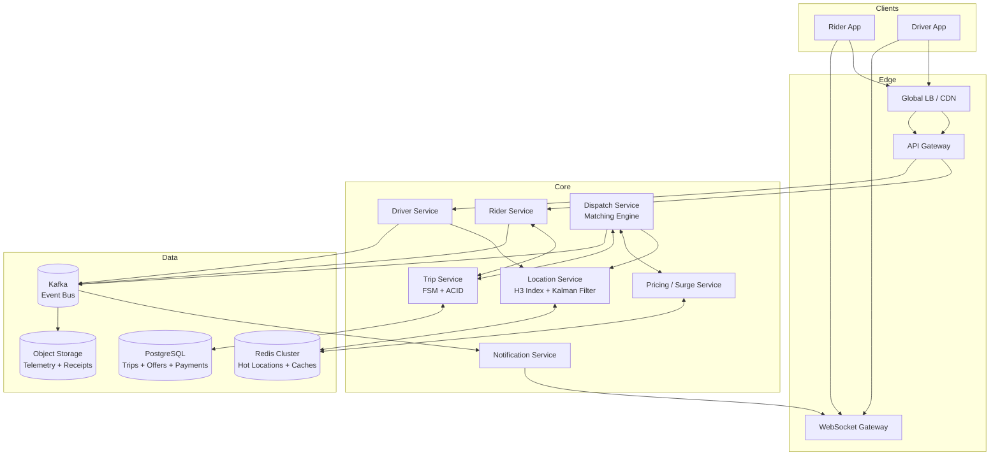
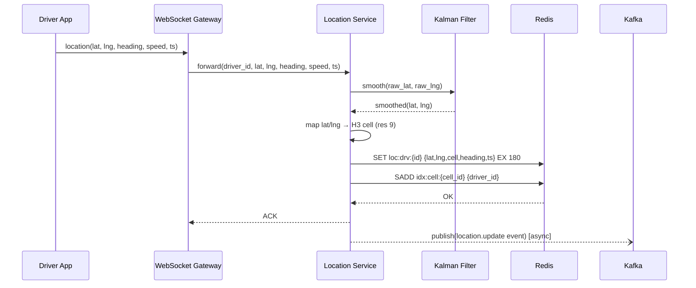
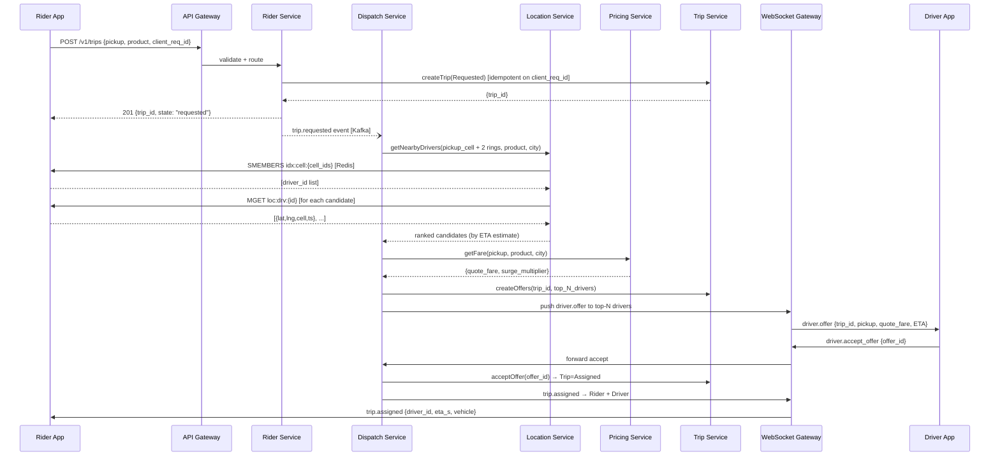
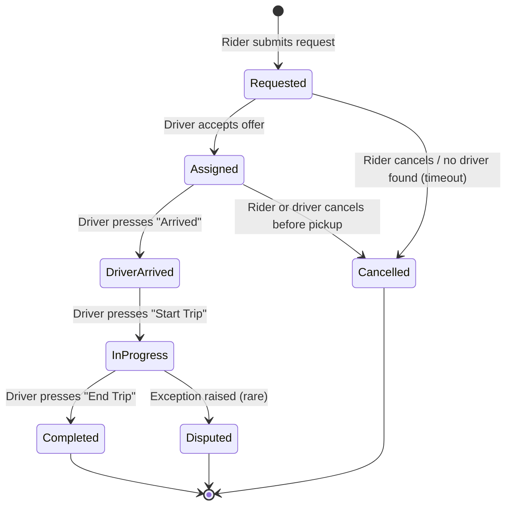
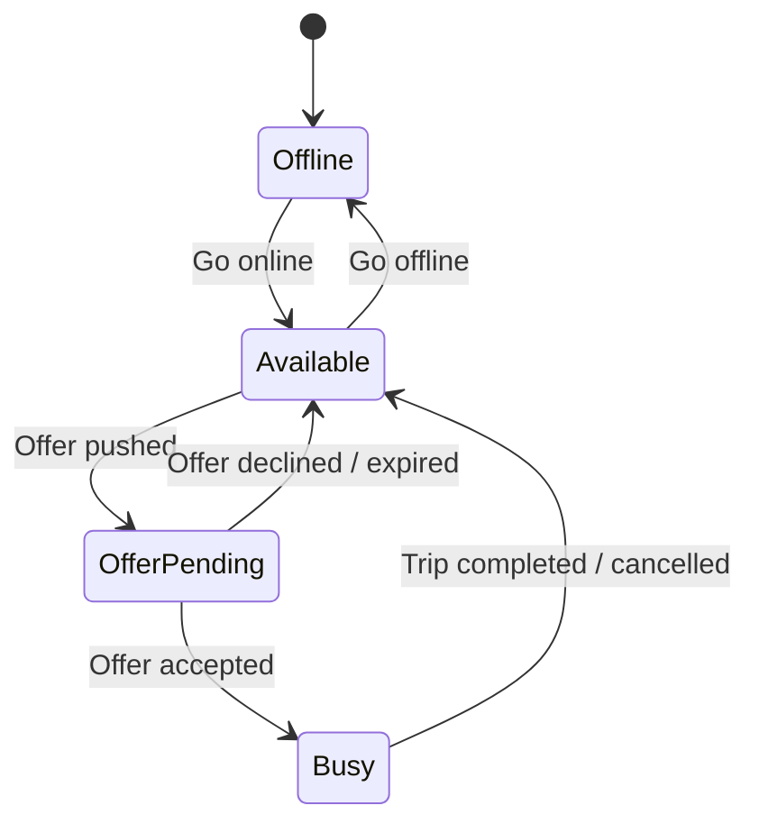
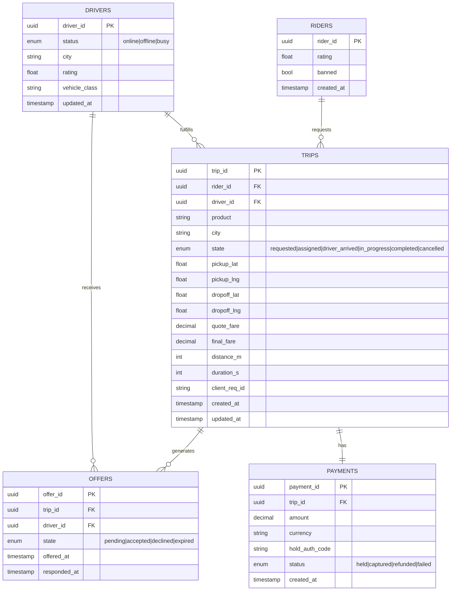
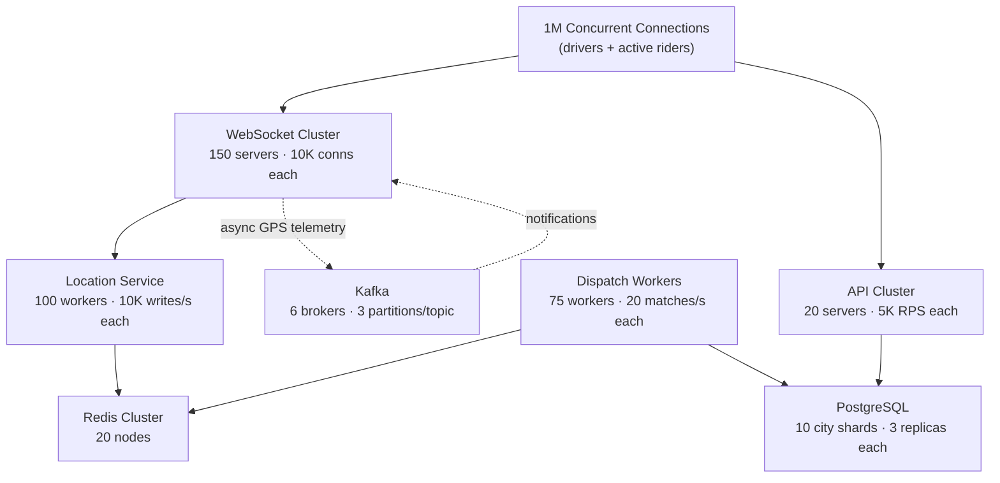
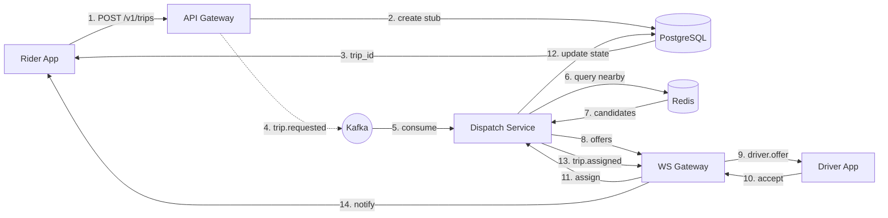

# Chapter 2 — Architecture Design

## Contents

1. [System Overview](#1-system-overview)
2. [Data Flow — GPS Location Update](#2-data-flow--gps-location-update)
3. [Data Flow — Request to Assign](#3-data-flow--request-to-assign)
4. [Trip State Machine](#4-trip-state-machine)
5. [Surge Pricing Flow](#5-surge-pricing-flow)
6. [ML Augmentations (Optional)](#6-ml-augmentations-optional)
7. [Edge-Case Handling](#7-edge-case-handling)
8. [Data Model & Storage Design](#8-data-model--storage-design)
9. [API Design](#9-api-design)
10. [Scaling & Capacity](#10-scaling--capacity)
11. [Fault Tolerance](#11-fault-tolerance)
12. [Observability](#12-observability)
13. [Security](#13-security)
14. [Trade-Offs Summary](#14-trade-offs-summary)

---

## 1. System Overview

The diagram below shows the high-level component layout. GPS traffic from drivers enters via the WebSocket Gateway and is processed by the Location Service before landing in Redis. Trip requests enter through the API Gateway; the Dispatch Service owns the matching critical path. Kafka decouples all async work (notifications, analytics, payments).



**Figure 1 — High-level component overview.** Solid arrows are synchronous calls; all async work (notifications, telemetry, receipts) flows through Kafka.

---

## 2. Data Flow — GPS Location Update

The sequence below shows the 1 Hz GPS write path from driver app to Redis. This path must complete in under 100ms p99; all analytics are written asynchronously to Kafka after the Redis write has succeeded.



**Figure 2 — GPS location update sequence.** The Kalman filter smooths noisy readings before the H3 cell is computed. Redis keys carry a 3-minute TTL so stale drivers automatically fall out of search results.

**Key implementation notes:**
- `loc:drv:{id}` stores the latest position — always overwritten, not appended.
- `idx:cell:{cell_id}` is a Redis Set; dispatch reads it with `SMEMBERS` for a cell and its neighbors.
- A separate background job (`SSCAN` every 30s) prunes stale driver IDs from cell sets.
- If the driver app loses connectivity, the Redis key naturally expires (TTL 180s), removing the driver from the search pool.

---

## 3. Data Flow — Request to Assign

The diagram below traces a ride request from the rider tapping "Request" through the dispatch matching loop to the final assignment notification. The critical path target is p99 < 5s end-to-end.



**Figure 3 — Request-to-assign sequence.** The rider receives a 201 immediately after the trip stub is written (the dispatch loop is event-driven). The entire dispatch loop — neighbor cell lookup, fare quote, offer push, accept — targets p99 < 5s from the initial POST.

---

## 4. Trip State Machine

The diagram below shows all valid trip state transitions. Each transition is an idempotent write to PostgreSQL; the Trip Service rejects duplicate or out-of-order transitions.



**Figure 4 — Trip state machine.** `Cancelled` is reachable from `Requested` and `Assigned` only — not from `InProgress`. Every state transition emits a Kafka event consumed by the Notification Service, Payment Service, and analytics workers.

**Driver state machine (complementary):**



**Figure 5 — Driver availability state machine.** A driver in `OfferPending` cannot receive a second offer. After declining or expiry, the driver returns to `Available` and re-enters the candidate pool.

---

## 5. Surge Pricing Flow

Surge multipliers are precomputed per H3 cell on a rolling schedule and cached in Redis. The critical path (fare quote during dispatch) reads from cache and never blocks on a recompute.

```mermaid
flowchart LR
    Events["Supply/Demand Events\n(trip requests, driver online/offline)"]
    Kafka[(Kafka)]
    SurgeWorker["Surge Worker\n(per city, every 30–120s)"]
    Redis[(Redis\ncell:{id}:surge)]
    PricingSvc["Pricing Service"]
    DispatchSvc["Dispatch Service"]
    RiderApp["Rider App"]

    Events --> Kafka --> SurgeWorker
    SurgeWorker -->|"write surge multiplier"| Redis
    DispatchSvc -->|"GET cell:{id}:surge"| Redis
    Redis --> PricingSvc
    PricingSvc -->|"base_fare × surge"| DispatchSvc
    PricingSvc -->|"upfront quote"| RiderApp
```

**Figure 6 — Surge pricing flow.** The Surge Worker reads from Kafka to maintain a rolling supply/demand ratio per cell. Changes are clamped to ±20% per recompute cycle to prevent oscillation.

**Surge guardrails:**
- Maximum surge multiplier: 5× (configurable per city/product).
- Minimum recompute interval: 30s (prevents thrashing during rapid demand spikes).
- Cold-start fallback: serve the city-level baseline fare if the cell key is missing in Redis.

---

## 6. ML Augmentations (Optional)

Targeted enhancements that improve UX without altering core dispatch guarantees. All ML paths have rule-based fallbacks; shadow-deploy before full rollout.

**ETA Prediction (synchronous, dispatch critical path)**

Combine real-time traffic speed profiles with historical per-road-segment averages.

```python
# Implementation sketch — ETA estimator (p99 < 20 ms)
def estimate_eta(pickup: LatLng, driver: LatLng, city: str) -> int:
    dist_m = haversine(pickup, driver)
    segment_key = f"speed:{city}:{hour_of_week()}"
    avg_speed_ms = feature_store.get(segment_key, default=8.3)  # 30 km/h fallback
    eta_s = int(dist_m / avg_speed_ms)
    return eta_s
```

**ML SLOs:**
- ETA model: p99 < 20 ms inference; mean absolute error < 2 minutes.
- Fraud detection: p99 < 50 ms; false-positive rate < 0.1%.

**Fraud / Anomaly Detection (asynchronous)**

Detect GPS spoofing, fake pickups, and route inflation post-trip.

```python
# Implementation sketch — async fraud scorer
def score_trip(trip_event: dict) -> float:
    features = {
        "route_deviation_pct": trip_event["route_deviation"],
        "speed_anomaly": trip_event["max_speed_kmh"] > 180,
        "location_jump_count": trip_event["gps_jump_count"],
    }
    return fraud_model.predict(features)  # gradient boosting, 0.0–1.0
```

---

## 7. Edge-Case Handling

| Scenario | Strategy |
|---|---|
| No driver accepts (offer timeout) | Expand H3 search to next ring; re-offer to new candidates; repeat up to 3 cycles before surfacing "no car available" |
| Driver app loses connectivity mid-trip | Trip state preserved in PostgreSQL; driver reconnects and resumes from last known FSM state |
| GPS teleport (> 100 m/s jump) | Reject the update; use last valid position; log anomaly for fraud review |
| Hot H3 cell (stadium, airport) | Increase cell TTL; dedicate a Redis key per cell prefix; apply per-driver offer rate limits |
| Surge spike (flash event) | Clamp surge delta to ±20%/cycle; trigger emergency capacity alert; pre-warm cells for known events |
| Duplicate trip request (retry) | Idempotent on `client_req_id` — return existing trip object if already created |
| Payment pre-auth failure | Trip request rejected with `402`; do not dispatch a driver |

---

## 8. Data Model & Storage Design

### Database Schema (PostgreSQL)

The ER diagram below shows the five core tables. Trips are sharded by `city_id`; all offers, payments, and state transitions for a trip land in the same city shard.



**Figure 7 — Core entity-relationship diagram.** `client_req_id` on TRIPS enables idempotent retries. OFFERS tracks the full offer history per trip for acceptance-rate analytics. PAYMENTS stores the pre-auth code separately from the final capture.

**Indexes:**
- `trips(city, state, created_at DESC)` — dispatch queue scans and ops dashboards.
- `trips(rider_id, created_at DESC)` — rider history queries.
- `trips(client_req_id)` — idempotency deduplication (unique constraint).
- `offers(trip_id, state)` — check all pending offers for a trip.
- `drivers(city, status, vehicle_class)` — driver availability queries (kept small; main source is Redis).

**Sharding:**
- **Key:** `city_id` (hash-based, 1 shard per major city initially).
- **Why:** All trips, offers, and payments for a city land on one shard; no cross-shard joins needed.
- **Re-shard trigger:** Write throughput > 2K/s or storage > 500 GB per shard.

### Specialized Storage

| Store | Key Pattern | TTL / Retention | Purpose |
|---|---|---|---|
| Redis (location) | `loc:drv:{id}` | 180s (TTL auto-expires stale drivers) | Hot driver positions for dispatch |
| Redis (cell index) | `idx:cell:{cell_id}` | Pruned every 30s | Set of driver IDs per H3 cell |
| Redis (surge) | `cell:{id}:surge` | 120s TTL | Precomputed surge multiplier per cell |
| Redis (routing) | `user:{id}:conn` | 60s | WS server mapping for push delivery |
| Kafka | `location.updates`, `trip.events`, `offers` | 7 days | Async fan-out, analytics, payments |
| S3 | Location telemetry (Parquet) | 2 years | Route reconstruction, ML training |

---

## 9. API Design

| Method | Path | Key Parameters | Response |
|---|---|---|---|
| `POST` | `/v1/trips` | `pickup_lat`, `pickup_lng`, `product`, `client_req_id` | Trip object `{trip_id, state, quote_fare, eta_s}` |
| `GET` | `/v1/trips/:id` | — | Trip status + current ETA |
| `DELETE` | `/v1/trips/:id` | `reason` | 204 (cancellation confirmed) |
| `GET` | `/v1/pricing` | `pickup_lat`, `pickup_lng`, `product`, `city` | `{base_fare, surge_multiplier, estimated_fare}` |
| `PUT` | `/v1/drivers/me/status` | `status: online\|offline` | 204 No Content |
| `POST` | `/v1/drivers/offers/:offer_id/accept` | — | Updated trip assignment |
| `POST` | `/v1/drivers/offers/:offer_id/decline` | `reason` | 204 No Content |
| `GET` | `/v1/drivers/nearby` | `lat`, `lng`, `radius_km`, `product` | List of anonymized nearby driver positions |

All endpoints require JWT authentication. Rate limits: 100 req/min per user; 10K req/s per IP at the load balancer.

**WebSocket events (push from server):**

| Event | Direction | Payload |
|---|---|---|
| `trip.assigned` | → Rider | `{driver_id, eta_s, vehicle, driver_name}` |
| `trip.driver_arriving` | → Rider | `{eta_s, driver_lat, driver_lng}` |
| `trip.started` | → Rider + Driver | `{trip_id, started_at}` |
| `trip.completed` | → Rider + Driver | `{trip_id, final_fare, duration_s, distance_m}` |
| `driver.offer` | → Driver | `{trip_id, pickup_lat, pickup_lng, quote_fare, ttl_s}` |
| `driver.offer_expired` | → Driver | `{trip_id}` |
| `location.driver_update` | → Rider (during trip) | `{driver_lat, driver_lng, eta_s}` |

**GPS update:** Driver sends location frames over the persistent WebSocket connection — not REST. Each frame: `{lat, lng, heading, speed, ts}`.

---

## 10. Scaling & Capacity

The diagram below shows the steady-state cluster layout at 10M DAU. Dashed lines are async paths; solid lines are synchronous.



**Figure 8 — Steady-state cluster layout at 10M DAU.**

**Scaling rules:**

| Component | Add capacity when… |
|---|---|
| WebSocket | Avg connections > 8K per server |
| Location Service | Write latency p99 > 80ms or CPU > 70% |
| Dispatch Workers | Request→assign p99 > 3s or queue depth growing |
| Redis | Memory > 80%; add nodes; enable cluster mode above 50 GB |
| PostgreSQL | Writes > 1.5K/s per shard or storage > 500 GB per shard |
| Kafka | Sustained throughput > 100K msg/s |

### Capacity Quick Reference

| Metric | Calculation | Result |
|---|---|---|
| GPS writes/s (peak) | 1M drivers × 1 Hz | 1M writes/s |
| Active trip connections | 500K trips × 2 (rider+driver) | 1M WS connections |
| Dispatch ops/s (peak) | 1,500 trips/s × 50ms match = 75 workers | ~75 Dispatch workers |
| Redis hot data | 1M drivers × 500 B | ~500 MB |
| Trip storage (annual) | 200M × 2 KB | ~400 GB/year |
| Location telemetry (daily compressed) | 1M/s × 86,400s × 150 B / 10 | ~1.3 TB/day |

---

## 11. Fault Tolerance

| Failure | Impact | Recovery | Mitigation |
|---|---|---|---|
| Redis node down | Matching blind spots; cache misses | Cluster promotes replica (5–10s) | Fall back to last-known driver device positions; shrink search radius |
| Dispatch worker crash | Request queued in Kafka; no offer sent | Worker restarts; picks up from Kafka offset | At-least-once Kafka consumption; idempotent trip creation |
| PostgreSQL shard down | Trip writes fail for that city | Promote replica (30–60s); replay Kafka events | Per-city shard isolation; write buffer in Kafka |
| Kafka consumer lag | Delayed push notifications | Scale consumers horizontally | Alert on lag > 10K; DLQ for poison events |
| WS server crash | Clients reconnected by LB | Exponential backoff reconnect; re-sync trip state via REST | Rolling deploys with 30s drain; clients re-fetch trip state on reconnect |

**Idempotent trip creation:**

```python
@retry(max_attempts=3, backoff=exponential_jitter)
def create_trip(rider_id: str, pickup: LatLng, client_req_id: str) -> Trip:
    return db.execute(
        """INSERT INTO trips (trip_id, rider_id, pickup_lat, pickup_lng, client_req_id, state)
           VALUES (gen_ulid(), %s, %s, %s, %s, 'requested')
           ON CONFLICT (client_req_id) DO UPDATE SET updated_at = NOW()
           RETURNING *""",
        (rider_id, pickup.lat, pickup.lng, client_req_id)
    )
```

**Circuit breaker on Pricing Service:**

```python
@circuit_breaker(failure_threshold=5, timeout=30)
def get_surge_multiplier(cell_id: str, city: str) -> float:
    return pricing_service.get_surge(cell_id, city)
    # After 5 failures in 30s: open circuit → fall back to base fare (1.0×)
```

**Production hardening checklist:**
- City-level isolation: no shared DB, Redis, or Kafka topic between cities.
- Idempotent writes (`client_req_id`); idempotent Kafka consumers; DLQ with drain SLO.
- Backpressure on dispatch: cap offer-push rate to 5 offers/driver/minute.
- Rolling deploys with WS connection draining (30s grace period).
- GPS TTL auto-prune: stale drivers automatically fall out of Redis cell sets.

---

## 12. Observability

**Metrics (RED / USE):**
- **Rate:** GPS updates/s, trip requests/s, offers sent/s, assignments/s.
- **Errors:** Offer timeout rate, dispatch errors, FSM conflict rate, payment failures.
- **Duration:** p50/p95/p99 request→assign latency, GPS write latency, pricing latency.
- **Saturation:** Redis memory per node, Kafka consumer lag, DB connections per shard.

**Structured log example:**

```json
{
  "timestamp": "2025-11-15T18:32:10Z",
  "level": "INFO",
  "service": "dispatch-service",
  "trace_id": "xyz789",
  "event": "trip_assigned",
  "trip_id": "01ARYZ6S41TSV4RRFFQ69G5FAV",
  "city": "sf",
  "candidates_searched": 42,
  "offers_sent": 3,
  "latency_ms": 1240,
  "surge_multiplier": 1.8
}
```

**Distributed trace spans (OpenTelemetry):**

```
Rider POST → TripService.create → Dispatch.findCandidates → LocationService.query
  → PricingService.quote → Dispatch.sendOffers → Driver WS → Dispatch.acceptOffer
  → TripService.assign → Rider WS notification
```

**Alert thresholds:**
- Request→assign p99 > 5s sustained for 2 minutes → page on-call.
- Offer acceptance rate < 60% over 5 minutes → expand search radius automatically.
- GPS update lag: > 10% drivers not updated in 10s → Redis health alert.
- Kafka consumer lag > 50K messages → scale consumers.
- Payment pre-auth failure rate > 1% → fraud/payments alert.

---

## 13. Security

| Layer | Mechanism |
|---|---|
| Authentication | JWT tokens (15-min TTL); refresh tokens (7-day, httpOnly cookie) |
| Authorization | Server verifies rider/driver identity on every FSM transition |
| Driver location privacy | Exact driver location hidden from rider until assignment; approximate position only |
| Phone masking | All in-trip calls routed through masked number proxy; real numbers never exposed |
| Encryption in transit | TLS 1.3 for all REST and WebSocket connections |
| Encryption at rest | AES-256 for PostgreSQL, S3, and Redis |
| Payment security | PCI-DSS tokenization; pre-auth holds via payment gateway; no raw card data stored |
| Fraud detection | Async scorer post-trip; GPS jump detector in Location Service; device integrity checks |
| Rate limiting | 100 trips/day per rider; 5 offers/min per driver; 10K RPS per IP at load balancer |

---

## 14. Trade-Offs Summary

| Decision | Why Chosen | Alternative | When to Reconsider |
|---|---|---|---|
| H3 geospatial index | O(rings) neighbor scan; excellent cache locality | PostGIS R-Tree | Sparse global regions with irregular distribution |
| Redis for hot locations | Sub-millisecond reads; auto-TTL prunes stale drivers | In-memory service | If driver count exceeds Redis memory capacity |
| Hybrid push/pull dispatch | Push for speed; pull for resilience when push fails | Pure push | If driver autonomy / bidding marketplace is required |
| PostgreSQL for trip store | ACID FSM transitions; no distributed coordination | Cassandra | If global write volume exceeds 50K trips/s |
| City-level shard isolation | Failure blast radius limited to one city | Global shard | If cross-city trip matching is required (airport pools) |
| Kafka for async fan-out | Durable replay; decouples notifications, analytics | RabbitMQ | Simpler queues with lower operational overhead |

---

## End-to-End Flow Summary



**Key insights:**
1. **Sync path:** POST → DB write → trip_id returned immediately (~50 ms p50).
2. **Async dispatch:** Kafka → Dispatch → Location query → Offers → Accept → Assign (p99 < 5s).
3. **Geospatial:** H3 ring scan on Redis sets — no full index scan on every request.
4. **Idempotency:** `client_req_id` prevents duplicate trips on retries.
5. **Surge:** Precomputed per H3 cell; dispatch reads from Redis cache — never blocks on recompute.

---

## References

- **Uber Engineering:** H3 — Uber's Hexagonal Hierarchical Spatial Index
- **Lyft Engineering:** Matchmaking in Lyft Line — Scaling a Marketplace
- **Redis Geo:** Redis GEOADD / GEORADIUS commands for geospatial sets
- **Kalman Filter:** Welch & Bishop — An Introduction to the Kalman Filter (UNC TR 95-041)
- **Geohash:** Niemeyer, 2008 — Geohash encoding/decoding
- **H3 Spec:** https://h3geo.org/docs/
