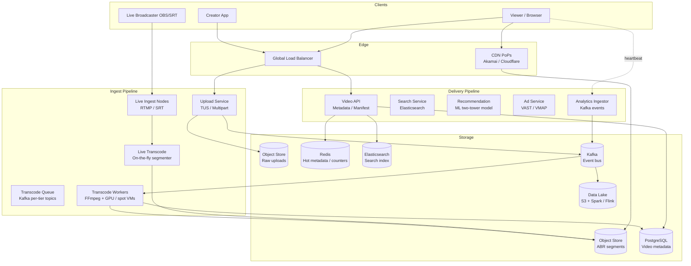

# Chapter 2 — Architecture Design

## Contents

1. [System Overview](#1-system-overview)
2. [Data Flow — Upload Pipeline](#2-data-flow--upload-pipeline)
3. [Data Flow — Video Playback (VOD)](#3-data-flow--video-playback-vod)
4. [Data Flow — Live Streaming](#4-data-flow--live-streaming)
5. [Transcode Pipeline Deep-Dive](#5-transcode-pipeline-deep-dive)
6. [CDN & Edge Delivery](#6-cdn--edge-delivery)
7. [Adaptive Bitrate (ABR) Mechanics](#7-adaptive-bitrate-abr-mechanics)
8. [Data Model & Storage Design](#8-data-model--storage-design)
9. [API Design](#9-api-design)
10. [Scaling & Capacity](#10-scaling--capacity)
11. [Fault Tolerance](#11-fault-tolerance)
12. [Observability](#12-observability)
13. [Security](#13-security)
14. [Trade-Offs Summary](#14-trade-offs-summary)

---

## 1. System Overview

The platform separates into two independent pipelines: the **ingest pipeline** (upload → transcode → publish, write-heavy, async, compute-bound) and the **delivery pipeline** (manifest → segments → player, read-heavy, latency-critical, CDN-dominated). These pipelines share only the object store and the metadata database.



**Figure 1 — High-level component overview.** Solid arrows are synchronous; dashed arrows are async/fire-and-forget.

---

## 2. Data Flow — Upload Pipeline

The upload path is fully asynchronous. The creator's app uploads a raw file; publishing happens minutes later after transcoding completes.

1. **Initiate upload**: Client calls `POST /v1/videos` → Upload Service returns a signed multipart URL set and a `upload_id`. Upload Service writes `{video_id, status: "uploading", owner_id, ...}` to PostgreSQL.
2. **Chunk upload**: Client splits file into 10 MB chunks; uploads each in parallel using the presigned S3 URL. MD5 checksum on each chunk verified by S3. Client retries any failed chunk independently.
3. **Complete upload**: Client calls `POST /v1/videos/{id}/complete` with the ETag list. S3 assembles the multipart object in `raw-uploads/`.
4. **Publish transcode event**: Upload Service publishes `{video_id, raw_s3_key, owner_id, duration_estimate}` to Kafka topic `upload.completed`.
5. **ContentID scan**: A fingerprinting worker subscribes to `upload.completed`, computes audio fingerprint (chromaprint) and visual perceptual hash, and matches against the rights database. Result appended to the video metadata row.
6. **Transcode job dispatch**: Transcode Orchestrator reads the video's required rendition set, publishes one message per rendition to per-tier Kafka topics: `transcode.360p`, `transcode.720p`, `transcode.1080p`, `transcode.4k`.
7. **Transcode execution**: Worker pool (one pool per tier topic) downloads the raw file from S3, runs FFmpeg with the tier-specific codec/bitrate profile, writes HLS segments (`.ts` + `.m3u8`) and DASH segments (`.mp4` + `.mpd`) to `vod-abr/` in S3. Keyframe positions derived from a pre-analysis pass to ensure GOP alignment across renditions.
8. **Rendition checkpoint**: On each successful segment write, worker updates a Redis counter `{video_id}:completed_segments`. On full rendition completion, publishes `transcode.rendition.done` to Kafka.
9. **Publish video**: Transcode Orchestrator receives `done` events for all required renditions. Updates PostgreSQL: `status = "published"`, `manifest_url = cdn_url/vod-abr/{video_id}/master.m3u8`. Emits `video.published` event. Search indexer and recommendation systems consume this event.
10. **CDN pre-warm**: Publish Service sends HEAD requests to the top 50 CDN PoPs for the master manifest URL, seeding the edge cache before organic traffic arrives.

**End-to-end latency target**: Upload complete → video publicly playable < 1× video duration (i.e., a 10-minute video is published within 10 minutes of upload completion).

---

## 3. Data Flow — Video Playback (VOD)

The delivery path is read-only and dominated by CDN. The origin stack handles < 5% of total egress.

1. **Metadata fetch**: Client calls `GET /v1/videos/{id}` → Video API reads from Redis cache (30 s TTL). Cache miss falls through to PostgreSQL. Response includes `manifest_url` (CDN URL), title, duration, thumbnail URL.
2. **Manifest fetch**: Client fetches the HLS master manifest (`master.m3u8`) from CDN. CDN cache hit (TTL 30 s for manifests) → returned in < 5 ms. Cache miss → CDN origin-shield fetches from S3 → S3 returns the manifest → CDN caches → client receives.
3. **Initial rendition selection**: HLS client (AVFoundation / ExoPlayer) reads the master manifest, which lists all available renditions with bandwidth hints. Player selects the highest rendition that fits within the estimated network bandwidth (measured via the first few segment downloads).
4. **Segment fetch**: Client fetches the first N segments of the selected rendition. Segments are content-addressed immutable objects (`/vod-abr/{video_id}/{rendition}/{segment_seq}.ts`). CDN TTL for segments is 365 days (content-addressed; never changes).
5. **Adaptive switching**: Player measures actual throughput on each segment download. If throughput drops below the current rendition's bitrate threshold, player switches to the next lower rendition at the next segment boundary (aligned keyframe). Switch is seamless — no rebuffering if the lookahead buffer is > 2 segments.
6. **Seek**: User seeks to position T. Player computes segment index = `floor(T / segment_duration)`. Player flushes buffer, fetches the target segment directly by URL, and resumes playback from the keyframe at the start of that segment.
7. **Progress heartbeat**: Every 30 s, client sends `POST /v1/videos/{id}/heartbeat` with `{progress_sec, buffer_ratio, rendition_chosen, event_type}`. Analytics Ingestor writes to Kafka `player-events` topic for real-time dashboards and creator analytics.
8. **Ad insertion (client-side for VOD)**: Ad Service returns a VAST tag URL alongside video metadata. Player makes a separate request to the ad server to retrieve the ad manifest; inserts ad break at the pre-roll position before playback begins.

**Critical path latency target**: TTFF p95 < 2 s = metadata (~30 ms) + manifest (~10 ms CDN hit) + first segment (~50 ms) + decode/buffer (~500 ms) = ~600 ms typical. p99 budget accounts for cold CDN cache + first-watch cold start.

---

## 4. Data Flow — Live Streaming

Live streaming operates at much lower latency. The ingest and delivery paths are separate services.

1. **Broadcaster connects**: OBS/Streamlabs connects to the nearest Live Ingest Node via RTMP (`rtmp://ingest.{region}.example.com/live/{stream_key}`). Stream key is validated against the auth service (JWT scoped to the creator's channel).
2. **Ingest normalization**: Live Ingest Node re-encodes the incoming RTMP stream to a normalized intermediate bitrate (4 Mbps, H.264). This decouples the broadcaster's upload quality from the transcode input.
3. **Live transcode**: Live Transcoder segments the normalized stream into 2-second HLS segments for each ABR tier (360p, 720p, 1080p). Segments are written to S3 with a sliding window — only the last 300 segments (10 min) are kept active; older segments are archived for DVR.
4. **Manifest update**: Live Transcoder continuously rewrites the `.m3u8` manifest, appending the latest segment sequence number and removing the expired ones. Manifest TTL on CDN is 2 s (for LL-HLS; 8 s for standard HLS).
5. **Viewer manifest fetch**: Viewer player polls the manifest every `target_duration` seconds (2 s for LL-HLS). CDN serves the manifest with a short TTL; origin-shield batches simultaneous polls from the same PoP.
6. **Segment delivery**: CDN caches live segments for their duration (~2 s). For high-viewer streams, segments are served from the CDN edge with no origin fetch after the first viewer at that PoP.
7. **DVR**: Viewer can seek back in the live stream up to the archived window. DVR requests are served from the archive S3 path (same object keys, different manifest that includes historical segment range).
8. **Stream end**: Broadcaster disconnects or calls `POST /v1/streams/{id}/end`. Live Transcoder writes a final manifest with `#EXT-X-ENDLIST`. After broadcast, a VOD conversion job stitches the archived segments into a permanent VOD (same pipeline as a normal upload, but skipping re-encode since segments are already transcoded).

**Glass-to-glass latency targets**: Standard HLS: 10–15 s. LL-HLS (default): 2–4 s. WebRTC ingest → SFU: < 500 ms (Phase 2 for interactive events only).

---

## 5. Transcode Pipeline Deep-Dive

### Rendition Profile

| Rendition | Resolution | Codec | Bitrate | Segment Duration |
|---|---|---|---|---|
| 360p | 640×360 | H.264 Baseline | 500 Kbps | 4 s |
| 720p | 1280×720 | H.264 High | 2.5 Mbps | 4 s |
| 1080p | 1920×1080 | H.264 High | 5 Mbps | 4 s |
| 1080p (AV1) | 1920×1080 | AV1 | 3 Mbps | 4 s |
| 4K | 3840×2160 | H.265/HEVC | 12 Mbps | 4 s |

### Pipeline Stages

1. **Pre-analysis pass**: FFmpeg `-vf idet` + scene detection generates a keyframe insertion map. Keyframe positions are shared across all rendition jobs to guarantee GOP alignment.
2. **Parallel per-rendition encode**: One worker per rendition tier. Each worker is an independent Kafka consumer in a consumer group scoped to that tier's topic. Horizontal scaling: add more workers = more parallel encodes.
3. **Thumbnail generation**: A separate lightweight worker generates a sprite sheet (one frame every 5 s) and a poster image from the 5 s mark. Both written to S3.
4. **VMAF quality check**: After encode, VMAF score is computed (reference = raw, distorted = encoded). Score < 70 triggers a quality alert but does not block publish (configurable).
5. **ABR packaging**: Shaka Packager runs on completed renditions to write the HLS master manifest, per-rendition playlists, and DASH MPD. Segment names are content-addressed (`sha256(video_id + seq)`) to make CDN cache keys immutable.
6. **Metadata update**: Orchestrator writes `manifest_url`, `duration`, `thumbnail_url`, `rendition_set`, `status = published` to PostgreSQL atomically (single transaction).

### Prioritization

- Tier 1 (creator partners, paid): 360p and 720p in front of queue, 4K deprioritized.
- Tier 2 (standard): FIFO per tier.
- 4K: JIT only — encode triggered by first 4K view attempt on a 1080p+ source, not pre-emptively.

---

## 6. CDN & Edge Delivery

### Multi-CDN Strategy

Primary CDN (e.g., Akamai): ~70% of traffic weight. Secondary CDN (e.g., Cloudflare): ~30%. Traffic distribution via GeoDNS + latency-based routing. Automatic failover: synthetic probes (HEAD request to a known segment URL every 30 s per PoP); if p95 > 500 ms, shift DNS weight away from degraded vendor.

### Cache TTL Policy

| Object Type | TTL | Reason |
|---|---|---|
| HLS master manifest | 30 s | Must reflect new renditions added after publish |
| Per-rendition playlist | 4 s (VOD) / 2 s (live) | Must reflect segment additions for live |
| Segments (VOD) | 365 days | Content-addressed; immutable once written |
| Segments (live) | Segment duration (2 s) | Sliding window; old segments expire naturally |
| Video metadata API | 60 s | Cached at CDN edge for API responses |
| Thumbnails | 7 days | Rarely change after publish |

### Origin Shield

A mid-tier caching layer (origin shield) sits between CDN PoPs and S3. Shield collapses parallel cache-miss requests from all PoPs in a region into a single origin fetch. Reduces S3 request rate by 95%+ during a viral spike.

---

## 7. Adaptive Bitrate (ABR) Mechanics

### HLS Manifest Structure

```
#EXTM3U
#EXT-X-VERSION:6
#EXT-X-STREAM-INF:BANDWIDTH=500000,RESOLUTION=640x360,CODECS="avc1.42e01e"
360p/playlist.m3u8
#EXT-X-STREAM-INF:BANDWIDTH=2500000,RESOLUTION=1280x720,CODECS="avc1.64001f"
720p/playlist.m3u8
#EXT-X-STREAM-INF:BANDWIDTH=5000000,RESOLUTION=1920x1080,CODECS="avc1.640028"
1080p/playlist.m3u8
```

The player downloads the master manifest once. Per-rendition playlists are fetched and updated periodically (or on quality switch).

### ABR Switching Logic

The player maintains a throughput estimate (EWMA over the last 3 segment download speeds). Switching up: current buffer > 15 s AND estimated throughput > 1.4× next tier's bitrate. Switching down: estimated throughput < 0.85× current tier's bitrate OR buffer < 5 s. Hysteresis prevents thrashing between adjacent renditions.

### Segment Prefetch

Player pre-fetches the next `N` segments while playing the current one (N = 3 by default; increases to 5 on high-bandwidth connections). Segments are fetched in background using HTTP/2 multiplexing — no head-of-line blocking per segment.

---

## 8. Data Model & Storage Design

### Core Tables

```sql
CREATE TABLE videos (
  video_id        UUID PRIMARY KEY,
  owner_id        UUID NOT NULL,
  title           VARCHAR(256),
  description     TEXT,
  status          VARCHAR(32) NOT NULL,  -- uploading|transcoding|published|failed|deleted
  visibility      VARCHAR(32) NOT NULL,  -- public|unlisted|private
  duration_sec    INTEGER,
  manifest_url    TEXT,
  thumbnail_url   TEXT,
  raw_s3_key      TEXT,
  view_count      BIGINT DEFAULT 0,
  created_at      TIMESTAMPTZ NOT NULL,
  published_at    TIMESTAMPTZ,
  INDEX (owner_id, created_at DESC),
  INDEX (status, created_at DESC)
);

CREATE TABLE transcode_jobs (
  job_id          UUID PRIMARY KEY,
  video_id        UUID NOT NULL REFERENCES videos(video_id),
  rendition       VARCHAR(16) NOT NULL,  -- 360p|720p|1080p|4k
  status          VARCHAR(32) NOT NULL,  -- queued|processing|done|failed
  worker_id       TEXT,
  started_at      TIMESTAMPTZ,
  completed_at    TIMESTAMPTZ,
  error_msg       TEXT,
  INDEX (video_id, rendition),
  INDEX (status, created_at)
);

CREATE TABLE watch_history (
  user_id         UUID NOT NULL,
  video_id        UUID NOT NULL,
  progress_sec    INTEGER NOT NULL,
  watched_at      TIMESTAMPTZ NOT NULL,
  PRIMARY KEY (user_id, video_id),
  INDEX (user_id, watched_at DESC)
);

CREATE TABLE engagement (
  video_id        UUID NOT NULL PRIMARY KEY,
  likes           BIGINT DEFAULT 0,
  comments_count  BIGINT DEFAULT 0,
  shares          BIGINT DEFAULT 0,
  updated_at      TIMESTAMPTZ
);
```

### Storage Tiers

| Tier | Contents | Storage | Latency | Cost |
|---|---|---|---|---|
| Hot | Manifests, thumbnails, metadata | Redis (in-memory) | < 2 ms | $$$ |
| Warm | ABR segments (popular, recent) | S3 Standard + CDN edge | 10–50 ms (origin miss) | $$ |
| Cold | ABR segments (old, low-view) | S3 Glacier Instant Retrieval | < 1 ms restore | $ |
| Archive | Raw uploads > 7 days post-publish | S3 Glacier Deep Archive | Hours restore | $0.004/GB/month |

Lifecycle rules auto-tier based on last-accessed timestamp and view count: no views in 90 days → cold; no views in 365 days → archive.

---

## 9. API Design

### Core Endpoints

```
POST   /v1/videos                     — Create video record, get upload URLs
POST   /v1/videos/{id}/complete       — Notify upload complete, trigger transcode
GET    /v1/videos/{id}                — Get video metadata + manifest URL
GET    /v1/videos/{id}/status         — Polling endpoint for transcode status
DELETE /v1/videos/{id}                — Soft-delete video (owner/admin only)

POST   /v1/videos/{id}/heartbeat      — Player progress event (rate-limited)
POST   /v1/videos/{id}/like           — Like/unlike toggle (idempotent)
POST   /v1/videos/{id}/comments       — Create comment
GET    /v1/videos/{id}/comments       — Paginated comments (cursor-based)

GET    /v1/search?q={query}&cursor=   — Full-text video search
GET    /v1/feed/recommendations       — Personalized video feed

POST   /v1/streams                    — Create live stream (returns stream key)
GET    /v1/streams/{id}               — Live stream metadata + manifest URL
POST   /v1/streams/{id}/end           — End live stream
```

### Auth & Rate Limits

- All endpoints require Bearer JWT. Token contains `user_id`, `channel_id`, `roles`.
- Upload endpoints: 5 active uploads per user (creator tier: 20).
- Heartbeat: max 1 event/10 s per `video_id` per client (token bucket).
- Search: 60 req/min per authenticated user; 10 req/min per anonymous IP.
- Like/comment: 50 actions/min per user (burst: 5).

---

## 10. Scaling & Capacity

| Component | Baseline | Scale Trigger | Action |
|---|---|---|---|
| Upload Service | 50 pods | RPS > 80% capacity | HPA on RPS |
| Transcode workers (720p) | 500 pods (spot) | Kafka lag > 5 K messages | HPA on lag metric; add spot VMs |
| Video API | 100 pods | p95 > 80 ms or CPU > 70% | HPA on CPU |
| Redis (metadata) | 3-shard cluster | Memory > 70% | Add shard; re-slot keys |
| PostgreSQL | 1 primary + 4 replicas | Read replica CPU > 60% | Add read replica; cache hot rows |
| Elasticsearch | 10-node cluster | p95 query > 150 ms | Add data nodes; tune shard allocation |
| CDN | Vendor-managed | — | Multi-CDN failover; pre-warm manifests |
| Kafka | 30 brokers | Consumer lag > 60 s | Add partitions; scale consumer groups |

**PostgreSQL sharding trigger**: When transcode job table exceeds 5 B rows or write TPS > 10 K sustained → shard `videos` by `video_id` hash using Citus; `watch_history` by `user_id`.

---

## 11. Fault Tolerance

| Failure | Detection | Recovery |
|---|---|---|
| Transcode worker crash | Kafka consumer heartbeat timeout (30 s) → message re-queued | New worker picks up; checks S3 for existing partial rendition before re-encoding |
| CDN vendor degraded | Synthetic probes p95 > 500 ms | DNS weight shifted to secondary CDN within 60 s |
| PostgreSQL primary failure | Patroni health check fails | Synchronous standby promoted within 15 s; zero data loss |
| S3 regional outage | S3 5xx error rate > 1% | Failover to cross-region replica bucket; CDN origin CNAME updated |
| Kafka broker failure | Under-replicated partitions > 0 | Leader election for affected partitions within 30 s; RF=3 ensures no data loss |
| Redis crash | Redis Sentinel failover | Replica promoted within 10 s; metadata cache rebuilt from PostgreSQL on miss |

---

## 12. Observability

### Metrics — Delivery

| Metric | Source | Alert |
|---|---|---|
| TTFF p50/p95/p99 | Client SDK → Kafka → Flink | p99 > 4 s |
| Rebuffer ratio | Client SDK → Kafka | > 1% over 5 min window |
| CDN cache hit rate | CDN vendor API | < 88% |
| Rendition quality distribution | Client SDK | p50 quality < 480p |
| Segment fetch error rate | Client SDK | > 0.5% |

### Metrics — Ingest

| Metric | Source | Alert |
|---|---|---|
| Transcode queue depth (per tier) | Kafka consumer lag | 720p lag > 5 K messages |
| Transcode success rate | `transcode_jobs` table | Failed / total > 1% |
| Upload success rate | Upload Service logs | < 99% |
| End-to-end transcode time (p95) | Job start/end timestamps | > 2× video duration |
| VMAF score distribution | Transcode worker metrics | p10 < 65 |

### Distributed Tracing

Every request carries a `X-Trace-ID` header (OpenTelemetry). Trace spans cover: Upload Service → S3 multipart → Kafka publish → Transcode worker → S3 segment write → Metadata update. Latency breakdown visible per span in Jaeger/Tempo.

---

## 13. Security

### Upload Security
- Presigned S3 URLs expire in 1 hour; scoped to a single `upload_id` prefix.
- File type validation on the assembled object via FFprobe before transcoding begins; reject non-video MIME types.
- File size limit enforced at the S3 multipart initiator (abort if > 10 GB).

### Playback Security
- CDN-level token authentication: time-limited signed URL generated by Video API using HMAC-SHA256 over `{video_id}:{user_id}:{expiry}`. Scoped to path prefix `/vod-abr/{video_id}/*`, covering all segments in one token.
- DRM (premium content): Widevine (Android/Chrome), FairPlay (Apple), PlayReady (Windows). License server responds with a short-lived content key; key rotation every 24 hours.

### API Security
- JWT RS256 signed by Auth Service; public key distributed via JWKS endpoint.
- CORS restricted to known client origins.
- Rate limiting enforced at API Gateway (Envoy) before upstream services.
- Comment content filtered through ML classifier before storage; hate speech and CSAM blocked at ingest.

---

## 14. Trade-Offs Summary

| Decision | Choice | Alternative Rejected | Reason |
|---|---|---|---|
| ABR protocol | HLS primary | DASH primary | HLS native support on iOS; simpler player integration; LL-HLS bridges the latency gap |
| CDN | Multi-vendor (Akamai + Cloudflare) | Single vendor | Avoids vendor lock-in; enables automatic failover |
| Transcode workers | Spot VMs (per-tier queues) | Reserved VMs (single queue) | 60–80% cost reduction; per-tier isolation prevents priority inversion |
| Segment naming | Content-addressed (hash-based) | Sequential (seq numbers) | Immutable keys = infinite CDN TTL = maximum cache efficiency |
| Metadata store | PostgreSQL | Cassandra | Transactional publish (multi-table atomic write); simpler operations at current scale |
| View counters | Redis INCR + periodic flush | Direct DB writes | 10 M concurrent viewers generate too many writes for direct RDBMS; Redis absorbs the burst |
| Live latency | LL-HLS (2–4 s) | WebRTC | CDN-compatible; no SFU required; scales to millions without relay topology changes |
| DRM | Per-video opt-in | Always-on | DRM adds latency (license roundtrip) and complexity; most content is free; enable only where rights require it |
