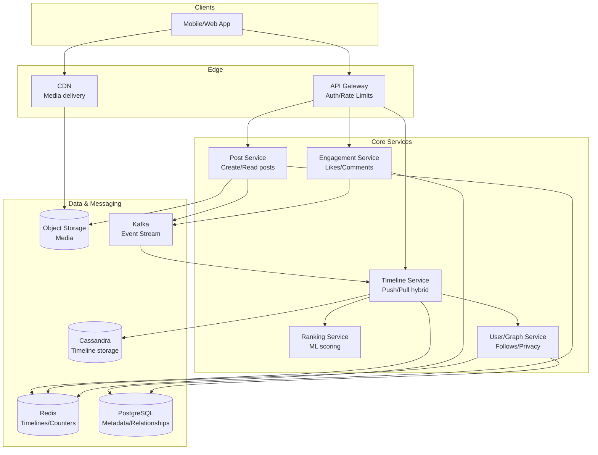

# 2) High-Level Architecture (Most Detailed)

## Components (What/Why)

- API Gateway: Auth, routing, rate limits
- User/Graph Service: Follows, blocks, privacy checks (graph store + cache)
- Post Service: Create/read posts, metadata, pointers to media in object storage
- Timeline Service:
  - Write path: Fanout (push) to home timelines for normal users
  - Read path: On-demand merge (pull) for heavy accounts/celebrities
- Ranking Service: Feature fetch + scoring; A/B config; TTL caches
- Engagement Service: Likes/comments/shares with idempotency and anti-abuse
- Cache Layer: Redis/Memcache for timelines, user features, counters
- Persistence:
  - OLTP (PostgreSQL/MySQL) for metadata and relationships
  - Wide-column/NoSQL (Cassandra/Scylla) for large append-only timelines
  - Object Storage (CDN) for media
- Event Bus (Kafka): Post published, engagement events, fanout tasks, counter updates
- Offline/Batch: Feature pipelines, model training, aggregation to data lake

## Data Flows

### A) Publish Post (Write Path)

1) Client → API → Post Service: validate auth/visibility; insert post metadata
2) Emit `post.published` event (Kafka) with author_id, visibility, ts
3) Timeline Service consumes event:
   - For normal authors: fetch follower ids (from cache/graph)
   - Enqueue fanout jobs to write post_id into each follower's home timeline (Redis list or NoSQL row)
   - For celebrities (threshold T followers): mark for pull-only; skip push fanout
4) Notifications for close-friends/mentions enqueued; media served via CDN

### B) Fetch Home Feed (Read Path)

1) Client → API → Timeline Service
2) If user is normal (push timelines enabled):
   - Read precomputed home list from Redis/NoSQL (cursor/pagination)
   - Optional: fetch top K and pass to Ranking Service for re-rank; fill from tail if items filtered
3) If user follows celebrities (pull path for those sources):
   - Merge: precomputed list + on-demand fetch from celebrity source timelines (last N)
4) Hydrate posts (Post Service) + apply visibility/privacy filters
5) Return with cursors; prefetch next page asynchronously

### C) Engagements

- Likes/comments produce events; counters updated with write-back cache (eventual consistency)
- Anti-abuse: rate limits, shadow bans, dedupe by idempotency keys

## Minimal Data Model (Indicative)

- users(id, priv_type[public|private], created_at, ...)
- follows(user_id, follows_id, created_at) — sharded by user_id
- posts(id, author_id, vis, text, media_refs, created_at) — time-partitioned
- home_timeline(user_id, ts_bucket, [post_id list]) — NoSQL/Redis
- user_timeline(author_id, ts_bucket, [post_id list]) — source of truth per author
- counters(entity_id, type[like|comment|share], value) — cached with periodic flush

Indexes: follows(user_id), posts(author_id, created_at desc), timelines by key prefix

## APIs (Examples)

- POST /v1/posts {text, media_refs?, vis}
- GET /v1/feed?cursor=...&limit=...
- GET /v1/users/:id/posts?cursor=...
- POST /v1/posts/:id/like (idempotent)

Auth: JWT; per-user rate limits; content safety checks on publish

## Why These Choices

- Push for the 99%: Fast reads for typical users → high cache hit; fanout cost manageable
- Pull for the 1%: Prevent write amplification for celebrities; merge at read time
- Redis + NoSQL: Hot timelines in Redis; durable store in NoSQL; read-through fills
- Kafka fanout: Reliable, parallelizable; backpressure-aware
- Ranking as a service: Feature cache + low-latency model inference; graceful degrade to recency-only

## Monitoring Cheat-Sheet

- Freshness: post publish → feed visible lag (p50/p95/p99)
- Feed latency: p50/p95/p99; cache hit rate
- Fanout: job backlog, throughput, failure/retry counts
- Ranking: p95 latency, cache hit, model fallbacks
- Counters: drift vs ground truth; flush lag
