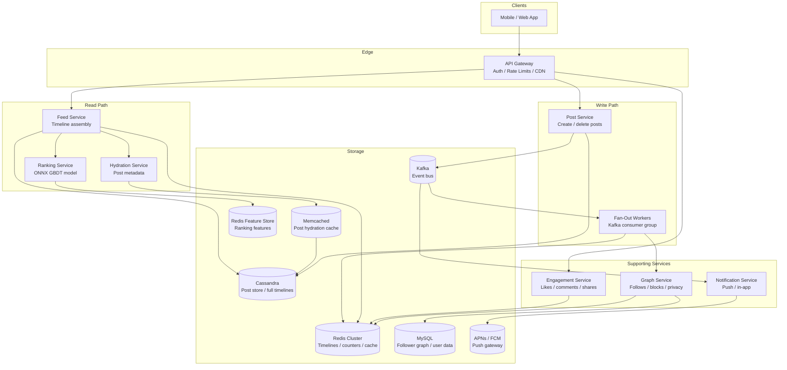

# Chapter 2 — Architecture Design

## Contents

1. [System Overview](#1-system-overview)
2. [Data Flow — Publishing a Post](#2-data-flow--publishing-a-post)
3. [Data Flow — Fetching the Home Feed](#3-data-flow--fetching-the-home-feed)
4. [Fan-Out Service Deep-Dive](#4-fan-out-service-deep-dive)
5. [Ranking Service Deep-Dive](#5-ranking-service-deep-dive)
6. [Engagement & Counter System](#6-engagement--counter-system)
7. [Graph & Privacy Service](#7-graph--privacy-service)
8. [Notification Flow](#8-notification-flow)
9. [Data Model & Storage Design](#9-data-model--storage-design)
10. [API Design](#10-api-design)
11. [Scaling & Capacity](#11-scaling--capacity)
12. [Fault Tolerance](#12-fault-tolerance)
13. [Observability](#13-observability)
14. [Security](#14-security)
15. [Trade-Offs Summary](#15-trade-offs-summary)

---

## 1. System Overview

The feed system has two fully decoupled paths: the **write path** (post creation → Kafka → fan-out workers → Redis timelines) and the **read path** (Redis timeline → post hydration → ranking → response). Kafka is the coupling boundary — the only component both paths touch.


```mermaid
flowchart TB
  subgraph Clients
    App[Mobile / Web App]
  end

  subgraph Edge
    API[API Gateway\nAuth / Rate Limits / CDN]
  end

  subgraph Write Path
    PostSvc[Post Service\nCreate / delete posts]
    FanOutWorker[Fan-Out Workers\nKafka consumer group]
  end

  subgraph Read Path
    FeedSvc[Feed Service\nTimeline assembly]
    RankSvc[Ranking Service\nONNX GBDT model]
    HydrateSvc[Hydration Service\nPost metadata]
  end

  subgraph Supporting Services
    GraphSvc[Graph Service\nFollows / blocks / privacy]
    EngageSvc[Engagement Service\nLikes / comments / shares]
    NotifSvc[Notification Service\nPush / in-app]
  end

  subgraph Storage
    Kafka[(Kafka\nEvent bus)]
    Redis[(Redis Cluster\nTimelines / counters / cache)]
    Cassandra[(Cassandra\nPost store / full timelines)]
    MySQL[(MySQL\nFollower graph / user data)]
    Memcached[(Memcached\nPost hydration cache)]
    FeatureStore[(Redis Feature Store\nRanking features)]
    PushGW[(APNs / FCM\nPush gateway)]
  end

  App --> API

  API --> PostSvc --> Kafka
  API --> FeedSvc
  API --> EngageSvc

  Kafka --> FanOutWorker --> Redis
  Kafka --> NotifSvc --> PushGW

  FeedSvc --> Redis
  FeedSvc --> Cassandra
  FeedSvc --> HydrateSvc --> Memcached --> Cassandra
  FeedSvc --> RankSvc --> FeatureStore

  PostSvc --> Cassandra
  EngageSvc --> Redis
  GraphSvc --> MySQL & Redis
  FanOutWorker --> GraphSvc
```

**Figure 1 — High-level component overview.** Solid arrows are synchronous calls; Kafka arrows are async.

---

## 2. Data Flow — Publishing a Post

Post creation is optimized for low write latency. All expensive work (fan-out, notifications, search indexing) is async.

1. **Auth & validate**: Client sends `POST /v1/posts` with JWT. API Gateway validates token, checks rate limit (50 posts/hr per user), enforces content length limit.
2. **Media handling**: If post contains media, client receives a presigned S3 URL from the Media Service separately. The post body contains only the media reference URL, not the binary.
3. **Post write**: Post Service generates a `post_id` (UUID v7 — contains timestamp for natural sort order). Writes to Cassandra `posts` table (partition key: `author_id`, cluster key: `post_id`). Also writes to `author_timeline` sorted set in Redis for fast source-timeline reads.
4. **ACK client**: Post Service returns `{post_id, created_at}` to client within 30 ms. Fan-out has not started yet.
5. **Publish event**: Post Service publishes `{post_id, author_id, created_at, visibility, text_preview}` to Kafka topic `post.created`. Async from this point.
6. **Fan-out dispatch**: Fan-Out Worker consumes `post.created`. Calls Graph Service to get follower list for `author_id`. If follower count ≤ 10 K (fan-out threshold): writes `post_id` as a scored entry (score = `created_at` unix ms) into each follower's `timeline:{user_id}` Redis sorted set. ZADD with LTRIM to bound at 200 entries.
7. **Celebrity handling**: If follower count > 10 K, Fan-Out Worker skips Redis writes. Post lands only in `celebrity_posts:{author_id}` Redis set. Pull-at-read handles delivery.
8. **Side effects**: Kafka `post.created` is also consumed by: Search Indexer (adds post to Elasticsearch), Notification Worker (fans out push to close-friends/mentioned users), Analytics pipeline.

**End-to-end publish latency**: Client ACK ≈ 30 ms. Post visible in followers' feeds ≈ 5–15 s (fan-out worker processing time at median load).

---

## 3. Data Flow — Fetching the Home Feed

Feed assembly is designed to complete in < 50 ms p50 end-to-end. Every step has a timeout and a fallback.

1. **Request**: Client sends `GET /v1/feed?cursor={cursor}&limit=20`. API Gateway forwards to Feed Service.
2. **Timeline retrieval**: Feed Service reads `timeline:{user_id}` from Redis sorted set (`ZREVRANGEBYSCORE` with keyset cursor). Returns up to 200 candidate post IDs. Timeout: 5 ms. Fallback on Redis miss: read from Cassandra `home_timeline` table (slower, ~20 ms).
3. **Celebrity injection**: Feed Service calls Graph Service to get the user's celebrity followees (those above the fan-out threshold). For each, reads the last 20 posts from `celebrity_posts:{author_id}` in Redis. Merges into the candidate set (in-memory sort by score). Deduplicates by `post_id` using a hash set.
4. **Privacy filter**: Feed Service calls Graph Service to get `{blocked_by_user, blocked_by_other, private_accounts_not_followed}`. Removes any candidate posts where `author_id` is in the blocked set. Applied in-memory against the candidate set (< 1 ms).
5. **Post hydration**: Feed Service passes the filtered list of post IDs to Hydration Service. Hydration Service fetches from Memcached (batch `get` for all IDs simultaneously). Cache hit rate target: > 90%. Misses fall through to Cassandra `posts` table. Timeout: 15 ms. Fallback: omit un-hydratable posts (partial feed rather than error).
6. **Ranking**: Feed Service passes hydrated posts with context features `{user_id, local_hour, session_depth}` to Ranking Service. Ranking Service fetches pre-computed affinity features from the Redis Feature Store (1 batch read). Runs ONNX GBDT model in-process to score each post. Timeout: 25 ms hard limit. Fallback: sort by `created_at` descending (reverse-chronological).
7. **Response assembly**: Feed Service takes the top 20 ranked posts, computes the next cursor `(score, post_id)` from the 21st post, and returns the response. Includes `X-Feed-Mode: ranked` or `X-Feed-Mode: chronological` header to indicate which mode was used.
8. **Prefetch**: Feed Service asynchronously pre-fetches the next page (posts 21–40) and writes them to a short-lived Redis key `feed_prefetch:{user_id}:{cursor}` (TTL 30 s) for instant next-page response.

**Critical path latency breakdown**: Redis timeline (5 ms) + privacy filter (1 ms) + hydration (10 ms Memcached hit) + ranking (15 ms) + serialization (5 ms) = ~36 ms p50.

---

## 4. Fan-Out Service Deep-Dive

Fan-out is the highest-volume write operation in the system. Design decisions here determine Redis write throughput, storage cost, and feed freshness.

### Parallelism

Fan-Out Workers are a Kafka consumer group (`fanout-workers`) with one worker per Kafka partition. The `post.created` topic has 200 partitions; scaling to 200 parallel workers provides 200× fan-out throughput. Each worker handles its partition independently — no inter-worker coordination.

### Follower List Chunking

Graph Service returns follower IDs in pages of 5 K. Fan-Out Worker processes each page as a Redis pipeline (`ZADD` + `LTRIM` batched into a single round-trip). 10 K followers → 2 pages → 2 Redis pipeline calls. Redis pipeline amortizes RTT: 2 K `ZADD` operations in one pipeline call = ~5 ms vs 2 K individual calls = ~2 s.

### Inactive User Optimization

Timeline Redis keys have a 7-day TTL (reset on each new entry). Users inactive for > 7 days have no Redis key. Fan-out skips writing to keys that don't exist (ZADD NX on a non-existent key with TTL creates the key, but a prior check on activity status avoids the overhead). Reduces fan-out Redis writes by ~30% (inactive user fraction).

### Backpressure

If Kafka consumer lag on `fanout-workers` exceeds 60 s, the HPA scales fan-out worker pods. If lag exceeds 5 min (capacity ceiling), fan-out enters degraded mode: process only users who have been active in the last 48 h (high-priority subset). Inactive user timelines catch up once lag clears.

---

## 5. Ranking Service Deep-Dive

### Features

| Feature | Type | Source | Latency |
|---|---|---|---|
| Author-user affinity | Float (0–1) | Redis Feature Store (pre-computed hourly) | < 1 ms (batch) |
| Author engagement rate (7d) | Float | Redis Feature Store | < 1 ms (batch) |
| Post engagement velocity (15 min) | Float | Redis counter (HGET) | < 1 ms (batch) |
| Post freshness decay | Float | Computed inline from `created_at` | 0 ms |
| User local hour-of-day | Integer (0–23) | From request context | 0 ms |
| Post has media | Boolean | Hydrated post object | 0 ms |
| User session depth | Integer | From request context | 0 ms |

### Model

GBDT (Gradient Boosted Decision Tree) trained offline with LightGBM. Served via ONNX Runtime in-process (no network round-trip). Inference time: ~0.05 ms per candidate. 200 candidates × 0.05 ms = 10 ms total inference. Feature fetch from Redis adds ~5 ms (one batch pipelined call).

### Graceful Degradation

Ranking Service is a soft dependency. Feed Service wraps the ranking call in a `CircuitBreaker` with a 25 ms timeout. On open circuit or timeout: `fallback = sorted(candidates, key=lambda p: p.created_at, reverse=True)`. The `X-Feed-Mode: chronological` header is set; the fallback rate is tracked as a separate metric.

---

## 6. Engagement & Counter System

### Like Flow

1. Client `POST /v1/posts/{id}/like`. Engagement Service validates JWT.
2. Idempotency check: `SET user:{uid}:liked:{post_id} 1 NX EX 2592000` (30-day TTL) returns 0 (already exists) → return 200 with no state change.
3. If new: `INCR counter:{post_id}:likes` in Redis counter shard.
4. Publish `{post_id, user_id, action: "like"}` to Kafka `engagement.events`.
5. Kafka consumer (batch processor): every 60 s, flush Redis counter values to Cassandra `post_counters` table.
6. Unlike: `DEL user:{uid}:liked:{post_id}` + `DECR counter:{post_id}:likes`.

### Counter Hot Key Handling

A viral post receiving 1 M likes/sec would saturate a single Redis key. Counter sharding: Engagement Service routes `INCR` to `counter:{post_id}:likes:{shard}` where `shard = random(0, N-1)`. Feed read path sums shards: `SUM(MGET counter:{post_id}:likes:0 ... counter:{post_id}:likes:N-1)`. Sharding activated automatically when per-key ops/sec > 100 K (detected by a hot-key monitor daemon).

### Comments

Comments are written to Cassandra `comments` table (partition: `post_id`, cluster: `comment_id`). Hot comments (> 10 K replies) are cached in Memcached. Comment count is maintained as a Redis counter with the same flush pattern as likes.

---

## 7. Graph & Privacy Service

### Storage

- **MySQL** (source of truth): `follows(follower_id, followee_id, created_at, status)`. Transactional follow/unfollow (ACID). Indexes: `(follower_id)`, `(followee_id)`.
- **Redis** (hot cache): `following:{user_id}` → sorted set of followee IDs (score = follow timestamp). `followers:{user_id}` → sorted set of follower IDs. TTL 1 hour (actively refreshed on access). Celebrity follower sets are NOT cached in Redis (too large); fetched from MySQL paginated.
- **Cassandra** (celebrity follower lists): `celebrity_followers(author_id, follower_id)`. Partition key `author_id` enables efficient bulk reads for fan-out.

### Privacy Check

Privacy filter is a read-path concern. Graph Service exposes `GET /privacy/check?viewer_id=X&author_id=Y` returning `{allowed: bool, reason}`. Internally: checks `blocks` table (MySQL, cached in Redis Bloom filter), checks `follows` table if account is private. Response cached in Redis for 5 min (TTL). On block event: publish to `privacy.updated` Kafka topic; all Graph Service pods consume and immediately invalidate their local cache for the affected pair.

### Block/Mute Events

Privacy changes are propagated via `privacy.updated` Kafka topic consumed by Fan-Out Workers (to remove posts from blocked user from existing timelines) and by Feed Service pods (to invalidate privacy cache). This ensures blocked content is removed from feeds within the next cache TTL (< 5 min).

---

## 8. Notification Flow

1. **Trigger**: Kafka `engagement.events` consumed by Notification Worker. Also consumes `post.created` for new-post notifications to close-friends.
2. **Eligibility**: Notification Worker calls Graph Service to check: is the recipient following the actor? Has the recipient muted notifications from this actor? Is the recipient's notification preference for this action type enabled?
3. **Rate limiting**: Per-recipient notification rate limit: max 5 push notifications/hour. Excess notifications are aggregated into a digest ("5 people liked your post").
4. **Delivery**: APNs for iOS, FCM for Android. Notification Worker batches up to 500 messages per APNs/FCM API call for throughput efficiency.
5. **In-app**: Notification events also written to Cassandra `notifications` table (partition: `recipient_id`, cluster: `notification_id` desc). Client polls `GET /v1/notifications?cursor=` on app open.
6. **At-least-once delivery**: Kafka consumer commits offsets only after successful APNs/FCM delivery confirmation. Failed deliveries are retried with exponential backoff (3 retries max). Undeliverable notifications (device token expired) trigger token refresh flow.

---

## 9. Data Model & Storage Design

### Cassandra Tables

```
posts(
  author_id UUID,
  post_id   TIMEUUID,    -- contains timestamp; natural sort order
  text      TEXT,
  media_url TEXT,
  visibility TEXT,
  PRIMARY KEY (author_id, post_id)
) WITH CLUSTERING ORDER BY (post_id DESC)
  AND default_time_to_live = 2592000;  -- 30-day hot tier

home_timeline(
  user_id   UUID,
  bucket    INT,         -- floor(unix_ts / 86400) for day-based bucketing
  post_id   TIMEUUID,
  author_id UUID,
  PRIMARY KEY ((user_id, bucket), post_id)
) WITH CLUSTERING ORDER BY (post_id DESC);

post_counters(
  post_id   UUID,
  likes     COUNTER,
  comments  COUNTER,
  shares    COUNTER,
  PRIMARY KEY (post_id)
);
```

### Redis Keys

| Key Pattern | Type | Purpose | TTL |
|---|---|---|---|
| `timeline:{user_id}` | Sorted Set | Home feed timeline (last 200 post IDs, scored by timestamp) | 7 days |
| `celebrity_posts:{author_id}` | Sorted Set | Last 200 post IDs from celebrity authors | 1 hour |
| `counter:{post_id}:likes:{shard}` | String | Like counter shard | No TTL |
| `following:{user_id}` | Sorted Set | Followee IDs | 1 hour |
| `user:{uid}:liked:{post_id}` | String (NX) | Like idempotency key | 30 days |
| `affinity:{user_id}:{author_id}` | String | Online affinity score | 2 hours |
| `feed_prefetch:{user_id}:{cursor}` | String (JSON) | Pre-fetched next page | 30 seconds |

### MySQL Tables

```sql
CREATE TABLE follows (
  follower_id  CHAR(36) NOT NULL,
  followee_id  CHAR(36) NOT NULL,
  status       ENUM('active','pending','blocked') NOT NULL,
  created_at   DATETIME NOT NULL,
  PRIMARY KEY (follower_id, followee_id),
  INDEX (followee_id, status)
);

CREATE TABLE blocks (
  blocker_id   CHAR(36) NOT NULL,
  blocked_id   CHAR(36) NOT NULL,
  created_at   DATETIME NOT NULL,
  PRIMARY KEY (blocker_id, blocked_id)
);
```

---

## 10. API Design

### Core Endpoints

```
POST   /v1/posts                      — Create post; returns {post_id, created_at}
DELETE /v1/posts/{id}                 — Delete post (owner only; soft delete)
GET    /v1/posts/{id}                 — Get single post with counters

GET    /v1/feed?cursor=&limit=        — Home feed (ranked); cursor = base64({score,post_id})
GET    /v1/users/{id}/posts?cursor=   — Author's post timeline (public)

POST   /v1/posts/{id}/like            — Like (idempotent); returns {liked: bool, count: int}
DELETE /v1/posts/{id}/like            — Unlike (idempotent)
POST   /v1/posts/{id}/comments        — Create comment
GET    /v1/posts/{id}/comments?cursor= — Paginated comments

POST   /v1/follows/{user_id}          — Follow; returns {status: active|pending}
DELETE /v1/follows/{user_id}          — Unfollow
POST   /v1/blocks/{user_id}           — Block
DELETE /v1/blocks/{user_id}           — Unblock

GET    /v1/notifications?cursor=      — In-app notifications (paginated)
```

### Rate Limits

| Endpoint | Limit |
|---|---|
| `POST /v1/posts` | 50/hr per user (burst: 10/min) |
| `GET /v1/feed` | 200/min per user |
| `POST .../like` | 100/min per user |
| `POST .../comments` | 30/min per user |
| `POST /v1/follows` | 400/day per user |

---

## 11. Scaling & Capacity

| Component | Baseline | Scale Trigger | Action |
|---|---|---|---|
| Post Service | 50 pods | CPU > 70% or RPS > 80% capacity | HPA on CPU/RPS |
| Fan-Out Workers | 200 pods (1 per Kafka partition) | Consumer lag > 60 s | HPA on lag; increase partitions if ceiling hit |
| Feed Service | 200 pods | p95 > 250 ms or RPS > 80% | HPA on RPS |
| Ranking Service | 100 pods | p95 > 20 ms or error rate > 1% | HPA on CPU |
| Redis timeline cluster | 10 nodes (5 shards × 2) | Memory > 70% | Add shard; rebalance slots |
| Memcached (hydration) | 20 nodes | Hit rate < 85% | Add nodes; tune max memory per node |
| MySQL (graph) | 1 primary + 4 replicas | Read replica CPU > 60% | Add read replica; shard by user_id range |
| Cassandra (posts) | 20 nodes (RF=3) | Read/write latency p99 > 20 ms | Add nodes; rebalance vnodes |
| Kafka | 30 brokers | Consumer lag > 5 min | Add brokers; increase `post.created` partitions |

---

## 12. Fault Tolerance

| Failure | Detection | Mitigation | Recovery |
|---|---|---|---|
| Redis timeline down | `timeline_cache_miss_rate` > 50% | Read `home_timeline` from Cassandra (slower) | Redis Sentinel promotes replica; rebuild timeline async |
| Fan-out lag spike | Consumer lag > 60 s | HPA scales workers; promote celebrities to pull mode | Drain Kafka backlog at catch-up throughput |
| Ranking service timeout | `ranking_fallback_rate` > 1% | Reverse-chronological fallback (25 ms hard timeout) | Pod restart; stateless recovery < 30 s |
| Privacy cache stale | Audit probe detects violation | Kill switch: disable feed; redeploy with fix | Block event invalidation via `privacy.updated` topic |
| Counter hot key | Per-key ops/sec > 100 K | Automatic counter sharding (N=8 shards) | Shard merge on viral spike subsidence |
| Cassandra node failure | RF=3 + LOCAL_QUORUM | Serve reads from remaining 2 replicas | Cassandra auto-repair on node return |
| Graph service down | Error rate > 5% | Use stale cached follower list (5 min TTL) from Redis | Stateless pod restart; graph DB unaffected |

---

## 13. Observability

### SLO Dashboards

| Metric | p50 | p95 | p99 | Alert |
|---|---|---|---|---|
| Feed API latency | 50 ms | 200 ms | 400 ms | p95 > 250 ms |
| Post creation latency | 20 ms | 80 ms | 150 ms | p99 > 200 ms |
| Fan-out freshness | 3 s | 15 s | 30 s | p95 > 30 s |
| Ranking latency | 8 ms | 20 ms | 35 ms | p95 > 25 ms |
| Like API latency | 5 ms | 15 ms | 30 ms | p99 > 60 ms |

### Key Operational Metrics

- `fanout_kafka_lag` — leading indicator of freshness degradation
- `ranking_fallback_rate` — indicates ranking service health
- `redis_timeline_hit_rate` — drives feed latency; alert if < 90%
- `privacy_audit_violation_count` — must be zero; any non-zero value is P0
- `counter_hot_key_detected` — triggers automatic sharding

### Distributed Tracing

OpenTelemetry trace spans: `API Gateway → Feed Service → [Redis, Hydration Service, Ranking Service]`. Latency breakdown per span visible in Jaeger/Tempo. Every feed request carries `X-Trace-ID` propagated to all downstream calls.

---

## 14. Security

- **JWT auth**: RS256-signed tokens, 1-hour TTL, validated at API Gateway via JWKS endpoint. Feed Service and downstream services trust the gateway's `X-User-ID` header (not re-validate the JWT).
- **Scoped tokens**: Creator apps receive tokens with `posts:write` scope. Read-only clients (embeds) get `feed:read` scope only.
- **Rate limiting**: Enforced at API Gateway using a Redis sliding window counter per `(user_id, endpoint)`.
- **Content safety**: ML classifier (async, post-publish) screens text for hate speech, CSAM, spam. Violations trigger soft-delete + human review queue.
- **Privacy enforcement**: Dual-layer (write time + read time) as described in Section 7. Privacy audit log samples 1% of feed responses to detect leaks.
- **GDPR / data deletion**: Account deletion triggers async pipeline: soft-delete → hard-delete from Cassandra within 30 days → tombstone events in Kafka → Redis key expiry. Audit logs retained separately under legal hold exemption.

---

## 15. Trade-Offs Summary

| Decision | Choice | Alternative Rejected | Reason |
|---|---|---|---|
| Fan-out strategy | Hybrid (push for ≤ 10 K followers; pull for celebrities) | Pure push | Write amplification at celebrity scale makes pure push infeasible |
| Timeline hot store | Redis sorted set | Cassandra only | 2 ms vs 20 ms read latency; needed for 200 ms SLO |
| Counter consistency | Write-back (Redis INCR + 60 s flush) | Write-through to Cassandra | 500 K events/sec exceeds Cassandra direct write capacity |
| Ranking timeout | 25 ms hard timeout + reverse-chron fallback | Blocking wait | Feed must always return; ranking is a quality enhancement, not a gate |
| Pagination | Keyset cursor (score, post_id) | Offset-based | Offset pagination is unstable on a live feed; keyset is O(log N) and deterministic |
| Graph store | MySQL + Redis cache | Graph DB (Neo4j) | Fan-out needs bulk edge reads, not traversal; MySQL + cache is simpler and sufficient |
| Deduplication | In-memory hash set + original_post_id dedup | Bloom filter | Candidate set bounded at 200; hash set is O(N) with negligible cost |
| Celebrity threshold | 10 K followers (with 8 K hysteresis) | Static 1 M | At 1 M threshold, fan-out cost is too high; 10 K is a practical balance |
