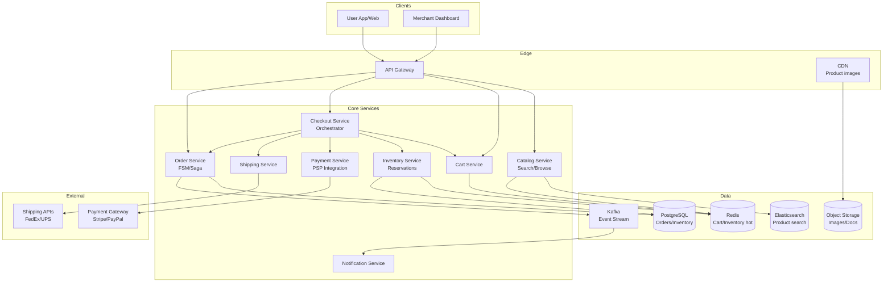

# 2) High-Level Architecture (Most Detailed)

## Components

- Catalog Service: Product metadata, images, pricing; ElasticSearch for search; Redis cache for hot products
- Cart Service: Session-based (Redis) or persistent (SQL); calculate totals client-side with server validation
- Inventory Service: Hot stock in Redis; ledger in SQL; reservation queue with TTL
- Checkout Service: Orchestrate validation, reserve, tax/shipping calc, payment auth
- Payment Service: PSP integration (Stripe/PayPal); tokenization; auth→capture flow; idempotency keys
- Order Service: Order FSM (state machine); saga pattern for rollback on failures
- Shipping Service: Rate calculation (FedEx/UPS APIs); label generation; tracking updates
- Notification Service: Email/SMS for order status; webhooks for merchants

## Data Flows

### A) Add to Cart → Checkout → Payment

1) User adds items → Cart Service (Redis); validate SKU exists and price current
2) Checkout initiation → Checkout Service validates cart; reserves inventory (write to reservation table with TTL)
3) Calculate shipping/taxes (external APIs or cached rates)
4) Apply discounts/coupons (validate rules; update subtotal)
5) Payment authorization (PSP); idempotency key prevents double-charge
6) On success: create order (state=confirmed); decrement inventory; capture payment async or on shipment
7) On failure: release reservation; return error with retry guidance

### B) Inventory Reserve & Release

- Reserve: INSERT reservation(sku_id, user_id, qty, expires_at); check stock >= reserved+qty
- TTL worker: Periodically scan expired reservations; release back to available stock
- Decrement: On payment capture, atomic decrement: UPDATE inventory SET stock = stock - qty WHERE sku_id = ? AND stock >= qty

## Data Model

- products(id, merchant_id, name, price, category, rating, stock_total, created_at)
- inventory(sku_id PK, warehouse_id, stock_available, stock_reserved)
- reservations(id PK, sku_id FK, user_id, qty, expires_at, status[active|released|fulfilled])
- orders(id PK, user_id, total, state[created|confirmed|shipped|delivered|canceled|refunded], created_at)
- order_items(order_id FK, sku_id, qty, price_snapshot)
- payments(order_id FK, psp_ref, amount, status[authorized|captured|failed|refunded], idempotency_key)

## APIs

- GET /v1/products?q=...&filters=...
- POST /v1/cart {sku_id, qty}
- POST /v1/checkout {cart_id, shipping_address, payment_method_token}
- GET /v1/orders/:id

Auth: JWT; rate-limit checkout per user; validate ownership

## Why These Choices

- Redis for cart/inventory hot path: sub-ms reads; TTL for session expiry
- Saga pattern: Compensating transactions (release, refund) on partial failure
- Idempotency keys: PSP retries safe; prevent duplicate charges
- Async capture: Hold auth at checkout; capture on shipment (reduces refund friction)

## Monitoring

- Checkout funnel: cart→checkout→payment success rates
- Inventory: oversell incidents; reservation timeout rate
- Payment: auth success, capture success, PSP latency p95
- Order FSM: stuck orders; state transition errors
