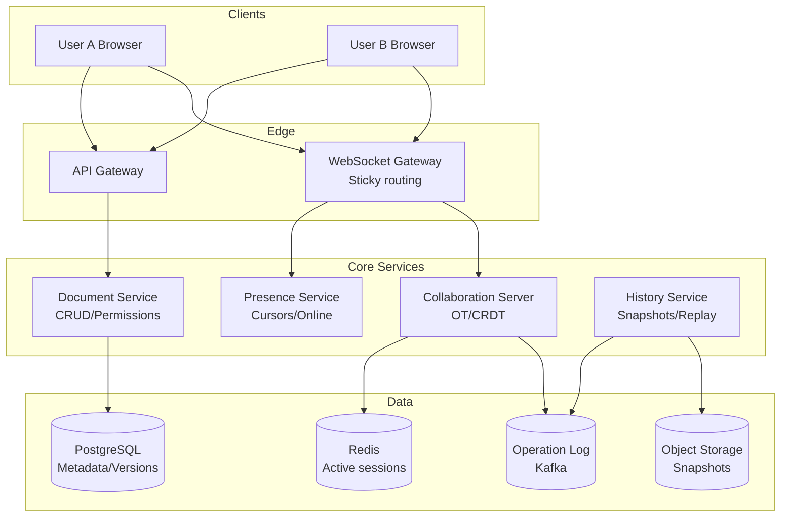

# 2) High-Level Architecture (Most Detailed)

## Components

- WebSocket Gateway: Persistent connections; sticky routing per document session
- Document Service: CRUD for doc metadata; permissions; version snapshots
- Collaboration Server: OT/CRDT transformation; broadcast ops to connected clients; maintain operation history
- Storage: PostgreSQL for metadata/versions; object storage for snapshots; Redis for active session state
- Presence Service: Track cursors, selections, online users per doc
- History Service: Snapshot periodic checkpoints; store operation log; replay for time-travel

## Data Flows

### A) User Opens Document

1) Client → API: GET /docs/:id → metadata, permissions, latest snapshot version
2) Client establishes WebSocket → Collab Server (sticky to doc shard)
3) Server sends: full doc state (or snapshot + ops since snapshot)
4) Client renders; joins presence pool; broadcasts cursor position

### B) User Edits (Insert Text)

1) Client applies local operation immediately (optimistic UI)
2) Generate operation: {type: 'insert', pos: 42, text: 'hello', userId, timestamp, vector_clock}
3) Send op via WebSocket → Collab Server
4) Server applies OT transform (adjust pos if concurrent ops exist); broadcasts to other connected clients
5) Clients receive op; apply with OT; UI updates; no conflict visible to user
6) Server appends op to operation log (durable store)

### C) Concurrent Edits (OT/CRDT in Action)

- User A inserts "X" at pos 10
- User B inserts "Y" at pos 10 (same time)
- Server receives A's op first → broadcasts to B
- B's client transforms B's op using OT: adjust pos if needed (e.g., now pos 11)
- Server receives B's op → transforms against A's → broadcasts
- Final state converges: both clients show same result ("XY" or "YX" deterministically)

### D) Offline Edit & Sync

1) User goes offline; continues editing locally
2) Operations queued in IndexedDB
3) On reconnect: send queued ops with causal ordering (vector clocks)
4) Server replays ops with OT; resolves conflicts; sends catchup ops to client
5) Client applies catchup; UI converges

## Data Model

- documents(id PK, owner_id, title, snapshot_version, created_at, updated_at)
- doc_permissions(doc_id FK, user_id, role[owner|editor|viewer|commenter])
- operations(id PK, doc_id FK, op_type, position, content, user_id, timestamp, vector_clock) — append-only log
- snapshots(doc_id FK, version, content_blob, created_at) — periodic checkpoints
- presence(doc_id, user_id, cursor_pos, selection_range, last_seen) — TTL in Redis

## APIs

- GET /v1/docs/:id {metadata, snapshot_url, permissions}
- WS /v1/collab/:doc_id (ops stream)
- POST /v1/docs/:id/snapshots (manual checkpoint)
- GET /v1/docs/:id/history?version=... (time-travel)

Auth: JWT; validate permissions before WS connect

## Why These Choices

- OT (Operational Transformation): Mature; deterministic convergence; used by Google Docs
- CRDT (Conflict-free Replicated Data Types): Alternative; simpler conflict-free math; larger metadata overhead
- Choice: OT for text (lower overhead); CRDT for rich structures (JSON) if needed
- WebSocket: Bi-directional; low-latency; sticky sessions per doc for ordering
- Operation log: Append-only; enables time-travel; replay for audit
- Snapshots: Reduce replay cost; checkpoint every N ops or time interval

## Monitoring

- Op propagation latency p50/p95/p99
- Transform failures (OT divergence); retry/fallback
- WebSocket connection churn; reconnect rate
- Snapshot lag; storage growth
