# 2) High-Level Architecture (Most Detailed)

```mermaid
flowchart TB
   subgraph Clients
      TraderApp[Trading App]
   end

   subgraph Edge
      Gateway[Order Gateway\nValidation/Risk]
      MDWS[Market Data WebSocket]
   end

   subgraph Core Services
      MatchEngine[Matching Engine\nOrder Book per Symbol]
      ExecSvc[Execution Service\nExternal routing]
      PositionSvc[Position Service\nHoldings/Cash]
      SettleSvc[Settlement Service\nT+2 clearing]
      MDSvc[Market Data Service\nAggregator]
      ComplianceSvc[Audit/Compliance]
   end

   subgraph Data
      Kafka[Kafka\nEvent Log]
      Redis[(Redis\nOrder Book cache)]
      PG[(PostgreSQL\nPositions/Trades)]
   end

   subgraph External
      Exchanges[External Exchanges\nNASDAQ/NYSE]
      Clearinghouse[Clearinghouse]
   end

   TraderApp --> Gateway
   TraderApp --> MDWS
  
   Gateway --> MatchEngine
   Gateway --> Kafka
   MatchEngine --> Redis
   MatchEngine --> Kafka
   MatchEngine --> PositionSvc
  
   ExecSvc --> Exchanges
   PositionSvc --> PG
   SettleSvc --> Clearinghouse
   SettleSvc --> PG
  
   MDSvc --> Kafka
   MDWS --> MDSvc
   Kafka --> ComplianceSvc
  
   Exchanges -.->|FIX/Multicast| MDSvc
```

## Components

- Order Gateway: Validate orders; risk checks; route to matching engine
- Matching Engine: In-memory order book per symbol; FIFO price-time matching; event-sourced
- Market Data Service: Aggregate quotes; publish via WebSocket/multicast; rate-limit per user tier
- Position Service: Track holdings, cash balance; update on fills; strong consistency
- Execution Service: Route orders to external exchanges (NASDAQ, NYSE) or internal matching
- Settlement Service: T+2 clearing; reconcile with clearinghouse; cash movements
- Audit/Compliance: Immutable event log; trade reporting; regulatory exports

## Data Flows

### A) User Places Order

1) User → Order Gateway: POST /orders {symbol: AAPL, type: limit, side: buy, qty: 100, price: 150}
2) Gateway validates: symbol exists, qty > 0, price reasonable
3) Risk check: buying_power >= qty × price; day-trade limit not exceeded
4) Generate order ID; persist to event log (Kafka)
5) Route to Matching Engine (shard by symbol)
6) Matching Engine:
   - Insert into order book (price-time priority)
   - Attempt immediate match with opposite side
   - If match: generate fill event; update order status
   - If partial/no match: order rests in book
7) Ack to user: order accepted, status=open/partial/filled
8) Broadcast fill to Position Service; update holdings + cash

### B) Market Data Distribution

1) Exchange → Market Data Adapters: FIX/multicast feed (quotes, trades)
2) Adapter parses; publishes to internal Kafka topic per symbol
3) Market Data Service consumes; maintains latest bid/ask/last trade per symbol
4) Users subscribe via WebSocket; receive real-time updates (throttled by tier: retail 1Hz, pro 10Hz)

### C) Order Matching (Detail)

Order book structure:
- Buy orders: Max heap (highest price first); FIFO within same price
- Sell orders: Min heap (lowest price first); FIFO within same price

Matching algorithm:
1) New buy limit order at $150
2) Check sell book: any sell <= $150?
3) If yes: Match with best (lowest) sell; generate fill event
4) Update both orders: reduce qty or mark filled
5) If buy qty remains: insert remainder into buy book
6) If no match: insert into buy book
7) Publish fill events; update positions

### D) End-of-Day Settlement

1) Market close: Flush all unfilled orders (or keep for next day per order type)
2) Settlement Service: Aggregate fills; calculate net cash/position changes
3) Submit to clearinghouse (DTCC); T+2 settlement cycle
4) Reconcile: Match platform records with clearinghouse confirmations
5) Report discrepancies; manual review queue

## Data Model

- users(id, cash_balance, buying_power, created_at)
- orders(id PK, user_id FK, symbol, type, side, qty, price, status[open|partial|filled|canceled], created_at, filled_at)
- fills(id PK, order_id FK, qty_filled, fill_price, timestamp, counterparty_order_id)
- positions(user_id, symbol, qty, avg_cost_basis)
- order_book(symbol, side[buy|sell], price, qty, order_id, timestamp) — in-memory; replicated to event log

## APIs

- POST /v1/orders {symbol, type, side, qty, price?}
- GET /v1/orders/:id
- DELETE /v1/orders/:id (cancel)
- WS /v1/market-data/:symbol (subscribe to quotes/trades)
- GET /v1/positions

Auth: JWT; two-factor for trades; rate-limit per user

## Why These Choices

- In-memory order book: Sub-ms matching; durability via event sourcing (Kafka)
- Event sourcing: Replay for audit; disaster recovery; guaranteed consistency
- Shard by symbol: Parallel matching; single-threaded per symbol for deterministic FIFO
- WebSocket for market data: Low-latency push; backpressure-aware
- Strong consistency for positions: No phantom shares; ACID transactions

## Monitoring

- Matching latency p50/p95/p99 per symbol
- Order ack latency; fill rate
- Market data lag (exchange timestamp → user receive)
- Position reconciliation errors (daily check)
- Risk check rejections; fraud alerts
