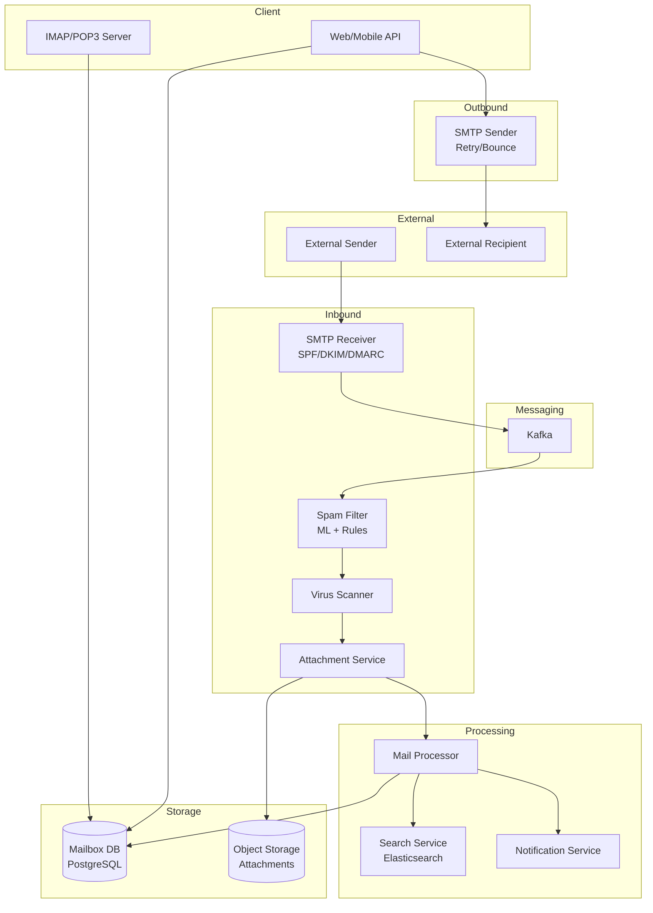

# 2) High-Level Architecture (Most Detailed)

## Components

- SMTP Receiver: Accept inbound emails; validate SPF/DKIM; enqueue for processing
- Spam Filter: ML model (LSTM on email text) + rule-based (blacklists, regex); score 0-100
- Virus Scanner: ClamAV or cloud API (VirusTotal); quarantine if malware detected
- Attachment Service: Extract attachments; deduplicate (SHA-256 hash); store in S3; compress images
- Mail Processor: Route to user mailbox; apply filters (inbox, spam, archive); trigger notifications
- Mailbox Service: CRUD operations on user mailboxes; IMAP/POP3 server; fetch emails
- Search Service: Elasticsearch cluster; index subject, body, sender, date; full-text queries
- SMTP Sender: Outbound email delivery; retry logic; bounce handling; reputation tracking
- Notification Service: Push to mobile/desktop; IMAP IDLE or WebSocket for real-time alerts
- Web/Mobile API: RESTful API for compose, read, search, organize

## Data Flows

### A) User Receives Email (Inbound)

1) External sender → SMTP Receiver (port 25): `MAIL FROM`, `RCPT TO`, `DATA`
2) SMTP Receiver:
   - Validate recipient exists
   - Check SPF record (sender IP authorized?)
   - Verify DKIM signature (email not tampered?)
   - Check DMARC policy (alignment of From header)
3) Enqueue to Kafka topic: `incoming_mail` (message = raw email + metadata)
4) Mail Processor consumer:
   - Parse MIME (multipart/alternative, attachments)
   - Extract attachments → Attachment Service (store in S3, generate download URL)
   - Run spam filter: ML model scores email; if score > 80 → spam folder
   - Run virus scan on attachments; if malware → quarantine, notify user
   - Apply user filters (e.g., "from:boss@example.com → label:important")
5) Insert email into user's mailbox DB (PostgreSQL, sharded by user_id)
6) Index email in Elasticsearch (async; eventual consistency OK for search)
7) If user online: Push notification via WebSocket or IMAP IDLE
8) SMTP ack to sender: `250 OK`

### B) User Sends Email (Outbound)

1) User → Web API: POST /v1/emails {to, subject, body, attachments[]}
2) Web API:
   - Validate attachments <25MB total
   - Upload attachments to S3 (deduplicate by hash)
   - Compose MIME message (multipart/mixed)
3) Insert into `outbox` table (user_id, email_id, status=pending)
4) Enqueue to Kafka: `outgoing_mail`
5) SMTP Sender consumer:
   - Resolve recipient MX records (DNS lookup)
   - Connect to recipient's SMTP server
   - Send email: `MAIL FROM`, `RCPT TO`, `DATA`
   - Handle response:
     - `250 OK`: Mark sent; update status=delivered
     - `4xx` (temp fail): Retry (exponential backoff; max 3 days)
     - `5xx` (hard bounce): Mark failed; notify user
6) Store sent email in user's "Sent" folder
7) Track sender reputation (bounces, spam reports); throttle if reputation drops

### C) User Searches Email

1) User → Web API: GET /v1/search?q=receipt+from:amazon&folder=inbox
2) API → Search Service (Elasticsearch):
   - Query: `{ "bool": { "must": [ {"match": {"body": "receipt"}}, {"term": {"from": "amazon"}}, {"term": {"folder": "inbox"}} ] } }`
   - Filter by user_id (security: only search own emails)
3) Elasticsearch returns matching email IDs + snippets (highlights)
4) API fetches email metadata from Mailbox Service (cache in Redis; TTL 5 min)
5) Return results to user (paginated; 20/page)

### D) Spam Detection (Detail)

Two-stage filter:
1) **Rule-based** (fast; 10ms):
   - Blacklist: Known spammer IPs (updated hourly from threat feeds)
   - Regex: `viagra|cheap mortgage|click here` in subject/body
   - Rate-limit: Sender sends >100 emails in 1 min → likely spam
2) **ML-based** (slower; 200ms):
   - LSTM model trained on 1B labeled emails (spam/ham)
   - Features: TF-IDF of subject+body, sender domain age, attachment types, DKIM pass/fail
   - Output: Probability 0-1 (convert to 0-100 score)

Final decision:
- Score 0-50: Inbox
- Score 51-80: Suspicious (show warning banner)
- Score 81-100: Spam folder

User feedback loop: If user marks email as spam/not spam → retrain model weekly.

## Data Model

- **users**(id, email, quota_used, quota_limit, created_at)
- **emails**(id PK, user_id FK, folder[inbox|sent|spam|trash|archive], subject, from, to, body_text, body_html, received_at, read, thread_id)
- **attachments**(id PK, email_id FK, filename, size, content_type, s3_key, sha256_hash, virus_scan_status)
- **threads**(id PK, user_id FK, subject_normalized, participant_emails[], updated_at)
- **filters**(id PK, user_id FK, condition{from, subject, has_attachment}, action{label, folder, delete})
- **sender_reputation**(domain, ip, bounce_rate, spam_report_rate, score, updated_at)

Sharding:
- Mailbox DB: Shard by user_id (hash-based; 64 shards)
- Elasticsearch: Shard by user_id (one index per shard; 128 shards)
- Attachments: S3 (partitioned by date: /2025/01/15/{hash}.pdf)

## APIs

- POST /v1/emails {to, subject, body, attachments} — Send email
- GET /v1/emails?folder=inbox&page=1 — List emails
- GET /v1/emails/:id — Fetch email detail
- PUT /v1/emails/:id {read: true, folder: archive} — Update email
- DELETE /v1/emails/:id — Move to trash (soft delete; 30-day retention)
- GET /v1/search?q=query&folder=inbox&page=1 — Search
- POST /v1/filters {condition, action} — Create filter

Auth: OAuth 2.0; scope: `email.read`, `email.send`; rate-limit: 1000 API calls/hour per user.

## Why These Choices

- Kafka for mail queue: Decouple SMTP ingestion from processing; replay on failures; scale consumers independently
- PostgreSQL sharded: Strong consistency for mailbox (ACID); predictable query patterns (fetch by user_id)
- Elasticsearch: Full-text search with relevance scoring; tolerates eventual consistency (OK if search lags by 1 min)
- S3 for attachments: Cheap storage ($0.02/GB); deduplication saves 30% (many users receive same PDF)
- Two-stage spam filter: Fast rule-based catches 80%; ML catches remaining 20%; total latency <250ms

## Monitoring

- SMTP receive rate (emails/sec); reject rate (invalid recipients)
- Spam filter accuracy: Precision/recall (daily report)
- Virus scan hits; quarantine rate
- Search latency p95/p99; Elasticsearch cluster health
- Outbound delivery rate; bounce rate per domain
- Storage quota per user; total storage growth rate
