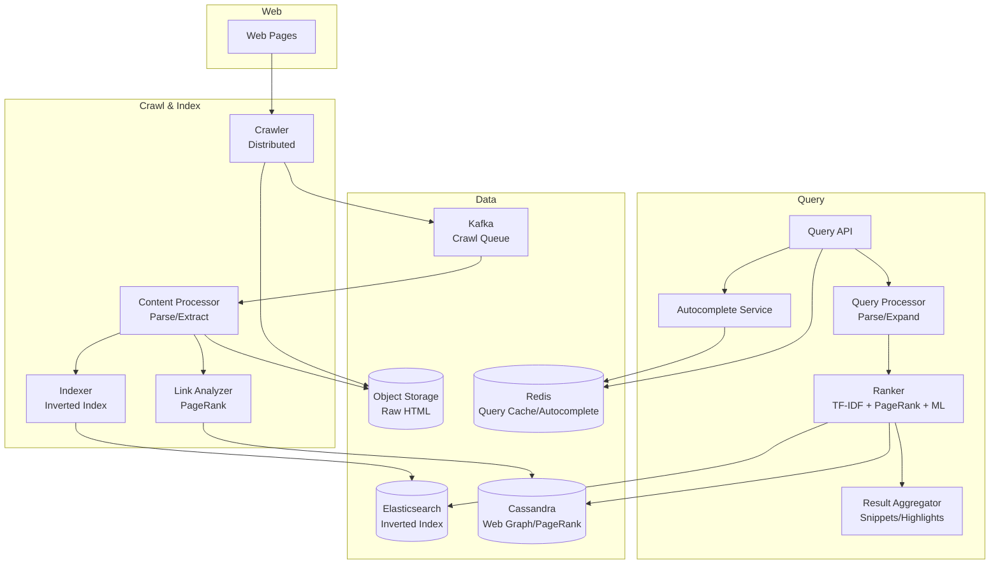

# 2) High-Level Architecture (Most Detailed)

## Components

- Crawler: Fetch web pages; follow links; distributed queue (Kafka); respect robots.txt, politeness
- Content Processor: Parse HTML; extract text, links, meta tags; detect language, duplicates
- Indexer: Build inverted index (term → doc IDs); TF-IDF scores; store in distributed index (Elasticsearch or custom)
- Link Analyzer: Calculate PageRank; build web graph; detect link spam
- Query Processor: Parse query; spell-check; expand synonyms; tokenize
- Ranker: Retrieve candidate docs; score (TF-IDF + PageRank + ML model); return top 10
- Result Aggregator: Fetch snippets; highlight query terms; add cached links
- Autocomplete Service: Trie-based; personalized suggestions; updated from query logs
- Cache Layer: Redis; cache popular query results (top 10K queries = 50% traffic); TTL 5 min

## Data Flows

### A) Web Crawling

1) Seed URLs: Start with curated list (Alexa top 1M, news sites, Wikipedia)
2) Crawler:
   - Dequeue URL from frontier (priority queue in Kafka; partition by domain)
   - Fetch robots.txt: Check `Disallow`, `Crawl-delay`
   - HTTP GET: Fetch page (timeout 10s; follow redirects; max 5 hops)
   - Store raw HTML in S3 (compressed); key = URL hash
   - Extract links: Parse `<a href>`, canonicalize URLs (remove #fragment, sort query params)
   - Enqueue new links to frontier (dedupe via Bloom filter; avoid crawling same URL twice)
3) Politeness: Rate-limit 1 req/sec per domain (distributed rate limiter via Redis)
4) Crawl schedule: High-priority (news sites) → hourly; medium (blogs) → daily; low (archives) → weekly

### B) Indexing

1) Content Processor (reads from S3):
   - Parse HTML (BeautifulSoup); extract title, meta description, body text
   - Detect language (langdetect); skip non-English if configured
   - Remove boilerplate (ads, nav bars) via template detection
   - Deduplicate: Compute SimHash; if 95% similar to existing doc → skip
2) Tokenize text: Split into words; lowercase; remove stop words (the, is, a)
3) Stemming: "running" → "run" (Porter stemmer)
4) Build inverted index:
   - For each term: Store doc IDs where term appears + positions (for phrase queries)
   - Example: `{"python": [doc1:pos[10,50], doc2:pos[5]], "tutorial": [doc1:pos[51], doc3:pos[3]]}`
5) Compute TF-IDF: Term frequency × inverse document frequency
6) Store index in Elasticsearch (sharded by term hash; 100 shards)
7) Link Analyzer: Extract outgoing links; build web graph (doc → outgoing URLs)

### C) PageRank Calculation (Batch Job, Daily)

1) Load web graph from link index (10B nodes, 100B edges)
2) Initialize PageRank: PR(page) = 1 / N (uniform distribution)
3) Iterate 10 times:
   - For each page: PR_new(page) = 0.15 + 0.85 × Σ(PR(inbound_page) / outbound_count(inbound_page))
4) Store PageRank scores in distributed key-value store (Cassandra; doc_id → score)
5) Use in ranking: Boost pages with high PageRank (popular sites rank higher)

### D) Query Processing & Ranking

1) User → Query API: GET /search?q=machine+learning+tutorial
2) Query Processor:
   - Parse: Tokenize "machine learning tutorial" → [machine, learning, tutorial]
   - Spell-check: "machne" → "machine" (edit distance; dictionary lookup)
   - Synonym expansion: "car" → [car, automobile, vehicle] (from synonym DB)
   - Stopword removal: Remove "the", "is" (optional; can hurt phrase queries)
3) Check cache (Redis): Key = query hash; if hit → return cached results (50% hit rate)
4) If cache miss → Ranker:
   - Retrieve candidate docs: Query inverted index (Elasticsearch): Docs containing any query term
   - Score each doc:
     - TF-IDF: How relevant is doc to query terms?
     - PageRank: How authoritative is the page?
     - Freshness: Boost recent pages (news queries)
     - User signals: Click-through rate (CTR), dwell time from past queries
   - ML ranking model (LambdaMART): Train on 1M labeled queries (query, doc, relevance[0-4])
   - Combine signals: Final_score = 0.3×TF-IDF + 0.2×PageRank + 0.3×ML_score + 0.2×Freshness
5) Sort by score; return top 10 doc IDs
6) Result Aggregator:
   - Fetch doc metadata (title, URL, snippet) from doc store (Cassandra)
   - Generate snippet: Extract 200 chars around query terms; highlight in bold
   - Add cached link: `cache:example.com/page` (stored in S3)
7) Return results to user (JSON)
8) Cache results in Redis (TTL 5 min)

### E) Autocomplete

1) User types "mach" → Client sends: GET /autocomplete?q=mach
2) Autocomplete Service:
   - Query trie: Find all completions starting with "mach" (machine, machinery, machinima)
   - Rank by popularity (query frequency from logs) + personalization (user's past queries)
   - Return top 10 suggestions
3) Trie updated daily from query logs (aggregate counts; insert into trie)

## Data Model

- **crawl_frontier**(url PK, priority[high|medium|low], last_crawled_at, next_crawl_at, domain)
- **documents**(doc_id PK, url, title, meta_description, body_text_snippet, crawled_at, language, simhash, pagerank_score)
- **inverted_index**(term PK, postings[{doc_id, positions[], tf_idf}]) — sharded by term
- **web_graph**(doc_id PK, outgoing_links[], inbound_count)
- **query_logs**(query, timestamp, user_id, clicked_result_doc_ids[], dwell_time_sec)
- **autocomplete_trie**(prefix PK, suggestions[{query, score}])

Sharding:
- Inverted index: Shard by term hash (100 shards); each shard handles 1% of vocabulary
- Documents: Shard by doc_id (hash-based; 100 shards)
- PageRank: Stored in Cassandra (wide-row: doc_id → score); replicated 3x

## APIs

- GET /search?q=query&page=1 — Search results
- GET /autocomplete?q=prefix — Autocomplete suggestions
- GET /cached?url=example.com — Cached page
- POST /admin/crawl {url} — Trigger manual crawl (for webmasters)

Auth: API key for programmatic access; rate-limit 1000 queries/hour per IP.

## Why These Choices

- Kafka for crawl frontier: Distributed queue; partition by domain (ensures politeness); replay on failures
- Elasticsearch for inverted index: Built-in TF-IDF, phrase queries, sharding; mature ecosystem
- Cassandra for PageRank: Wide-row model (doc_id → score); fast lookups; horizontally scalable
- Redis cache: Hot queries (top 10K) → 50% of traffic; reduces backend load by 2x
- Bloom filter for dedupe: Probabilistic (1% false positive OK); saves 99% of duplicate crawls

## Monitoring

- Crawl rate (pages/sec); frontier queue depth
- Index lag (time from crawl → indexed); target <1 min for news
- Query latency p50/p95/p99
- Cache hit rate (target >50%)
- Relevance metrics: CTR (top-10), dwell time, bounce rate
- Spam detection: % of spam in top 10 (daily audit)
