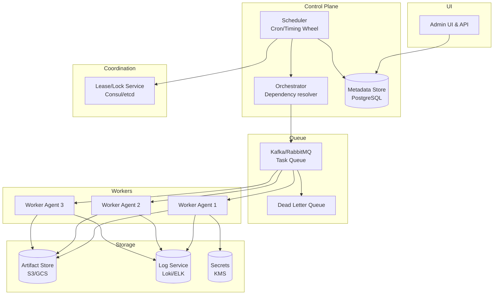

# 2) High-Level Architecture (Most Detailed)

## Components

- API & UI: Define DAGs, schedules, triggers; RBAC; audit
- Metadata Store: DAGs, runs, tasks, attempts; PostgreSQL/CockroachDB (multi-region)
- Scheduler: Cron parser; hierarchical timing wheel; computes ready tasks
- Orchestrator: Resolves dependencies; enqueues runnable tasks to queues
- Queue/Broker: Kafka/RabbitMQ; per-tenant/priority topics; dead-letter queues
- Worker Agents: Pull tasks; execute; heartbeat; upload logs; respect concurrency limits
- Lease/Lock Service: Consul/etcd/Redis for leader election; task leases (avoid duplicate work)
- Artifact Store: S3/GCS; large inputs/outputs
- Log Service: Stream logs to object storage + index (Loki/ELK)
- Secrets: KMS + per-tenant secret store

## Data Flows

### A) Scheduling & Dispatch

1) User creates DAG + schedule (cron) via API → Metadata Store
2) Scheduler tick (every 1s):
   - Evaluate due schedules using hierarchical timing wheel (O(1) amortized)
   - Emit ScheduleDue events → Orchestrator
3) Orchestrator:
   - Determine runnable tasks (parents succeeded)
   - Acquire task lease (Lease{task_run_id, ttl=5m})
   - Enqueue to Queue with headers: {tenant, priority, dedupe_key, retries_left}
4) Worker pulls from Queue (long-poll):
   - Acquire execution lease (Lease{task_attempt_id, ttl=heartbeat×3})
   - Fetch secrets & artifacts; start containerized execution (K8s Job)
   - Stream logs; heartbeat every 10s
5) On completion:
   - Worker publishes TaskResult (success/failure, outputs)
   - Orchestrator marks task_run; schedule dependents or retries

### B) Retries & Backoff

- On failure, Orchestrator computes next retry_time = now + backoff × jitter
- Enqueue with dedupe_key to avoid duplicate effects
- If max_retries exceeded → move to dead-letter queue; alert

### C) Heartbeats & Failure Detection

- Worker heartbeats every 10s → Orchestrator updates last_seen
- If no heartbeat for 30s (3×), Orchestrator revokes lease and re-enqueues task (at-least-once)
- Idempotency key ensures duplicate attempts don't double-apply effects

### D) Concurrency Limits & Quotas

- Per-tenant concurrent limit (e.g., 1000 tasks)
- Per-queue limit; per-label limit (e.g., gpu=true max 100)
- Token-bucket rate limiter (Redis) for dispatch

## Data Model

- tenants(id, name, quota_concurrency, quota_rate)
- dags(id, tenant_id, name, definition_json, version, created_at)
- schedules(id, dag_id, cron_expr, timezone, paused)
- runs(id, dag_id, scheduled_at, status, sla_deadline)
- tasks(id, run_id, name, attempt, status, dedupe_key, priority, lease_expires_at)
- attempts(id, task_id, worker_id, started_at, ended_at, exit_code, logs_pointer)
- workers(id, labels_json, last_heartbeat, capacity)

## APIs

- POST /v1/dags {name, definition}
- POST /v1/dags/:id/schedules {cron, timezone}
- POST /v1/dags/:id/triggers {time?}
- GET /v1/runs/:id
- GET /v1/tasks/:id/logs
- POST /v1/tasks/:id/retry | cancel

Auth: OAuth2 + per-tenant RBAC; mTLS between control plane components.

## Why These Choices

- Hierarchical timing wheel: Efficient scheduling for millions of timers (near O(1) tick)
- Pull-based workers: Natural backpressure; simpler failure handling; scale horizontally
- Leases via strong-consistency KV: Avoid duplicate execution; safe failover
- Kafka: Durable, ordered topics; multiple consumer groups (workers) per tenant/priority
- Containerized execution (K8s): Isolation; declarative resource requests (CPU/GPU)

## Monitoring

- Schedule-to-dispatch latency p50/p95/p99
- Task success rate, retry rate, mean attempts
- Orchestrator lag (ready tasks not enqueued)
- Queue depth per tenant/priority
- Worker heartbeat freshness; orphaned leases
- SLA breaches per DAG
