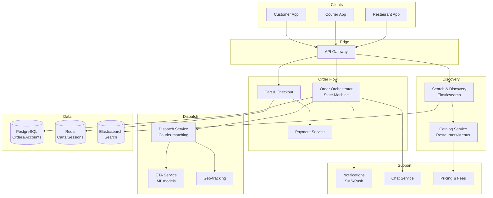

# 2) High-Level Architecture (Most Detailed)

## Components

- Catalog Service: Restaurants, menus, hours, item availability; POS integrations
- Search & Discovery: Elasticsearch; ranking by distance, ETA, rating, promos
- Pricing & Fees: Delivery fees, surge (demand/supply), taxes, tips, promos
- Cart & Checkout: Order validation, promotions, fraud checks, payment auth/capture
- Order Orchestrator: State machine for order lifecycle; idempotent transitions
- Dispatch Service: Courier matching, batching; ETA prediction; constraints (vehicle, capacity)
- Courier App Backend: Geo-tracking, navigation, pickup/drop workflow; heatmaps
- ETA Service: ML models (travel time + prep time); realtime recalculations
- Notifications: SMS/Push; SLA alerts; proactive delay notifications
- Chat Service: Customer-courier-restaurant chat; translation; moderation
- Analytics & Ops: Dashboards; support tooling; incident response

## Data Flows

### A) Discovery & Checkout

1) User searches restaurants → Search queries Elasticsearch with geo filters and ranking
2) User adds items to cart → Cart validates availability, pricing, promotions
3) Checkout → Fraud check (risk score); payment authorization (PSP) with idempotency key
4) Order Orchestrator creates order (status=confirmed), notifies restaurant

### B) Restaurant Prep & Ready

1) Restaurant accepts order → POS integration or merchant app; provides prep time
2) Orchestrator updates status=prep_started; ETA recalculation
3) When ready, status=ready_for_pickup; signal Dispatch to prioritize assignment

### C) Courier Dispatch & Delivery

1) Dispatch selects courier using scoring: distance/time to pickup, utilization, batching potential, courier preferences
2) Courier assigned → app receives job; navigation to restaurant; in-app checklists
3) Pickup event; then en-route; live location updates at 1Hz; ETA recalculated factoring traffic/weather
4) Delivered → payment capture; tip adjustments; receipt

### D) Batching & Hot Areas

- Dispatch considers nearby orders for batching (same restaurant or route overlap); ensure food quality window
- Surge pricing when demand > supply; incentives for couriers to move to hot zones

## Data Model

- restaurants(id, name, location{lat,lng}, hours, rating, cuisines[], pos_integration)
- menu_items(id, restaurant_id, name, price, options_json, available)
- orders(id, user_id, restaurant_id, status, total, created_at, eta, courier_id)
- order_items(order_id, menu_item_id, qty, customizations_json)
- couriers(id, vehicle[type], capacity, rating, last_location{lat,lng}, status)
- dispatch_jobs(id, order_id, courier_id, assigned_at, accepted_at, picked_up_at, delivered_at)

## APIs

- GET /v1/search?lat=&lng=&q=&filters
- POST /v1/cart {items}
- POST /v1/checkout {cart, payment_method, tip}
- GET /v1/orders/:id
- WS /v1/orders/:id/tracking

Auth: OAuth; PCI vault tokens for payment; PII encrypted at rest.

## Why These Choices

- Elasticsearch for geo + text relevance at scale
- Separate ETA service to iterate ML models without touching orchestrator
- Idempotent order state machine prevents double charges and inconsistent states
- Scoring-based dispatch adaptable to local constraints and batching

## Monitoring

- Search latency; checkout p95; payment auth success rate
- Order funnel conversion; abandonment rate
- Dispatch time-to-assign; courier acceptance rate; delivery SLA
- ETA MAE; reassignments; cancellations
