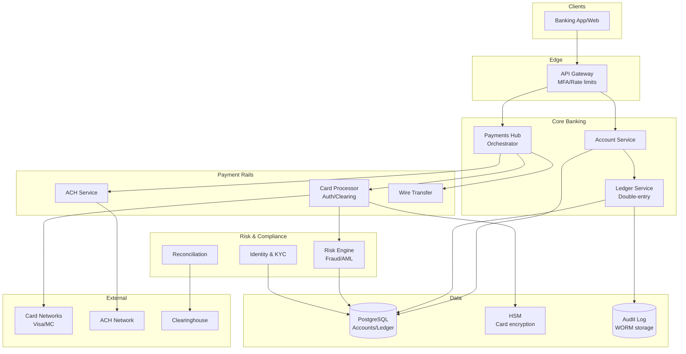

# 2) High-Level Architecture (Most Detailed)

## Components

- Identity & KYC: Onboarding, identity verification, sanctions screening
- Account Service: Accounts, limits, controls, statements
- Ledger Service: Double-entry ledger; postings; balance snapshots; strong consistency
- Payments Hub: Orchestrates transfers (internal, ACH, wire, card, RTP/SEPA), cutoffs, retries
- Card Processor: Auth, clearing, chargebacks; HSM integration; tokenization
- Risk Engine: Real-time fraud scoring (features, ML), rules; AML screening; case mgmt
- Reconciliation: Daily matching with external networks (ACH, card, wire), diff resolution
- Reporting & GL: Financial reporting; GL feeds; WORM storage
- Support Tools: Disputes, refunds, adjustments; audit trail

## Data Flows

### A) Internal Transfer (A → B)

1) API: POST /transfers {from, to, amount, idempotency_key}
2) Account Service validates limits/controls; freeze checks
3) Ledger creates a Posting Batch (debit A, credit B) → ACID txn → commit
4) Balance snapshots updated; events emitted to Kafka (for notifications)
5) Return success; idempotency ensures retried requests do not duplicate postings

### B) Card Authorization

1) Merchant → Card Network → Card Processor: auth request
2) Risk Engine computes score; risk rules (velocity, geo, MCC) may decline
3) Ledger places hold on account (reduce available, not ledger balance)
4) Approve/decline within 300ms; response to network
5) Later, clearing file posts final amount; hold released; differences adjusted

### C) ACH Outbound

1) User schedules ACH transfer; Payments Hub validates
2) ACH batch file generated at cutoff; transmitted to bank; NACHA format
3) Settlement T+1/T+2; returns processed; ledger adjusted; user notified

### D) Reconciliation & GL

1) End-of-day: Compare ledger totals with network reports (card, ACH, wire)
2) Differences → reconciliation queue; auto-resolve common mismatches; manual cases
3) GL posting generated to enterprise accounting; WORM archived

## Data Model

- accounts(id, user_id, type, status, limits_json, created_at)
- ledger_entries(id, batch_id, account_id, amount, currency, direction[debit|credit], created_at)
- posting_batches(id, status, created_at, committed_at, idempotency_key)
- holds(id, account_id, amount, reason, created_at, released_at)
- transfers(id, from_account, to_account, amount, status, created_at)
- cards(id, account_id, pan_token, status, limits, last4)
- fraud_events(id, account_id, txn_id, score, features_json, decision)

## APIs

- POST /v1/transfers {from, to, amount, idempotency_key}
- GET /v1/accounts/:id/balance
- POST /v1/cards/:id/controls {freeze, limits}
- POST /v1/ach/outbound {dest, amount, schedule}

Auth: OAuth2 + device binding; HSM-backed keys; strong audit with tamper-proof logs.

## Why These Choices

- Double-entry ledger with ACID guarantees eliminates double-spend; easy audits
- Idempotency keys on all money-moving APIs prevent duplicate postings
- Holds model separates available vs. ledger balance for card flows
- Hub-and-spoke Payments Hub isolates network specifics and retries

## Monitoring

- Ledger write latency and contention; deadlocks
- Auth p95 latency; approval/decline rates; false positive rate
- ACH/wire file success; reconciliation diffs; GL posting success
- Fraud model drift; rules hit rates; case backlog
