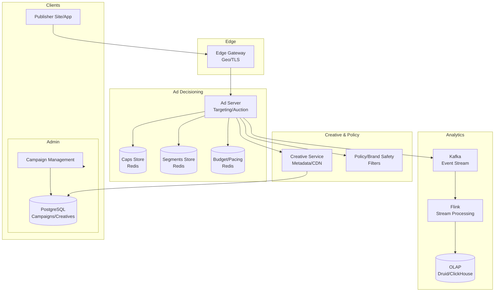

# 2) High-Level Architecture (Most Detailed)

## Components

- Edge Gateways: Terminate TLS; geo detection; consent parsing; route to nearest ad server
- Ad Server (Decisioning): Targeting, auction, pacing, frequency caps; <50ms budget
- KV Stores:
  - Caps Store: User×campaign frequency counters (Redis/KeyDB/Ristretto) with TTL
  - Segments Store: User segments (read-only, memory-mapped or Redis)
  - Budget/Pacing Store: Per-campaign counters (strongly consistent writes)
- Creative Service: Creative metadata; A/B variants; CDN links
- Policy/Brand Safety: Blocklists, categories; unsafe content detector (NLP CV)
- Analytics Pipeline: Stream impressions/clicks to Kafka → Flink → OLAP (Druid/ClickHouse/BigQuery)
- Admin/Console: Campaigns, targeting, budgets, creatives; approvals

## Hot Path (Request → Response)

1) Bid request arrives at Edge; parse context (url/app, device, geo, consent)
2) Ad Server fetches user segments (if consented) and frequency caps
3) Retrieve eligible line items (pre-filtered by index); compute scores/bids
4) Apply brand safety and policy filters
5) Auction: rank; apply floors; choose winner
6) Pacing: Check budget delivery; throttle if ahead; allocate impression
7) Frequency Cap: Increment counter atomically; if exceeds, choose next candidate
8) Respond with ad markup (HTML/JS/VAST) and tracking pixels
9) Log impression (fire-and-forget to Kafka; with local disk buffer fallback)

## Data Model

- campaigns(id, budget, start/end, pacing, target_criteria_json, bids, creatives[])
- creatives(id, campaign_id, type, size, url, cdn_url, variants_json)
- freq_caps(key=user_id:campaign_id, count, ttl)
- budgets(campaign_id, spent, last_update)
- segments(user_id, segment_ids)

## APIs

- POST /ad/request {context, user, consent}
- POST /events/impression {req_id}
- POST /events/click {req_id}
- Admin: POST /campaigns, /creatives, /policies

Auth: mTLS between internal services; signed event beacons.

## Why These Choices

- In-memory KV for caps: microsecond reads/writes at 10M QPS
- Streaming analytics decouples hot path from heavy writes
- Pre-indexed line items speed up eligibility checks (bitmap indices)
- Edge presence reduces RTT; improves p95 latency

## Monitoring

- p50/p95/p99 decision latency; timeouts
- Fill rate; win rate; revenue/eCPM
- Pacing error; budget drift; cap miss rate
- KV hit rate; eviction; hot key alerts