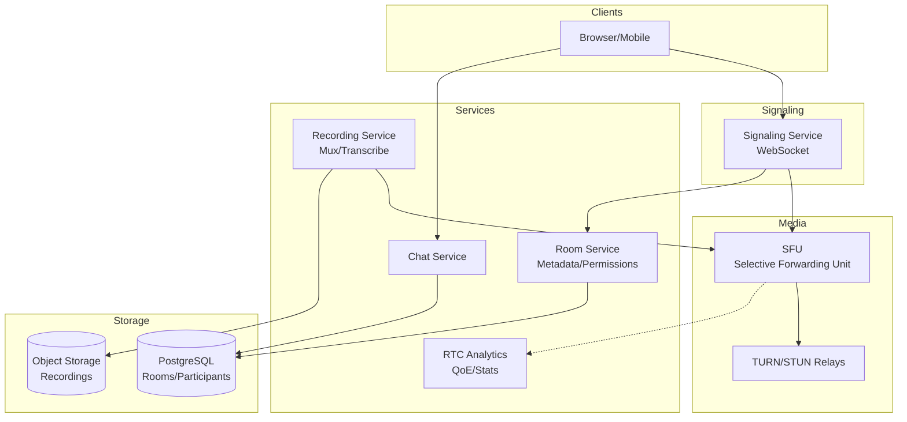

# 2) High-Level Architecture (Most Detailed)

## Components

- Signaling Service: WebSocket; SDP offer/answer exchange; ICE candidate relay; room state
- SFU (Selective Forwarding Unit): Routes RTP streams; per-participant subscription; simulcast/SVC selection
- TURN Relays: Media relay for symmetric NAT; STUN for public IP discovery
- Recording Service: Subscribe to SFU feeds; mux to single file; S3 upload; transcription via ASR
- Media Pipeline: Pre-processing (noise suppression, echo cancellation); post-processing for recordings
- Room Service: Meeting metadata, participants, permissions, breakout rooms
- Auth & Access Control: JWT-based meeting tokens; waiting room queue; host controls
- Analytics: RTC stats collection; QoE monitoring; network telemetry
- Chat Service: Pub/sub for in-meeting messages; file upload to S3

## Data Flows

### A) Join Meeting & ICE Negotiation

1) User clicks join → Auth service validates; issues JWT meeting token
2) Client connects to Signaling via WebSocket; sends join request
3) Signaling allocates SFU endpoint; returns SDP offer (IP, ports, codecs)
4) Client gathers ICE candidates (local, STUN reflexive, TURN relayed)
5) Client sends SDP answer + candidates to Signaling
6) Signaling relays to SFU; ICE connectivity checks run (STUN binding requests)
7) Best candidate pair selected; DTLS-SRTP handshake; media starts flowing

### B) Media Routing (SFU)

1) Participant A sends 3 simulcast layers (1080p, 720p, 360p) to SFU
2) SFU forwards to each subscriber based on their subscription (e.g., B requests 720p)
3) SFU performs BWE (TWCC feedback); signals layer switches if congestion detected
4) Participant B's client adapts send bitrate based on REMB/TWCC feedback

### C) Screenshare

1) User starts screenshare; generates new RTP stream (higher resolution, lower FPS)
2) Signaling renegotiates SDP (add m= line for screenshare track)
3) SFU forwards screenshare to all; clients switch layout to spotlight screenshare

### D) Recording

1) Host starts recording; Recording Service subscribes to SFU for all active streams
2) Muxes audio/video into single MP4 (FFmpeg); uploads chunks to S3 in parallel
3) ASR transcription runs async; generates VTT subtitles
4) Recording available in playback portal; host can download/share

## Data Model

- meetings(id, host_id, created_at, settings_json, recording_enabled)
- participants(meeting_id, user_id, joined_at, role, connection_id)
- recordings(meeting_id, s3_key, duration, transcript_url, created_at)
- analytics_events(meeting_id, user_id, event_type, metrics_json, timestamp)

## APIs

- WS /signaling/join {meeting_id, token}
- WS /signaling/offer {sdp}
- POST /meetings {settings}
- POST /meetings/:id/recording/start
- GET /recordings/:id

Auth: JWT with meeting scope; HMAC-signed TURN credentials; E2EE key exchange in-band (optional).

## Why These Choices

- SFU over MCU: Lower latency; scales horizontally; participants control layout client-side
- Simulcast/SVC: Adaptability without transcoding; saves CPU
- TURN for NAT: ~20% of users need relay; TURN autoscales with usage
- Cloud recording separate from SFU: Isolate load; can replay/edit later

## Monitoring

- Join success rate; time-to-first-frame; ICE failure rate
- E2E latency; jitter; packet loss per participant
- SFU CPU/bandwidth per meeting; TURN relay usage
- Recording success; transcription latency