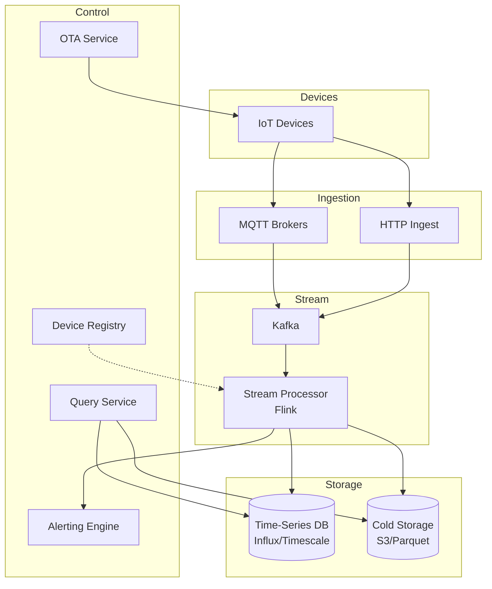

# 2) High-Level Architecture (Most Detailed)

## Components

- Ingestion Gateway: MQTT brokers (HiveMQ/Mosquitto), HTTP endpoints; TLS; device auth
- Message Queue: Kafka (partitioned by device_id or region); durability; replay
- Stream Processor: Flink/Kafka Streams; windowed aggregations; enrichment; anomaly detection
- Time-Series DB: InfluxDB/TimescaleDB; sharded by time+device; retention policies
- Device Registry: Device metadata, twin state, firmware versions; DynamoDB/Cassandra
- Alerting Engine: Rule evaluator + ML models; deduplication; fan-out via SNS/SQS
- Cold Storage: S3/GCS; Parquet/Avro; lifecycle policies (Glacier after 1 year)
- Query Service: Federated queries over hot/warm/cold; caching; downsampling for visualization
- OTA Service: Firmware storage; rollout policies; telemetry for rollback triggers

## Data Flows

### A) Device → Ingestion → Processing

1) Device sends telemetry via MQTT publish (topic: `devices/{id}/telemetry`)
2) Gateway authenticates (X.509 cert or JWT); validates schema
3) Enqueue to Kafka topic (partition by device_id for ordering)
4) Stream Processor (Flink):
   - Deserialize; enrich with device metadata (location, type)
   - Compute windowed aggregations (avg temp per 5 min)
   - Detect anomalies (z-score, threshold, ML model)
5) Write to Time-Series DB (InfluxDB); tag by device_id, location, type
6) If anomaly → trigger alert; fan-out to Alerting Engine

### B) Alerting & Notification

1) Alert triggered by rule or ML (e.g., temp > 80°C)
2) Alerting Engine deduplicates (same device+rule within 5 min → suppress)
3) Fetch notification preferences from Device Registry (SMS, email, webhook)
4) Fan-out via SNS; deliver to user; log alert history

### C) Historical Query

1) User queries dashboard: "Show device X temp for last 7 days"
2) Query Service checks cache (Redis); if miss → query Time-Series DB
3) If query spans > 7 days → federate to S3 (Parquet) via Presto/Athena
4) Downsample for visualization (10K points max); return to dashboard

### D) OTA Firmware Update

1) Admin uploads firmware blob to S3; creates rollout policy (canary 5%, full 100%)
2) Device polls OTA Service; checks firmware version
3) If update available → download delta patch; apply; report success/failure
4) If failure rate > 5% → auto-rollback; alert ops

## Data Model

- devices(id, type, location{lat,lng}, firmware_version, twin_state_json, created_at)
- telemetry(device_id, timestamp, metric_name, value, tags_json)
- aggregations(device_id, window_start, metric_name, avg, min, max, stddev)
- alerts(id, device_id, rule_id, triggered_at, resolved_at, severity)
- firmware(version, s3_key, checksum, rollout_policy_json)

## APIs

- MQTT: devices/{id}/telemetry (publish)
- POST /v1/alerts {device_id, rule}
- GET /v1/query?device_id=&metric=&start=&end=
- POST /v1/ota/rollout {firmware_version, policy}

Auth: Device certs (mutual TLS); API keys for admin; IAM roles for services.

## Why These Choices

- Kafka for durability and replay; Flink for stateful stream processing
- Time-Series DB optimized for tag queries and retention policies
- Partitioning by device_id ensures ordering per device; shard by time for queries
- S3 Parquet for cost-effective long-term storage; Athena for ad-hoc queries

## Monitoring

- Ingestion rate; Kafka lag; dead-letter queue depth
- Stream processor checkpoint lag; anomaly detection latency
- Time-Series DB write throughput; query p95 latency
- Alert delivery success; deduplication rate