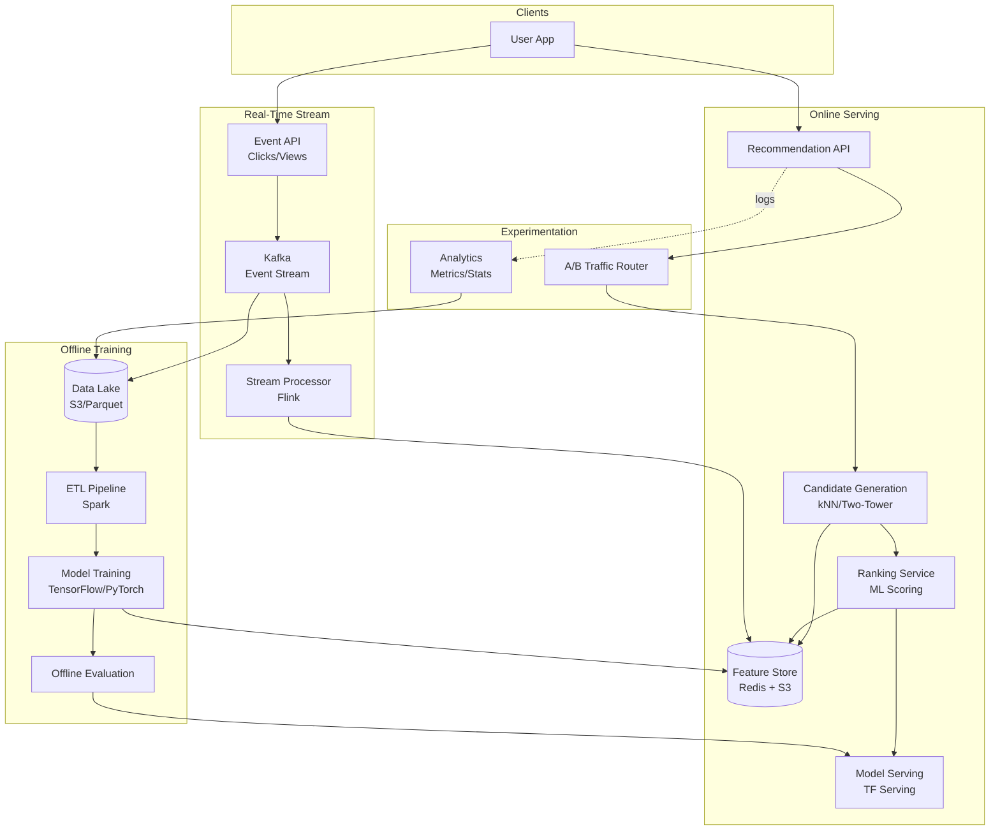

# 2) High-Level Architecture (Most Detailed)

## Components

- Candidate Generation: Matrix factorization (ALS), two-tower model (user/item embeddings), kNN on embeddings
- Ranking Service: LambdaMART, deep neural net; features from Feature Store; score top 1000 → return top 10
- Feature Store: Precomputed embeddings, user history, item metadata; Redis/S3
- Real-Time Event Stream: Kafka; clicks, views, purchases; update features within seconds
- Offline Training Pipeline: Spark for ETL; TensorFlow/PyTorch for training; daily model retraining
- Model Serving: TensorFlow Serving/TorchServe; versioning; A/B traffic split
- Experimentation Platform: Traffic routing; metrics collection (CTR, conversion); statistical tests
- Logging & Analytics: Impression/click logs → data lake → offline evaluation

## Data Flows

### A) Offline Training (Daily)

1) ETL: Extract interactions from data lake; filter spam/bots; feature engineering
2) Train candidate model (two-tower): User/item embeddings via contrastive learning
3) Train ranker: Collect labels (click=1, no-click=0); train LambdaMART on features
4) Evaluate on holdout set; if metrics improve → deploy new model
5) Export embeddings to Feature Store (S3 + Redis); update model in Serving

### B) Online Recommendation (Request)

1) User requests recommendations → Ranking Service
2) Fetch user embedding from Feature Store (Redis); cache hit rate >95%
3) Candidate Generation: kNN on item embeddings → top 1000 candidates
4) Fetch item features (popularity, recency, category) from Feature Store
5) Ranker scores each candidate; applies business rules (diversity, freshness)
6) Return top 10; log impressions to Kafka

### C) Real-Time Signal Processing

1) User clicks item → event to Kafka
2) Stream processor (Flink) updates user's short-term history (last 10 actions)
3) Update Feature Store (Redis) with new user vector (incremental update)
4) Next recommendation request uses fresh features (<10s lag)

### D) A/B Testing

1) Traffic router assigns user to experiment group (control 50%, variant 50%)
2) Each group sees recommendations from different model version
3) Log impressions/clicks with experiment ID
4) Analytics: Compute CTR, conversion per group; statistical significance test
5) If variant wins → promote to production; if loses → rollback

## Data Model

- users(id, embedding_vector, last_10_actions[], cohort, created_at)
- items(id, embedding_vector, category, popularity_score, created_at)
- interactions(user_id, item_id, action[click|view|purchase], timestamp)
- experiments(id, model_version, traffic_pct, metrics_json)

## APIs

- GET /v1/recommendations?user_id=&count=10
- POST /v1/events {user_id, item_id, action}
- GET /v1/experiments/:id/metrics

Auth: OAuth; rate-limit per user; A/B experiment assignments via header.

## Why These Choices

- Two-tower model: Scales to 100M users × 10M items; precompute embeddings for fast inference
- Feature Store: Decouples training from serving; enables feature reuse across models
- Kafka for real-time: Low-latency updates; replay for backfill; fault-tolerant
- kNN on embeddings: Sub-50ms candidate generation; FAISS/Annoy for ANN search

## Monitoring

- p50/p95 recommendation latency; candidate generation time; ranking time
- CTR, conversion rate per model version
- Feature Store hit rate; stale feature rate
- Model drift: Offline eval metrics weekly