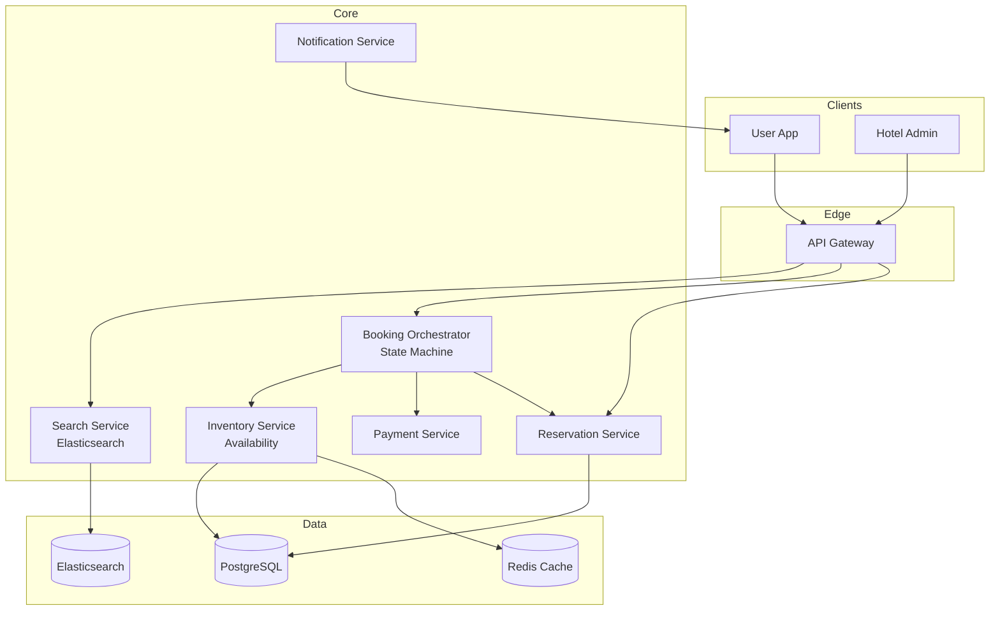

# 2) High-Level Architecture (Most Detailed)

## Components

- Search Service: Elasticsearch; geo queries; filters; ranking (price, rating, availability)
- Inventory Service: Room availability by date; strong consistency (PostgreSQL + locks or Redis)
- Booking Orchestrator: State machine (search → hold → confirm → paid); idempotency
- Payment Service: PSP integration; auth/capture; refunds; fraud checks
- Reservation Service: CRUD on bookings; cancellations; confirmations; notifications
- Property Management: Hotel admin; rate/inventory updates; calendar management
- Review Service: CRUD reviews; moderation; ranking update pipeline
- Notification Service: Email/SMS confirmations; reminders; cancellations

## Data Flows

### A) Search & Availability

1) User searches: location, check-in/out dates, guests
2) Search Service queries Elasticsearch: geo + date range + filters
3) For each result, fetch real-time availability from Inventory Service (cache with 1-min TTL)
4) Rank by: availability, price, rating, distance; return top 20
5) User clicks property → detailed availability calendar fetched

### B) Booking Flow (Last Room Race)

1) User selects room+dates → Booking Orchestrator
2) Create booking record (status=pending); attempt inventory lock:
   - Pessimistic: `SELECT ... FOR UPDATE` on inventory row; if available → decrement; TTL 10 min
   - Optimistic: Read inventory version; on confirm, update with version check (CAS)
3) If lock acquired → redirect to payment
4) User enters payment → Payment Service auths card (hold funds)
5) On auth success → Booking Orchestrator confirms booking (status=confirmed); capture payment later
6) Release lock; send confirmation email/SMS
7) If TTL expires → release lock; booking auto-cancels

### C) Cancellation & Refund

1) User cancels booking → Reservation Service validates policy
2) If free cancellation → full refund; if penalty → partial refund
3) Payment Service processes refund (async; takes 5-7 days)
4) Inventory Service increments room count (make available again)
5) Notify user; update property availability in search index

### D) Property Rate/Inventory Updates

1) Hotel updates rate or blocks dates via Property Management UI
2) Write to Inventory Service; trigger cache invalidation
3) Async reindex in Elasticsearch (eventual consistency; OK for search)
4) Booking Orchestrator checks inventory before confirming (strong consistency)

## Data Model

- properties(id, name, location{lat,lng}, amenities[], rating, reviews_count)
- rooms(id, property_id, type, price, capacity)
- inventory(room_id, date, available_count, version, updated_at)
- bookings(id, user_id, room_id, check_in, check_out, status, total, payment_id, idempotency_key)
- payments(id, booking_id, amount, auth_code, captured_at, status)
- reviews(id, property_id, user_id, rating, text, created_at)

## APIs

- GET /v1/search?location=&check_in=&check_out=&guests=
- POST /v1/bookings {room_id, dates, guest_info, idempotency_key}
- POST /v1/bookings/:id/cancel
- GET /v1/properties/:id/availability?check_in=&check_out=

Auth: OAuth; payments via tokenized cards (PCI vault); admin via API keys.

## Why These Choices

- Elasticsearch for search: Geo queries, faceting, fast relevance ranking
- Pessimistic locking for last room: Prevents double booking; simple correctness
- Idempotency keys on bookings: Network retries safe; no duplicate charges
- Async payment capture: Reduces fraud (cancel if guest no-show); aligns with hotel check-in

## Monitoring

- Search latency; availability cache hit rate
- Booking funnel conversion (search → view → book → paid)
- Lock timeouts (inventory held but not confirmed)
- Payment auth/capture success rates; fraud blocks