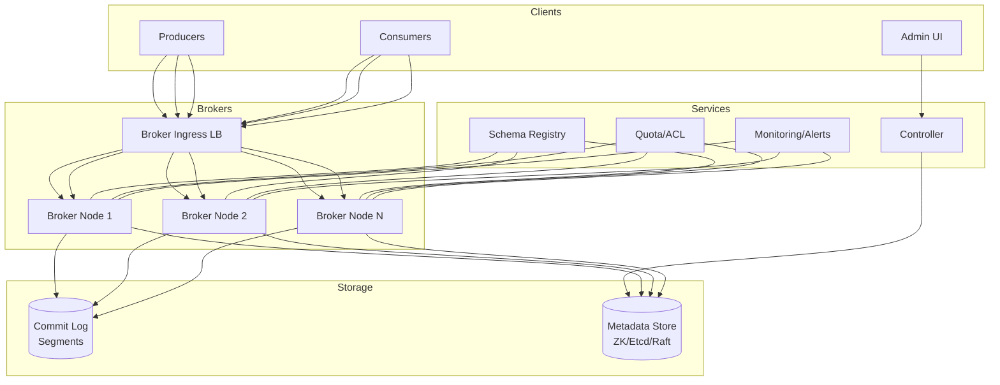

# 2) High-Level Architecture (Most Detailed)

## Components

- Brokers: Store partitions; handle reads/writes; coordinate via ZooKeeper/KRaft (Kafka)
- Topics & Partitions: Logical grouping; each partition is ordered log; replicated across brokers
- Leader Election: Per-partition leader (writes); followers replicate; ZooKeeper/Raft for coordination
- Producer: Batches messages; compresses; partitions by key; acks config (0/1/all)
- Consumer Groups: Share partitions; track offsets; rebalance on member join/leave
- Offset Storage: Committed offsets in internal topic (__consumer_offsets); durable
- Replication: In-Sync Replicas (ISR); leader waits for ISR acks before commit
- Compaction: Background process; keeps latest message per key; tombstones for deletes

## Data Flows

### A) Publish (Producer → Broker)

1) Producer batches messages (e.g., 100 msgs or 16KB); compresses (gzip/snappy)
2) Partition by key (hash(key) % num_partitions) or round-robin if no key
3) Send to leader broker for partition
4) Leader writes to log (append-only); optionally waits for ISR replicas to ack
5) Return ack to producer (based on acks config: 0=fire-and-forget, 1=leader, all=ISR)

### B) Replication (Leader → Follower)

1) Follower continuously fetches from leader (high-water mark)
2) Follower appends to local log; sends ack to leader
3) Leader updates high-water mark (offset up to which all ISR have replicated)
4) Consumers can only read up to high-water mark (committed messages)

### C) Consume (Consumer → Broker)

1) Consumer subscribes to topic; joins consumer group
2) Coordinator assigns partitions to consumers (rebalance protocol)
3) Consumer fetches from partition leader; starts at last committed offset
4) Consumer processes message; commits offset (auto or manual)
5) On rebalance (consumer add/remove), partitions reassigned; consumers resume from last offset

### D) Leader Failover

1) Leader broker crashes; ZooKeeper/KRaft detects (heartbeat timeout)
2) Controller elects new leader from ISR; updates metadata
3) Producers/consumers refresh metadata; route traffic to new leader
4) No message loss (only ISR members eligible for leadership)

## Data Model

- topics(name, partitions_count, replication_factor, retention_ms)
- partitions(topic, partition_id, leader_broker_id, replicas[], isr[])
- messages(offset, key, value, timestamp, headers)
- offsets(consumer_group, topic, partition, committed_offset)

## APIs

- Producer: `send(topic, key, value)`
- Consumer: `subscribe(topics)`, `poll()`, `commit_offsets()`
- Admin: `create_topic(name, partitions, replication_factor)`, `describe_topic(name)`

Auth: SASL/SCRAM; mTLS; ACLs per topic.

## Why These Choices

- Append-only log: Sequential writes (fast); immutable; replay-friendly
- Per-partition ordering: Scales horizontally; global ordering doesn't scale
- Pull-based consumers: Natural backpressure; consumers control pace
- ISR replication: Balance durability and latency; configurable acks

## Monitoring

- Producer throughput; batch size; compression ratio
- Consumer lag (offset delta); rebalance frequency
- Replication lag per partition; ISR shrink/expand events
- Leader election time; broker under-replicated partitions