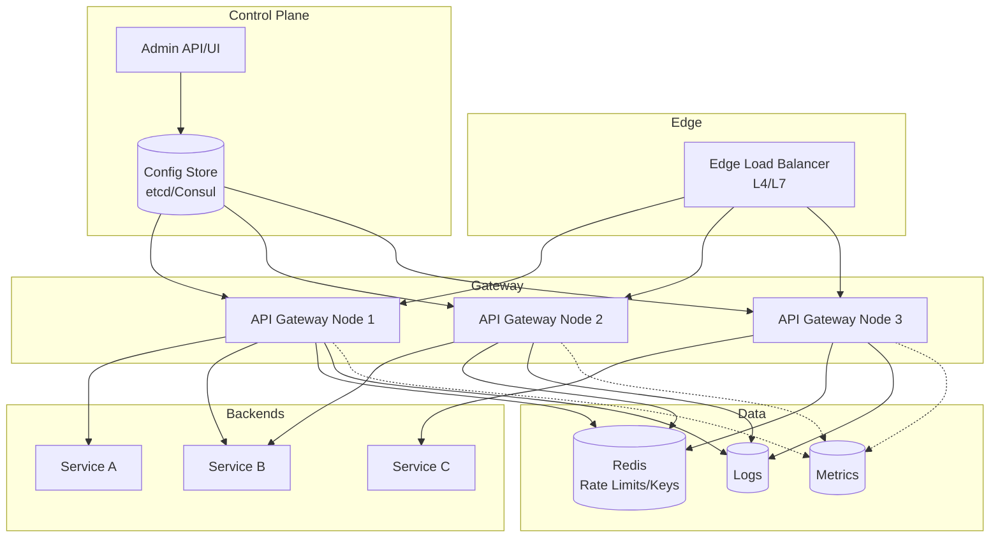

# 2) High-Level Architecture (Most Detailed)



## Components (What & Why)

### 1. Edge Load Balancer (L4/L7)
**What**: Cloud-native load balancer (AWS ALB/NLB, GCP GCLB) that distributes incoming traffic across gateway nodes.

**Why**:
- **Health-Based Routing**: Removes unhealthy gateway nodes from rotation automatically
- **TLS Termination**: Offloads SSL/TLS handshake from gateway nodes (or passes through for mTLS)
- **DDoS Protection**: First line of defense with rate limiting and IP blacklisting

**Alternatives**: Nginx/HAProxy self-managed, but cloud LBs offer integrated WAF/DDoS

---

### 2. API Gateway Nodes (Stateless)
**What**: Golang/Rust-based proxy servers (e.g., Kong, Envoy, custom) that handle request routing, auth, rate limiting, transformations.

**Why**:
- **Low Latency**: Compiled languages (Go/Rust) keep overhead <2ms for hot path
- **Stateless Design**: Enables horizontal scaling without coordination overhead
- **Plugin Architecture**: Extend with custom logic (Lua scripts in Kong, WASM in Envoy)

**Key Responsibilities**:
- Route lookup from in-memory config (O(1) trie-based matching)
- JWT validation with cached public keys (refresh every 5min)
- Rate limiting with local token buckets (Redis for distributed state)
- Circuit breaker state machine (closed→open→half-open transitions)
- Backend connection pooling with HTTP/2 multiplexing

---

### 3. Configuration Control Plane (etcd/Consul)
**What**: Distributed key-value store that holds gateway configuration (routes, rate limits, auth policies).

**Why**:
- **Consistent Updates**: Watch mechanism pushes config changes to all gateway nodes within seconds
- **Versioning**: Track config history, rollback on bad deploys
- **Dynamic Discovery**: Backends register via service mesh (Consul Connect, Istio)

**Configuration Schema** (example):
```json
{
  "routes": [
    {
      "id": "user-service-v1",
      "path": "/api/v1/users/*",
      "methods": ["GET", "POST"],
      "backends": ["user-service:8080"],
      "auth": "jwt",
      "rate_limit": {"requests": 1000, "window": "1m"},
      "timeout": "5s",
      "retry": {"attempts": 2, "backoff": "exponential"}
    }
  ]
}
```

---

### 4. Rate Limiter (Redis Cluster)
**What**: Distributed Redis cluster storing token bucket counters per user/API/tenant.

**Why**:
- **Atomic Operations**: Redis INCR/EXPIRE commands provide accurate counting without race conditions
- **Low Latency**: <1ms p99 latency for counter reads/writes in same AZ
- **Sliding Window**: Use Redis sorted sets for sliding window counters (more accurate than fixed windows)

**Algorithm**: Token Bucket (default) or Leaky Bucket
- Each user gets N tokens, refilled at rate R
- Request consumes 1 token; reject if bucket empty
- Redis key: `rate_limit:{user_id}:{api_route}`, TTL = window duration

**Fallback**: Local in-memory rate limiting if Redis unreachable (eventual consistency)

---

### 5. Authentication Service Integration
**What**: Gateway validates JWT tokens by calling auth service or caching public keys.

**Why**:
- **JWT Validation**: Verify signature with cached public key (RSA/ECDSA), check expiry/claims
- **OAuth Introspection**: For opaque tokens, call auth service `/introspect` endpoint (cached 60s)
- **RBAC/ABAC**: Enforce permissions based on token claims (roles, scopes, attributes)

**Optimization**: Cache valid tokens in local LRU (60s TTL) to avoid repeated auth calls

---

### 6. Circuit Breaker (Local State Machine)
**What**: Per-backend state machine tracking failure rate and response times.

**Why**:
- **Fail Fast**: If backend error rate >50% over 10s window, open circuit (reject requests immediately)
- **Auto-Recovery**: After 30s timeout, enter half-open state (send 1 probe request)
- **Cascading Failure Prevention**: Stop sending traffic to dying backends, give them time to recover

**States**:
- **Closed**: Normal operation, requests flow through
- **Open**: Fail fast with 503 Service Unavailable
- **Half-Open**: Allow limited traffic to test recovery

**Thresholds** (configurable per route):
- Error rate: >50% errors in 10s window
- Latency: p99 >5s for 10 consecutive requests
- Timeout: 30s before half-open transition

---

### 7. Observability Stack
**What**: Prometheus (metrics), Loki/ELK (logs), Jaeger/Zipkin (traces).

**Why**:
- **Metrics**: Track per-route latency (p50/p95/p99), throughput, error rate, circuit breaker state
- **Logs**: Access logs with request ID, sanitized headers (no auth tokens), response status
- **Traces**: Distributed tracing with OpenTelemetry, correlate gateway→backend requests

**Key Metrics**:
- `gateway_request_duration_seconds{route, status}` (histogram)
- `gateway_requests_total{route, status}` (counter)
- `gateway_circuit_breaker_state{backend}` (gauge: 0=closed, 1=open, 2=half-open)
- `gateway_rate_limit_exceeded_total{user, route}` (counter)

---

## Data Flows

### Flow A: Happy Path Request (JWT Auth, No Rate Limit Hit)
1. **Client** → Edge LB (TLS termination)
2. **Edge LB** → Gateway Node (HTTP/2)
3. **Gateway Node**:
   - Route lookup in local config trie (O(1), <100μs)
   - JWT validation: Check local cache (hit) → validate signature → extract user_id
   - Rate limit check: Redis GET `rate_limit:{user_id}:{route}` → decrement token → OK
   - Circuit breaker check: Backend is "closed" state → proceed
   - Backend request: Connection pool → HTTP/2 request to backend service
4. **Backend Service** → Gateway Node (response)
5. **Gateway Node**:
   - Response transformation (add CORS headers, compress gzip)
   - Emit metrics (latency, status code)
   - Log access (request_id, user_id, route, status, duration)
6. **Gateway Node** → Edge LB → Client

**Latency Breakdown**:
- Route lookup: 100μs
- JWT validation (cached): 500μs
- Rate limit check (Redis): 1ms
- Backend request: 20ms (backend processing)
- Response processing: 500μs
- **Total**: ~22ms (2ms gateway overhead + 20ms backend)

---

### Flow B: Rate Limit Exceeded
1. **Client** → Gateway Node (same as Flow A steps 1-3)
2. **Gateway Node**:
   - Rate limit check: Redis GET `rate_limit:{user_id}:{route}` → token bucket empty
   - Return 429 Too Many Requests with Retry-After header
3. **Gateway Node** → Client (no backend call)

**Short-Circuit**: Rate limit check happens before backend call, saving backend load

---

### Flow C: Circuit Breaker Open (Backend Unhealthy)
1. **Client** → Gateway Node
2. **Gateway Node**:
   - Route lookup → Auth validation → Rate limit check (all pass)
   - Circuit breaker check: Backend is "open" state (>50% error rate in last 10s)
   - Return 503 Service Unavailable (no backend call)
3. **Gateway Node** → Client

**Background**: Separate goroutine monitors circuit breaker state:
- Every 30s in "open" state → transition to "half-open"
- In "half-open": Allow 1 request through → if success, close circuit; if fail, reopen for another 30s

---

### Flow D: Configuration Update (New Route)
1. **Admin** → Control Plane API (POST `/routes` with new config)
2. **Control Plane**:
   - Validate config (JSON schema check)
   - Store in etcd with version number
   - etcd triggers watch event to all gateway nodes
3. **Gateway Nodes** (all instances):
   - Receive etcd watch event within 1-5s
   - Reload in-memory route trie (atomic swap, zero downtime)
   - Emit metric `gateway_config_reload_timestamp`
4. **Control Plane** → Admin (ACK with propagation status)

**Rollback**: If validation fails post-deploy, control plane reverts to previous version automatically

---

## Minimal Data Model

### Configuration Storage (etcd/Consul)
```
routes:
  - id: UUID
    path: string (regex pattern)
    methods: [string]
    backends: [string] (service names or IPs)
    auth: enum (none, jwt, oauth, api_key)
    rate_limit:
      requests: int
      window: duration
    timeout: duration
    retries:
      attempts: int
      backoff: enum (fixed, exponential)
    circuit_breaker:
      error_threshold: float (0.5 = 50%)
      timeout: duration
      half_open_requests: int

auth_policies:
  - id: UUID
    type: enum (jwt, oauth)
    jwt_issuer: string
    jwt_public_key: string (cached)
    scopes: [string]

rate_limit_overrides:
  - user_id: UUID
    route_id: UUID
    custom_limit: int
```

### Runtime State (Redis)
```
rate_limit:{user_id}:{route_id} → int (token count)
  TTL: window duration (e.g., 60s)

circuit_breaker:{backend}:state → enum (closed, open, half_open)
  TTL: none (persistent until state change)

circuit_breaker:{backend}:error_count → int
  TTL: window duration (10s)
```

### Metrics (Prometheus)
```
gateway_request_duration_seconds{route, status, method} → histogram
gateway_requests_total{route, status} → counter
gateway_backend_connections{backend, state} → gauge
gateway_rate_limit_exceeded_total{user, route} → counter
gateway_circuit_breaker_state{backend} → gauge (0/1/2)
gateway_jwt_validation_failures_total{reason} → counter
```

---

## API Design

### Client-Facing (Proxied APIs)
Gateway proxies all client requests transparently—no gateway-specific API for clients.

Example proxied request:
```http
GET /api/v1/users/123 HTTP/1.1
Host: api.example.com
Authorization: Bearer eyJhbGc...
X-Request-ID: uuid-1234
```

Gateway adds internal headers to backend:
```http
GET /users/123 HTTP/1.1
Host: user-service:8080
X-User-ID: uuid-5678 (extracted from JWT)
X-Forwarded-For: 1.2.3.4
X-Request-ID: uuid-1234 (pass-through or generate)
```

---

### Admin/Control Plane API

**1. Route Management**
```http
POST /admin/routes
Content-Type: application/json

{
  "path": "/api/v2/orders/*",
  "backends": ["order-service-v2:8080"],
  "auth": "jwt",
  "rate_limit": {"requests": 500, "window": "1m"}
}
```

**2. Circuit Breaker Override**
```http
POST /admin/circuit-breaker/{backend}/reset
→ Manually close circuit (emergency override)
```

**3. Health Check**
```http
GET /health
→ 200 OK + {status: "healthy", uptime: "5d3h", config_version: "v123"}
```

**4. Metrics Endpoint** (for Prometheus scraping)
```http
GET /metrics
→ Prometheus text format with all gateway metrics
```

---

## Monitoring Cheat-Sheet

### Golden Signals
1. **Latency**: `gateway_request_duration_seconds` (p50/p95/p99)
   - Alert if p99 >5ms for 5 consecutive minutes
2. **Traffic**: `gateway_requests_total` (QPS)
   - Monitor 5-min rolling average, alert on 50% drop
3. **Errors**: `gateway_requests_total{status=~"5..|429"}`
   - Alert if error rate >1% for 5min
4. **Saturation**: CPU/memory per gateway node
   - Alert if CPU >80% for 10min (trigger auto-scale)

### Critical Dashboards
- **Per-Route Performance**: Latency/throughput heatmap by route
- **Circuit Breaker States**: Real-time view of open/half-open backends
- **Rate Limit Violations**: Top 10 users/IPs hitting rate limits
- **Configuration Propagation**: Time since last config update per node

### Log Queries (Sample)
- **Failed Requests**: `status >= 500 AND route = "/api/v1/orders"`
- **Slow Requests**: `duration > 5s`
- **Auth Failures**: `jwt_validation_failure = true`

### Alerts
- **High Latency**: p99 >5ms for 5min → page on-call
- **Circuit Breaker Open**: Any backend in "open" state for >2min → investigate backend health
- **Config Drift**: Node config version mismatch for >5min → check control plane connectivity
- **Rate Limit Abuse**: Single user hits rate limit >100 times/min → potential DDoS
