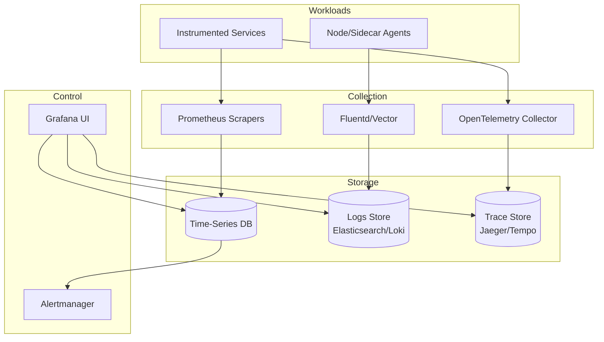

# 2) High-Level Architecture (Most Detailed)



## Components (What & Why)

### 1. Metrics Collection (Prometheus Scraper + Remote Write)
**What**: Prometheus-compatible agents scrape `/metrics` endpoints from services every 15s, push to central storage via `remote_write`.

**Why**:
- **Pull Model Benefits**: Service discovery via Kubernetes/Consul, auto-detect new services
- **Remote Write**: Decouple collection from storage (scale independently)
- **Prometheus Compatibility**: Industry standard, huge ecosystem of exporters

**Alternatives**: Push-based (StatsD, Telegraf) requires agents on every host, but works better for ephemeral workloads (AWS Lambda)

---

### 2. Time-Series Database (VictoriaMetrics/Thanos)
**What**: Distributed TSDB optimized for high-cardinality metrics with Gorilla compression.

**Why**:
- **Compression**: Gorilla encoding reduces 16-byte samples to ~1.3 bytes (10:1 ratio)
- **Horizontal Scaling**: Shard by metric name hash, query across shards with federated querying
- **Long-Term Storage**: Tiered storage (hot SSD → warm S3) with automatic compaction

**VictoriaMetrics vs. Thanos**:
- **VictoriaMetrics**: Single-binary, simpler ops, better query performance
- **Thanos**: Prometheus-native, better for multi-cluster federation, S3-first architecture

---

### 3. Logs Collection (Fluentd/Vector Agents)
**What**: Agents running on each host/container tail log files, parse JSON, forward to centralized log storage.

**Why**:
- **Decoupling**: Services write logs to stdout/file, agents handle aggregation/forwarding
- **Structured Logs**: Enforce JSON schema (timestamp, level, service, message, trace_id)
- **Buffering**: Agents buffer logs during network outages (10GB local disk)

**Alternatives**: Direct logging to API (HTTP POST) adds latency and coupling to log backend

---

### 4. Log Storage (Elasticsearch/Loki)
**What**: 
- **Elasticsearch**: Full-text search with inverted indexes (every field indexed)
- **Loki**: Log aggregation with label-based indexing (only metadata indexed, not log content)

**Why**:
- **Elasticsearch**: Rich search (regex, fuzzy matching), but expensive at scale (index overhead)
- **Loki**: 10× cheaper storage (no content indexing), optimized for Grafana queries

**Trade-off**: Loki requires labels for filtering (can't search arbitrary text unless label exists)

---

### 5. Trace Collection (OpenTelemetry Collector)
**What**: Services instrument code with OpenTelemetry SDKs, send spans to collector via OTLP (gRPC/HTTP).

**Why**:
- **Vendor-Neutral**: OpenTelemetry is CNCF standard, works with Jaeger/Zipkin/Tempo
- **Batching**: Collector batches spans (1000 spans/batch) before forwarding to storage
- **Sampling**: Collector applies sampling rules (tail-based sampling: keep 100% of error traces)

---

### 6. Trace Storage (Jaeger/Tempo)
**What**: Distributed tracing backend storing spans with parent-child relationships.

**Why**:
- **Jaeger**: Mature, supports Elasticsearch/Cassandra backends, rich UI for trace visualization
- **Tempo**: Grafana-native, S3-only storage (cheap), integrates with Loki/Prometheus

**Storage Model**: Spans stored by trace_id (primary key), indexed by service/operation/tags

---

### 7. Alerting Engine (Prometheus Alertmanager / Custom)
**What**: Evaluates alert rules (PromQL/LogQL) every 1min, routes alerts via PagerDuty/Slack/email.

**Why**:
- **PromQL**: Expressive query language for metrics (e.g., `rate(http_requests_total[5m]) > 1000`)
- **Grouping**: Batch alerts (e.g., "10 services down" → 1 alert, not 10)
- **Silencing**: Temporarily mute alerts during deployments

**Alert Rule Example**:
```yaml
- alert: HighErrorRate
  expr: |
    rate(http_requests_total{status=~"5.."}[5m]) / rate(http_requests_total[5m]) > 0.05
  for: 5m
  labels:
    severity: critical
  annotations:
    summary: "Service {{ $labels.service }} has 5% error rate"
```

---

### 8. Visualization (Grafana)
**What**: Dashboard platform querying metrics (PromQL), logs (LogQL), traces (Jaeger API).

**Why**:
- **Unified UI**: Single pane of glass for metrics + logs + traces
- **Pre-Built Dashboards**: USE method (Utilization, Saturation, Errors), RED method (Rate, Errors, Duration)
- **Ad-Hoc Queries**: Explore mode for debugging without pre-built dashboards

---

### 9. Service Mesh Integration (Istio/Linkerd)
**What**: Service mesh sidecars (Envoy) auto-generate metrics/traces for all HTTP/gRPC traffic.

**Why**:
- **Zero Instrumentation**: No code changes, mesh emits latency/throughput/error metrics
- **Distributed Tracing**: Mesh propagates trace context (B3 headers) automatically
- **Golden Signals**: Rate, errors, duration (RED method) out-of-the-box

---

## Data Flows

### Flow A: Metric Ingestion (Scrape + Store)
1. **Prometheus Agent** scrapes `/metrics` from service every 15s (pull model)
2. **Agent** batches metrics (10K samples), pushes to **Time-Series DB** via `remote_write` (HTTP POST)
3. **TSDB** compresses with Gorilla encoding, writes to WAL (write-ahead log) for durability
4. **TSDB** flushes WAL to immutable blocks (2h chunks), uploads to S3 for long-term storage
5. **Alerting Engine** queries TSDB every 1min, evaluates alert rules, sends notifications

**Latency**: 15s scrape + 30s write + 60s alert eval = **~105s** from metric emission to alert

---

### Flow B: Log Ingestion (Agent + Index)
1. **Service** writes JSON log to stdout: `{"timestamp": "...", "level": "ERROR", "service": "api", "trace_id": "...", "message": "..."}`
2. **Fluentd Agent** (daemonset) tails container logs, parses JSON, enriches with Kubernetes labels
3. **Agent** buffers logs (10s buffer), sends batch (1000 logs) to **Log Storage** (Elasticsearch/Loki)
4. **Log Storage**:
   - **Elasticsearch**: Indexes all fields, creates inverted index
   - **Loki**: Indexes only labels (service, level), stores log content as chunks
5. **User** queries logs via Grafana: `{service="api", level="ERROR"} |= "timeout"` (LogQL)

**Latency**: 10s buffer + 5s index = **~15s** from log write to searchable

---

### Flow C: Trace Ingestion (Spans + Storage)
1. **Service A** receives HTTP request, creates span with trace_id, span_id
2. **Service A** calls **Service B**, propagates trace context via HTTP headers (`traceparent: 00-trace_id-parent_span_id-01`)
3. **Service B** creates child span, links to parent via `parent_span_id`
4. **Both Services** send spans to **OpenTelemetry Collector** (gRPC, batched)
5. **Collector** applies sampling:
   - **Head-Based**: Sample 1% of all traces (fast, but misses rare errors)
   - **Tail-Based**: Buffer spans 30s, sample 100% of error traces (slow, but complete)
6. **Collector** forwards spans to **Trace Storage** (Jaeger/Tempo)
7. **User** queries trace via Grafana: Search by trace_id, visualize waterfall diagram

**Latency**: 30s tail-based buffer + 10s storage = **~40s** from span creation to queryable

---

### Flow D: Alert Notification (Rule Evaluation + Routing)
1. **Alerting Engine** queries TSDB every 1min: `rate(http_requests_total{status="500"}[5m]) > 100`
2. **Rule Matches**: Error rate exceeds threshold for 5 consecutive evaluations (5min)
3. **Alert Triggered**: Engine sends alert to **Alertmanager**
4. **Alertmanager**:
   - Groups similar alerts (10 services down → 1 notification)
   - Routes to PagerDuty (severity=critical), Slack (severity=warning)
   - Applies silences (no alerts during 2am-4am maintenance window)
5. **PagerDuty** pages on-call engineer, Slack posts to #alerts channel

**Latency**: 1min eval + 5min threshold = **6min** from issue start to page

---

## Minimal Data Model

### Metrics (Time-Series DB)
```
metric_name: http_requests_total
labels: {service="api", method="GET", status="200"}
samples: [(timestamp1, value1), (timestamp2, value2), ...]
```

**Cardinality**: `metric_name × label_combinations`
- Example: `http_requests_total` with 10 services, 5 methods, 3 statuses = 10 × 5 × 3 = **150 time series**
- **Danger**: Adding user_id label (1M users) → 150M time series (cardinality explosion)

### Logs (Log Storage)
```json
{
  "timestamp": "2024-01-01T12:00:00Z",
  "level": "ERROR",
  "service": "api",
  "host": "pod-123",
  "trace_id": "abc123",
  "message": "Database connection timeout",
  "error": {
    "type": "TimeoutError",
    "stack": "..."
  }
}
```

**Indexed Fields** (Loki): service, level, host (labels only)
**Full-Text Search** (Elasticsearch): All fields indexed

### Traces (Trace Storage)
```json
{
  "trace_id": "abc123",
  "span_id": "def456",
  "parent_span_id": "ghi789",
  "service": "api",
  "operation": "GET /users/:id",
  "start_time": "2024-01-01T12:00:00Z",
  "duration": 0.05,
  "tags": {
    "http.method": "GET",
    "http.status_code": 200,
    "db.query": "SELECT * FROM users WHERE id=?"
  },
  "logs": [
    {"timestamp": "...", "message": "Cache miss"}
  ]
}
```

**Indexes**: trace_id (primary), service+operation (secondary), tags (optional)

---

## API Design

### Metrics Query (PromQL)
```http
GET /api/v1/query?query=rate(http_requests_total[5m])&time=2024-01-01T12:00:00Z
→ Returns: {"metric": {...}, "values": [[timestamp, value]]}
```

**Advanced**: Range query for dashboard graphs:
```http
GET /api/v1/query_range?query=...&start=2024-01-01T00:00:00Z&end=2024-01-01T23:59:59Z&step=1m
```

### Logs Query (LogQL)
```http
GET /loki/api/v1/query_range?query={service="api"} |= "error"&start=...&end=...
→ Returns: [{"stream": {"service": "api"}, "values": [[timestamp, log_line]]}]
```

**Aggregation**: Count logs per minute:
```
sum(rate({service="api"}[1m])) by (level)
```

### Trace Query (Jaeger API)
```http
GET /api/traces/{trace_id}
→ Returns: {"data": [{"traceID": "...", "spans": [...]}]}
```

**Search**: Find slow traces:
```http
GET /api/traces?service=api&operation=GET%20/users&minDuration=1s&limit=20
```

### Alert Rules (YAML Config)
```yaml
groups:
  - name: example
    interval: 1m
    rules:
      - alert: HighMemory
        expr: node_memory_usage > 0.9
        for: 5m
        labels:
          severity: warning
        annotations:
          summary: "Host {{ $labels.instance }} memory >90%"
```

---

## Monitoring Cheat-Sheet

### Golden Signals (per service)
1. **Latency**: `histogram_quantile(0.99, rate(http_request_duration_seconds_bucket[5m]))`
2. **Traffic**: `sum(rate(http_requests_total[5m]))`
3. **Errors**: `sum(rate(http_requests_total{status=~"5.."}[5m]))`
4. **Saturation**: `node_memory_usage`, `node_cpu_usage`

### Critical Alerts
- **Observability Platform Down**: TSDB/Log Storage unreachable for 5min
- **Cardinality Explosion**: Active time series >100M (rate of growth >10% per hour)
- **Query Overload**: Query latency p95 >10s for 10min
- **Disk Full**: TSDB storage >90% (auto-delete old data or scale storage)

### Cost Optimization Queries
- **Top 10 High-Cardinality Metrics**: `topk(10, count by (__name__)({__name__=~".+"}))`
- **Storage Growth**: `rate(tsdb_storage_bytes_total[1h])` (TB/day)
- **Query Cost**: `sum(rate(tsdb_query_duration_seconds_sum[5m])) by (user)` (who runs expensive queries)
