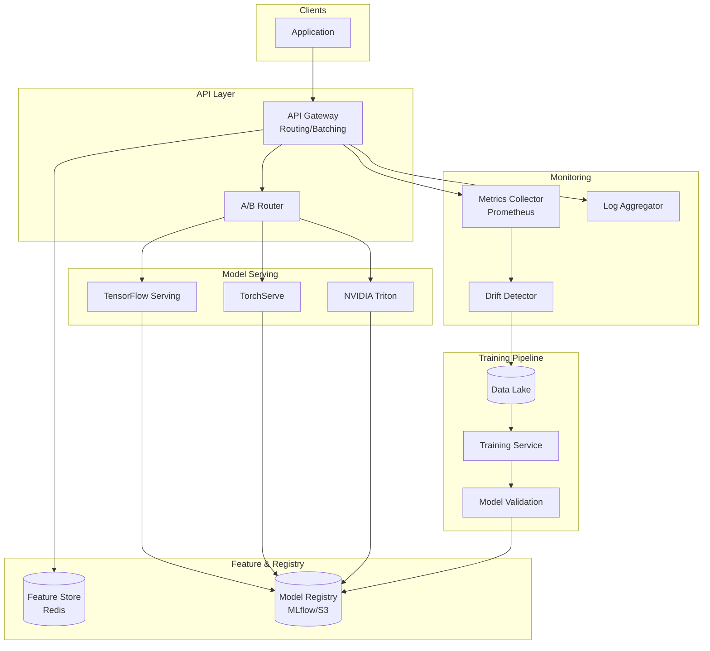

# 2) High-Level Architecture (Most Detailed)



 

## Components (What & Why)

### 1. API Gateway / Prediction Service
**What**: REST/gRPC API layer that receives prediction requests, routes to appropriate model servers, returns results.

**Why**:
- **Routing Logic**: Routes requests to correct model version based on A/B test rules or canary weights
- **Load Balancing**: Distributes traffic across replicas (round-robin, least-connections)
- **Request Batching**: Buffers requests for 10ms, batches them for GPU efficiency
- **Fallback**: Returns cached prediction or simpler model if primary model times out

**Responsibilities**:
- Input validation (schema check, feature count, data types)
- Feature preprocessing (normalize, encode, missing value imputation)
- Model routing (v1 vs v2, CPU vs GPU)
- Response aggregation (ensemble multiple models if needed)

---

### 2. Model Serving Runtime (TensorFlow Serving / TorchServe / Triton)
**What**: Framework-specific runtimes that load models, execute inference, manage GPU memory.

**Why**:
- **Optimized Inference**: TF Serving optimizes TensorFlow graphs, TorchServe JIT-compiles PyTorch models
- **GPU Management**: Handles CUDA contexts, memory allocation, concurrent execution streams
- **Dynamic Batching**: Automatically batches requests within latency budget (e.g., batch up to 32 requests, wait max 10ms)

**Runtime Comparison**:
- **TensorFlow Serving**: Best for TensorFlow models, supports SavedModel format, gRPC/REST API
- **TorchServe**: PyTorch models, supports TorchScript, ONNX export
- **NVIDIA Triton**: Multi-framework (TF, PyTorch, ONNX, TensorRT), best GPU utilization, ensemble support

---

### 3. Model Registry (MLflow / SageMaker Model Registry)
**What**: Centralized repository storing trained models with metadata (version, accuracy, framework, training data).

**Why**:
- **Versioning**: Track all model versions (v1, v2, v3), enable rollback
- **Lineage**: Link model to training data, hyperparameters, code version (reproducibility)
- **Approval Workflow**: Stage models (dev → staging → production) with approval gates

**Metadata Stored**:
```json
{
  "model_id": "fraud_detection_v2",
  "framework": "tensorflow",
  "version": "2.0.1",
  "accuracy": 0.95,
  "training_date": "2024-01-01",
  "artifact_uri": "s3://models/fraud_detection_v2.tar.gz",
  "model_size": "2.3GB",
  "input_schema": {"features": ["amount", "merchant_id", ...]},
  "stage": "production"
}
```

---

### 4. Feature Store (Feast / Tecton)
**What**: Low-latency storage for precomputed features (user embeddings, aggregates) with online/offline APIs.

**Why**:
- **Precomputation**: Features computed once (batch), reused across models (e.g., user's 30-day transaction average)
- **Consistency**: Same features in training and serving (avoid train/serve skew)
- **Low Latency**: <10ms p99 lookup for real-time features from Redis/DynamoDB

**Architecture**:
- **Online Store** (Redis): Real-time features (user_id → [age, location, purchase_count])
- **Offline Store** (S3/Snowflake): Historical features for training
- **Feature Pipeline**: Spark/Flink jobs compute features, sync to online store

---

### 5. A/B Testing & Traffic Splitter
**What**: Proxy layer that routes X% traffic to model v1, Y% to model v2, tracks metrics per variant.

**Why**:
- **Experimentation**: Test new model versions without full rollout (gradual ramp 5% → 20% → 100%)
- **Statistical Significance**: Collect metrics (accuracy, latency, revenue) until p<0.05
- **Auto-Rollback**: Revert to v1 if v2 error rate >2% (automated guardrails)

**Routing Rules**:
- **User-Level**: Hash(user_id) % 100 < 20 → route to v2 (20% traffic, consistent per user)
- **Request-Level**: Random() < 0.2 → route to v2 (20% traffic, non-consistent)
- **Canary**: Route 5% of production traffic to v2 for 1 hour, monitor errors

---

### 6. Model Cache (Redis/Memcached)
**What**: In-memory cache storing recent predictions keyed by input hash.

**Why**:
- **Duplicate Requests**: Ad ranking often sees same ad+user combo → cache hit avoids inference
- **Cost Savings**: Cache hit = $0 inference cost (vs. $0.01 per GPU inference)
- **Latency**: Redis lookup <1ms vs. 50ms GPU inference

**Cache Strategy**:
- **Key**: SHA256(model_id + input_features)
- **Value**: {prediction, confidence, timestamp}
- **TTL**: 1 hour for real-time models, 24 hours for batch models

**Trade-offs**:
- **Stale Predictions**: Cached prediction may be outdated if model retrained
- **Cache Stampede**: Popular input causes many simultaneous cache misses → rate-limit model calls

---

### 7. Dynamic Batching Queue
**What**: Request buffer that accumulates requests for up to 10ms, batches them for GPU inference.

**Why**:
- **GPU Efficiency**: Single request = 5% GPU utilization, batch of 32 = 80% utilization
- **Throughput**: Batching increases throughput 10× (1K → 10K predictions/sec per GPU)
- **Latency Budget**: 10ms batching + 50ms inference = 60ms total (within 100ms SLA)

**Algorithm**:
1. Request arrives → add to queue
2. If queue size ≥32 OR wait_time ≥10ms → process batch
3. Run batch inference (all 32 requests in single GPU call)
4. Return individual predictions to each request

---

### 8. Model Monitoring & Drift Detection
**What**: Background job that analyzes prediction distribution, input features, model performance.

**Why**:
- **Data Drift**: Production data changes (e.g., COVID shifts shopping patterns) → model accuracy drops
- **Concept Drift**: Relationship between features and target changes (e.g., fraud tactics evolve)
- **Biased Predictions**: Model favors certain groups (gender, race) → compliance risk

**Metrics Tracked**:
- **Prediction Distribution**: P(fraud=1) should match historical baseline (e.g., 2% fraud rate)
- **Feature Distribution**: Mean/stddev of features should be stable (alert if >3 sigma shift)
- **Model Accuracy**: Sample 1% of predictions, get ground truth labels (delayed), compare with prediction

**Alerting**:
- **Accuracy Drop**: Model accuracy drops >5% over 7 days → retrain model
- **Feature Drift**: Input features shift >2 sigma → investigate data pipeline issue
- **Latency Spike**: p99 >200ms for 10min → auto-scale inference servers

---

## Data Flows

### Flow A: Real-Time Prediction (Single Request)
1. **Client** → API Gateway: `POST /predict {"model": "fraud_detection_v2", "features": [...]}`
2. **API Gateway**:
   - Validate input (schema check, feature count)
   - Fetch real-time features from Feature Store (Redis): `user_id → [age, purchase_count]`
   - Check Model Cache (Redis): `SHA256(model_id + features)` → cache miss
   - Route to Model Serving Runtime (based on A/B test rule: 80% v1, 20% v2)
3. **Model Serving Runtime** (TensorFlow Serving):
   - Add request to dynamic batching queue
   - Wait up to 10ms for batch to fill (or until batch size = 32)
   - Run batch inference on GPU (50ms for 32 predictions)
4. **Model Serving Runtime** → API Gateway: `{"prediction": 0.92, "confidence": 0.85}`
5. **API Gateway**:
   - Cache prediction in Redis (TTL = 1 hour)
   - Log prediction to Kafka (for monitoring/retraining)
6. **API Gateway** → Client: `{"prediction": 0.92, "is_fraud": true}`

**Latency Breakdown**:
- Input validation: 1ms
- Feature fetch: 5ms
- Cache lookup: 1ms
- Batching wait: 10ms (worst case)
- GPU inference: 50ms (batch of 32)
- Response: 1ms
- **Total**: ~68ms (p50), ~90ms (p99 with queueing)

---

### Flow B: Batch Inference (Offline Job)
1. **Batch Job** reads 10M user IDs from S3
2. **Job** queries Feature Store (offline) for precomputed features: `SELECT * FROM features WHERE user_id IN (...)`
3. **Job** chunks data into batches of 1000, sends to Batch Inference Service
4. **Batch Inference Service** loads model from S3 (once), processes batches sequentially on GPU
5. **Service** writes predictions to S3: `user_id, recommendation_1, recommendation_2, recommendation_3`
6. **Job** completes in 1 hour (10M predictions ÷ 100 GPUs ÷ 2.8K pred/sec/GPU = 36 min)

**Optimization**: Use Spark for parallelization (100 executors × 100 GPUs)

---

### Flow C: Model Deployment (New Version)
1. **Data Scientist** trains model, registers in Model Registry: `mlflow log-model fraud_detection_v3`
2. **CI/CD Pipeline** (GitLab/Jenkins):
   - Validate model (smoke test on sample data)
   - Package model (Docker image with TF Serving + model artifacts)
   - Push image to ECR/GCR
3. **Deployment Service** (Kubernetes Operator):
   - Create new deployment: `fraud_detection_v3` with 3 replicas
   - Wait for health checks to pass (model loaded, test prediction succeeds)
   - Update A/B test config: Route 5% traffic to v3 (canary)
4. **Monitoring Service** watches v3 metrics for 1 hour:
   - Error rate: <1% (pass)
   - Latency p99: <100ms (pass)
   - Accuracy (sampled): 95% (pass)
5. **Deployment Service** ramps traffic: 5% → 20% → 50% → 100% over 24 hours
6. **Deployment Service** marks v2 as deprecated, keeps it running for 7 days (rollback safety)

**Rollback**: If v3 error rate >2%, instantly route 100% traffic back to v2

---

### Flow D: Feature Computation & Sync
1. **Batch Feature Pipeline** (Spark/Flink) runs daily:
   - Compute user features: `user_id → [total_purchases, avg_amount, last_login]`
   - Write to Offline Store (S3/Snowflake) for training
2. **Online Store Sync** (Change Data Capture):
   - Read new features from Offline Store
   - Upsert to Online Store (Redis): `HSET user:123 total_purchases 50 avg_amount 75.5`
3. **Real-Time Features** (Streaming Flink):
   - User makes purchase → Kafka event → Flink → update Redis: `HINCRBY user:123 total_purchases 1`

---

## Minimal Data Model

### Model Registry (Postgres/DynamoDB)
```
models:
  - model_id: UUID
    name: string
    version: string
    framework: enum (tensorflow, pytorch, onnx, xgboost)
    artifact_uri: string (S3 path)
    model_size_bytes: int
    input_schema: json
    output_schema: json
    accuracy_metrics: json (precision, recall, f1, auc)
    stage: enum (dev, staging, production)
    created_at: timestamp
    approved_by: string
```

### Feature Store (Redis/DynamoDB)
```
Redis:
  user:{user_id} → hash {age: 25, location: "US", purchase_count: 10}
  TTL: 24 hours (refreshed by batch job)

DynamoDB:
  partition_key: user_id
  attributes: {age, location, purchase_count, last_login, ...}
```

### Prediction Logs (Kafka → S3)
```json
{
  "prediction_id": "uuid",
  "model_id": "fraud_detection_v2",
  "model_version": "2.0.1",
  "features": [0.5, 0.3, ...],
  "prediction": 0.92,
  "confidence": 0.85,
  "latency_ms": 65,
  "cache_hit": false,
  "timestamp": "2024-01-01T12:00:00Z"
}
```

---

## API Design

### Real-Time Prediction
```http
POST /v1/predict
Content-Type: application/json

{
  "model": "fraud_detection_v2",
  "features": {
    "amount": 150.0,
    "merchant_id": "12345",
    "user_age": 30
  }
}

Response 200 OK:
{
  "prediction_id": "uuid",
  "prediction": 0.92,
  "label": "fraud",
  "confidence": 0.85,
  "latency_ms": 68,
  "model_version": "2.0.1"
}
```

### Batch Prediction
```http
POST /v1/batch_predict
Content-Type: application/json

{
  "model": "recommendation_v1",
  "input_uri": "s3://data/users.csv",
  "output_uri": "s3://predictions/recs.csv",
  "batch_size": 1000
}

Response 202 Accepted:
{
  "job_id": "uuid",
  "status": "running",
  "progress": "10%",
  "eta_seconds": 3600
}
```

### Model Deployment
```http
POST /v1/models/{model_id}/deploy
Content-Type: application/json

{
  "version": "3.0.0",
  "replicas": 3,
  "instance_type": "gpu.t4.large",
  "traffic_percentage": 5
}

Response 200 OK:
{
  "deployment_id": "uuid",
  "status": "healthy",
  "endpoint": "https://api.example.com/v1/predict?model=fraud_detection_v3"
}
```

---

## Monitoring Cheat-Sheet

### Golden Signals (per model)
1. **Latency**: p50/p95/p99 inference time (target: p99 <100ms)
2. **Throughput**: Predictions/sec (target: >100K globally)
3. **Error Rate**: Failed predictions / total (target: <0.1%)
4. **GPU Utilization**: % GPU busy (target: >80%)

### Model-Specific Metrics
- **Prediction Distribution**: P(class=1) over time (detect drift)
- **Feature Distribution**: Mean/stddev of input features (detect data quality issues)
- **Cache Hit Rate**: % requests served from cache (target: >30% for ad ranking)
- **Batch Size**: Avg requests per batch (target: >16 for GPU efficiency)

### Cost Metrics
- **Cost Per Prediction**: Total inference cost ÷ predictions (target: <$0.01/1000)
- **GPU Idle Time**: % time GPU waiting for requests (target: <20%)
- **Spot Instance Failures**: # batch jobs interrupted by spot termination

### Alerts
- **High Latency**: p99 >200ms for 10min → auto-scale or investigate slow model
- **Model Drift**: Prediction distribution shifts >10% → retrain model
- **A/B Test Failure**: Variant B error rate >2× variant A → auto-rollback
- **GPU OOM**: Model fails with CUDA out-of-memory → reduce batch size or model size
