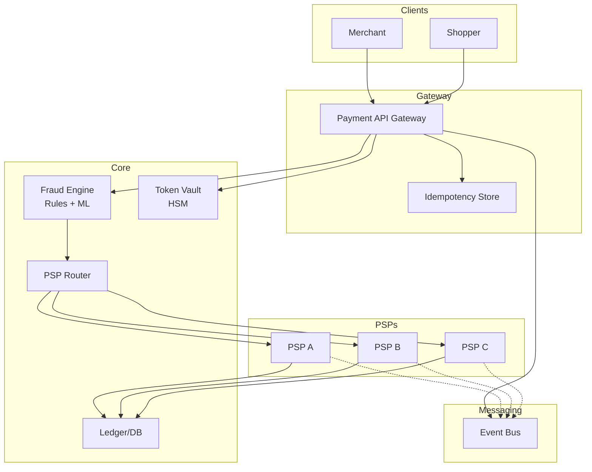

# 2) High-Level Architecture (Most Detailed)



## Components (What & Why)

### 1. Payment API Gateway
**What**: REST API layer that validates requests, enforces idempotency, routes to PSPs.

**Why**: Decouple clients from PSP-specific APIs, enforce security/validation, provide unified interface.

**Responsibilities**: Rate limiting, authentication (API keys/JWT), input validation, idempotency keys, audit logging.

---

### 2. Tokenization Vault (HSM)
**What**: Hardware Security Module stores encrypted card data, returns tokens for PCI compliance.

**Why**: Never store raw card numbers (PCI DSS requirement), encrypt at rest with FIPS 140-2 certified HSMs.

**Flow**: Card number → HSM encrypts → token returned → token stored in DB → card number discarded.

---

### 3. Fraud Detection Engine
**What**: Real-time scoring with rules (velocity checks, geolocation) + ML model (XGBoost/neural net).

**Why**: Block fraudulent transactions before authorization (save PSP fees), reduce chargeback liability.

**Scoring**: <100ms ML inference (fraud_score 0-100) → block if >80, manual review if 50-80, approve if <50.

---

### 4. PSP Router
**What**: Intelligent routing to select optimal PSP based on card type, region, cost, success rate.

**Why**: Multi-PSP strategy reduces dependency, optimizes cost (route to cheapest PSP), improves auth rates (PSP B may approve what PSP A declines).

**Routing Logic**: 
- VISA → Stripe (lowest fees for US)
- Mastercard EU → Adyen (best EU auth rate)
- Failover: If PSP A timeout >500ms, retry with PSP B

---

### 5. PSP Adapters (Stripe, Adyen, Braintree)
**What**: Per-PSP integration layer that translates unified API to PSP-specific formats.

**Why**: Normalize PSP differences (auth codes, error formats, retry logic) behind common interface.

**Example**: Stripe uses `card[number]`, Adyen uses `cardNumber` → adapter translates.

---

### 6. Ledger Service (Double-Entry)
**What**: Immutable append-only ledger recording all money movements (debits/credits).

**Why**: Financial accuracy (audit trail), detect discrepancies, regulatory compliance (SOX, GDPR).

**Schema**:
```
- transaction_id: UUID
- debit_account: merchant_balance
- credit_account: customer_card
- amount: 100.00 USD
- status: pending | captured | refunded
```

---

### 7. Settlement & Reconciliation
**What**: Daily batch job that settles funds with banks, reconciles gateway records vs. PSP/bank statements.

**Why**: Ensure all transactions accounted for (zero missing), detect fraud/errors, trigger investigations.

**Reconciliation Flow**:
1. Gateway: 10,000 transactions, $1M total
2. PSP Statement: 9,999 transactions, $999,900 total
3. Alert: 1 missing transaction ($100) → manual investigation

---

### 8. Retry & Recovery Service
**What**: Asynchronous retry logic for failed payments (network timeout, PSP downtime).

**Why**: Transient failures (5% of declines) can succeed on retry → improve success rate from 95% → 98%.

**Strategy**: Exponential backoff (retry after 1min, 5min, 1h, 24h), switch PSP on 2nd retry.

---

## Data Flows

### Flow A: Successful Payment Authorization
1. **Client** → API Gateway: `POST /payments {"amount": 100, "currency": "USD", "card": "tok_visa_1234"}`
2. **API Gateway**:
   - Validate input (amount >0, currency valid, token exists)
   - Check idempotency key (dedupe duplicate requests)
   - Log request to audit trail
3. **Fraud Engine**:
   - Fetch user history (last 10 transactions, IP geolocation, device fingerprint)
   - Run rules (velocity check: max 5 tx/hour, geolocation: IP matches billing address)
   - ML scoring (fraud_score: 15/100 → approve)
4. **PSP Router**: Select Stripe (optimal for VISA + US)
5. **Stripe Adapter** → Stripe API: Authorize $100
6. **Stripe** → Gateway: `{"status": "approved", "auth_code": "ABC123"}`
7. **Ledger Service**: Record pending transaction (not yet captured)
8. **API Gateway** → Client: `{"status": "success", "payment_id": "pay_123", "auth_code": "ABC123"}`

**Latency**: 50ms fraud + 200ms PSP + 50ms overhead = **300ms total**.

---

### Flow B: Fraud Blocked Transaction
1. Steps 1-3 same as Flow A
2. **Fraud Engine**: fraud_score: 85/100 → block (high risk)
3. **API Gateway** → Client: `{"status": "declined", "reason": "fraud_suspected"}`
4. **Notification**: Alert fraud team for manual review

**No PSP call** → save $0.10 fee per blocked transaction.

---

### Flow C: PSP Failover (Timeout)
1. Steps 1-3 same as Flow A
2. **PSP Router**: Select Stripe
3. **Stripe Adapter** → Stripe: 500ms timeout (no response)
4. **PSP Router**: Failover to Adyen (retry same transaction)
5. **Adyen** → Gateway: `{"status": "approved"}`
6. Continue with steps 7-8 from Flow A

**Total Latency**: 500ms (Stripe timeout) + 200ms (Adyen) = **700ms** (breaches SLA, acceptable for failover).

---

### Flow D: Capture & Settlement (Post-Authorization)
1. **Merchant** ships product → calls `POST /payments/pay_123/capture`
2. **API Gateway** → PSP Adapter: Capture $100 (previously authorized)
3. **PSP** → Gateway: `{"status": "captured"}`
4. **Ledger Service**: Update transaction status (pending → captured)
5. **Settlement Job** (runs daily at 2am):
   - Aggregate all captured transactions per PSP
   - Initiate bank transfer (Stripe → Merchant bank account)
   - Record settlement in ledger
6. **Reconciliation Job** (runs daily at 6am):
   - Download PSP statement (all transactions from yesterday)
   - Compare gateway ledger vs. PSP statement (10,000 tx = 10,000 tx ✓)
   - Alert if mismatch

---

## Minimal Data Model

### Transactions (PostgreSQL)
```sql
CREATE TABLE transactions (
  id UUID PRIMARY KEY,
  idempotency_key VARCHAR(64) UNIQUE NOT NULL,
  merchant_id UUID NOT NULL,
  amount DECIMAL(19,4) NOT NULL,
  currency CHAR(3) NOT NULL,
  status VARCHAR(20), -- pending, authorized, captured, refunded, failed
  card_token VARCHAR(64) NOT NULL, -- HSM token, not raw card
  psp_name VARCHAR(20), -- stripe, adyen, braintree
  psp_transaction_id VARCHAR(64),
  auth_code VARCHAR(16),
  fraud_score INT,
  created_at TIMESTAMP NOT NULL,
  captured_at TIMESTAMP,
  INDEX idx_merchant_created (merchant_id, created_at)
);
```

### Ledger (Append-Only, Immutable)
```sql
CREATE TABLE ledger_entries (
  id BIGINT PRIMARY KEY AUTO_INCREMENT,
  transaction_id UUID NOT NULL,
  entry_type VARCHAR(10), -- debit, credit
  account VARCHAR(50), -- merchant_balance, customer_card, psp_fee
  amount DECIMAL(19,4),
  currency CHAR(3),
  created_at TIMESTAMP NOT NULL,
  -- No UPDATE/DELETE allowed (append-only)
);
```

### Fraud Scores (Cassandra for fast writes)
```
PRIMARY KEY (transaction_id)
COLUMNS: user_id, ip_address, device_fingerprint, fraud_score, risk_factors (JSON)
TTL: 90 days
```

---

## API Design

### Create Payment
```http
POST /v1/payments
Headers: 
  Authorization: Bearer <api_key>
  Idempotency-Key: <uuid>
Body:
{
  "amount": 100.00,
  "currency": "USD",
  "card_token": "tok_visa_1234", -- from tokenization
  "customer_id": "cus_123",
  "metadata": {"order_id": "ord_456"}
}

Response 201 Created:
{
  "payment_id": "pay_789",
  "status": "authorized",
  "auth_code": "ABC123",
  "created_at": "2024-01-01T12:00:00Z"
}
```

### Capture Payment
```http
POST /v1/payments/{payment_id}/capture
Body: {"amount": 80.00} -- partial capture

Response 200 OK:
{
  "payment_id": "pay_789",
  "status": "captured",
  "captured_amount": 80.00
}
```

### Refund Payment
```http
POST /v1/payments/{payment_id}/refund
Body: {"amount": 50.00, "reason": "customer_return"}

Response 200 OK:
{
  "refund_id": "ref_999",
  "status": "refunded",
  "refunded_amount": 50.00
}
```

---

## Monitoring Cheat-Sheet

### Golden Signals
1. **Authorization Success Rate**: `(approved / total) × 100` → target >98%
2. **Fraud Rate**: `(fraudulent_tx / total) × 100` → target <0.1%
3. **Latency**: p50/p95/p99 auth time → target p99 <500ms
4. **PSP Availability**: Uptime per PSP → auto-failover if <99%

### Financial Metrics
- **GMV (Gross Merchandise Value)**: Total payment volume per day
- **Chargeback Rate**: `(chargebacks / total_tx) × 100` → target <0.5%
- **Reconciliation Gaps**: # transactions unmatched after 24h → target = 0

### Alerts
- **High Fraud**: Fraud rate >0.5% for 10min → alert security team
- **Authorization Failures**: Success rate <95% for 5min → check PSP health
- **Reconciliation Mismatch**: Daily reconciliation finds >10 missing tx → escalate to finance
- **HSM Failure**: Tokenization vault unreachable → critical alert (can't process payments)
