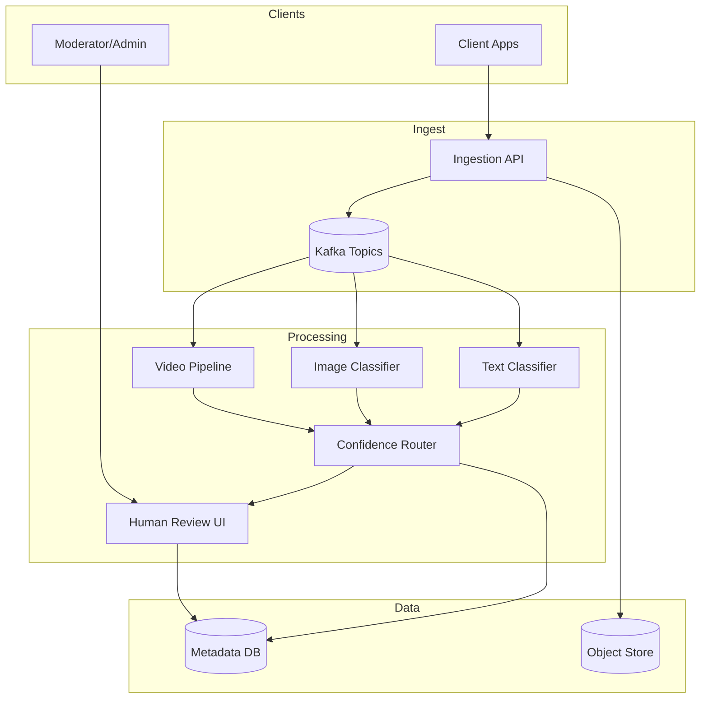

# 2) High-Level Architecture (Most Detailed)



## Components

### 1. Content Ingestion API
Receives posts/comments/images/videos, queues for moderation, returns immediately (async moderation).

### 2. AI Classifiers
- **Text**: BERT-based hate speech/spam detection (50ms inference)
- **Images**: ResNet/EfficientNet for NSFW/violence (100ms inference)
- **Video**: Frame sampling (1 FPS) + audio transcription + classifier ensemble

### 3. Confidence-Based Routing
- High confidence (>80%): Auto-approve or auto-block
- Medium confidence (50-80%): Human review
- Low confidence (<50%): Re-classify with ensemble models

### 4. Human Review Queue
**Prioritization**: CSAM (P0, <5min SLA) > violence (P1) > hate speech (P2) > spam (P3)
**Load Balancing**: Assign tasks to moderators based on language, specialization (CSAM team), workload.

### 5. Appeals System
User submits appeal → senior moderator reviews → overturn or uphold → update training data.

### 6. Feedback Loop (Active Learning)
Moderator decisions → label queue → retrain models weekly → A/B test new model (shadow mode) → deploy.

## Data Flows

### Flow A: Text Moderation
1. User posts comment → Ingestion API → Kafka topic
2. Text Classifier (BERT) → confidence 65% (hate speech)
3. Route to Human Review Queue (medium confidence)
4. Moderator reviews → marks as hate speech → content blocked
5. Decision logged → training data for model retraining

### Flow B: Image Moderation (Auto-Block)
1. User uploads image → Ingestion API → S3
2. Image Classifier (ResNet) → confidence 95% (NSFW)
3. Auto-block (high confidence) → user notified
4. Log decision for audit

## API Design

**Submit Content**:
```http
POST /v1/moderate
{"type": "text", "content": "..."}
→ {"moderation_id": "uuid", "status": "pending"}
```

**Check Status**:
```http
GET /v1/moderate/{id}
→ {"status": "approved|blocked", "reason": "hate_speech", "confidence": 0.92}
```

## Monitoring
- **AI Accuracy**: Precision/recall per classifier (weekly audits)
- **Moderator Performance**: Reviews/hour, accuracy (spot-check by QA team)
- **Queue Latency**: p95 time-to-assignment (target <10s)
- **Appeals Rate**: % of blocks appealed (target <5%)
