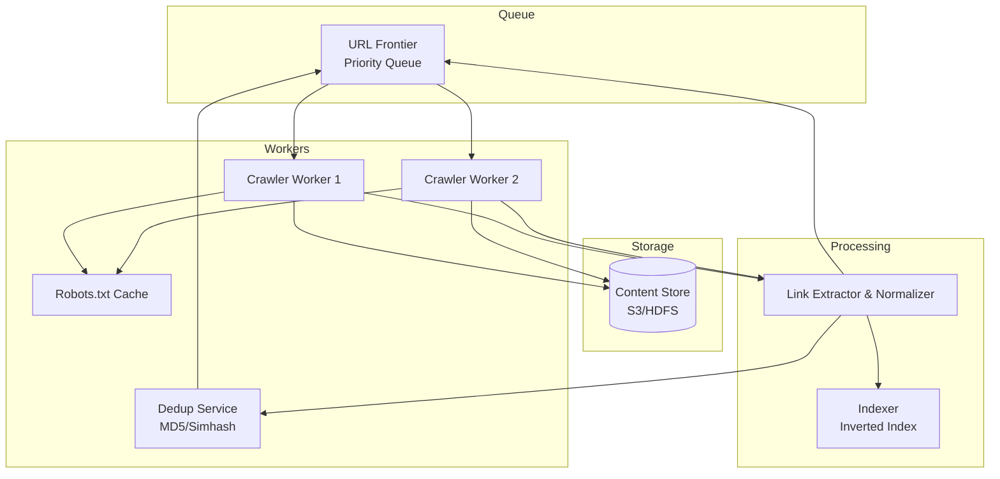

# 2) High-Level Architecture (Most Detailed)



## Components

### 1. URL Frontier (Priority Queue)
Distributed queue storing URLs to crawl, prioritized by:
- **Freshness**: Recrawl news sites daily, static pages monthly
- **PageRank**: Prioritize high-authority domains
- **Domain Politeness**: Ensure 1 req/sec per domain (rate limiting)

### 2. Crawler Workers
Distributed workers that:
1. Pop URL from frontier
2. Check robots.txt cache (respect disallowed paths)
3. Fetch page (HTTP GET with User-Agent header)
4. Extract links, text, metadata
5. Push new URLs to frontier
6. Store page content to S3

### 3. Robots.txt Cache
In-memory cache (Redis) storing robots.txt rules per domain:
```
domain: example.com
disallowed: [/admin, /private]
crawl_delay: 2s
```
TTL: 24 hours (refresh daily).

### 4. Deduplication Service
**Exact Duplicates**: MD5 hash of page content → if hash exists, skip
**Near-Duplicates**: Simhash (locality-sensitive hashing) → detect 90% similar pages

### 5. Content Store
S3/HDFS storing raw HTML + metadata:
```
{url, domain, fetch_time, status_code, html_content, outbound_links[]}
```

### 6. Link Extractor & Normalizer
Parse HTML → extract `<a href>` tags → normalize URLs:
- Relative → absolute (href="/about" → "https://example.com/about")
- Remove fragments (#section)
- Canonicalize (www.example.com → example.com)

### 7. Scheduler
Background job that:
- Computes next crawl time (news: now + 1d, blogs: now + 7d)
- Enqueues URLs to frontier with priority

## Data Flows

### Flow A: Crawl New Page
1. **Worker** pops URL from frontier: `https://example.com/page1`
2. **Worker** checks robots.txt cache: `/page1` allowed ✓
3. **Worker** fetches page (HTTP GET, respects crawl-delay 1s)
4. **Worker** parses HTML: Extracts 50 outbound links + page text
5. **Deduplication Service**: Hash content (MD5) → not seen before ✓
6. **Content Store**: Save HTML to S3: `s3://crawled-pages/example.com/page1.html`
7. **Worker** normalizes links → pushes to frontier (50 new URLs)
8. **Worker** waits 1s (politeness) before next request to example.com

### Flow B: Detect Duplicate Content
1. Worker crawls `example.com/page2` → content hash: `abc123`
2. Deduplication Service: Lookup hash in Bloom filter → exists ✓
3. Worker skips storage (duplicate), logs duplicate for analytics

### Flow C: Robots.txt Handling
1. Worker encounters new domain: `newsite.com/page1`
2. Worker fetches `newsite.com/robots.txt`:
```
User-agent: *
Disallow: /private
Crawl-delay: 2
```
3. Cache robots.txt rules (Redis, TTL 24h)
4. Worker crawls `/page1` (allowed), waits 2s before next request

## API Design

**Crawl Status API** (for monitoring):
```http
GET /crawler/status
→ {
  "total_pages_crawled": 5000000000,
  "crawl_rate": 50000,  // pages/sec
  "frontier_size": 1000000000,
  "active_workers": 950
}
```

**Submit URL** (for external submissions):
```http
POST /crawler/submit
{"url": "https://newsite.com", "priority": "high"}
→ {"status": "queued", "eta": "2024-01-02T00:00:00Z"}
```

## Monitoring
- **Crawl Rate**: Pages/sec (target 1M peak, 3.8K sustained)
- **Frontier Size**: URLs queued (target <1B, alert if >10B)
- **Politeness Violations**: Requests exceeding 1 req/sec per domain (target 0)
- **Duplicate Rate**: % pages skipped due to duplication (expected 20-30%)
- **Error Rate**: HTTP errors (4xx/5xx) per domain (block if >50%)
