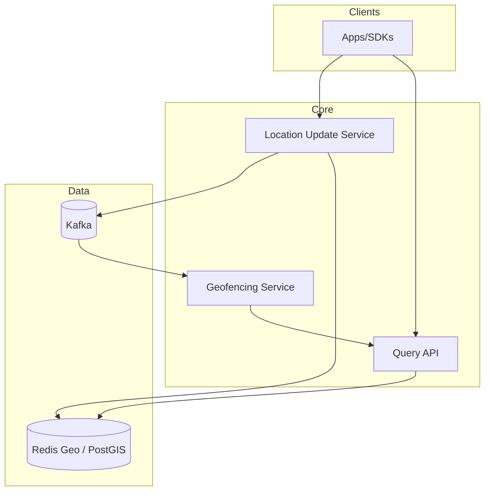

# 2) High-Level Architecture (Most Detailed)



## Components

### 1. Geospatial Index (Redis Geo / PostGIS)
**Redis Geo**: Stores places with lat/lon, supports GEORADIUS command (<10ms p99).
**PostGIS**: PostgreSQL extension for complex polygon queries (slower, 50ms p99).

**Data Model** (Redis):
```
GEOADD places -122.4194 37.7749 "restaurant:123"
GEORADIUS places -122.4194 37.7749 5 km WITHDIST
→ Returns: [(restaurant:123, 2.3km), (restaurant:456, 4.5km)]
```

### 2. Geohash / H3 Encoding
**Geohash**: Encode lat/lon into string (precision 6 = ~1km square).
```
(37.7749, -122.4194) → "9q8yy"
```
**H3**: Uber's hexagonal grid (more uniform than square grid).

**Benefits**: Prefix-based search (all places in "9q8yy*" are within 1km).

### 3. Location Update Service
Streaming service (Kafka + Flink) that:
1. Receives location updates (driver_id, lat, lon, timestamp)
2. Updates geospatial index (Redis GEOADD)
3. Computes Geohash → updates sharded index

### 4. Query Service (Radius Search)
API endpoint that:
1. Receives query (lat, lon, radius=5km)
2. Computes Geohash neighbors (9 cells for 5km search)
3. Queries Redis GEORADIUS for each cell
4. Merges results, sorts by distance
5. Returns top 20 places

### 5. Geofencing Service
Background job that:
1. Subscribes to location update stream
2. Checks if object entered/exited geofence (ST_Within polygon query)
3. Triggers webhook/push notification

## Data Flows

### Flow A: Radius Search
1. User → API: `GET /nearby?lat=37.77&lon=-122.41&radius=5km`
2. Query Service:
   - Compute Geohash: "9q8yy" (precision 5)
   - Get neighbors: ["9q8yy", "9q8yw", "9q8yv", ...] (9 cells)
3. Redis: `GEORADIUS places 37.77 -122.41 5 km WITHDIST`
4. Filter: category="restaurant", rating>4.0
5. Sort: By distance (ascending)
6. Return: Top 20 results with distance

**Latency**: 10ms Redis + 5ms filtering + 5ms sorting = **20ms total**.

### Flow B: Real-Time Location Update
1. Driver app → Location Update Service: `{"driver_id": 123, "lat": 37.78, "lon": -122.42}`
2. Service:
   - Compute Geohash: "9q8yz"
   - Redis: `GEOADD drivers 37.78 -122.42 driver:123`
   - Publish to Kafka: `driver_location_updates` topic
3. Geofencing Service (subscriber):
   - Check if driver entered pickup zone (polygon query)
   - If yes, trigger notification to rider

**Latency**: 5ms Redis update + 10ms Kafka publish = **15ms total**.

## API Design

**Radius Search**:
```http
GET /nearby?lat=37.77&lon=-122.41&radius=5km&category=restaurant&limit=20
→ [
  {"id": 123, "name": "Pizza Place", "distance": 2.3, "rating": 4.5},
  {"id": 456, "name": "Burger Joint", "distance": 4.1, "rating": 4.2}
]
```

**Update Location**:
```http
POST /location/update
{"object_id": "driver:123", "lat": 37.78, "lon": -122.42}
→ {"status": "ok", "geohash": "9q8yz"}
```

## Monitoring
- **Query Latency**: p50/p95/p99 for radius queries (target p99 <100ms)
- **Update Throughput**: Location updates/sec (target 10M peak)
- **Index Size**: # places indexed (track growth)
- **Geofence Triggers**: Alerts fired/sec (detect anomalies)
