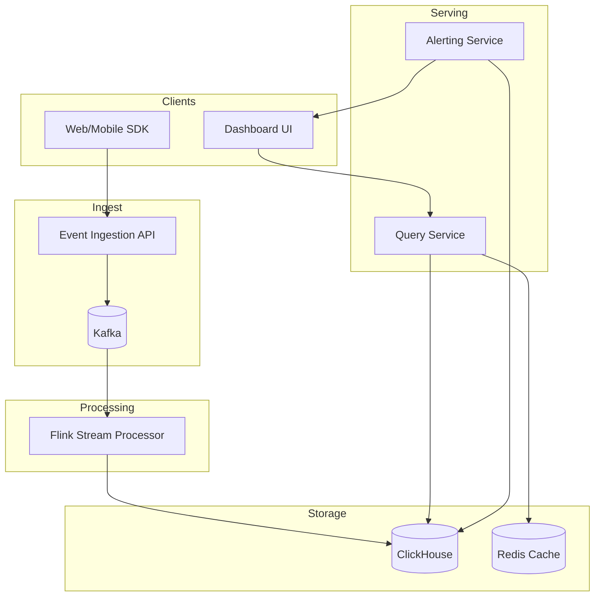

# 2) High-Level Architecture (Most Detailed)



## Components

### 1. Event Ingestion API
REST/gRPC API receives events, batches them, publishes to Kafka.
```json
{"event": "page_view", "timestamp": "2024-01-01T12:00:00Z", "user_id": 123, "page": "/product", "country": "US", "device": "mobile"}
```

### 2. Kafka (Event Stream)
Distributed log storing raw events (7-day retention), partitioned by user_id for ordering.

### 3. Stream Processor (Flink)
Real-time aggregation:
- **Tumbling Windows**: Page views per minute (rollup every 60s)
- **Session Windows**: User sessions (group events with <30min gaps)
- **Stateful Joins**: Enrich events (user_id → user_country from user profile DB)

### 4. OLAP Database (ClickHouse)
Columnar DB storing pre-aggregated data:
```sql
CREATE TABLE metrics (
  timestamp DateTime,
  metric_name String,
  value Float64,
  dimensions Map(String, String)  -- {country: US, device: mobile}
) ENGINE = MergeTree()
PARTITION BY toYYYYMMDD(timestamp)
ORDER BY (metric_name, timestamp);
```

**Query Example**:
```sql
SELECT timestamp, sum(value) AS total_views
FROM metrics
WHERE metric_name = 'page_views'
  AND timestamp >= now() - INTERVAL 7 DAY
  AND dimensions['country'] = 'US'
GROUP BY toStartOfHour(timestamp)
ORDER BY timestamp;
```

### 5. Query Service
API layer that:
1. Receives dashboard query (metric, time range, filters)
2. Checks cache (Redis): `dashboard:page_views:7d:US` → cache hit (90% hit rate)
3. If miss, queries ClickHouse → caches result (TTL 1min)
4. Returns aggregated data (time-series array)

### 6. Dashboard UI (React + Grafana)
Web UI rendering charts:
- **Time-Series**: Line graphs (page views over time)
- **Breakdowns**: Pie charts (traffic by country)
- **Tables**: Top pages by views

### 7. Alerting Service
Background job that:
- Evaluates alert rules every 1min (PromQL-style queries)
- Detects anomalies (traffic drop >20% vs. last hour)
- Sends notifications (Slack, PagerDuty)

## Data Flows

### Flow A: Event Ingestion → Pre-Aggregation
1. User → SDK: Page view event
2. SDK → Ingestion API: Batch 100 events
3. API → Kafka: Publish to `events` topic
4. Flink (consumer):
   - Read events from Kafka
   - Tumbling window (60s): Aggregate page views per country per device
   - Output: `{timestamp: "2024-01-01T12:01:00Z", metric: "page_views", country: "US", device: "mobile", value: 1500}`
5. Flink → ClickHouse: Batch insert (1000 rows)

**Latency**: 10s event batch + 60s window + 10s insert = **80s lag** (within 1min SLA).

### Flow B: Dashboard Query
1. User → Dashboard UI: Load "Page Views (7d)" dashboard
2. UI → Query Service: `GET /metrics?name=page_views&range=7d&country=US`
3. Query Service → Redis: `GET dashboard:page_views:7d:US` → cache miss
4. Query Service → ClickHouse:
```sql
SELECT toStartOfHour(timestamp) AS hour, sum(value)
FROM metrics
WHERE metric_name = 'page_views' AND country = 'US' AND timestamp >= now() - 7
GROUP BY hour;
```
5. ClickHouse → Query Service: 168 rows (7 days × 24 hours)
6. Query Service → Redis: `SET dashboard:page_views:7d:US <result> EX 60`
7. Query Service → UI: JSON response
8. UI renders line graph

**Latency**: 20ms cache lookup + 2s ClickHouse query + 500ms rendering = **2.5s total**.

### Flow C: Drill-Down (Filter by Device)
1. User clicks "Mobile" on pie chart
2. UI → Query Service: `GET /metrics?name=page_views&range=7d&country=US&device=mobile`
3. Query Service → ClickHouse (cache miss for new filter):
```sql
... WHERE country = 'US' AND device = 'mobile' ...
```
4. Return filtered results (50% of original data)

## API Design

**Send Events**:
```http
POST /events
[
  {"event": "page_view", "user_id": 123, "page": "/home", ...},
  {"event": "click", "user_id": 123, "element": "button", ...}
]
→ {"status": "accepted", "count": 2}
```

**Query Metrics**:
```http
GET /metrics?name=page_views&range=7d&group_by=country&filter=device:mobile
→ [
  {"country": "US", "value": 1500000},
  {"country": "UK", "value": 500000}
]
```

## Monitoring
- **Ingestion Rate**: Events/sec (track spikes, capacity planning)
- **Lag**: Time from event generation → queryable (target <1min)
- **Query Latency**: p50/p95/p99 (target p99 <3s)
- **Cache Hit Rate**: % queries served from cache (target >90%)
- **ClickHouse Storage**: Disk usage (partition pruning, compression)
