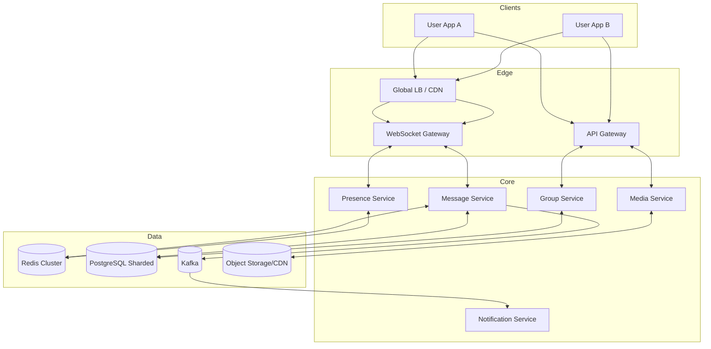
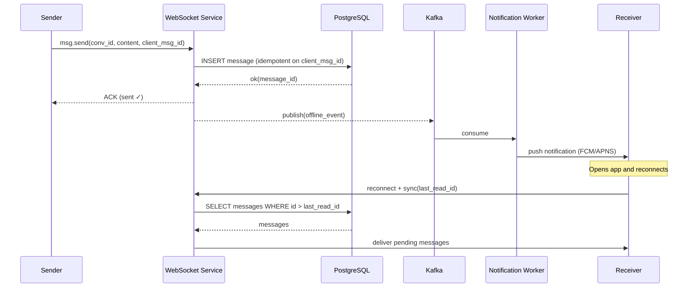
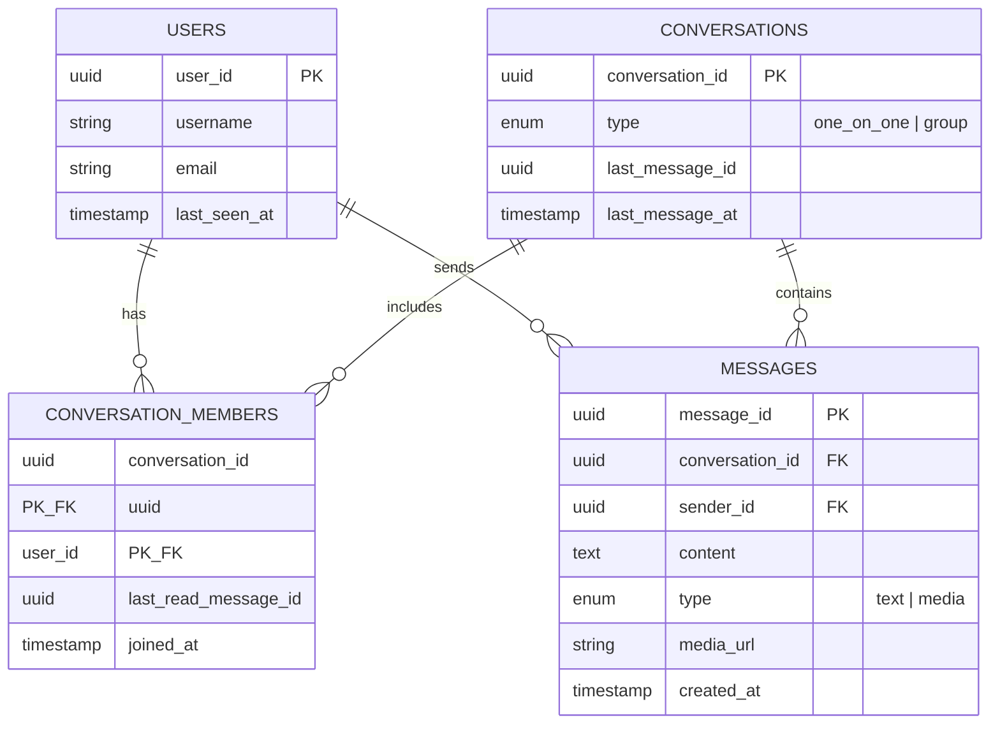
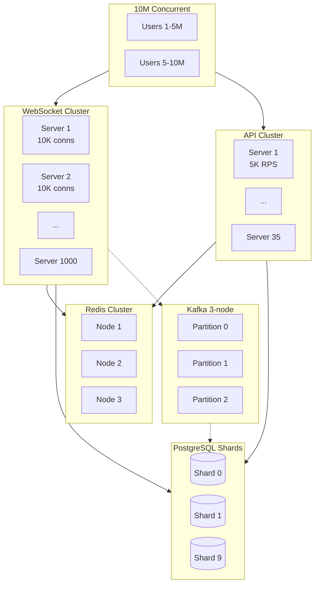
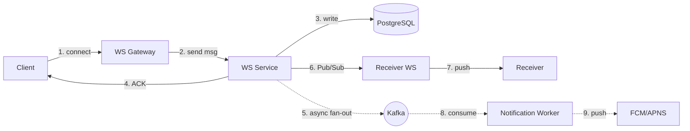

# 01-real-time-chat-application - Real Time Chat Application
Generated: 2025-11-02 20:38:43 -05:00

---

<!-- Source: 01-requirements.md -->
# 1) Requirements & Scale

> Goal: Define what we are building, how big it needs to be, and the first-order constraints. Keep it brief and practical.

---

## What we are building (at a glance)

A real-time chat system (WhatsApp/Slack-like) that supports:

- One-on-one and group messaging (text + media)
- Delivery/read receipts and presence (online/typing)
- Message history with pagination
- Push notifications for offline users

Scope (Phase 1): Design only (no code), production-credible, cloud-friendly.

---

## Core requirements

### Functional

- Send/receive messages instantly (Web, iOS, Android)
- Create groups, add/remove members
- Show delivery states: sent ✓, delivered ✓✓, read ✓✓ blue
- Presence: online/offline, last seen, typing
- Upload/download images/videos/files (links in messages)
- Search by user/conversation (basic)

### Non-functional

- Real-time UX: p99 message delivery under 100 ms for online users
- Availability ≥ 99.95% (≈ 4.38 hours/year downtime)
- Data durability: messages must not be lost
- Privacy: minimal exposure in push notifications
- Cost-aware: prefer simple, proven building blocks

---

## Scale targets (order-of-magnitude)

- 100M daily active users (DAU)
- 10M concurrent WebSocket connections
- Average 50 messages/day/user → 5B messages/day
- Average write rate: ~58K messages/sec (×3 at peak ≈ 174K/sec)
- Read-heavy: roughly 10 reads per write (history fetch, delivery state)

---

## Quick capacity math (back-of-envelope)

- Message size (text avg): ~1 KB (body + metadata)
- Daily text storage: 5B × 1 KB ≈ 5 TB/day
- Media (10% messages, 50 KB avg via CDN/S3): ≈ 25 TB/day (served mostly via CDN)
- One-year storage (text only, before compression): ≈ 1.8 PB
- With compression and realistic retention: plan for multi-PB over years

Networking (messages only):
- Peak bandwidth: 174K msg/s × 1.1 KB ≈ 190 MB/s ≈ 1.5 Gbps (media served via CDN separately)

Compute sizing (rule-of-thumb):
- WebSocket: ~10K connections/server → ~1,000–1,200 WS servers for 10M conns
- API: ~5K RPS/server → 40–60 API servers for core traffic
- Cache: 0.5–3 TB Redis cluster for presence + hot history
- DB: Shard PostgreSQL by conversation_id; start with 10 shards × 4 replicas

---

## Constraints and guardrails

- Ordering matters: conversations must render in correct order → favor strong consistency for writes
- Real-time first: bidirectional transport (WebSocket) for online delivery
- Async everything else: notifications, analytics, fan-out workers via a queue
- Keep it simple: proven tech (PostgreSQL + Redis + Kafka + S3/CDN)
- Mobile clients can buffer offline; sync on reconnect
- WebSocket preferred; HTTP fallback for restrictive networks
- End-to-end encryption (E2EE) optional; server-side moderation when needed
- Multi-region deployment; eventual consistency across regions acceptable (CRDT for sync)
- PII/GDPR: User can delete messages; 30-day hard retention; compliance audit logs

---

## Success measures

- Delivery latency p99 < 100 ms for online users
- Success rate ≥ 99.9% per message
- Stable connections: < 1% drop per hour
- 90%+ CDN hit ratio for media

---

## Out of scope (Phase 1)

- End-to-end encryption protocol details (use Signal in Phase 2)
- Advanced search/ranking and ML-based spam detection
- Full multi-region active-active (start with single primary region + DR)


---

<!-- Source: 02-architecture.md -->
# 2) High-Level Architecture (Most Detailed)



## Data Flow (Send Message) in 8 steps

1) User A sends a message via WebSocket; gateway authenticates JWT and enforces rate limits.
2) Gateway calls Message Service with {conversation_id, sender_id, content, client_msg_id}.
3) Message Service validates membership; checks Redis for dedup on client_msg_id (TTL 5m).
4) Persist: insert message, update conversation.last_message_at in PostgreSQL (shard by conversation_id).
5) ACK sender with {message_id, server_timestamp, status: "sent"}.
6) Publish to Redis Pub/Sub channel conv:{conversation_id} for cross-server fanout.
7) Receiver's WS server delivers to User B; Message Service tracks delivery/read receipts.
8) Async: emit Kafka event for notifications (offline users), indexing, analytics.

## Connection Management

- WebSocket lifecycle: connect → JWT auth → register {user_id: ws_server, conn_id} in Redis (TTL 60s).
- Heartbeat: client PING every 30s; server PONG; close if no response within 60s.
- Reconnect: exponential backoff (1s, 2s, 4s, max 30s); fetch missed messages since last_seen_ts.
- Server restart: LB redirects to healthy nodes; clients reconnect; fetch missed messages from DB.
- Multi-device: multiple WS connections per user_id; fanout to all devices.

## Message Routing (Cross-Server Delivery)

Problem: User A is on WS-Server-1, User B is on WS-Server-3.

Solution: Redis Pub/Sub fanout.
- Message Service publishes to channel: user:{recipient_id}:messages.
- Each WS server subscribes for its connected users; delivers locally if user is connected.
- Latency: ~50–80ms end-to-end (DB write + Pub/Sub + delivery).

## Core Data Model (minimal)

See '3. Data Model & Storage Design' for the authoritative schema and storage plan.

### Critical Path and Latency

- Path: validate → DB write → ACK → cross-server delivery
- Typical latency: ~40ms p50; <100ms p99 (WS 5ms, DB 20ms, Pub/Sub 10ms, delivery 5ms)

### Offline Recipient Flow (sequence)



## Group Message Fanout

1:N delivery for groups (example: 100 members):
- Persist one message to DB (status: sent)
- Publish to Kafka topic `group.messages` with the member list
- Consumer workers fan out per member:
  - If online (presence in Redis): publish to user's Pub/Sub channel for instant delivery
  - If offline: enqueue to `offline_messages` (Kafka) → Notification Service → push notification
- Async: track per-recipient delivery/read status (e.g., last_read_message_id)

## ML Augmentations (Optional)

Targeted enhancements that don’t change core guarantees:

1) Content Moderation (sync)
- Text classification for spam/profanity before DB write
- Model: Distilled BERT, p99 <10ms, deployed as a sidecar
- Action: Block high-confidence violations; flag borderline for review

2) Notification Ranking (async)
- Prioritize push notifications by sender affinity, recency, engagement
- Features: message frequency, relationship strength, time-of-day
- Model: Gradient boosting, retrained weekly, features in feature store

3) Semantic Search (async)
- Generate embeddings post-write; store in vector index (pgvector/OpenSearch k-NN)
- Query via cosine similarity; fallback to SQL full-text when needed

### Edge-Case Handling

| Scenario | Strategy |
|----------|----------|
| Connection flap | Exponential backoff (1s,2s,4s…30s max); resume from last_read_id |
| Celebrity group (1M members) | Hybrid fanout: push only to online + mentioned; others fetch on open |
| Hot shard | Detect write skew; re-shard hot conversations; per-conversation rate limits |
| Kafka lag | Alert when lag >10K; scale consumers; DLQ for poison messages |
| Redis down | Cache-miss fallback to DB; presence may degrade gracefully |

Operational notes:
- All ML paths have simple rule-based fallbacks
- Shadow deploy models; A/B test impact before full rollout
- SLOs: Moderation p99 <10ms; ranking nDCG@10 >0.7; embedding drift <5%

## 3. Data Model & Storage Design


### Database Schema (PostgreSQL)



**Indexes:**
- `messages(conversation_id, created_at DESC)` — pagination
- `conversation_members(user_id)` — user's conversations
- `messages(client_msg_id)` — idempotency lookup (unique)

**Sharding:**
- **Key:** `conversation_id` (hash-based, 10 shards initially)
- **Why:** Keeps all messages for a conversation on one shard; enables local ordering and pagination
- **When to re-shard:** Write throughput >8K/s per shard or storage >1TB per shard

### Specialized Storage

| Store | Purpose | Data | TTL/Retention |
|-------|---------|------|---------------|
| **Redis Cache** | Hot reads | Recent 50 msgs per conversation | 1h |
| **Redis Presence** | Online status | `user:{id}:presence` | 60s auto-expire |
| **Redis Pub/Sub** | Cross-server routing | Ephemeral channels | N/A |
| **Object Storage (S3)** | Media files | Images, videos, docs | Permanent (CDN 90d cache) |
| **Kafka (log)** | Event stream | Offline msgs, analytics | 7 days |

### SQL vs NoSQL Trade-offs

| Criterion | PostgreSQL (Chosen) | Cassandra (Alternative) |
|-----------|---------------------|-------------------------|
| **Ordering** | Strong (ACID, single-shard) | Eventual (race conditions) |
| **Transactions** | ACID per shard | Limited (LWT slow) |
| **Write throughput** | 10K/s per shard | 100K/s+ |
| **Sharding complexity** | Manual re-shard | Auto-distribute |
| **Ops familiarity** | Mature tooling | Steeper learning curve |

**Decision:** PostgreSQL for correctness (ordering critical); shard proactively before bottlenecks.

### API surface (minimal)

- GET /conversations/{id}/messages?limit=50&before=cursor
- POST /messages { conversation_id, content, type, client_msg_id }
- POST /groups { name, member_ids[] }
- PUT /users/me/presence { status: online|away|offline }

### Redis keys (examples)

```
user:{id}:presence → online|offline (TTL 60s)
conv:{id}:messages → recent list (TTL 1h)
user:{id}:conn → ws_server:conn_id (TTL 5m)
channels: user:{id} / group:{id}
```

---

## 4. Scaling, Fault Tolerance & Observability

### Monitoring Cheat-Sheet

- WebSocket: Connection churn (reconnects/min); heartbeat timeouts; per-server connection count
- Message Service: Send latency p50/p95/p99; duplicate rate; DB write errors; Redis Pub/Sub lag
- Presence: Update lag (time since last heartbeat); stale connections (missed cleanup)
- Kafka: Consumer lag per topic; DLQ size; rebalance frequency
- PostgreSQL: Per-shard write QPS; replication lag; connection pool saturation; query p99
- Redis: Memory usage; eviction rate; Pub/Sub channel subscribers; command latency

### Scaling Strategy



**Scaling Rules:**
- **WebSocket:** Add server when avg conns >8K (target 10K max)
- **API:** Add when p95 >100ms or CPU >70%
- **Redis:** Add nodes when memory >80%; use cluster mode for >100GB
- **PostgreSQL:** Add shards when writes >8K/s per shard or storage >1TB
- **Kafka:** 3 partitions × 3 replicas; add partitions for >100K msg/s

### Fault Tolerance

| Failure | Impact | Recovery | Mitigation |
|---------|--------|----------|------------|
| **WS server crash** | 10K users disconnect | Auto-reconnect (exp backoff) | Health checks; rolling deploys |
| **Redis node down** | Cache misses → DB load | Cluster failover (5s) | Cache-aside fallback; alert on hit ratio drop |
| **DB primary down (shard)** | Writes fail for shard | Promote replica (30-60s) | Per-shard isolation; write retries |
| **Kafka lag** | Delayed notifications | Scale consumers; DLQ | Alert on lag >10K; idempotent consumers |

**Idempotency & Retries:**
```python
@retry(max_attempts=3, backoff=exponential_jitter)
def publish_to_kafka(event):
    kafka.send(topic="offline_messages", key=event.user_id, value=event, idempotent=True)
```

**Circuit Breaker (for downstream DB):**
```python
@circuit_breaker(failure_threshold=5, timeout=30s)
def write_to_db(message):
    return db.execute(INSERT_QUERY, message)
    # If 5 failures in 30s → open circuit → fail fast
```

**Content Moderation (synchronous gate):**
```python
def moderation_gate(text: str) -> bool:
    """
    Synchronous text classification; p99 < 10ms.
    Blocks only high-confidence violations (profanity, spam).
    Model: distilled BERT classifier; deployed as sidecar inference service.
    """
    score = model.predict(text)  # 0.0–1.0
    return score < THRESHOLD_HIGH  # e.g., 0.85
```

**Notification Prioritization (asynchronous):**
```python
def compute_priority(event: dict) -> float:
    """
    Rank notification importance post-ACK; published async to push queue.
    Features: sender_relationship, recency, message_length, user_engagement.
    Model: gradient boosting regression; updated weekly via batch training.
    """
    features = feature_store.get_online(event['recipient_id'])
    priority = ranking_model.predict(features + event_data)
    return priority  # 0.0 (low) → 1.0 (high)
```

### Observability

**Metrics (RED/USE):**
- **Rate:** msg/s, active connections, API RPS
- **Errors:** 5xx rate, failed sends, consumer retries
- **Duration:** p50/p95/p99 send latency, DB query time
- **Saturation:** CPU/mem per pod, Redis memory, DB connections, Kafka lag

**Logging:**
```json
{
  "timestamp": "2025-11-02T10:15:30Z",
  "level": "INFO",
  "service": "websocket-service",
  "trace_id": "abc123",
  "event": "message_sent",
  "conversation_id": "conv_456",
  "latency_ms": 42,
  "recipient_online": true
}
```

**Tracing (OpenTelemetry spans):**
- WS receive → validate → DB write → Redis update → Kafka publish → recipient deliver

**Alerts:**
- p99 latency >150ms (2 min sustained)
- WS reconnect spike >10% (5 min)
- Cache hit ratio <85%
- Kafka consumer lag >50K messages
- DLQ growth >100 msgs/min

**Model metrics (if ML enabled):**
- Moderation p99 <10ms; false-positive rate <2%
- Notification ranking: nDCG@10 >0.7 (engagement proxy)
- Embedding drift: cosine similarity vs baseline >0.95
- Feature freshness: <1h lag for online features

### Production hardening checklist

- Edge controls: global + per-user rate limits; request timeouts; circuit breakers; server-side authZ checks.
- Backpressure: cap WS send buffers; shed non-critical updates under load; producer backoff with jitter.
- Data integrity: idempotent writes (client_msg_id); monotonic message_id per conversation; cursor pagination.
- Messaging: idempotent consumers; DLQ with SLO for drain; partition by conversation_id when order matters.
- Cache: TTL by object type; negative caching where useful; warm hot rooms; always safe cache-miss path.
- Deploy/migrate: rolling deploys with conn draining; expand→migrate→contract schema changes; flags/canary/rollback.
- Observability: end-to-end traces; RED/USE dashboards; alerts on p95/p99, errors, WS reconnect spikes, cache hit drop, lag, DLQ growth.
- Resilience/DR: graceful degradation (fallback to polling); backups + restore drills; per-shard RPO/RTO targets.
- Security/compliance: secret rotation; PII minimization; retention + deletion (GDPR/CCPA); encryption in-transit/at-rest.

---

## Operational runbooks (concise)

1) Graceful WebSocket drain during deploy
- Mark instance as draining (remove from LB for new connections).
- Continue serving existing conns; send "server_maintenance" hint to clients to reconnect.
- After max grace (e.g., 2 minutes) or <50 active conns, close remaining with retry-after header; ensure reconnect backoff on client.

2) Kafka DLQ replay (offline notifications)
- Verify fix deployed and idempotency keys cover replay.
- Snapshot consumer group offsets; pause live consumers for topic.
- Re-consume DLQ to original topic/consumer with a small batch size; monitor error rate and lag; resume normal consumption.

3) Hot shard mitigation (PostgreSQL)
- Detect skew: write latency > p95 target or storage > threshold.
- Apply per-conversation rate limits; move read-heavy traffic to replicas.
- Split hotspot: create new shard and migrate targeted conversations (by hash range); update routing table; backfill asynchronously.

4) Cache warm-up (Redis)
- Identify top N conversations by recent activity.
- Preload last 50 messages into conv:{id}:messages.
- Enable negative caching for recent misses to reduce DB thundering herd.

5) Safe schema change (expand → migrate → contract)
- Expand: add nullable columns/new tables (no breaking changes).
- Migrate: backfill data in batches with throttling; dual-write temporarily.
- Contract: switch reads to new schema; remove legacy fields after soak period.

## 5. Security, Trade-offs & Summary

### Security

| Layer | Mechanism |
|-------|-----------|
| **Authentication** | JWT tokens (15-min TTL); refresh tokens (7-day, httpOnly cookie) |
| **Authorization** | Conversation membership check on every message send/read |
| **Encryption** | TLS 1.3 in transit; AES-256 at rest; future: E2EE (Signal protocol) |
| **Rate limiting** | Token bucket: 50 msgs/min per user; 10 RPS per IP |
| **PII protection** | Generic push payloads; scrub logs; GDPR delete API |
| **Compliance** | GDPR (data portability, deletion); store consent; audit logs |

### Trade-offs Summary

| Decision | Why Chosen | Alternative | When to Reconsider |
|----------|------------|-------------|-------------------|
| **WebSocket** | <100ms latency, bi-directional | Long polling, SSE | HTTP-only env (firewall) |
| **PostgreSQL** | Strong ordering, ACID | Cassandra | Extreme write scale (>100K/s global) |
| **Kafka** | Replay, high throughput | RabbitMQ, SQS | Low-latency <10ms; simple queues |
| **Redis Pub/Sub** | Cross-server routing | Direct WS mesh | Multi-region active-active |
| **Sharding by conversation** | Locality, ordering | Shard by user | Read-heavy user timelines |

### End-to-End Flow (Summary)



**Key insights:**
1. **Sync path:** WS → DB → ACK (40ms p50, 80ms p99)
2. **Async path:** Kafka → workers → notifications (eventual)
3. **Ordering:** Single-shard write + sortable `message_id` (ULID)
4. **Idempotency:** `client_msg_id` prevents duplicates on retries
5. **Presence:** Redis TTL keys auto-expire; Pub/Sub broadcasts updates

### Future Enhancements

- **Performance optimizations:**
    - Heuristic pre-caching (anticipate likely conversations based on recent activity)
    - Smart batching for large groups (priority and time-window based)
- **Advanced features:**
    - End-to-end encryption (Signal protocol integration)
    - Full-text search (Elasticsearch)
    - Multi-region active-active (CRDTs for conflict resolution)
    - Voice/video calling (WebRTC + SFU)

---

## Capacity Planning (Quick Reference)

| Metric | Calculation | Result |
|--------|-------------|--------|
| **Avg QPS** | 100M × 50 / 86,400 | 58K/s |
| **Peak QPS** | 58K × 3 | 174K/s |
| **Daily storage** | 5B × 1KB (text) + 0.5B × 50KB (media) | 5TB + 25TB |
| **WS servers** | 10M / 10K | 1,000 |
| **API servers** | 174K / 5K | 35 |
| **Redis** | 10% hot (1.2TB × 0.1) | 120GB |
| **DB shards** | Start 10; grow | 10 × 4 replicas |

---

## References

- **Patterns:** DDIA (Kleppmann), ByteByteGo (Alex Xu), Educative Modern System Design
- **Real-world:** Discord (scaling WS to billions), Uber/LinkedIn (Kafka), WhatsApp (Erlang + MySQL)
- **Standards:** WebSocket RFC 6455, ULID spec, Signal protocol (E2EE)


---

<!-- Source: 03-key-decisions.md -->
# 3) Key Decisions# Chapter 3 · Key Decisions (Concise)


## WebSocket vs HTTP Polling> Goal: Capture the 3–4 decisions that define the architecture. Short, practical, interview-ready.


**Decision: WebSocket for real-time; HTTP as fallback**---


Why not HTTP polling?## 1) Real-time transport: WebSocket vs SSE vs Long Polling

- Polling at 1s intervals → 1000 wasted requests/min per user when idle

- 10M users × 1 req/s = 10M RPS just checking for new messages- **Problem**: Need instant, two-way communication (typing, delivery, presence, messages)

- Cost: ~$500K/month vs $50K for persistent connections- **Options**:

  - Long polling: simple, but chatty and inefficient at scale

Why not Long Polling?  - Server-Sent Events (SSE): server→client only, no client→server push

- Still requires 1 request per message  - WebSocket: full-duplex, single persistent connection

- Complex timeout handling (30-60s holds)- **Decision**: WebSocket

- Head-of-line blocking  - Why: lowest latency, best battery/network efficiency, supports bidirectional flows

  - Trade-off: connection state + sticky load balancing required

WebSocket benefits:  - Note: keep REST for non-realtime (history, settings, CRUD)

- Bidirectional: Server can push instantly

- Single TCP connection: Lower overhead---

- Sub-100ms delivery latency

- 10K connections/server achievable with Go/Erlang## 2) Data store for messages: PostgreSQL vs Cassandra


Trade-off: More complex connection management (heartbeats, reconnects, load balancing)- **Problem**: Messages must appear in strict order within each conversation

- **Options**:

## PostgreSQL vs NoSQL (Cassandra)  - Cassandra: great write throughput, but eventual consistency → ordering gaps

  - PostgreSQL: strong consistency (ACID), simpler queries, easy pagination

**Decision: PostgreSQL with sharding**- **Decision**: PostgreSQL (sharded by conversation_id)

  - Why: ordering and correctness trump raw write TPS

Why consistency matters:  - How we scale: 10 shards × 4 replicas, add shards as we grow

1. Message ordering must be strict per conversation  - Trade-off: sharding complexity, careful capacity planning

2. User deletes message → must disappear immediately (not eventual)  - When to reconsider: if ordering can be relaxed and write volume dominates reads, evaluate Cassandra/ScyllaDB

3. Group admin removes member → no more messages visible (ACID transaction)

---

PostgreSQL advantages:

- ACID transactions: INSERT message + UPDATE conversation.last_message atomically## 3) Fan-out strategy for group messages: Push vs Pull (Hybrid)

- Strong consistency: What you write, you immediately read

- Foreign keys: Can't orphan messages- **Problem**: Send one message to 10–1000 members without blocking sender

- Complex queries: JOIN conversations + participants + messages natively- **Options**:

  - Push to everyone immediately (fast UX, heavy workload)

Cassandra disadvantages for chat:  - Pull on demand when opening chat (lightweight, delayed UX)

- Eventual consistency → deleted messages may reappear briefly- **Decision**: Hybrid

- No cross-partition transactions → can't atomically update message + conversation  - Default: push to online members via WebSocket

- Lightweight Transactions (LWT) too slow for chat latency requirements  - Offline: enqueue to Kafka → push notification only; sync on return

  - Very large/celebrity groups: pull-dominant (push only @mentions)

Numbers:

- PostgreSQL: ~10K writes/sec per shard---

- With 10 shards: 100K writes/sec → covers 174K peak with headroom

- Read replicas: 3 replicas × 50K reads/sec = 150K reads/sec## 4) Caching strategy: What to cache and how


We accept manual sharding complexity for correctness.- **Problem**: Reads dominate (10:1). DB is too slow/expensive for every read.

- **Plan**:

## Redis Pub/Sub vs Kafka for Online Delivery  - Presence: Redis keys with short TTL (auto-expire)

  - Recent messages: cache hot conversations (cache-aside on read)

**Decision: Hybrid - Redis Pub/Sub for online, Kafka for offline**  - Profiles/group metadata: cache with longer TTL; invalidate on write

  - Cross-server routing: Redis Pub/Sub channels (user:{id}, group:{id})

Redis Pub/Sub:- **Trade-offs**:

- Sub-millisecond latency for cross-server routing  - Cache invalidation is hard → prefer immutability where possible

- Ephemeral: No persistence needed for online users  - Keep TTLs reasonable; tolerate brief staleness for non-critical data

- Simple: PUBLISH to channel, all subscribers get it instantly

- Limitation: No replay if subscriber is down---


Kafka:## 5) Asynchrony: What goes to Kafka

- Persistent log: Guaranteed delivery for offline users

- Replay: Can re-consume on failure- **Problem**: Keep p95 under 100 ms for sending a message

- Limitation: ~10-50ms latency (too slow for real-time feel)- **Plan**:

  - Synchronous path: validate → write to DB → ACK to sender

Hybrid approach:  - Async path (Kafka): fan-out to group, notifications, analytics, indexing

1. Message Service writes to DB → publishes to Redis Pub/Sub- **Benefits**:

2. Online users: Get instant delivery via Pub/Sub  - Snappy UX; independent scaling of workers; retry semantics built-in

3. Simultaneously: Write to Kafka `offline_messages` topic

4. Kafka consumers check Redis for online status---

5. If offline: Send push notification via FCM/APNS

## 6) Privacy in notifications

Best of both: Real-time for online + reliable delivery for offline.

- **Problem**: Push notifications can leak content (E2EE later)

## Sharding Strategy (Conversation ID)- **Decision**: Use generic payloads ("New message from Alice")

  - Full content shown only after app fetches and decrypts locally (future E2EE)

**Decision: Shard by conversation_id (consistent hashing)**

---

Why not user_id?

- Group messages span multiple users → requires cross-shard queries## TL;DR

- Hot users (celebrities) create skewed shards

- WebSocket for real-time; REST for everything else

Why conversation_id?- PostgreSQL (sharded) for ordered messages; Redis for hot reads/presence

- All messages in a conversation live on one shard → no distributed transactions- Kafka for fan-out/notifications/analytics (async)

- Queries are per-conversation (fetch history) → single shard lookup- Hybrid push/pull for groups; generic push notifications for privacy

- Load distributes evenly (millions of conversations)

---

Shard key: `HASH(conversation_id) % num_shards`

- Start with 10 shards; add more when single shard >8K writes/sec or >1TB storage 

- Re-sharding: Expand to 20 shards → migrate even-numbered conversations → dual-write period → cutover

Hot shard mitigation:
- If one conversation goes viral (10M members): Separate "broadcast" service
- Rate limit per conversation: Max 100 msg/sec

## ULID vs Snowflake for Message IDs

**Decision: ULID (Universally Unique Lexicographically Sortable Identifier)**

Why not auto-increment?
- Requires coordination across shards → bottleneck
- Exposes message count (privacy/competitive intel)

Why not UUID v4?
- Random → can't sort by time without additional column
- Larger index (16 bytes)

ULID benefits:
- Time-sortable: First 48 bits = timestamp (ms precision)
- No coordination: Generated locally
- Lexicographic ordering: `ORDER BY id DESC` = newest first
- 128-bit: Collision-free
- URL-safe: Base32 encoded

Example: `01ARYZ6S41TSV4RRFFQ69G5FAV`
- First 10 chars: Timestamp
- Remaining: Randomness

## Multi-Region Strategy

**Decision: Active-Active with CRDT for sync**

Single region risks:
- US-East outage → entire system down
- High latency for EU/Asia users (300ms+)

Active-Active approach:
- Each region has full stack (WS, API, DB, Redis, Kafka)
- Users routed to nearest region (latency-based DNS)
- Cross-region sync via Kafka replication (MirrorMaker 2)

Conflict resolution (CRDT):
- Messages: Append-only → no conflicts (ULID timestamp for ordering)
- Presence: Last-write-wins (timestamp-based)
- Group membership: Operational Transform (add/remove commute)

Trade-off: Eventual consistency across regions (acceptable; users rarely change regions mid-conversation).

## Message Retention & Archival

**Decision: Tiered storage by age**

Hot (Redis cache): Last 50 messages per conversation, 1h TTL
- Covers 90% of reads (recent history)
- ~5TB total (compressed)

Warm (PostgreSQL): 30 days, partitioned monthly
- SSD-backed; indexed for fast queries
- ~150TB (sharded)

Cold (S3): 30 days - 5 years, compressed Parquet
- For compliance/legal hold
- Queries via Athena/Presto (acceptable latency)

Deleted messages:
- Soft delete (deleted_at column) for 7 days (undo grace period)
- Hard delete after 7 days (GDPR compliance)
- Media: Mark for deletion in S3 (lifecycle policy purges after 30 days)

## End-to-End Encryption (E2EE)

**Decision: Optional E2EE (Signal Protocol) for private chats**

Why optional?
- E2EE prevents server-side moderation/search
- Enterprise customers need compliance (audit logs, e-discovery)

Signal Protocol (Double Ratchet):
- Each device has identity key + signed pre-keys
- Key exchange via server (relay only; no access to keys)
- Forward secrecy: New key per message
- Server stores encrypted payloads; can't read content

Implementation:
- Client-side encryption before sending to WebSocket
- Server forwards encrypted blob
- Recipient decrypts locally
- Media: Encrypt before S3 upload; share key via encrypted message

Trade-off: Increased client complexity; ~20% battery/CPU overhead.

## Rate Limiting Strategy

**Decision: Multi-layer rate limits**

Per-user limits:
- 100 messages/minute (burst protection)
- 50 group creates/hour (spam prevention)
- 1000 API calls/minute (DoS protection)

Per-IP limits (at LB):
- 10K requests/sec (protects backend from DDoS)

Per-conversation limits:
- 1000 messages/minute (prevents spam in large groups)

Implementation:
- Redis Token Bucket algorithm
- Distributed counters with sliding window
- Return 429 Too Many Requests with Retry-After header

Bypass for VIPs:
- Separate rate limit tier for paid/enterprise accounts

## Presence Accuracy vs Cost

**Decision: 60-second TTL with optimistic updates**

Fully accurate presence:
- Requires heartbeat every second → 10M users × 1Hz = 10M writes/sec to Redis
- Cost: ~$100K/month in Redis cluster

Our approach:
- Client sends heartbeat every 30s
- Server sets Redis key: `user:{id}:presence` with 60s TTL
- If no heartbeat in 60s → key expires → user marked offline
- Optimistic: Show "online" even during 30-60s window without heartbeat

Edge case: User closes app → appears online for up to 60s
- Acceptable: "last seen" timestamp shown after 60s
- Critical scenarios (video call) use explicit presence ping

Trade-off: 60s staleness for 99% cost reduction.


---

<!-- Source: 04-wrap-up.md -->
# 4) Scale, Failures & Wrap-Up# Chapter 4 · Scale, Failures, and Wrap-Up (Concise)


## Scaling Plan (0 → 100M Users)> Goal: Practical production notes you can recall in an interview. Short and useful.


### Phase 1: MVP (0-100K users)---

- Single-region deployment (1 AZ)

- 5 WebSocket servers (2K connections each)## How we scale (simple playbook)

- 1 PostgreSQL primary + 2 read replicas

- Single Redis instance (16GB)- **Connections**: add WebSocket instances (sticky by user)

- Monolithic Message Service- **Reads**: add Redis capacity; increase cache coverage; raise TTLs for hot sets

- **Writes**: add DB shards (by conversation_id); add replicas for read scaling

Bottleneck: PostgreSQL writes (~10K/sec)- **Fan-out**: add Kafka partitions and workers; keep synchronous path slim

- **Media**: push more via CDN; tune image/video compression & variants

### Phase 2: Growth (100K - 10M users)

- Multi-AZ deployment---

- 50 WebSocket servers (load balanced)

- Shard PostgreSQL: 4 shards (conversation_id hashing)## What can fail (and how we recover)

- Redis Cluster (6 nodes, 96GB total)

- Split services: Message, Presence, Group, Notification1) **WebSocket server crash**

- Impact: a slice of users disconnect

Bottleneck: Cross-server routing (Redis Pub/Sub)- Auto-recovery: clients reconnect with backoff; new WS instance takes over

- Mitigation: health checks, rolling deploys, circuit breakers

### Phase 3: Scale (10M - 100M users)

- Multi-region (US, EU, Asia)2) **Redis node down**

- 1000+ WebSocket servers (auto-scaling)- Impact: cache misses → higher DB load

- PostgreSQL: 10+ shards per region- Recovery: Redis cluster failover; warm critical keys (presence, hot convos)

- Redis Cluster: 50+ nodes- Mitigation: graceful cache-miss path; alert on hit ratio drop

- Kafka for cross-region sync

- CDN for media (99% cache hit)3) **DB primary down (one shard)**

- Impact: writes fail for that shard

Bottleneck: Hot shards (viral conversations)- Recovery: promote replica to primary; resume in ~30–60s

- Mitigation: per-shard isolation; backpressure + retries in WS/API

### Capacity Numbers

4) **Kafka backlog**

| Component | Capacity per Instance | Instances Needed @ 100M DAU |- Impact: delayed notifications/fan-out (messages still stored)

|-----------|----------------------|----------------------------|- Recovery: scale consumers, add partitions, purge DLQ if needed

| WebSocket Servers | 10K connections | 1,000 (10M concurrent) |- Mitigation: alerts on consumer lag; idempotent consumers

| Message Service | 5K RPS | 35 (174K peak) |

| PostgreSQL Shards | 10K writes/sec | 20 (with headroom) |---

| Redis Cluster | 50K ops/sec | 10 nodes |

| Kafka Brokers | 100K msg/sec | 6 (3x replication) |## Monitoring cheat-sheet (Golden Signals)


## Failure Modes & Mitigation- Latency: WS send/receive; API p50/p95; DB query times

- Traffic: messages/sec; active connections; cache ops/sec

### 1. WebSocket Server Crash- Errors: send failures; 5xx rate; consumer retries/DLQ size

- Saturation: CPU/mem per pod; Redis memory; DB connections; Kafka lag

**Impact:** 10K users disconnected

Business KPIs

**Detection:** Load balancer health check fails (2 consecutive missed pings)- Delivered/sent ratio; delivery time p95

- DAU/MAU; messages per DAU; notification open rate

**Auto-recovery:**

- Clients receive connection close event---

- Exponential backoff reconnect: 1s, 2s, 4s, max 30s

- LB routes to healthy servers## Common pitfalls (avoid these)

- Client fetches missed messages: `GET /messages?since={last_seen_ts}`

- Using polling where WebSocket is clearly needed

**Mitigation:**- No sticky sessions for WS (cross-server routing pain)

- Rolling deploys with connection draining (30s grace period)- Over-caching without sensible TTLs/invalidation paths

- Pre-warm replacement servers- Under-sharding early (painful re-shards) or over-sharding early (ops overhead)

- Circuit breaker if >50% servers unhealthy → fallback to HTTP polling- Leaking content in push notifications


**SLA Impact:** ~2-5s downtime per user (reconnect time)---


### 2. PostgreSQL Primary Failure (Single Shard)## Trade-offs summary


**Impact:** Writes fail for conversations on that shard (~10% of traffic)| Decision | Benefit | Cost | Alternative |

|---|---|---|---|

**Detection:** | WebSocket over polling | Real-time, efficient | Sticky LB | Long polling/SSE |

- Health check: Failed write operation| PostgreSQL over Cassandra | Strong ordering | Sharding work | Cassandra (eventual) |

- Replication lag alert: Replica not receiving updates| Redis caching | 10× faster reads | Invalidation | DB-only (slower) |

| Kafka async fan-out | Snappy UX, decoupled | Added infra | Sync fan-out (slow) |

**Recovery:**| CDN for media | Cheap, fast, global | Cache control | Direct-from-DB (costly) |

1. Automatic failover: Promote read replica to primary (30-60s)

2. Update connection pool to point to new primary---

3. Retry queued writes (Kafka buffer holds messages)

## Interview talking points

**Mitigation:**

- Per-shard isolation: Other shards unaffected- How you keep message ordering (single-shard per conversation; ACID)

- Retry logic with exponential backoff (3 attempts)- Why WS + sticky LB; what Redis Pub/Sub is used for

- Kafka as write-ahead log (replay on recovery)- Fan-out via Kafka; when to switch to pull for huge groups

- Alert on replication lag >30s- Read-after-write consistency and presence with TTLs


**SLA Impact:** 30-60s write unavailability for 10% of users; reads unaffected (replicas healthy)---


### 3. Redis Cluster Partial Failure## Follow-up interview Q&A (quick)


**Impact:** - Q: How do you scale writes when one shard gets hot?

- Presence data stale (users show offline incorrectly)	- A: Rebalance by increasing shard count and migrating hot conversations; temporarily raise cache TTLs and enable backpressure.

- Cache misses → increased DB load- Q: What if Redis goes down—do we lose messages?

- Pub/Sub delivery delays	- A: No. Redis is a cache/bus. The source of truth is PostgreSQL; delivery can fall back to polling/sync until Redis recovers.

- Q: Why not use a single queue per user instead of Redis Pub/Sub?

**Detection:**	- A: Pub/Sub keeps routing simple and fast across WS servers; per-user durable queues explode cardinality and ops cost.

- Cache hit ratio drops below 85%- Q: How do you ensure users read their own writes immediately?

- Redis command latency >10ms	- A: Read-after-write policy: briefly read from primary after a write or until replica catches up.

- Q: When would you choose long polling over WebSocket?

**Auto-recovery:**	- A: Very small scale, intermittent updates, or restricted environments where persistent connections are unreliable.

- Redis Cluster rebalances: Slaves promoted, data redistributed

- Recovery time: 5-10s---


**Mitigation:**## Wrap-up

- Cache-aside pattern: Always fetch from DB on miss

- Presence degradation: Show "last seen X minutes ago" instead of live statusThis design favors correctness and simplicity: WebSocket + PostgreSQL + Redis + Kafka + S3/CDN. It scales horizontally, keeps the sync path tight, and moves heavy work to async. It’s a practical template you can adapt to most chat-like systems.

- Pub/Sub fallback: Kafka-based delivery (slower but reliable)
- Circuit breaker on Redis: Bypass cache if unavailable

**SLA Impact:** Minimal; system degrades gracefully (higher latency, no data loss)

### 4. Kafka Consumer Lag

**Impact:** 
- Delayed push notifications (offline users don't get alerts)
- Search index stale
- Analytics delayed

**Detection:**
- Consumer lag >50K messages
- Lag time >5 minutes

**Recovery:**
1. Scale consumers horizontally (add more instances)
2. Increase parallelism (more partitions)
3. Prioritize topics: Drain `offline_messages` before `analytics`

**Mitigation:**
- Idempotent consumers (replay safe)
- Dead Letter Queue (DLQ) for poison pills
- Alert on lag growth rate (not absolute lag)

**SLA Impact:** Non-critical path; online delivery unaffected

### 5. Network Partition (Split Brain)

**Impact:** Multi-region: US can't reach EU region

**Detection:**
- Cross-region health checks fail
- Kafka replication lag spikes

**Recovery:**
- Each region operates independently (Active-Active)
- Conflict resolution via CRDT when partition heals
- Messages converge eventually (append-only log)

**Mitigation:**
- Region-local reads/writes (no cross-region dependencies)
- Conflict-free data model (timestamps for ordering)
- Manual intervention only if CRDT divergence detected

**SLA Impact:** No user-visible impact; regions isolated

## Monitoring & Alerts (SLO-Based)

### Critical (Page On-Call)

- Message send latency p99 >150ms for 5 minutes
- WebSocket reconnect rate >10% for 2 minutes
- PostgreSQL write errors >1% for 1 minute
- Kafka consumer lag >100K messages

### Warning (Ticket Next Day)

- Cache hit ratio <85% for 10 minutes
- Redis memory >80%
- Disk usage per shard >70%
- Dead Letter Queue size >1000

### Dashboards

1. **Real-time Overview**
   - Messages/sec (sent, delivered, read)
   - Active connections per server
   - P50/P95/P99 send latency

2. **Health**
   - Service error rates (per endpoint)
   - Database connection pool usage
   - Kafka consumer lag per topic
   - Circuit breaker states

3. **Business Metrics**
   - DAU/MAU
   - Messages per user per day
   - Group vs 1-on-1 ratio
   - Media upload success rate

## Operational Runbooks

### Runbook 1: Graceful WebSocket Drain (Deployment)

```
1. Mark server as "draining" in LB (stop accepting new connections)
2. Send "server_maintenance" event to all connected clients
3. Clients initiate reconnect to other servers
4. Wait 60s for graceful disconnect (or until <50 connections)
5. Force-close remaining connections
6. Deploy new version
7. Re-add to LB pool
```

### Runbook 2: Hot Shard Mitigation

```
1. Identify hot shard: Write latency >100ms p99 or storage >1TB
2. Analyze: Single conversation causing spike? (Query top 10 by message count)
3. Apply rate limit: conversation_id-based throttle (max 100 msg/min)
4. Plan split: Create new shard; migrate 50% of conversations
5. Update routing table: conversation_id hash → new shard mapping
6. Dual-write period: Write to both old and new shards (1 hour)
7. Cutover: Redirect reads to new shard; stop dual-write
```

### Runbook 3: Kafka DLQ Replay

```
1. Investigate poison pill: Check DLQ for error patterns
2. Fix consumer bug; deploy patched version
3. Pause live consumption: Stop consumers from main topic
4. Replay DLQ:
   kafka-console-consumer --topic offline_messages_dlq \
     --from-beginning | kafka-console-producer --topic offline_messages
5. Verify: Check consumer lag decreases; no new DLQ entries
6. Resume live consumption
```

## Cost Breakdown (100M DAU)

| Component | Cost/Month |
|-----------|-----------|
| WebSocket Servers (1000 × c5.2xlarge) | $250K |
| PostgreSQL (20 shards × db.r5.4xlarge) | $200K |
| Redis Cluster (50 nodes × r5.xlarge) | $80K |
| Kafka (6 brokers × m5.2xlarge) | $25K |
| S3 Storage (2.25PB media) | $50K |
| CloudFront (CDN, 10PB/month) | $100K |
| Data Transfer (egress) | $150K |
| **Total Infrastructure** | **$855K/month** |

**Cost per DAU:** $0.00855 ($8.55 per 1000 users)

Optimization opportunities:
- Reserved instances: -40% compute cost
- S3 Intelligent-Tiering: -30% storage cost
- Spot instances for Kafka consumers: -70% worker cost

## Trade-Offs Summary

| Decision | What We Gain | What We Lose |
|----------|-------------|--------------|
| WebSocket over HTTP | Real-time latency, lower bandwidth | Connection management complexity |
| PostgreSQL over Cassandra | Strong consistency, ACID | Manual sharding, vertical scaling limit |
| Redis Pub/Sub + Kafka hybrid | Fast online + reliable offline | Two messaging systems to maintain |
| ULID message IDs | Time-sortable, no coordination | 128-bit size (vs 64-bit Snowflake) |
| 60s presence TTL | 99% cost reduction | Up to 60s staleness |
| Multi-region Active-Active | Low latency globally, HA | Eventual consistency across regions |

## Key Takeaways

1. **Consistency over availability:** Chat requires strict message ordering; chose PostgreSQL + ACID over eventual consistency
2. **Hybrid sync/async:** Online delivery via Redis Pub/Sub (fast); offline via Kafka (reliable)
3. **Shard by conversation:** Keeps related data together; avoids distributed transactions
4. **Graceful degradation:** Redis down → fetch from DB; WebSocket down → HTTP fallback
5. **Idempotency everywhere:** Client-generated IDs prevent duplicates on retries
6. **ML as enhancement:** Moderation, ranking, search improve UX without breaking core guarantees
7. **Observe the tails:** p99 latency matters more than avg; monitor per-shard/per-server metrics

## References

- **WebSocket at Scale:** Slack Engineering - Job Queue and Connection Management
- **Discord Architecture:** How Discord Stores Billions of Messages (Cassandra → ScyllaDB migration)
- **WhatsApp Scale:** 1M connections per server using Erlang (Rick Reed talk)
- **Message Ordering:** DDIA Chapter 5 (Replication) and Chapter 7 (Transactions)
- **ULID Spec:** https://github.com/ulid/spec
- **Signal Protocol:** Double Ratchet Algorithm (E2EE)
- **CRDT for Multi-Region:** Conflict-Free Replicated Data Types (Shapiro et al.)


