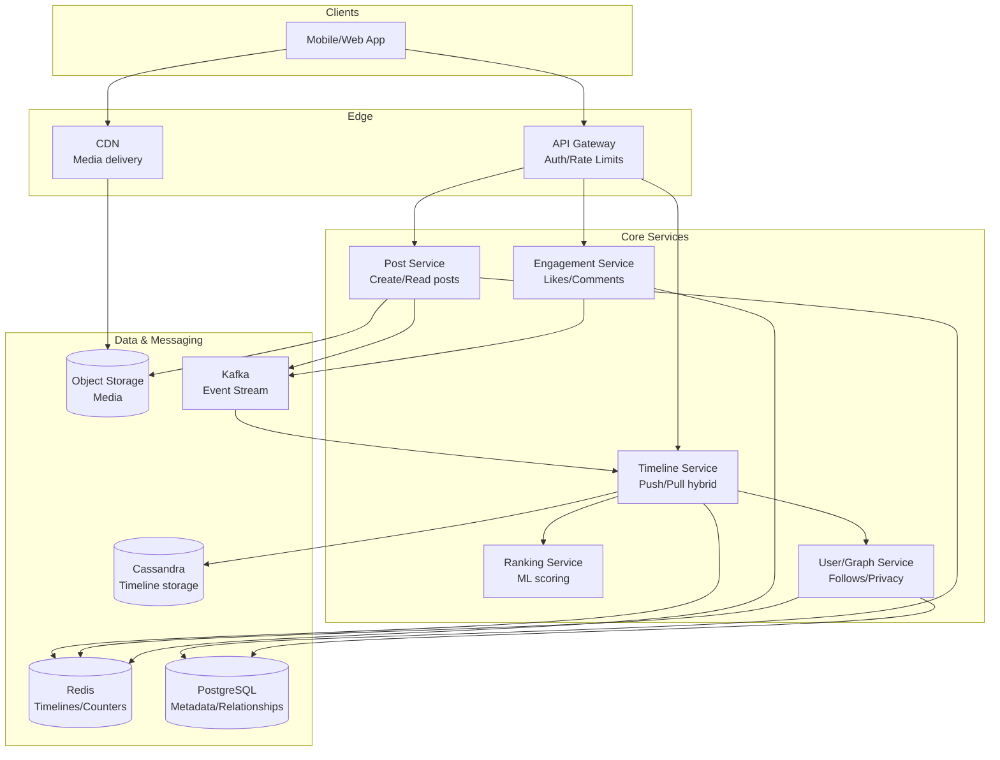

# 04-social-media-news-feed - Social Media News Feed
Generated: 2025-11-02 20:38:43 -05:00

---

<!-- Source: 01-requirements.md -->
# 1) Requirements & Scale

## Functional Requirements

- Post: Users create posts (text, image/video pointers), visibility (public/friends/followers)
- Feed: Personalized home feed (friends/followees + ranking); reverse-chron backup
- Actions: Like, comment, share/retweet, save; counters eventually consistent
- Privacy: Respect blocks, private accounts, circles/lists
- Notifications: New posts from close friends; mentions; engagement alerts
- Search/Explore: Optional—trending, topics, hashtag discovery

## Non-Functional Requirements

- Low latency: Feed fetch p95 < 200ms from cache; cold miss < 500ms
- High availability: 99.95%+
- Freshness: New post appears in followers' feeds within seconds
- Cost: Optimize storage (cold/archive) and cache hit ratios
- Observability: Per-tenant (region) feed SLOs; ranking latency budgets

## Scale & Back-of-the-Envelope

- Users: 200M MAU; 50M DAU
- Writes: 10–50K posts/sec peak; engagements 10× posts
- Reads: 1–5M feed reads/sec global
- Fanout: Median followers/user ~200; heavy-tailed (celebrities 1M+)

Rough storage:
- Post metadata (SQL/NoSQL): 10^11 posts over years; 200–500B each core
- Media in object storage (CDN fronted)
- Feed timelines: precomputed lists (Redis/Memcache + persistent store)

## Constraints & Assumptions

- Follower graph is sparse and skewed (power-law)
- Celebrity fanout handled differently ("live fanout"/pull-based)
- Counters (likes) are eventually consistent; exact counts on demand via read-through
- Ranking model can run online with cached features; heavy features offline

## Success Measures

- Feed p95 latency; freshness lag (publication→visible)
- Cache hit rate; backend read QPS reductions
- Engagement uplift (CTR, dwell time) with ranking on vs baseline
- Error rate and stale/incorrect visibility incidents

---

<!-- Source: 02-architecture.md -->
# 2) High-Level Architecture (Most Detailed)

## Components (What/Why)

- API Gateway: Auth, routing, rate limits
- User/Graph Service: Follows, blocks, privacy checks (graph store + cache)
- Post Service: Create/read posts, metadata, pointers to media in object storage
- Timeline Service:
  - Write path: Fanout (push) to home timelines for normal users
  - Read path: On-demand merge (pull) for heavy accounts/celebrities
- Ranking Service: Feature fetch + scoring; A/B config; TTL caches
- Engagement Service: Likes/comments/shares with idempotency and anti-abuse
- Cache Layer: Redis/Memcache for timelines, user features, counters
- Persistence:
  - OLTP (PostgreSQL/MySQL) for metadata and relationships
  - Wide-column/NoSQL (Cassandra/Scylla) for large append-only timelines
  - Object Storage (CDN) for media
- Event Bus (Kafka): Post published, engagement events, fanout tasks, counter updates
- Offline/Batch: Feature pipelines, model training, aggregation to data lake

## Data Flows

### A) Publish Post (Write Path)

1) Client → API → Post Service: validate auth/visibility; insert post metadata
2) Emit `post.published` event (Kafka) with author_id, visibility, ts
3) Timeline Service consumes event:
   - For normal authors: fetch follower ids (from cache/graph)
   - Enqueue fanout jobs to write post_id into each follower's home timeline (Redis list or NoSQL row)
   - For celebrities (threshold T followers): mark for pull-only; skip push fanout
4) Notifications for close-friends/mentions enqueued; media served via CDN

### B) Fetch Home Feed (Read Path)

1) Client → API → Timeline Service
2) If user is normal (push timelines enabled):
   - Read precomputed home list from Redis/NoSQL (cursor/pagination)
   - Optional: fetch top K and pass to Ranking Service for re-rank; fill from tail if items filtered
3) If user follows celebrities (pull path for those sources):
   - Merge: precomputed list + on-demand fetch from celebrity source timelines (last N)
4) Hydrate posts (Post Service) + apply visibility/privacy filters
5) Return with cursors; prefetch next page asynchronously

### C) Engagements

- Likes/comments produce events; counters updated with write-back cache (eventual consistency)
- Anti-abuse: rate limits, shadow bans, dedupe by idempotency keys

## Minimal Data Model (Indicative)

- users(id, priv_type[public|private], created_at, ...)
- follows(user_id, follows_id, created_at) — sharded by user_id
- posts(id, author_id, vis, text, media_refs, created_at) — time-partitioned
- home_timeline(user_id, ts_bucket, [post_id list]) — NoSQL/Redis
- user_timeline(author_id, ts_bucket, [post_id list]) — source of truth per author
- counters(entity_id, type[like|comment|share], value) — cached with periodic flush

Indexes: follows(user_id), posts(author_id, created_at desc), timelines by key prefix

## APIs (Examples)

- POST /v1/posts {text, media_refs?, vis}
- GET /v1/feed?cursor=...&limit=...
- GET /v1/users/:id/posts?cursor=...
- POST /v1/posts/:id/like (idempotent)

Auth: JWT; per-user rate limits; content safety checks on publish

## Why These Choices

- Push for the 99%: Fast reads for typical users → high cache hit; fanout cost manageable
- Pull for the 1%: Prevent write amplification for celebrities; merge at read time
- Redis + NoSQL: Hot timelines in Redis; durable store in NoSQL; read-through fills
- Kafka fanout: Reliable, parallelizable; backpressure-aware
- Ranking as a service: Feature cache + low-latency model inference; graceful degrade to recency-only

## Monitoring Cheat-Sheet

- Freshness: post publish → feed visible lag (p50/p95/p99)
- Feed latency: p50/p95/p99; cache hit rate
- Fanout: job backlog, throughput, failure/retry counts
- Ranking: p95 latency, cache hit, model fallbacks
- Counters: drift vs ground truth; flush lag

---

<!-- Source: 03-key-decisions.md -->
# 3) Key Decisions (Trade-offs)

## 1) Fanout: Write vs Read vs Hybrid
- Write fanout (push): Precompute home timelines → fast reads; costly for high-follower authors
- Read fanout (pull): Compute on demand → consistent cost per reader; higher read latency
- Choice: Hybrid (push for normal authors; pull for celebrities)

## 2) Storage for Timelines
- Redis lists for hot pages; NoSQL (Cassandra/Scylla) for durable, large, append-only sequences
- Why: High write throughput, wide rows by user_id + time buckets, predictable scans

## 3) Ranking vs Pure Recency
- Ranking improves engagement but adds latency and complexity
- Choice: Rank top K (e.g., 50) with cached features; degrade to recency on failures/timeouts

## 4) Counters Consistency
- Eventual: cache increments, batch flush; exact on demand with read-through
- When to use strong: financial/critical metrics only; feed counters can be eventual

## 5) Graph & Privacy Checks
- Cache follows/blocks (Bloom filters + key sets); enforce visibility both at write and read
- Safety: content moderation pipeline on publish; quarantine bad items

## 6) Multi-Region Strategy
- Pin user to home region for writes; replicate timelines asynchronously
- Cross-region reads allowed with increased latency; warm caches by region

## 7) Backfill & Rebuild
- Rebuild home timelines after ranking model changes: background jobs with throttling
- Keep last N days in Redis; older pages read-through from NoSQL

---

<!-- Source: 04-wrap-up.md -->
# 4) Scale, Failures & Wrap-Up

## Scaling Playbook
- Separate write path (publish) and read path (fetch) with Kafka in the middle
- Shard timelines by user_id; bound hot keys with per-bucket rows
- Use Redis for hot home pages; TTL + LFU; prefetch next page on read
- Celebrity handling: force pull path; CDN for media; rate-limit fanout tasks
- Ranking: feature cache; circuit-breakers and timeouts; fallback to recency

## Failure Scenarios
1) Fanout backlog spike
- Impact: Freshness degrades
- Mitigation: Prioritize active users first; drop tail for inactive; expand pull coverage

2) Redis outage
- Impact: Read latency up; hit durable store more
- Mitigation: Read-through to NoSQL; enable recency-only mode; tighten page size

3) Ranking service timeout
- Impact: Latency spikes
- Mitigation: Enforce 50–80ms budget; fallback to recency; log model fallback rate

4) Counter drift
- Impact: Incorrect like counts
- Mitigation: Periodic reconciliation job; switch to exact on demand

## SLOs & Metrics
- Freshness lag p95 < 3s; feed p95 < 200ms; cache hit > 90%
- Fanout success > 99.9%; backlog drains within 5 minutes at 2× peak
- Ranking p95 < 80ms; fallbacks < 5%

## Pitfalls and Gotchas
- Hot keys: Popular posts/users; shard by post_id or use consistent hashing
- Privacy leaks: Double-check visibility at both write and read
- Ranking bias: Feedback loops (popular gets more popular); inject diversity
- Abuse/spam: Rate limits; shadow bans; ML-based detection

## Interview Talking Points
- Hybrid fanout rationale; celebrity handling
- Timeline storage design; pagination and hotset management
- Ranking latency budgets and graceful degradation
- Counters consistency and reconciliation strategy

## Follow-up Q&A
- Q: How handle viral posts?
  - A: Pre-warm cache; throttle fanout; prioritize pull for author if followers spike
- Q: Real-time vs batch ranking?
  - A: Hybrid; online for top K with cached features; offline for model training
- Q: Multi-language feed?
  - A: Translate on demand (cache translations); or serve in author's language + auto-translate button
- Q: Content moderation at scale?
  - A: ML classifiers on publish; human review queue; user reports; takedown workflow

---

This feed design balances read latency and write cost via hybrid fanout, keeps hot timelines in Redis with durable NoSQL backing, and uses ranking with strict time budgets and fallbacks to maintain usability during incidents.

