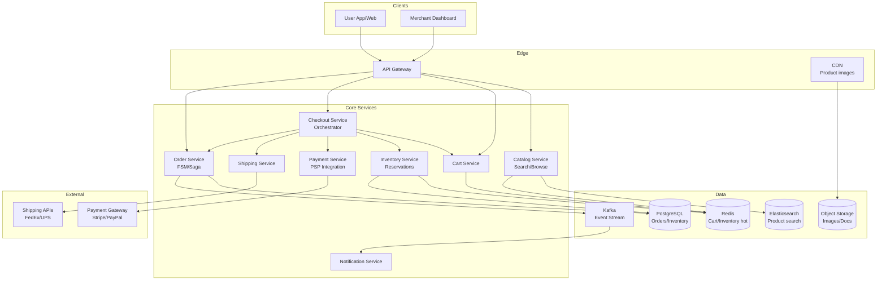

# 05-ecommerce-marketplace - Ecommerce Marketplace
Generated: 2025-11-02 20:38:43 -05:00

---

<!-- Source: 01-requirements.md -->
# 1) Requirements & Scale

## Functional Requirements

- Catalog: Browse products, filter/sort, view details, images, reviews
- Search: Full-text + faceted (brand, price range, rating)
- Cart: Add/remove/update items; save for later; view subtotal/taxes/shipping
- Checkout: Validate items, calculate shipping/taxes, apply discounts/coupons
- Inventory: Reserve stock on checkout start; release on timeout/cancel; decrement on payment capture
- Payments: Authorize at checkout; capture on shipment (or immediate for digital)
- Orders: State machine (created → confirmed → shipped → delivered → canceled/refunded)
- Idempotency: Retries must not double-charge or double-reserve

## Non-Functional Requirements

- Low latency: Checkout API p95 < 200ms (excluding external PSP round-trips)
- High availability: 99.95%+, degraded modes during PSP or tax provider incidents
- Consistency: Prevent oversell under contention; exactly-once-ish payments
- Observability: Per-merchant SLIs; payment auth success rate; reserve→capture conversion

## Scale & Back-of-the-Envelope

- Checkouts: 200–500K/min during peak (flash sale); ~3–8K RPS sustained
- Inventory SKUs: 10^5–10^7 per marketplace; hot SKUs during launches
- Payment providers: Multiple PSPs; average 300–800ms external latency

## Constraints & Assumptions

- Tokenized cards via PSP; no PAN storage
- Inventory reservations TTL ~10–15 min
- Mixed carts (multiple warehouses) split into shipments
- Strong write path for decrement/oversell prevention; reads can be cached

## Success Measures

- Authorization success rate; capture success rate
- Oversell rate (target ≈ 0)
- Checkout p95 latency; external dependency contribution
- Reserve→capture conversion (% of reservations that complete)

---

<!-- Source: 02-architecture.md -->
# 2) High-Level Architecture (Most Detailed)

## Components

- Catalog Service: Product metadata, images, pricing; ElasticSearch for search; Redis cache for hot products
- Cart Service: Session-based (Redis) or persistent (SQL); calculate totals client-side with server validation
- Inventory Service: Hot stock in Redis; ledger in SQL; reservation queue with TTL
- Checkout Service: Orchestrate validation, reserve, tax/shipping calc, payment auth
- Payment Service: PSP integration (Stripe/PayPal); tokenization; auth→capture flow; idempotency keys
- Order Service: Order FSM (state machine); saga pattern for rollback on failures
- Shipping Service: Rate calculation (FedEx/UPS APIs); label generation; tracking updates
- Notification Service: Email/SMS for order status; webhooks for merchants

## Data Flows

### A) Add to Cart → Checkout → Payment

1) User adds items → Cart Service (Redis); validate SKU exists and price current
2) Checkout initiation → Checkout Service validates cart; reserves inventory (write to reservation table with TTL)
3) Calculate shipping/taxes (external APIs or cached rates)
4) Apply discounts/coupons (validate rules; update subtotal)
5) Payment authorization (PSP); idempotency key prevents double-charge
6) On success: create order (state=confirmed); decrement inventory; capture payment async or on shipment
7) On failure: release reservation; return error with retry guidance

### B) Inventory Reserve & Release

- Reserve: INSERT reservation(sku_id, user_id, qty, expires_at); check stock >= reserved+qty
- TTL worker: Periodically scan expired reservations; release back to available stock
- Decrement: On payment capture, atomic decrement: UPDATE inventory SET stock = stock - qty WHERE sku_id = ? AND stock >= qty

## Data Model

- products(id, merchant_id, name, price, category, rating, stock_total, created_at)
- inventory(sku_id PK, warehouse_id, stock_available, stock_reserved)
- reservations(id PK, sku_id FK, user_id, qty, expires_at, status[active|released|fulfilled])
- orders(id PK, user_id, total, state[created|confirmed|shipped|delivered|canceled|refunded], created_at)
- order_items(order_id FK, sku_id, qty, price_snapshot)
- payments(order_id FK, psp_ref, amount, status[authorized|captured|failed|refunded], idempotency_key)

## APIs

- GET /v1/products?q=...&filters=...
- POST /v1/cart {sku_id, qty}
- POST /v1/checkout {cart_id, shipping_address, payment_method_token}
- GET /v1/orders/:id

Auth: JWT; rate-limit checkout per user; validate ownership

## Why These Choices

- Redis for cart/inventory hot path: sub-ms reads; TTL for session expiry
- Saga pattern: Compensating transactions (release, refund) on partial failure
- Idempotency keys: PSP retries safe; prevent duplicate charges
- Async capture: Hold auth at checkout; capture on shipment (reduces refund friction)

## Monitoring

- Checkout funnel: cart→checkout→payment success rates
- Inventory: oversell incidents; reservation timeout rate
- Payment: auth success, capture success, PSP latency p95
- Order FSM: stuck orders; state transition errors

---

<!-- Source: 03-key-decisions.md -->
# 3) Key Decisions (Trade-offs)

## 1) Inventory Model: Pessimistic vs Optimistic Locking
- Pessimistic: Reserve upfront; prevent oversell but locks stock for non-converting users
- Optimistic: Oversell risk; notify user "out of stock" at payment
- Choice: Pessimistic with short TTL (10–15 min); balance conversion vs availability

## 2) Payment: Auth vs Capture Timing
- Auth+Capture immediate: Simpler; funds held longer; higher refund rate
- Auth at checkout, capture on shipment: Better UX; reduces refunds for cancellations
- Choice: Auth+hold; capture on shipment (standard for physical goods)

## 3) Saga vs 2PC for Distributed Transactions
- 2PC: Strong consistency; blocking; coordinator SPOF
- Saga: Eventual consistency; compensating transactions; more complex
- Choice: Saga (reserve→auth→order→capture with rollback steps)

## 4) Search: SQL vs Elasticsearch
- SQL: Structured queries; slow full-text; limited faceting
- Elasticsearch: Fast full-text; rich facets; eventual consistency
- Choice: Elasticsearch for search; SQL for transactional catalog updates

## 5) Flash Sale Handling
- Queue users; throttle checkout; pre-warm inventory cache
- Lottery/waitlist for high-demand SKUs
- Choice: Rate-limit + queue; fallback to "notify when available"

## 6) Multi-Region Strategy
- Inventory per region; cross-region fallback on stockouts
- Orders pinned to user's region; replicate async
- Choice: Regional isolation; global catalog with regional stock

## 7) Tax Calculation
- Real-time (Avalara/TaxJar API): Accurate but adds latency
- Pre-cached by zip: Fast but stale; periodic refresh
- Choice: Hybrid; cache common zips; real-time for edge cases

---

<!-- Source: 04-wrap-up.md -->
# 4) Scale, Failures & Wrap-Up

## Scaling Playbook
- Shard inventory by SKU_id; shard orders by user_id or region
- Redis for hot inventory reads; SQL for durable ledger
- Horizontal checkout workers; queue for backpressure
- Multi-PSP strategy (primary + fallback); circuit breakers

## Failure Scenarios
1) PSP Timeout
- Impact: Checkouts fail; cart abandonment
- Mitigation: Fallback PSP; retry with exponential backoff; manual reconciliation queue

2) Inventory Reservation Leak
- Impact: Stock locked but no order; under-utilization
- Mitigation: TTL cleanup worker; monitoring for high reservation-to-order gap

3) Flash Sale Overload
- Impact: Checkout latency spikes; timeouts
- Mitigation: Pre-warm caches; rate-limit; queue system; failover to "notify me"

4) Double-Charge on Retry
- Impact: Customer charged twice
- Mitigation: Idempotency keys; PSP deduplication; refund automation

## SLOs & Metrics
- Checkout p95 < 200ms; payment auth success > 98%; oversell rate < 0.01%
- Reservation→capture conversion > 70%; TTL expiry < 20%
- Order FSM errors < 0.1%

## Pitfalls
- Race conditions on inventory decrement; use atomic SQL (WHERE stock >= qty)
- Stale pricing in cart; validate at checkout
- Tax/shipping calc failures block checkout; fallback to estimates
- Refund complexity; saga rollback must be idempotent

## Interview Talking Points
- Inventory reservation flow; TTL and cleanup
- Saga pattern for distributed transactions
- Idempotency in payments
- Flash sale throttling strategies

## Follow-up Q&A
- Q: How prevent bots buying all stock?
  - A: CAPTCHA; rate limits; device fingerprinting; waitlist/lottery
- Q: Multi-currency support?
  - A: Store prices in base currency; convert at checkout with cached FX rates
- Q: Fraud detection?
  - A: ML models (velocity checks, device signals); manual review for high-risk
- Q: Refund automation?
  - A: Reverse payment capture; release inventory; update order state; notify user

---

This e-commerce design prioritizes consistency (no oversell) and idempotency (no double-charge) via pessimistic inventory locking, saga-based orchestration, and PSP integration with fallback strategies.

