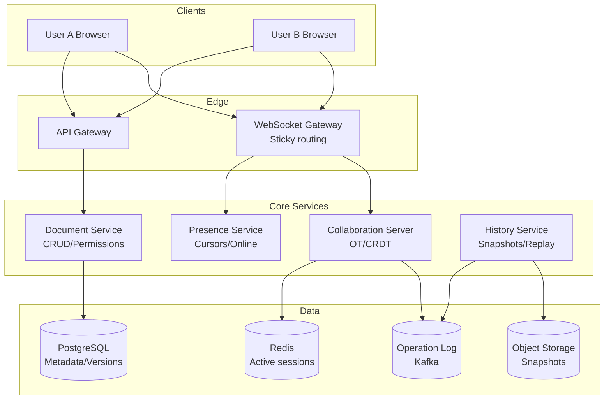

# 06-collaborative-document-editor - Collaborative Document Editor
Generated: 2025-11-02 20:38:43 -05:00

---

<!-- Source: 01-requirements.md -->
# 1) Requirements & Scale

## Functional Requirements

- Real-time editing: Multiple users edit same document simultaneously; see changes <1s
- Conflict resolution: Concurrent edits merge automatically (no manual conflicts)
- Cursor presence: Show other users' cursors, selections, names
- Version history: Time-travel to any past version; restore; compare diffs
- Comments/suggestions: Inline comments; threaded replies; suggest mode (track changes)
- Permissions: Owner/editor/viewer/commenter roles; share links with expiry
- Offline mode: Edit offline; sync on reconnect; handle conflicts

## Non-Functional Requirements

- Low latency: Edit propagation p95 < 500ms; cursor updates < 100ms
- High availability: 99.9%+
- Consistency: Eventual consistency with convergence guarantees (CRDT/OT)
- Observability: Edit lag, sync errors, conflict resolution success rate

## Scale & Back-of-the-Envelope

- Users: 50M MAU; 5M DAU
- Documents: 100M+ active docs; 1B+ total
- Concurrent editing: 1M concurrent sessions; avg 2–5 users/doc
- Operations: 10K ops/sec (insert, delete, format); burst to 100K during peak

## Constraints & Assumptions

- Document size limit ~10MB text; larger docs split or paginated
- WebSocket for real-time; fallback to polling
- Conflicts rare with OT/CRDT; no user-facing "conflict" errors
- Rich text (bold, links, lists); not full layout engine

## Success Measures

- Edit-to-visible latency p50/p95/p99
- Conflict resolution success rate (no divergence)
- Concurrent editing sessions; user retention
- Sync error rate; data loss incidents (target: 0)

---

<!-- Source: 02-architecture.md -->
# 2) High-Level Architecture (Most Detailed)

## Components

- WebSocket Gateway: Persistent connections; sticky routing per document session
- Document Service: CRUD for doc metadata; permissions; version snapshots
- Collaboration Server: OT/CRDT transformation; broadcast ops to connected clients; maintain operation history
- Storage: PostgreSQL for metadata/versions; object storage for snapshots; Redis for active session state
- Presence Service: Track cursors, selections, online users per doc
- History Service: Snapshot periodic checkpoints; store operation log; replay for time-travel

## Data Flows

### A) User Opens Document

1) Client → API: GET /docs/:id → metadata, permissions, latest snapshot version
2) Client establishes WebSocket → Collab Server (sticky to doc shard)
3) Server sends: full doc state (or snapshot + ops since snapshot)
4) Client renders; joins presence pool; broadcasts cursor position

### B) User Edits (Insert Text)

1) Client applies local operation immediately (optimistic UI)
2) Generate operation: {type: 'insert', pos: 42, text: 'hello', userId, timestamp, vector_clock}
3) Send op via WebSocket → Collab Server
4) Server applies OT transform (adjust pos if concurrent ops exist); broadcasts to other connected clients
5) Clients receive op; apply with OT; UI updates; no conflict visible to user
6) Server appends op to operation log (durable store)

### C) Concurrent Edits (OT/CRDT in Action)

- User A inserts "X" at pos 10
- User B inserts "Y" at pos 10 (same time)
- Server receives A's op first → broadcasts to B
- B's client transforms B's op using OT: adjust pos if needed (e.g., now pos 11)
- Server receives B's op → transforms against A's → broadcasts
- Final state converges: both clients show same result ("XY" or "YX" deterministically)

### D) Offline Edit & Sync

1) User goes offline; continues editing locally
2) Operations queued in IndexedDB
3) On reconnect: send queued ops with causal ordering (vector clocks)
4) Server replays ops with OT; resolves conflicts; sends catchup ops to client
5) Client applies catchup; UI converges

## Data Model

- documents(id PK, owner_id, title, snapshot_version, created_at, updated_at)
- doc_permissions(doc_id FK, user_id, role[owner|editor|viewer|commenter])
- operations(id PK, doc_id FK, op_type, position, content, user_id, timestamp, vector_clock) — append-only log
- snapshots(doc_id FK, version, content_blob, created_at) — periodic checkpoints
- presence(doc_id, user_id, cursor_pos, selection_range, last_seen) — TTL in Redis

## APIs

- GET /v1/docs/:id {metadata, snapshot_url, permissions}
- WS /v1/collab/:doc_id (ops stream)
- POST /v1/docs/:id/snapshots (manual checkpoint)
- GET /v1/docs/:id/history?version=... (time-travel)

Auth: JWT; validate permissions before WS connect

## Why These Choices

- OT (Operational Transformation): Mature; deterministic convergence; used by Google Docs
- CRDT (Conflict-free Replicated Data Types): Alternative; simpler conflict-free math; larger metadata overhead
- Choice: OT for text (lower overhead); CRDT for rich structures (JSON) if needed
- WebSocket: Bi-directional; low-latency; sticky sessions per doc for ordering
- Operation log: Append-only; enables time-travel; replay for audit
- Snapshots: Reduce replay cost; checkpoint every N ops or time interval

## Monitoring

- Op propagation latency p50/p95/p99
- Transform failures (OT divergence); retry/fallback
- WebSocket connection churn; reconnect rate
- Snapshot lag; storage growth

---

<!-- Source: 03-key-decisions.md -->
# 3) Key Decisions (Trade-offs)

## 1) OT vs CRDT
- OT: Transform concurrent ops; deterministic ordering; lower overhead; complex to implement correctly
- CRDT: Math guarantees convergence; no central transform; higher metadata (tombstones, version vectors)
- Choice: OT for text editing (Google Docs model); CRDT for decentralized/offline-first (e.g., rich JSON docs)

## 2) Central Server vs P2P
- Central server: Simpler ordering; single source of truth; scales with sharding
- P2P: No server; full decentralization; complex NAT traversal
- Choice: Central server for simplicity and reliability; sticky WebSocket per doc

## 3) Operation Granularity
- Character-level: Every keystroke an op; high op count; fine-grained undo
- Block-level: Group edits (e.g., word, sentence); fewer ops; coarser undo
- Choice: Character-level for real-time feel; batch on network layer for efficiency

## 4) Snapshot Strategy
- Frequency: Every N ops (e.g., 1000) or time interval (e.g., 5 min)
- Storage: Full doc vs incremental delta
- Choice: Full snapshots every 1K ops or 5 min; trade storage for fast load

## 5) Offline Sync
- Queue all ops; replay on reconnect with vector clocks for causal ordering
- Risk: Long offline → large queue; potential divergence
- Mitigation: Cap offline edit duration; force full resync if too stale

## 6) Presence Updates
- Broadcast every cursor move: High bandwidth
- Throttle: Send updates every 100–200ms; interpolate client-side
- Choice: Throttled presence with client-side smoothing

## 7) Permissions Enforcement
- Client-side check (fast) + server-side validate (authoritative)
- Risk: Client bypass; must validate all ops server-side
- Choice: Dual-check; reject unauthorized ops at server

## 8) Version History Storage
- Full snapshots per version: Easy but storage-heavy
- Op log replay: Compact but slow for old versions
- Choice: Hybrid; snapshots at intervals; ops between snapshots

---

<!-- Source: 04-wrap-up.md -->
# 4) Scale, Failures & Wrap-Up

## Scaling Playbook
- Shard docs by doc_id; sticky WS routing to same shard for ordering
- Collab servers: Horizontal scale per doc shard; Redis for session state
- Op log: Time-series DB (InfluxDB) or append-only table; partition by doc_id + timestamp
- Snapshots: Object storage (S3); CDN for popular docs
- Presence: Redis with TTL; pub/sub for cursor broadcasts

## Failure Scenarios
1) Collab server crash
- Impact: Active sessions disconnect; ops in-flight lost
- Mitigation: Clients auto-reconnect; request catchup ops from last ack'd version; server replays from log

2) OT transform bug (divergence)
- Impact: Clients see different doc states
- Mitigation: Versioned OT library; extensive testing; fallback to full resync if hash mismatch detected

3) Network partition (client isolated)
- Impact: User edits offline; long queue
- Mitigation: Cap offline duration; force full reload if >1K pending ops; warn user

4) Snapshot lag
- Impact: Slow doc load (must replay many ops)
- Mitigation: Auto-snapshot on inactivity; background workers generate snapshots for hot docs

## SLOs & Metrics
- Op latency p95 < 500ms; p99 < 1s
- Presence update < 200ms p95
- Divergence incidents: 0 per month (critical)
- Doc load time p95 < 2s (including snapshot + ops)

## Pitfalls and Gotchas
- OT correctness: TP1/TP2 properties; test exhaustively with fuzzing
- Cursor position after transform: Adjust correctly or jumps occur
- Large docs (>10MB): Paginate or split; full-doc sync becomes slow
- Undo/redo with OT: Must invert ops correctly; complex with concurrent edits

## Interview Talking Points
- OT vs CRDT comparison; when to use each
- How OT transforms concurrent insert at same position
- Snapshot + op log hybrid for version history
- Sticky WebSocket routing for operation ordering

## Follow-up Q&A
- Q: How handle paste of large text?
  - A: Chunk into smaller ops; batch send; show progress bar; server validates size limits
- Q: Undo in collaborative context?
  - A: Per-user undo stack; invert ops; broadcast as new op; others see reversal
- Q: Rich media (images, embeds)?
  - A: Store refs in doc (URLs); upload to object storage; inline rendering; ops reference by ID
- Q: Comment threads?
  - A: Separate data model; anchor to doc position range; adjust range on edits via OT

---

This collaborative editor design uses OT for conflict-free real-time editing, sticky WebSocket sessions for operation ordering, periodic snapshots for fast load, and an append-only operation log for version history and time-travel.

