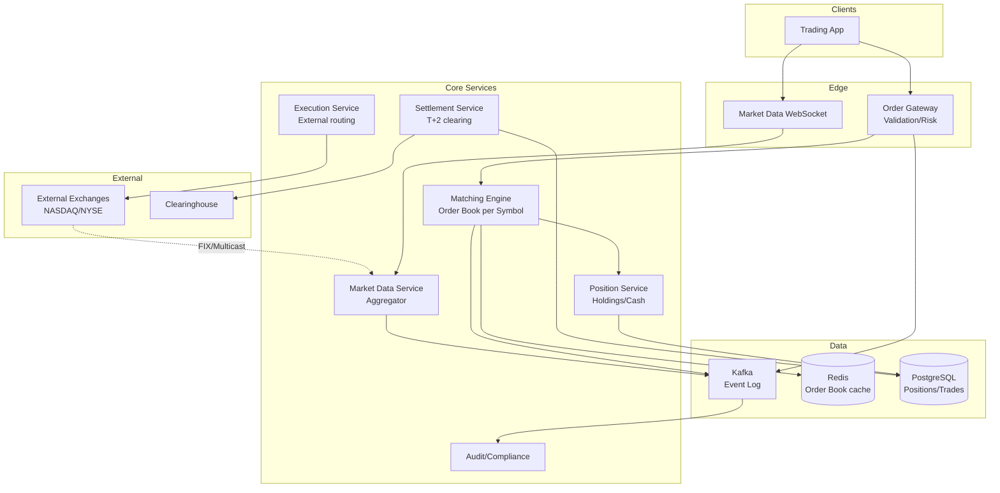

# 08-stock-trading-platform - Stock Trading Platform
Generated: 2025-11-02 20:38:44 -05:00

---

<!-- Source: 01-requirements.md -->
# 1) Requirements & Scale

## Functional Requirements

- Order placement: Market, limit, stop orders; buy/sell stocks
- Order matching: Match buy/sell orders; FIFO price-time priority
- Market data: Real-time quotes (bid/ask); trade feed; order book depth
- Portfolio: View positions, balances, P&L; transaction history
- Risk checks: Buying power validation; day-trade limits; reject invalid orders
- Settlement: T+2 clearing; broker-dealer integration
- Compliance: Audit trail; trade reporting; regulatory (SEC, FINRA)

## Non-Functional Requirements

- Ultra-low latency: Order ack < 10ms; matching < 1ms; market data < 10ms
- High availability: 99.99%+ during market hours
- Consistency: Strong consistency for orders/positions; no double-execution
- Fairness: FIFO order matching; no front-running
- Observability: Trade latency, fill rates, system health per symbol

## Scale & Back-of-the-Envelope

- Users: 10M accounts; 1M concurrent during market open
- Orders: 100K orders/sec peak (market open); 1M+ per day
- Market data: 10K symbols; 1M quotes/sec; multicast feed
- Positions: 10M users × 10 positions avg = 100M position records

## Constraints & Assumptions

- Market hours: 9:30 AM – 4 PM ET weekdays
- Order book per symbol in-memory; durability via event log
- Latency critical (microseconds matter for HFT); most retail users tolerate <100ms
- Regulatory requirements: Audit logs, trade reporting, best execution

## Success Measures

- Order-to-ack latency p50/p95/p99
- Fill rate (% of orders executed)
- Market data lag (exchange → platform → user)
- Zero accounting errors (positions/balances)

---

<!-- Source: 02-architecture.md -->
# 2) High-Level Architecture (Most Detailed)

## Components

- Order Gateway: Validate orders; risk checks; route to matching engine
- Matching Engine: In-memory order book per symbol; FIFO price-time matching; event-sourced
- Market Data Service: Aggregate quotes; publish via WebSocket/multicast; rate-limit per user tier
- Position Service: Track holdings, cash balance; update on fills; strong consistency
- Execution Service: Route orders to external exchanges (NASDAQ, NYSE) or internal matching
- Settlement Service: T+2 clearing; reconcile with clearinghouse; cash movements
- Audit/Compliance: Immutable event log; trade reporting; regulatory exports

## Data Flows

### A) User Places Order

1) User → Order Gateway: POST /orders {symbol: AAPL, type: limit, side: buy, qty: 100, price: 150}
2) Gateway validates: symbol exists, qty > 0, price reasonable
3) Risk check: buying_power >= qty × price; day-trade limit not exceeded
4) Generate order ID; persist to event log (Kafka)
5) Route to Matching Engine (shard by symbol)
6) Matching Engine:
   - Insert into order book (price-time priority)
   - Attempt immediate match with opposite side
   - If match: generate fill event; update order status
   - If partial/no match: order rests in book
7) Ack to user: order accepted, status=open/partial/filled
8) Broadcast fill to Position Service; update holdings + cash

### B) Market Data Distribution

1) Exchange → Market Data Adapters: FIX/multicast feed (quotes, trades)
2) Adapter parses; publishes to internal Kafka topic per symbol
3) Market Data Service consumes; maintains latest bid/ask/last trade per symbol
4) Users subscribe via WebSocket; receive real-time updates (throttled by tier: retail 1Hz, pro 10Hz)

### C) Order Matching (Detail)

Order book structure:
- Buy orders: Max heap (highest price first); FIFO within same price
- Sell orders: Min heap (lowest price first); FIFO within same price

Matching algorithm:
1) New buy limit order at $150
2) Check sell book: any sell <= $150?
3) If yes: Match with best (lowest) sell; generate fill event
4) Update both orders: reduce qty or mark filled
5) If buy qty remains: insert remainder into buy book
6) If no match: insert into buy book
7) Publish fill events; update positions

### D) End-of-Day Settlement

1) Market close: Flush all unfilled orders (or keep for next day per order type)
2) Settlement Service: Aggregate fills; calculate net cash/position changes
3) Submit to clearinghouse (DTCC); T+2 settlement cycle
4) Reconcile: Match platform records with clearinghouse confirmations
5) Report discrepancies; manual review queue

## Data Model

- users(id, cash_balance, buying_power, created_at)
- orders(id PK, user_id FK, symbol, type, side, qty, price, status[open|partial|filled|canceled], created_at, filled_at)
- fills(id PK, order_id FK, qty_filled, fill_price, timestamp, counterparty_order_id)
- positions(user_id, symbol, qty, avg_cost_basis)
- order_book(symbol, side[buy|sell], price, qty, order_id, timestamp) — in-memory; replicated to event log

## APIs

- POST /v1/orders {symbol, type, side, qty, price?}
- GET /v1/orders/:id
- DELETE /v1/orders/:id (cancel)
- WS /v1/market-data/:symbol (subscribe to quotes/trades)
- GET /v1/positions

Auth: JWT; two-factor for trades; rate-limit per user

## Why These Choices

- In-memory order book: Sub-ms matching; durability via event sourcing (Kafka)
- Event sourcing: Replay for audit; disaster recovery; guaranteed consistency
- Shard by symbol: Parallel matching; single-threaded per symbol for deterministic FIFO
- WebSocket for market data: Low-latency push; backpressure-aware
- Strong consistency for positions: No phantom shares; ACID transactions

## Monitoring

- Matching latency p50/p95/p99 per symbol
- Order ack latency; fill rate
- Market data lag (exchange timestamp → user receive)
- Position reconciliation errors (daily check)
- Risk check rejections; fraud alerts

---

<!-- Source: 03-key-decisions.md -->
# 3) Key Design Decisions & Trade-Offs

## 1. In-Memory Order Book vs. Persistent DB

**Decision**: In-memory order book per symbol; durability via event sourcing (Kafka).

**Rationale**:
- Matching latency must be <1ms; disk I/O adds 5-10ms
- Order book is small (top 1000 price levels × 100 orders each = ~100K orders per symbol)
- Event log (Kafka) provides durability; can rebuild book on crash

**Trade-off**: Slower recovery on matching engine restart (replay events); mitigated by periodic snapshots.

**When to reconsider**: If symbols have millions of open orders (rare); consider hybrid (top-of-book in memory, rest in DB).

---

## 2. FIFO vs. Pro-Rata Matching

**Decision**: FIFO (price-time priority).

**Rationale**:
- Fair to retail investors; order time matters
- Simpler logic; deterministic; regulatory standard for equities

**Trade-off**: High-frequency traders can "cut in line" with faster links; some futures markets use pro-rata (allocate by order size).

**When to reconsider**: If targeting options/futures (pro-rata common); or if regulations change.

---

## 3. Synchronous vs. Async Position Updates

**Decision**: Synchronous update (strong consistency).

**Rationale**:
- Position must reflect fills immediately; prevent overselling shares
- Risk checks on next order require accurate real-time balance

**Trade-off**: Adds ~2-5ms latency to fill path; could bottleneck at 100K orders/sec.

**When to reconsider**: If latency budget is tighter; use optimistic locking with retry; or pre-allocate "position slots" for pending orders.

---

## 4. Multicast vs. Unicast Market Data

**Decision**: Hybrid—unicast WebSocket for retail; multicast UDP for pros/HFTs.

**Rationale**:
- Retail needs backpressure (slow clients); WebSocket handles gracefully
- Pros require lowest latency (~microseconds); UDP multicast avoids per-client overhead

**Trade-off**: Multicast has no delivery guarantee; clients must handle gaps (sequence numbers).

**When to reconsider**: If user base is 100% retail; skip multicast complexity.

---

## 5. Strong vs. Eventual Consistency for Positions

**Decision**: Strong consistency (ACID transactions).

**Rationale**:
- Financial correctness > latency; no phantom shares or negative cash
- Regulations require audit trail; cannot have "eventually correct" balances

**Trade-off**: Limits horizontal scaling of position service; single DB shard per user.

**When to reconsider**: Never for regulatory compliance; could relax for non-trading features (e.g., portfolio charts can lag by seconds).

---

## 6. Single-Threaded vs. Multi-Threaded Matching

**Decision**: Single-threaded matching per symbol.

**Rationale**:
- FIFO requires deterministic order processing; multi-threading complicates locking
- One symbol's orders are independent of others; parallelize across symbols

**Trade-off**: If one symbol gets 50% of traffic (e.g., AAPL during earnings), that engine becomes bottleneck.

**When to reconsider**: Vertical scaling limit (~500K orders/sec per thread); at that point, partition symbol into sub-symbols (AAPL-A, AAPL-B) and merge at end of day (complex; avoid unless truly needed).

---

## 7. Co-Location vs. Cloud Hosting

**Decision**: Cloud (AWS) for retail platform; co-located for HFT connectors.

**Rationale**:
- Cloud: elastic scaling; 99.99% SLA; lower ops cost
- Co-location: Sub-ms latency to exchanges (NYSE, NASDAQ data centers); required for competitive market-making

**Trade-off**: Co-location is expensive ($10K+/month per rack); only justifiable for pro/HFT tier.

**When to reconsider**: If targeting only retail; stay pure cloud. If adding institutional clients, invest in co-lo.

---

## 8. Pre-Trade vs. Post-Trade Risk Checks

**Decision**: Pre-trade (synchronous).

**Rationale**:
- Regulatory requirement (RegT); cannot allow margin violations
- Prevents bad orders from reaching matching engine (reduces load)

**Trade-off**: Adds 1-2ms to order path; false positives can anger users (e.g., stale buying_power cache).

**When to reconsider**: If latency budget is extremely tight; could do async post-trade checks for certain order types (e.g., small market orders), but risky for compliance.

---

<!-- Source: 04-wrap-up.md -->
# 4) Wrap-Up: Scaling, Failures, Interview Tips

## Scaling Playbook

**0 → 1M users (~10K orders/sec)**
- Single matching engine per symbol
- PostgreSQL for positions (master-replica)
- Redis for market data cache (1 sec TTL)
- 3-5 app servers (Order Gateway, Position Service)

**1M → 5M users (~50K orders/sec)**
- Shard positions DB by user_id range (4 shards)
- Add read replicas for historical queries (order history, trade reports)
- Horizontally scale matching engines (one per popular symbol; others share)
- Move audit log to distributed Kafka (6 partitions)

**5M → 10M users (~100K orders/sec)**
- Use message brokers (Kafka) between Gateway → Matching Engine
- Pre-provision matching engines for top 1000 symbols (dedicated instances)
- Add market data multicast for pro tier (UDP)
- Co-locate exchange connectors in NYSE/NASDAQ data centers (sub-ms latency)
- Cache user risk limits (buying_power) in Redis; sync with DB every 100ms

**Beyond 10M (HFT scale)**
- Custom kernel-bypass networking (DPDK)
- FPGA-based matching engines (sub-microsecond)
- Direct market access (FIX protocol to exchanges)
- Global: Route US users → US region, EU users → London region (regulatory requirement: GDPR, MiFID II)

---

## Failure Scenarios

| Failure | Impact | Detection | Mitigation |
|---|---|---|---|
| Matching Engine Crash | Orders not processed; book lost | Health check timeout (1s) | Hot standby; replay Kafka event log to rebuild book (5-10s recovery) |
| Exchange Disconnect | No market data; cannot route orders | FIX heartbeat timeout (30s) | Failover to backup feed; halt trading if all feeds down (circuit breaker) |
| Position DB Outage | Orders rejected (cannot verify balance) | DB connection pool exhausted | Read from replica (stale by 1s); reject writes; queue orders for retry |
| Risk Check Service Down | Orders bypass risk checks (dangerous) | Health endpoint fails | Fail-closed: Reject all orders until service recovers; alert oncall immediately |
| Kafka Lag | Order acks delayed; fills not reflected in positions | Consumer lag metric > 1000 msgs | Scale Kafka partitions; add consumers; backpressure at Gateway (rate-limit) |
| User DDoS (spam orders) | Legitimate orders starved | Single user > 1000 orders/sec | Per-user rate limit (100 orders/sec); temp ban on violation |
| Accounting Error (position mismatch) | User has wrong share count | Daily reconciliation job (compare DB vs. clearinghouse) | Manual review queue; compensate user if our fault; investigate bug |

---

## SLOs (Service Level Objectives)

- **Order Ack Latency**: p99 < 10ms (Gateway → user response)
- **Matching Latency**: p95 < 1ms (order arrives at engine → fill event)
- **Market Data Lag**: p99 < 10ms (exchange timestamp → WebSocket push)
- **Availability**: 99.99% during market hours (9:30 AM - 4 PM ET, Mon-Fri); downtime budget = 52 sec/year
- **Fill Rate**: >99% for market orders (filled within 1 sec)
- **Data Accuracy**: Zero accounting errors per month (positions match clearinghouse)

---

## Common Pitfalls

1. **Ignoring time synchronization**: Matching engines must use NTP; clock drift causes wrong FIFO order; symptom: users report "later order filled first"
2. **No idempotency on fills**: Network retry can double-fill; use unique fill_id; check "already processed" before updating positions
3. **Unbounded order book**: DoS via spam limit orders far from market; limit: max 1000 orders per user per symbol; or price collar (orders >10% from last trade rejected)
4. **Stale risk checks**: User deposits $1000; cache not updated; order rejected incorrectly; solution: invalidate cache on balance change, or TTL <100ms
5. **No circuit breakers**: Market crashes; users panic-sell; system overloaded; solution: Halt trading if >10% move in 5 min; manual resume after review

---

## Interview Talking Points

- **Latency budget breakdown**: Where does each millisecond go? (network 2ms, gateway validation 1ms, matching 0.5ms, position update 2ms, ack back 2ms = ~8ms total)
- **Why event sourcing?**: Audit trail for SEC; replay for debugging; rebuild state after crash
- **FIFO fairness**: How to prevent "queue jumping"? Colocate matching engine with exchange; all users route through same gateway (no shortcuts)
- **HFT arms race**: Is sub-ms matching enough? No—pros want microseconds; requires custom hardware (FPGAs, kernel bypass); expensive trade-off vs. cloud simplicity
- **Regulatory compliance**: What logs are required? Every order (timestamp, user, symbol, price, qty, status); every fill (counterparty, price, qty, timestamp); retained 7 years (SEC Rule 17a-4)
- **Disaster recovery**: How fast can you recover? Matching engines: 5-10 sec (replay events); Positions DB: <1 min (failover to replica); Market data: <30 sec (reconnect to exchange feeds)

---

## Follow-Up Questions to Explore

- How would you add options trading? (Multi-leg orders; Greeks calculation; expiration handling)
- How to prevent insider trading detection? (Pattern analysis; flag suspicious activity before trade; real-time alerts)
- How to support after-hours trading? (Extended hours 4 AM - 9:30 AM, 4 PM - 8 PM; lower liquidity; wider spreads)
- How to handle stock splits? (Adjust all open orders; update positions; notify users)
- How would you add margin trading (borrow to buy)? (Margin requirements; collateral checks; forced liquidation on margin call)
- How to scale internationally? (Regulatory differences: T+2 in US, T+3 in India; currency conversion; cross-border settlement)

