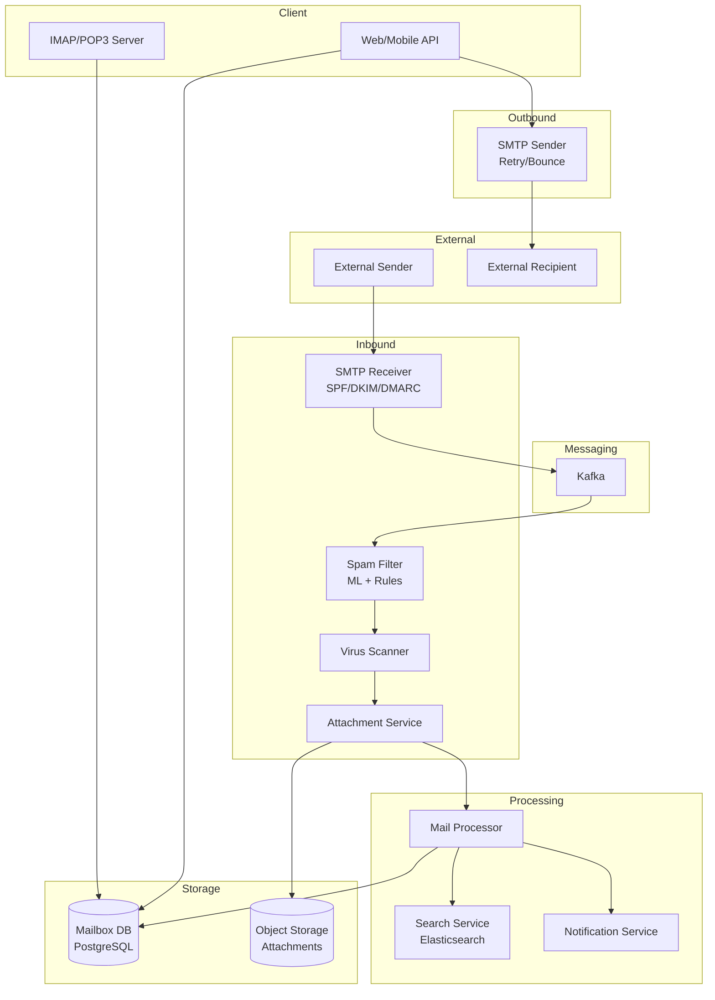

# 09-email-service-provider - Email Service Provider
Generated: 2025-11-02 20:38:44 -05:00

---

<!-- Source: 01-requirements.md -->
# 1) Functional & Non-Functional Requirements

## Functional Requirements

### Core Email Operations
- Send email: Compose, attach files (up to 25MB), send to multiple recipients
- Receive email: SMTP ingestion; spam filtering; virus scanning; deliver to inbox
- Read email: Fetch mailbox; threading/conversation view; mark read/unread
- Search: Full-text search over subject, body, attachments; filters (from, date range, has:attachment)
- Organize: Folders, labels, archive, delete, undo delete (trash retention 30 days)
- Attachments: Upload/download; preview (images, PDFs); virus scan on receive

### Advanced Features
- Spam detection: ML-based + rule-based (SPF/DKIM/DMARC); user feedback (mark as spam)
- Deliverability: Sender reputation; bounce handling (hard/soft); unsubscribe links for bulk mail
- Threading: Group replies into conversations; sort by latest message
- Contacts: Auto-complete; import from CSV; sync with address book
- Push notifications: Mobile/desktop alerts for new mail (IMAP IDLE or WebSocket)

### Compliance & Security
- Encryption: TLS for SMTP; at-rest encryption (AES-256)
- Audit: Retention for legal (eDiscovery); export user data (GDPR)
- 2FA: Require for login; app-specific passwords for IMAP/SMTP clients

## Non-Functional Requirements

- **Availability**: 99.9% uptime (43 min downtime/month); graceful degradation (read-only mode if write DB is down)
- **Latency**: Send email <500ms (p95); search <1s for 10K emails; inbox load <200ms
- **Throughput**: 10B emails/day (~115K emails/sec average, 300K/sec peak); 100K SMTP connections/sec
- **Deliverability**: >99% for legitimate emails; <0.1% false positives (real mail marked spam)
- **Storage**: 15GB free per user; 1PB total (500M users × 2GB avg); compressed + deduplicated attachments
- **Spam Accuracy**: <1% false negatives (spam in inbox); <0.1% false positives (real mail in spam)
- **Search**: Index all emails; full-text search in <1s; support 10-year history per user

## Scale Estimate

- **Users**: 500M active; 50M DAU (daily active)
- **Emails**: 10B/day sent/received (~5B inbound SMTP, 5B outbound)
- **Storage**: 500M users × 2GB avg = 1PB (compressed); attachments 50% of total
- **Search Index**: 10B emails × 10KB avg metadata = 100TB index (Elasticsearch)
- **SMTP Connections**: Peak 100K/sec (morning rush hour); avg 50K/sec
- **Attachments**: 5B emails/day × 30% have attachments × 2MB avg = 3PB/day raw (dedupe to ~500TB/day)

## Constraints

- SMTP protocol (RFC 5321): Must support standard clients (Outlook, Thunderbird, mobile)
- IMAP/POP3 for retrieval: Legacy protocol support
- SPF/DKIM/DMARC: Required for sender authentication; prevent spoofing
- CAN-SPAM Act: Unsubscribe link for bulk mail; honor opt-outs
- GDPR: Right to export/delete user data; data residency (EU users in EU data centers)

## Success Measures

- **Deliverability rate**: % of sent emails that reach inbox (target >99%)
- **Spam accuracy**: Precision (spam in spam folder) >99%; Recall (spam not in inbox) >99%
- **Search relevance**: Click-through rate on top search result >80%
- **Uptime**: 99.9% availability (measured by synthetic monitors sending test emails)
- **Latency**: p95 send latency <500ms; p95 search latency <1s

---

<!-- Source: 02-architecture.md -->
# 2) High-Level Architecture (Most Detailed)

## Components

- SMTP Receiver: Accept inbound emails; validate SPF/DKIM; enqueue for processing
- Spam Filter: ML model (LSTM on email text) + rule-based (blacklists, regex); score 0-100
- Virus Scanner: ClamAV or cloud API (VirusTotal); quarantine if malware detected
- Attachment Service: Extract attachments; deduplicate (SHA-256 hash); store in S3; compress images
- Mail Processor: Route to user mailbox; apply filters (inbox, spam, archive); trigger notifications
- Mailbox Service: CRUD operations on user mailboxes; IMAP/POP3 server; fetch emails
- Search Service: Elasticsearch cluster; index subject, body, sender, date; full-text queries
- SMTP Sender: Outbound email delivery; retry logic; bounce handling; reputation tracking
- Notification Service: Push to mobile/desktop; IMAP IDLE or WebSocket for real-time alerts
- Web/Mobile API: RESTful API for compose, read, search, organize

## Data Flows

### A) User Receives Email (Inbound)

1) External sender → SMTP Receiver (port 25): `MAIL FROM`, `RCPT TO`, `DATA`
2) SMTP Receiver:
   - Validate recipient exists
   - Check SPF record (sender IP authorized?)
   - Verify DKIM signature (email not tampered?)
   - Check DMARC policy (alignment of From header)
3) Enqueue to Kafka topic: `incoming_mail` (message = raw email + metadata)
4) Mail Processor consumer:
   - Parse MIME (multipart/alternative, attachments)
   - Extract attachments → Attachment Service (store in S3, generate download URL)
   - Run spam filter: ML model scores email; if score > 80 → spam folder
   - Run virus scan on attachments; if malware → quarantine, notify user
   - Apply user filters (e.g., "from:boss@example.com → label:important")
5) Insert email into user's mailbox DB (PostgreSQL, sharded by user_id)
6) Index email in Elasticsearch (async; eventual consistency OK for search)
7) If user online: Push notification via WebSocket or IMAP IDLE
8) SMTP ack to sender: `250 OK`

### B) User Sends Email (Outbound)

1) User → Web API: POST /v1/emails {to, subject, body, attachments[]}
2) Web API:
   - Validate attachments <25MB total
   - Upload attachments to S3 (deduplicate by hash)
   - Compose MIME message (multipart/mixed)
3) Insert into `outbox` table (user_id, email_id, status=pending)
4) Enqueue to Kafka: `outgoing_mail`
5) SMTP Sender consumer:
   - Resolve recipient MX records (DNS lookup)
   - Connect to recipient's SMTP server
   - Send email: `MAIL FROM`, `RCPT TO`, `DATA`
   - Handle response:
     - `250 OK`: Mark sent; update status=delivered
     - `4xx` (temp fail): Retry (exponential backoff; max 3 days)
     - `5xx` (hard bounce): Mark failed; notify user
6) Store sent email in user's "Sent" folder
7) Track sender reputation (bounces, spam reports); throttle if reputation drops

### C) User Searches Email

1) User → Web API: GET /v1/search?q=receipt+from:amazon&folder=inbox
2) API → Search Service (Elasticsearch):
   - Query: `{ "bool": { "must": [ {"match": {"body": "receipt"}}, {"term": {"from": "amazon"}}, {"term": {"folder": "inbox"}} ] } }`
   - Filter by user_id (security: only search own emails)
3) Elasticsearch returns matching email IDs + snippets (highlights)
4) API fetches email metadata from Mailbox Service (cache in Redis; TTL 5 min)
5) Return results to user (paginated; 20/page)

### D) Spam Detection (Detail)

Two-stage filter:
1) **Rule-based** (fast; 10ms):
   - Blacklist: Known spammer IPs (updated hourly from threat feeds)
   - Regex: `viagra|cheap mortgage|click here` in subject/body
   - Rate-limit: Sender sends >100 emails in 1 min → likely spam
2) **ML-based** (slower; 200ms):
   - LSTM model trained on 1B labeled emails (spam/ham)
   - Features: TF-IDF of subject+body, sender domain age, attachment types, DKIM pass/fail
   - Output: Probability 0-1 (convert to 0-100 score)

Final decision:
- Score 0-50: Inbox
- Score 51-80: Suspicious (show warning banner)
- Score 81-100: Spam folder

User feedback loop: If user marks email as spam/not spam → retrain model weekly.

## Data Model

- **users**(id, email, quota_used, quota_limit, created_at)
- **emails**(id PK, user_id FK, folder[inbox|sent|spam|trash|archive], subject, from, to, body_text, body_html, received_at, read, thread_id)
- **attachments**(id PK, email_id FK, filename, size, content_type, s3_key, sha256_hash, virus_scan_status)
- **threads**(id PK, user_id FK, subject_normalized, participant_emails[], updated_at)
- **filters**(id PK, user_id FK, condition{from, subject, has_attachment}, action{label, folder, delete})
- **sender_reputation**(domain, ip, bounce_rate, spam_report_rate, score, updated_at)

Sharding:
- Mailbox DB: Shard by user_id (hash-based; 64 shards)
- Elasticsearch: Shard by user_id (one index per shard; 128 shards)
- Attachments: S3 (partitioned by date: /2025/01/15/{hash}.pdf)

## APIs

- POST /v1/emails {to, subject, body, attachments} — Send email
- GET /v1/emails?folder=inbox&page=1 — List emails
- GET /v1/emails/:id — Fetch email detail
- PUT /v1/emails/:id {read: true, folder: archive} — Update email
- DELETE /v1/emails/:id — Move to trash (soft delete; 30-day retention)
- GET /v1/search?q=query&folder=inbox&page=1 — Search
- POST /v1/filters {condition, action} — Create filter

Auth: OAuth 2.0; scope: `email.read`, `email.send`; rate-limit: 1000 API calls/hour per user.

## Why These Choices

- Kafka for mail queue: Decouple SMTP ingestion from processing; replay on failures; scale consumers independently
- PostgreSQL sharded: Strong consistency for mailbox (ACID); predictable query patterns (fetch by user_id)
- Elasticsearch: Full-text search with relevance scoring; tolerates eventual consistency (OK if search lags by 1 min)
- S3 for attachments: Cheap storage ($0.02/GB); deduplication saves 30% (many users receive same PDF)
- Two-stage spam filter: Fast rule-based catches 80%; ML catches remaining 20%; total latency <250ms

## Monitoring

- SMTP receive rate (emails/sec); reject rate (invalid recipients)
- Spam filter accuracy: Precision/recall (daily report)
- Virus scan hits; quarantine rate
- Search latency p95/p99; Elasticsearch cluster health
- Outbound delivery rate; bounce rate per domain
- Storage quota per user; total storage growth rate

---

<!-- Source: 03-key-decisions.md -->
# 3) Key Design Decisions & Trade-Offs

## 1. Push vs. Pull for Email Delivery

**Decision**: Hybrid—push via WebSocket for active users; pull (IMAP IDLE) for legacy clients.

**Rationale**:
- Push: Lower latency (instant notification); reduces polling load
- IMAP IDLE: Standard protocol; works with Outlook, Thunderbird

**Trade-off**: Push requires persistent connections (100K connections = ~5GB RAM); expensive at scale.

**When to reconsider**: If >1M concurrent users online; use mobile push notifications (APNs/FCM) instead of WebSocket; cheaper.

---

## 2. Synchronous vs. Async Spam Filtering

**Decision**: Synchronous (inline during SMTP ingestion).

**Rationale**:
- Reject spam before storing; saves storage costs
- Sender gets immediate 5xx error (discourages spammers)

**Trade-off**: Adds 200-250ms to SMTP ack latency; could time out slow clients.

**When to reconsider**: If spam filter latency > 500ms; move to async (accept all mail; filter post-ingestion); trade storage for latency.

---

## 3. Single-Tenant vs. Multi-Tenant Mailbox DB

**Decision**: Multi-tenant (shard by user_id).

**Rationale**:
- Cheaper ops: 64 shards vs. 500M single-tenant DBs
- Easier backups, schema migrations

**Trade-off**: Noisy neighbor (one user's heavy queries slow others on same shard); harder to isolate security breach.

**When to reconsider**: If targeting enterprises; offer single-tenant DB for compliance (HIPAA, finance).

---

## 4. Full-Text Search: Elasticsearch vs. PostgreSQL

**Decision**: Elasticsearch.

**Rationale**:
- Better relevance scoring (BM25, phrase matching)
- Scales horizontally (add nodes); PostgreSQL full-text is single-node bound
- Supports fuzzy search, synonyms (e.g., "receipt" matches "invoice")

**Trade-off**: Eventual consistency (emails indexed after 10-60s); extra ops complexity (cluster tuning).

**When to reconsider**: If budget-constrained; PostgreSQL GIN index + tsvector is "good enough" for <1M emails/user.

---

## 5. Attachment Deduplication: Hash vs. Content-Based

**Decision**: SHA-256 hash deduplication.

**Rationale**:
- Same attachment sent to 1000 users → store once; saves 30% storage
- Fast: Hash computed during upload; O(1) lookup

**Trade-off**: False positives if hash collision (extremely rare); privacy concern (can infer if two users received same file by comparing hashes).

**When to reconsider**: If strict privacy required (e.g., healthcare); disable deduplication; encrypt attachments per-user.

---

## 6. Virus Scanning: On-Upload vs. On-Download

**Decision**: On-upload (synchronous).

**Rationale**:
- Prevent storing malware; protects all users
- Sender notified immediately (email rejected if virus found)

**Trade-off**: Adds 100-200ms to send path; could time out for large attachments (25MB scan takes 2-3s).

**When to reconsider**: If latency critical; scan async (store encrypted; scan in background; quarantine if malware detected later).

---

## 7. SMTP Retry: Exponential Backoff vs. Fixed Interval

**Decision**: Exponential backoff (1 min, 5 min, 30 min, 2 hr, 6 hr, 24 hr; max 3 days).

**Rationale**:
- Reduces load on recipient server (avoids thundering herd)
- RFC 5321 compliant

**Trade-off**: Slow delivery for transient failures; user may complain "email not sent yet."

**When to reconsider**: If SLA requires <1 min delivery; reduce backoff; risk being blacklisted by recipient.

---

## 8. Threading: Message-ID vs. Subject Matching

**Decision**: Message-ID (In-Reply-To, References headers).

**Rationale**:
- Deterministic; RFC 5322 standard
- Handles subject changes (e.g., "Re: Meeting" → "Re: Meeting - Updated Agenda")

**Trade-off**: If sender client doesn't set In-Reply-To (broken clients), threading fails; fallback to subject+participants matching (fuzzy).

**When to reconsider**: Never—Message-ID is correct approach; but need fallback heuristics for legacy clients.

---

<!-- Source: 04-wrap-up.md -->
# 4) Wrap-Up: Scaling, Failures, Interview Tips

## Scaling Playbook

**0 → 10M users (~100K emails/day)**
- Single SMTP server; single PostgreSQL instance
- Local spam filter (SpamAssassin); ClamAV for virus scan
- Store attachments on local disk
- Simple full-text search (PostgreSQL GIN index)

**10M → 100M users (~1B emails/day)**
- Shard mailbox DB by user_id (4 shards)
- Add Kafka for mail queue (3 brokers; 6 partitions)
- Deploy Elasticsearch (3 nodes; 1B docs indexed)
- Move attachments to S3; enable deduplication
- Horizontal scale SMTP receivers (10 instances; load-balanced)

**100M → 500M users (~10B emails/day)**
- 64 mailbox shards (PostgreSQL); read replicas for analytics
- Kafka: 12 brokers; 48 partitions
- Elasticsearch: 50 nodes; 10TB index; 10B docs
- Spam filter: GPU-accelerated ML inference (100 instances)
- Multi-region: US-East, US-West, EU (data residency for GDPR)
- CDN for attachments (CloudFront); cache popular files (e.g., company logos)

**Beyond 500M (Gmail scale)**
- Custom storage engine (Bigtable-like; columnar; compression)
- Distribute spam model inference to edge (TensorFlow Lite on SMTP receivers)
- Proactive caching: Pre-fetch inbox for likely-to-login users (ML prediction)
- Global Anycast SMTP (route to nearest data center)
- Quantum-safe encryption (post-quantum cryptography for future-proofing)

---

## Failure Scenarios

| Failure | Impact | Detection | Mitigation |
|---|---|---|---|
| SMTP Receiver Crash | Incoming mail rejected | Health check fails | Load balancer routes to healthy instances; MX failover to backup (DNS TTL 5 min) |
| Spam Filter Overloaded | Emails delayed; queue backs up | Kafka consumer lag > 10K msgs | Scale consumers (add 10 instances); temporarily skip ML model (rule-based only) |
| Elasticsearch Down | Search broken; inbox still works | Cluster status red | Read-only mode; show cached results; rebuild index from DB (takes 2 days for 10B emails) |
| Mailbox Shard Outage | 1/64 of users cannot read/send | DB connection timeout | Failover to read replica (promote to master); users see read-only mode for 5 min |
| Attachment S3 Outage | Cannot download attachments | S3 API errors | Serve from cache (CloudFront); if cache miss, show "Temporarily unavailable" |
| Virus Scanner API Down | Emails with attachments stuck | Scanner timeout (10s) | Bypass scanner (risky); quarantine for manual review; or reject with 4xx (temp fail) |
| Sender Reputation Drop | Emails bouncing; blacklisted | Bounce rate > 10% | Throttle outbound; investigate spam complaints; request de-listing from blacklists |

---

## SLOs (Service Level Objectives)

- **Uptime**: 99.9% availability (43 min downtime/month); measured by synthetic test emails every 1 min
- **Send Latency**: p95 < 500ms (user clicks Send → SMTP ack)
- **Inbox Load**: p95 < 200ms (fetch 50 latest emails)
- **Search Latency**: p95 < 1s (full-text search over 10K emails)
- **Deliverability**: >99% of sent emails reach inbox (not spam, not bounced)
- **Spam Accuracy**: <1% false negatives (spam in inbox); <0.1% false positives (real mail in spam)

---

## Common Pitfalls

1. **Ignoring SPF/DKIM/DMARC**: Outbound emails marked spam by recipients; symptom: low deliverability (50%); solution: Configure DNS records correctly; monitor alignment
2. **No rate-limiting on SMTP**: Attackers flood server; symptom: SMTP receiver CPU 100%; solution: Per-IP rate limit (100 emails/min); per-user rate limit (1000 emails/day)
3. **Storing raw MIME in DB**: Wastes space (2x overhead); symptom: Storage explodes; solution: Store parsed body_text + body_html separately; compress; dedupe attachments
4. **Synchronous virus scan on send**: Adds 3s latency for large attachments; symptom: User timeout; solution: Async scan; return "Email queued" immediately; notify if virus found
5. **No backpressure in mail queue**: Kafka lag grows indefinitely during spike; symptom: Emails delayed 1+ hour; solution: Reject new emails with 4xx (temp fail) when lag > 100K msgs

---

## Interview Talking Points

- **SMTP protocol basics**: How does `MAIL FROM`, `RCPT TO`, `DATA` work? What's the difference between `250 OK` (success) and `4xx` (temp fail, retry)?
- **Spam detection evolution**: Start with blacklists → Add regex rules → Train ML model on user feedback → Use embeddings (BERT) for semantic spam (e.g., "You won a prize" phrased differently)
- **Why Kafka for mail queue?**: Durability (replicated); replay (reprocess if spam model updated); decoupling (SMTP ingestion independent of processing)
- **Search relevance**: How to rank search results? BM25 (term frequency); recency (newer emails higher); user interaction (clicked results boost future ranking)
- **Attachment deduplication trade-offs**: Privacy (can infer if two users received same file); storage savings (30%); virus scan efficiency (scan once, protect all users)
- **Global scaling**: Data residency (GDPR: EU users in EU data centers); MX routing (GeoDNS: route to nearest SMTP receiver); attachment CDN (CloudFront: serve from edge)

---

## Follow-Up Questions to Explore

- How would you add end-to-end encryption (E2EE)? (PGP or S/MIME; key exchange challenges; cannot search encrypted body)
- How to prevent account takeover? (2FA mandatory; CAPTCHA on login; rate-limit password attempts; alert on login from new device)
- How to handle large attachments (>25MB)? (Upload to cloud storage; send link instead of inline attachment; expire link after 30 days)
- How would you support calendar invites (iCal)? (Parse .ics attachment; extract event details; sync with calendar service; RSVP buttons in email)
- How to scale spam model training? (Distributed training on GPU cluster; sample 1B emails; weekly retraining; A/B test new model before rollout)
- How to migrate users from legacy system? (IMAP sync: fetch all emails from old server; preserve folder structure, read status; dedup by Message-ID; cutover DNS MX records)

