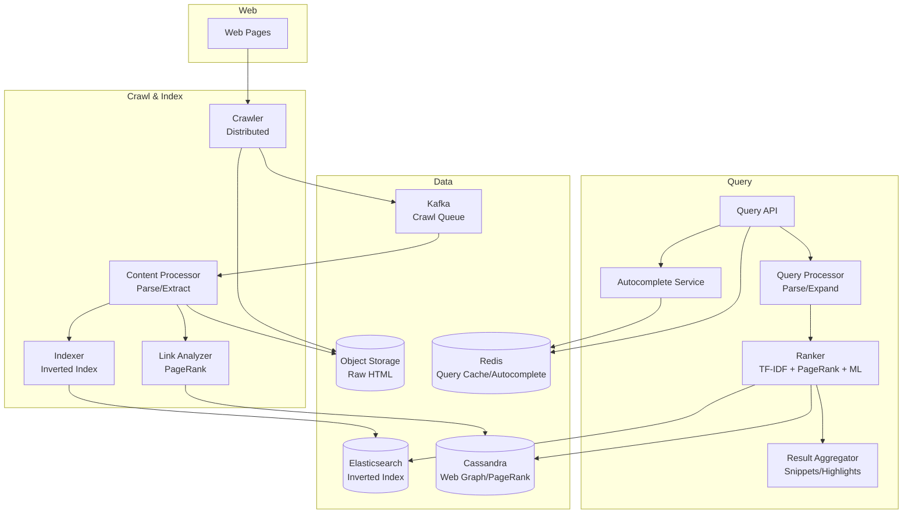

# 10-search-engine - Search Engine
Generated: 2025-11-02 20:38:44 -05:00

---

<!-- Source: 01-requirements.md -->
# 1) Functional & Non-Functional Requirements

## Functional Requirements

### Core Search
- Web crawling: Discover pages via seed URLs; follow links; respect robots.txt; politeness delay (1 req/sec per domain)
- Indexing: Parse HTML; extract text, title, meta tags, links; build inverted index (term → doc IDs)
- Query processing: Parse query; tokenize; spell-check; autocomplete; expand (synonyms)
- Ranking: TF-IDF, PageRank, freshness, domain authority; machine-learned ranking (LambdaMART)
- Results: Top 10 results per page; snippet (highlight query terms); title, URL, cached link

### Advanced Features
- Autocomplete: Suggest queries as user types (based on popularity, personalization)
- Spell correction: "pythom" → "Did you mean: python?"
- Image/video search: Separate index; metadata (alt text, caption); visual similarity (embeddings)
- Safe search: Filter adult content; toggle on/off
- Personalization: Boost results based on user history (location, past clicks)
- Freshness: Prioritize recent pages for news queries; recrawl frequently

### Admin/Operations
- Index sharding: Partition by term or document; horizontal scale
- Cache: Popular queries cached (Redis); TTL 5 min
- Monitoring: Query latency, index size, crawl rate, relevance metrics (CTR, dwell time)

## Non-Functional Requirements

- **Latency**: p95 < 500ms (user types query → results displayed); p50 < 200ms
- **Throughput**: 100K queries/sec peak; 50K avg
- **Index Size**: 10B web pages × 1KB avg = 10TB compressed (100TB uncompressed)
- **Crawl Rate**: 1B pages/day (~11K pages/sec); refresh popular pages daily, others weekly
- **Availability**: 99.9% uptime (43 min downtime/month)
- **Relevance**: Top-10 CTR >80% (users click at least one result); top-1 CTR >40%
- **Freshness**: News articles indexed within 1 min; regular pages within 1 day

## Scale Estimate

- **Indexed Pages**: 10B pages (subset of 50B+ total web pages)
- **Index Storage**: 10B pages × 1KB avg metadata + 10KB inverted index entry = 110TB (compressed to ~10TB)
- **Queries**: 100K/sec peak × 86400 sec/day = 8.6B queries/day
- **Crawl**: 1B pages/day; avg page size 100KB = 100PB/day raw (dedupe + compress to 10TB/day stored)
- **Cache**: 1M unique queries/day (Zipf distribution; top 10K account for 50% of traffic); 1M × 10KB = 10GB cache

## Constraints

- **Robots.txt**: Must respect (crawl delay, disallow paths); penalty: legal action, IP ban
- **Politeness**: Max 1 req/sec per domain; avoid DDoS accusations
- **Copyright**: Cannot store full page text (fair use); only snippets + link
- **GDPR**: Right to be forgotten (remove URLs from index upon request)
- **Spam**: Detect SEO spam (keyword stuffing, cloaking, link farms); penalize in ranking

## Success Measures

- **Relevance**: Top-10 CTR >80%; dwell time >30 sec (user reads result page)
- **Latency**: p95 query latency <500ms
- **Index Coverage**: >90% of popular sites indexed (Alexa top 1M)
- **Freshness**: News indexed <1 min; regular pages <24 hr
- **Spam Detection**: <1% spam in top 10 results

---

<!-- Source: 02-architecture.md -->
# 2) High-Level Architecture (Most Detailed)

## Components

- Crawler: Fetch web pages; follow links; distributed queue (Kafka); respect robots.txt, politeness
- Content Processor: Parse HTML; extract text, links, meta tags; detect language, duplicates
- Indexer: Build inverted index (term → doc IDs); TF-IDF scores; store in distributed index (Elasticsearch or custom)
- Link Analyzer: Calculate PageRank; build web graph; detect link spam
- Query Processor: Parse query; spell-check; expand synonyms; tokenize
- Ranker: Retrieve candidate docs; score (TF-IDF + PageRank + ML model); return top 10
- Result Aggregator: Fetch snippets; highlight query terms; add cached links
- Autocomplete Service: Trie-based; personalized suggestions; updated from query logs
- Cache Layer: Redis; cache popular query results (top 10K queries = 50% traffic); TTL 5 min

## Data Flows

### A) Web Crawling

1) Seed URLs: Start with curated list (Alexa top 1M, news sites, Wikipedia)
2) Crawler:
   - Dequeue URL from frontier (priority queue in Kafka; partition by domain)
   - Fetch robots.txt: Check `Disallow`, `Crawl-delay`
   - HTTP GET: Fetch page (timeout 10s; follow redirects; max 5 hops)
   - Store raw HTML in S3 (compressed); key = URL hash
   - Extract links: Parse `<a href>`, canonicalize URLs (remove #fragment, sort query params)
   - Enqueue new links to frontier (dedupe via Bloom filter; avoid crawling same URL twice)
3) Politeness: Rate-limit 1 req/sec per domain (distributed rate limiter via Redis)
4) Crawl schedule: High-priority (news sites) → hourly; medium (blogs) → daily; low (archives) → weekly

### B) Indexing

1) Content Processor (reads from S3):
   - Parse HTML (BeautifulSoup); extract title, meta description, body text
   - Detect language (langdetect); skip non-English if configured
   - Remove boilerplate (ads, nav bars) via template detection
   - Deduplicate: Compute SimHash; if 95% similar to existing doc → skip
2) Tokenize text: Split into words; lowercase; remove stop words (the, is, a)
3) Stemming: "running" → "run" (Porter stemmer)
4) Build inverted index:
   - For each term: Store doc IDs where term appears + positions (for phrase queries)
   - Example: `{"python": [doc1:pos[10,50], doc2:pos[5]], "tutorial": [doc1:pos[51], doc3:pos[3]]}`
5) Compute TF-IDF: Term frequency × inverse document frequency
6) Store index in Elasticsearch (sharded by term hash; 100 shards)
7) Link Analyzer: Extract outgoing links; build web graph (doc → outgoing URLs)

### C) PageRank Calculation (Batch Job, Daily)

1) Load web graph from link index (10B nodes, 100B edges)
2) Initialize PageRank: PR(page) = 1 / N (uniform distribution)
3) Iterate 10 times:
   - For each page: PR_new(page) = 0.15 + 0.85 × Σ(PR(inbound_page) / outbound_count(inbound_page))
4) Store PageRank scores in distributed key-value store (Cassandra; doc_id → score)
5) Use in ranking: Boost pages with high PageRank (popular sites rank higher)

### D) Query Processing & Ranking

1) User → Query API: GET /search?q=machine+learning+tutorial
2) Query Processor:
   - Parse: Tokenize "machine learning tutorial" → [machine, learning, tutorial]
   - Spell-check: "machne" → "machine" (edit distance; dictionary lookup)
   - Synonym expansion: "car" → [car, automobile, vehicle] (from synonym DB)
   - Stopword removal: Remove "the", "is" (optional; can hurt phrase queries)
3) Check cache (Redis): Key = query hash; if hit → return cached results (50% hit rate)
4) If cache miss → Ranker:
   - Retrieve candidate docs: Query inverted index (Elasticsearch): Docs containing any query term
   - Score each doc:
     - TF-IDF: How relevant is doc to query terms?
     - PageRank: How authoritative is the page?
     - Freshness: Boost recent pages (news queries)
     - User signals: Click-through rate (CTR), dwell time from past queries
   - ML ranking model (LambdaMART): Train on 1M labeled queries (query, doc, relevance[0-4])
   - Combine signals: Final_score = 0.3×TF-IDF + 0.2×PageRank + 0.3×ML_score + 0.2×Freshness
5) Sort by score; return top 10 doc IDs
6) Result Aggregator:
   - Fetch doc metadata (title, URL, snippet) from doc store (Cassandra)
   - Generate snippet: Extract 200 chars around query terms; highlight in bold
   - Add cached link: `cache:example.com/page` (stored in S3)
7) Return results to user (JSON)
8) Cache results in Redis (TTL 5 min)

### E) Autocomplete

1) User types "mach" → Client sends: GET /autocomplete?q=mach
2) Autocomplete Service:
   - Query trie: Find all completions starting with "mach" (machine, machinery, machinima)
   - Rank by popularity (query frequency from logs) + personalization (user's past queries)
   - Return top 10 suggestions
3) Trie updated daily from query logs (aggregate counts; insert into trie)

## Data Model

- **crawl_frontier**(url PK, priority[high|medium|low], last_crawled_at, next_crawl_at, domain)
- **documents**(doc_id PK, url, title, meta_description, body_text_snippet, crawled_at, language, simhash, pagerank_score)
- **inverted_index**(term PK, postings[{doc_id, positions[], tf_idf}]) — sharded by term
- **web_graph**(doc_id PK, outgoing_links[], inbound_count)
- **query_logs**(query, timestamp, user_id, clicked_result_doc_ids[], dwell_time_sec)
- **autocomplete_trie**(prefix PK, suggestions[{query, score}])

Sharding:
- Inverted index: Shard by term hash (100 shards); each shard handles 1% of vocabulary
- Documents: Shard by doc_id (hash-based; 100 shards)
- PageRank: Stored in Cassandra (wide-row: doc_id → score); replicated 3x

## APIs

- GET /search?q=query&page=1 — Search results
- GET /autocomplete?q=prefix — Autocomplete suggestions
- GET /cached?url=example.com — Cached page
- POST /admin/crawl {url} — Trigger manual crawl (for webmasters)

Auth: API key for programmatic access; rate-limit 1000 queries/hour per IP.

## Why These Choices

- Kafka for crawl frontier: Distributed queue; partition by domain (ensures politeness); replay on failures
- Elasticsearch for inverted index: Built-in TF-IDF, phrase queries, sharding; mature ecosystem
- Cassandra for PageRank: Wide-row model (doc_id → score); fast lookups; horizontally scalable
- Redis cache: Hot queries (top 10K) → 50% of traffic; reduces backend load by 2x
- Bloom filter for dedupe: Probabilistic (1% false positive OK); saves 99% of duplicate crawls

## Monitoring

- Crawl rate (pages/sec); frontier queue depth
- Index lag (time from crawl → indexed); target <1 min for news
- Query latency p50/p95/p99
- Cache hit rate (target >50%)
- Relevance metrics: CTR (top-10), dwell time, bounce rate
- Spam detection: % of spam in top 10 (daily audit)

---

<!-- Source: 03-key-decisions.md -->
# 3) Key Design Decisions & Trade-Offs

## 1. Breadth-First vs. Depth-First Crawling

**Decision**: Breadth-first (BFS).

**Rationale**:
- Discover important pages early (linked from home pages)
- Avoids getting stuck in deep directory structures (e.g., /archive/2005/...)

**Trade-off**: Higher memory usage (frontier queue stores all level-N URLs before moving to N+1).

**When to reconsider**: If targeting deep web (academic papers, archived content); use priority queue (rank by estimated importance, not just breadth).

---

## 2. Term-Based vs. Document-Based Index Sharding

**Decision**: Term-based (shard by term hash).

**Rationale**:
- Query "python tutorial" → Only 2 shards queried (python shard + tutorial shard)
- Lower latency (parallel queries to 2 shards vs. fanning out to 100 doc shards)

**Trade-off**: Load imbalance (popular terms like "the" hit one shard heavily); mitigated by removing stop words, replicating hot shards.

**When to reconsider**: If queries are mostly multi-term (5+ words); doc-based sharding reduces per-query fan-out.

---

## 3. Synchronous vs. Async Indexing

**Decision**: Async (eventual consistency).

**Rationale**:
- Crawling and indexing decoupled; can replay indexing if algo changes
- Latency OK: 1-min delay for news, 1-day for regular pages

**Trade-off**: Search results lag behind real-time web (breaking news takes 1 min to appear).

**When to reconsider**: If real-time search required (e.g., Twitter search); use streaming indexing (Kafka → Flink → Elasticsearch).

---

## 4. ML Ranking vs. Hand-Tuned Scoring

**Decision**: Hybrid—ML model (LambdaMART) + hand-tuned signals (TF-IDF, PageRank).

**Rationale**:
- ML learns complex patterns (user behavior, seasonal trends)
- Hand-tuned signals are interpretable (explain why result ranked high)

**Trade-off**: ML model adds 50ms inference latency; training requires 1M+ labeled queries.

**When to reconsider**: If launching MVP; start with TF-IDF + PageRank only; add ML after collecting query logs.

---

## 5. Per-Query vs. Pre-Aggregated Autocomplete

**Decision**: Pre-aggregated (trie built from query logs daily).

**Rationale**:
- Low latency (trie lookup <1ms); no real-time computation
- Popular queries dominate (Zipf distribution); trie size <1GB

**Trade-off**: Autocomplete lags by 1 day (new trending queries not suggested immediately).

**When to reconsider**: If real-time trends critical (e.g., news events); rebuild trie every 5 min from recent logs.

---

## 6. Exact Deduplication vs. Near-Duplicate (SimHash)

**Decision**: Near-duplicate (SimHash with 95% threshold).

**Rationale**:
- Catches plagiarism, mirrors (same content, different URLs)
- Reduces index size by 30% (many pages are copies)

**Trade-off**: False positives (5% different content treated as duplicates); users may miss slightly different versions.

**When to reconsider**: If false positives are a problem (e.g., legal documents where every word matters); use exact deduplication (SHA-256 hash).

---

## 7. Centralized vs. Distributed PageRank

**Decision**: Distributed (MapReduce batch job, daily).

**Rationale**:
- Web graph too large for single machine (10B nodes, 100B edges)
- PageRank iterative (10 rounds); parallelize across 1000 workers

**Trade-off**: Slow update (daily batch); new pages have no PageRank for 24 hrs.

**When to reconsider**: If incremental PageRank needed (e.g., real-time news ranking); use approximate algorithms (local PageRank, vertex-centric updates).

---

## 8. Cache All Queries vs. Only Popular Queries

**Decision**: Only popular queries (top 10K = 50% traffic).

**Rationale**:
- Long-tail queries (millions of unique queries) have low hit rate (<1%)
- Caching 10K queries requires 100MB RAM; caching all queries = 10GB (expensive at scale)

**Trade-off**: Cache miss for 50% of queries (tail); they pay full latency cost.

**When to reconsider**: If latency SLA is strict; cache aggressively (top 1M queries); or pre-compute results (offline batch).

---

<!-- Source: 04-wrap-up.md -->
# 4) Wrap-Up: Scaling, Failures, Interview Tips

## Scaling Playbook

**0 → 10M pages (~1K queries/sec)**
- Single crawler instance; SQLite frontier
- Single Elasticsearch node (1TB index)
- PostgreSQL for doc metadata
- No PageRank (simple TF-IDF ranking)
- In-memory autocomplete (10K queries)

**10M → 1B pages (~10K queries/sec)**
- Distributed crawlers (10 instances); Kafka frontier (6 partitions)
- Elasticsearch cluster (10 nodes; 10TB index; 3 replicas)
- Cassandra for doc metadata (3 nodes)
- PageRank: Weekly batch job (Spark on 100 workers)
- Redis cache (10GB; top 100K queries)

**1B → 10B pages (~100K queries/sec)**
- 100 crawler instances; Kafka (20 brokers, 100 partitions)
- Elasticsearch: 100 nodes; 100TB index; shard by term
- PageRank: Daily batch job (1000 workers; 4 hours runtime)
- ML ranking: LambdaMART model; TensorFlow Serving (50 instances)
- Autocomplete: Pre-built trie; updated hourly from logs
- Multi-region: US, EU, Asia (route by GeoDNS; replicate index)

**Beyond 10B (Google scale)**
- Custom inverted index (Bigtable-like; columnar; compression)
- Distributed PageRank: Incremental updates (Pregel/Giraph)
- Neural ranking: BERT embeddings; vector similarity search (FAISS)
- Real-time indexing: Streaming pipeline (Kafka → Flink → index in <1 min)
- Mobile-first: Separate index for mobile pages (prioritize AMP, fast-loading sites)

---

## Failure Scenarios

| Failure | Impact | Detection | Mitigation |
|---|---|---|---|
| Crawler Crash | Some pages not crawled; frontier stalled | Health check timeout (30s) | Kafka retains frontier; other crawlers continue; crashed crawler restarts and resumes |
| Elasticsearch Node Down | Search queries slow; some shards unavailable | Cluster status yellow/red | Replicas serve queries; promote replica to primary; rebalance shards |
| PageRank Job Fails | Ranking uses stale scores (1 day old) | Job completion timeout (6 hr) | Retry job; if persistent, use previous day's PageRank; manual investigation |
| Cache (Redis) Outage | All queries hit backend; latency spikes | Redis connection timeout | Serve from Elasticsearch (slower); scale up query workers; rebuild cache from logs |
| Indexing Lag (>1 hr) | New pages not searchable; users complain | Kafka consumer lag > 10K msgs | Scale indexing workers (add 50 instances); temporarily skip less critical tasks (e.g., language detection) |
| Spam Attack (SEO spam flood) | Low-quality results in top 10 | Manual audits; user feedback (spam reports) | Penalize spammy domains (blacklist); retrain ML model with new spam examples |

---

## SLOs (Service Level Objectives)

- **Query Latency**: p95 < 500ms; p50 < 200ms
- **Availability**: 99.9% uptime (43 min downtime/month)
- **Relevance**: Top-10 CTR >80%; top-1 CTR >40%
- **Index Freshness**: News indexed <1 min; regular pages <24 hr
- **Crawl Coverage**: >90% of Alexa top 1M sites indexed
- **Spam Rate**: <1% spam in top 10 results

---

## Common Pitfalls

1. **Ignoring robots.txt**: Legal issues; IP banned by sites; symptom: 403 errors; solution: Fetch and parse robots.txt before every domain crawl
2. **No politeness delay**: DDoS accusations; IP blacklisted; symptom: Crawler blocked; solution: Rate-limit 1 req/sec per domain (distributed limiter in Redis)
3. **Crawl traps (infinite URLs)**: Crawler stuck in calendar links (`/2025/01/01`, `/2025/01/02`, ...); symptom: Frontier grows unbounded; solution: URL pattern detection (skip URLs with >5 date components)
4. **Stale cache**: User sees old results; symptom: New pages not appearing; solution: Short TTL (5 min) or invalidate cache on index updates (complex)
5. **No deduplication**: Index bloated with mirrors; symptom: 3x storage cost; solution: SimHash near-duplicate detection (95% threshold)

---

## Interview Talking Points

- **Crawling politeness**: Why rate-limit? Respect server resources; avoid legal issues (terms of service violations); build good reputation (sites more likely to allow crawling)
- **Inverted index structure**: What's stored? `{term: [{doc_id, positions[], tf_idf}]}`; why positions? Phrase queries ("machine learning" must be adjacent)
- **PageRank intuition**: Random surfer model (follow links with 85% probability, jump to random page 15%); iterative algorithm (converges in ~10 rounds); popularity metric (linked by many pages = higher rank)
- **TF-IDF formula**: `TF = term_count / total_terms`; `IDF = log(total_docs / docs_with_term)`; intuition: Frequent in doc but rare across corpus = high relevance
- **ML ranking features**: TF-IDF, PageRank, domain authority, freshness, URL depth, click-through rate (CTR), dwell time, bounce rate; label: human raters score query-doc relevance (0-4)
- **Scaling challenge**: Inverted index grows linearly with corpus size; query latency grows logarithmically (with sharding); bottleneck: popular terms (e.g., "the"); solution: Remove stop words, replicate hot shards

---

## Follow-Up Questions to Explore

- How would you add image search? (OCR for text in images; alt text; visual embeddings (ResNet); reverse image search via feature matching)
- How to detect SEO spam? (Keyword stuffing: term frequency too high; cloaking: show different content to crawler vs. user; link farms: many low-quality inbound links; solution: Penalize in ranking)
- How to handle multiple languages? (Detect language (langdetect); separate index per language; translate query if mismatch (Google Translate API))
- How would you add personalized search? (User profile: location, past clicks, search history; boost results matching profile; privacy concern: store profile encrypted)
- How to implement "I'm Feeling Lucky" (return top result directly)? (Cache top result per popular query; higher risk if ranking is wrong; requires very high precision)
- How to scale crawling to 1 trillion pages? (Prioritize: Crawl high-PageRank pages first; recrawl schedule: News hourly, blogs daily, archives yearly; distributed: 10K crawlers; each handles 100M pages/day)

