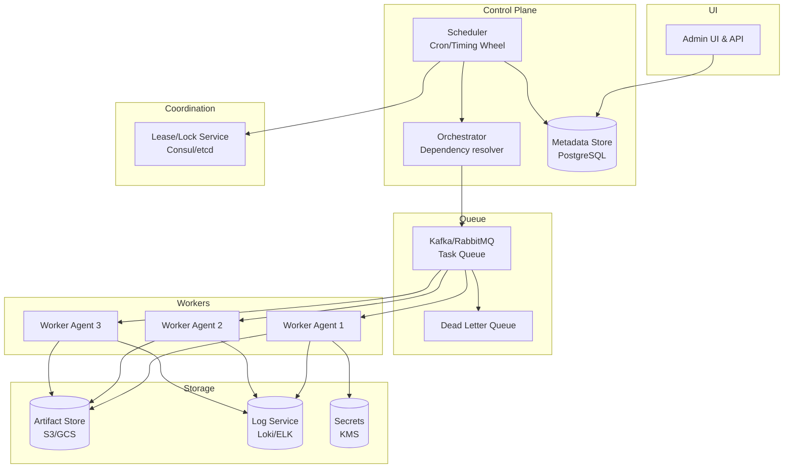

# 11-distributed-task-scheduler - Distributed Task Scheduler
Generated: 2025-11-02 20:38:44 -05:00

---

<!-- Source: 01-requirements.md -->
# 1) Functional & Non-Functional Requirements

## Functional Requirements

- Scheduling: One-off (run at 2025-11-01T10:00Z), recurring (cron), backfill (re-run past windows)
- DAGs: Define task graphs with dependencies (A → B, C); conditional branches; retries; timeouts
- Execution: Distribute tasks to workers; priorities; concurrency limits per queue/tenant
- Retries: Exponential backoff; max attempts; dead-letter queue; jitter; pause/resume
- Idempotency: Exactly-once effect via idempotent tasks and dedupe keys
- Observability: Task logs, metrics, traces; SLAs and alerts; audit trail
- Multi-Tenancy: Namespaces; quotas; isolation; per-tenant rate limits
- Artifacts: Pass small payloads via queue; large artifacts via object storage (S3)
- Human-in-the-Loop: Approvals for high-risk tasks; manual retries/cancels
- APIs/UI: Create/trigger DAGs; monitor runs; search by status; fetch logs

## Non-Functional Requirements

- Availability: 99.99% for the control plane (scheduler/orchestrator)
- Durability: No task lost; logs retained 30 days (hot) → 1 year (cold)
- Semantics: At-least-once delivery; tasks must be idempotent; dedupe window 24h
- Latency: Schedule → dispatch < 500ms p95; heartbeats every 10s; failure detection < 30s
- Throughput: 1M task dispatches/min; 50K DAG submissions/min; 100K worker heartbeats/sec
- Scalability: 100K workers; 2M concurrent timers; 1B tasks/day
- Security: mTLS between components; per-tenant authz; secret management (KMS)

## Scale Estimate

- Tasks/day: 1B → avg 11.6K/sec; peaks 60K/sec (top-of-hour crons)
- Timers: 2M active cron schedules; tick granularity 1s (hierarchical timing wheel)
- Metadata: 1B task records/day × 500B = 500GB/day (cold store S3; hot index: 3 days)
- Logs: Avg 10KB/task → 10TB/day (compressed; tier to cold storage)

## Constraints

- Worker heterogeneity: Some tasks require GPUs, some CPU-only; scheduling must respect labels
- Long-running tasks: Hours/days; heartbeats must sustain outages/restarts
- Clock skew: Control plane must tolerate ±100ms skew across nodes
- Backpressure: Protect DB/queues from spikes (e.g., mass retries)

## Success Measures

- Orchestration Availability: 99.99% during business hours
- Schedule Latency: p95 < 500ms from schedule to dispatch
- Task Success Rate: >99% (excluding user-code failures)
- No Lost Tasks: 0 tasks dropped; verifiable via end-to-end counters
- SLA Adherence: % of DAGs meeting deadlines; alert on breaches

---

<!-- Source: 02-architecture.md -->
# 2) High-Level Architecture (Most Detailed)

## Components

- API & UI: Define DAGs, schedules, triggers; RBAC; audit
- Metadata Store: DAGs, runs, tasks, attempts; PostgreSQL/CockroachDB (multi-region)
- Scheduler: Cron parser; hierarchical timing wheel; computes ready tasks
- Orchestrator: Resolves dependencies; enqueues runnable tasks to queues
- Queue/Broker: Kafka/RabbitMQ; per-tenant/priority topics; dead-letter queues
- Worker Agents: Pull tasks; execute; heartbeat; upload logs; respect concurrency limits
- Lease/Lock Service: Consul/etcd/Redis for leader election; task leases (avoid duplicate work)
- Artifact Store: S3/GCS; large inputs/outputs
- Log Service: Stream logs to object storage + index (Loki/ELK)
- Secrets: KMS + per-tenant secret store

## Data Flows

### A) Scheduling & Dispatch

1) User creates DAG + schedule (cron) via API → Metadata Store
2) Scheduler tick (every 1s):
   - Evaluate due schedules using hierarchical timing wheel (O(1) amortized)
   - Emit ScheduleDue events → Orchestrator
3) Orchestrator:
   - Determine runnable tasks (parents succeeded)
   - Acquire task lease (Lease{task_run_id, ttl=5m})
   - Enqueue to Queue with headers: {tenant, priority, dedupe_key, retries_left}
4) Worker pulls from Queue (long-poll):
   - Acquire execution lease (Lease{task_attempt_id, ttl=heartbeat×3})
   - Fetch secrets & artifacts; start containerized execution (K8s Job)
   - Stream logs; heartbeat every 10s
5) On completion:
   - Worker publishes TaskResult (success/failure, outputs)
   - Orchestrator marks task_run; schedule dependents or retries

### B) Retries & Backoff

- On failure, Orchestrator computes next retry_time = now + backoff × jitter
- Enqueue with dedupe_key to avoid duplicate effects
- If max_retries exceeded → move to dead-letter queue; alert

### C) Heartbeats & Failure Detection

- Worker heartbeats every 10s → Orchestrator updates last_seen
- If no heartbeat for 30s (3×), Orchestrator revokes lease and re-enqueues task (at-least-once)
- Idempotency key ensures duplicate attempts don't double-apply effects

### D) Concurrency Limits & Quotas

- Per-tenant concurrent limit (e.g., 1000 tasks)
- Per-queue limit; per-label limit (e.g., gpu=true max 100)
- Token-bucket rate limiter (Redis) for dispatch

## Data Model

- tenants(id, name, quota_concurrency, quota_rate)
- dags(id, tenant_id, name, definition_json, version, created_at)
- schedules(id, dag_id, cron_expr, timezone, paused)
- runs(id, dag_id, scheduled_at, status, sla_deadline)
- tasks(id, run_id, name, attempt, status, dedupe_key, priority, lease_expires_at)
- attempts(id, task_id, worker_id, started_at, ended_at, exit_code, logs_pointer)
- workers(id, labels_json, last_heartbeat, capacity)

## APIs

- POST /v1/dags {name, definition}
- POST /v1/dags/:id/schedules {cron, timezone}
- POST /v1/dags/:id/triggers {time?}
- GET /v1/runs/:id
- GET /v1/tasks/:id/logs
- POST /v1/tasks/:id/retry | cancel

Auth: OAuth2 + per-tenant RBAC; mTLS between control plane components.

## Why These Choices

- Hierarchical timing wheel: Efficient scheduling for millions of timers (near O(1) tick)
- Pull-based workers: Natural backpressure; simpler failure handling; scale horizontally
- Leases via strong-consistency KV: Avoid duplicate execution; safe failover
- Kafka: Durable, ordered topics; multiple consumer groups (workers) per tenant/priority
- Containerized execution (K8s): Isolation; declarative resource requests (CPU/GPU)

## Monitoring

- Schedule-to-dispatch latency p50/p95/p99
- Task success rate, retry rate, mean attempts
- Orchestrator lag (ready tasks not enqueued)
- Queue depth per tenant/priority
- Worker heartbeat freshness; orphaned leases
- SLA breaches per DAG

---

<!-- Source: 03-key-decisions.md -->
# 3) Key Design Decisions & Trade-Offs

## 1. Push vs. Pull Scheduling

**Decision**: Pull-based workers consuming from queues.

**Rationale**: Backpressure built-in; workers scale independently; network-friendly across regions.

**Trade-off**: Slightly higher dispatch latency vs. push; needs visibility timeouts/leases to handle duplicates.

**When to reconsider**: Ultra-low latency (<50ms) tasks; push can be considered with careful flow control.

---

## 2. At-Least-Once vs. Exactly-Once

**Decision**: At-least-once with idempotent tasks + dedupe keys.

**Rationale**: Exactly-once in distributed systems is expensive/fragile; idempotency is robust.

**Trade-off**: Requires developer discipline (idempotent side-effects); more metadata to track.

**When to reconsider**: Tasks that are pure computation (no side-effects) can be deduped more aggressively.

---

## 3. Centralized vs. Sharded Scheduler

**Decision**: Sharded by time bucket and tenant.

**Rationale**: Avoids single bottleneck; aligns with multi-tenant isolation.

**Trade-off**: Cross-shard coordination for DAGs spanning tenants (rare).

**When to reconsider**: If single-tenant deployment; centralized scheduler is simpler.

---

## 4. Queue Choice: Kafka vs. RabbitMQ

**Decision**: Kafka for scale and durability.

**Rationale**: High throughput; partitioning; replay; stronger ordering guarantees per partition.

**Trade-off**: Higher operational complexity; exactly-once semantics are nuanced.

**When to reconsider**: For small installations or strict per-message routing semantics, RabbitMQ/SQS is simpler.

---

## 5. Time Model: Timing Wheel vs. Cron Scan

**Decision**: Hierarchical timing wheel for timers; cron parser for schedule generation.

**Rationale**: Millions of timers with O(1) tick; cron-only scans get expensive at scale.

**Trade-off**: Implementation complexity; careful persistence of wheel state.

**When to reconsider**: If scale is <100K timers; a cron table scan may suffice.

---

## 6. Lease Backend: etcd/Consul vs. Redis

**Decision**: etcd/Consul for control-plane leases; Redis for rate limiting.

**Rationale**: Strong consistency and reliable watch semantics for leases; Redis excels at counters and buckets.

**Trade-off**: Operating both systems adds complexity.

**When to reconsider**: Managed control-plane (e.g., Cloud Spanner + Pub/Sub) may reduce ops burden.

---

## 7. Logs Storage: Object Store + Index vs. Full-Text in DB

**Decision**: Logs to object storage (S3) with searchable index (Loki/ELK).

**Rationale**: Cheap, scalable storage; efficient queries over metadata; streaming supported.

**Trade-off**: Searching full text requires index maintenance; eventual consistency in indexes.

**When to reconsider**: Low scale; storing logs in DB is simpler.

---

<!-- Source: 04-wrap-up.md -->
# 4) Wrap-Up: Scaling, Failures, Interview Tips

## Scaling Playbook

**0 → 10M tasks/day**
- Single scheduler + orchestrator; PostgreSQL; RabbitMQ; 100 workers
- Logs to local disk; rotate daily; simple UI

**10M → 100M tasks/day**
- Shard scheduler by tenant/time bucket; Kafka (6 brokers, 24 partitions)
- K8s for worker autoscaling; logs to S3 + Loki
- Partition metadata DB (Citus/CockroachDB); read replicas
- Rate limiting per tenant; backpressure policies

**100M → 1B tasks/day**
- Kafka 12 brokers, 96 partitions; dedicated clusters per region
- Timing wheel distributed across shards; checkpoint state to DB
- Global control plane with regional failover; mTLS everywhere
- Preemption + fair scheduling (DRF) across tenants

---

## Failure Scenarios

| Failure | Impact | Detection | Mitigation |
|---|---|---|---|
| Scheduler leader crash | Schedules not emitted | Leader heartbeat lost | Leader election; warm standby; replay due windows from DB |
| Orchestrator backlog | Ready tasks not dispatched | Queue depth rising | Scale orchestrator; shed load (pause low-priority tenants) |
| Worker partition | Tasks time out | Missed heartbeats | Revoke leases; re-enqueue; idempotency prevents double effects |
| Kafka outage | Dispatch halted | Producer/consumer errors | Retry with backoff; regional failover; buffer in DB |
| Hot partition (top-of-hour) | Burst overwhelms queue | Spikes in due tasks | Jittered schedules; spread-out cron; token bucket rate limits |
| Metadata DB hotspot | Slow API/UI | High p95 queries | Add read replicas; partition hot tables; cache DAG definitions |

---

## SLOs

- Schedule-to-dispatch p95 < 500ms
- Orchestrator availability 99.99%
- Task success rate > 99%
- Duplicate execution rate < 0.01% (idempotency failures)
- Log ingestion lag p95 < 5s

---

## Common Pitfalls

1. Non-idempotent tasks cause duplicate side-effects on retries
2. Cron spikes at top-of-hour overwhelm queues; add jitter
3. Long-running tasks without heartbeats leak capacity; enforce TTL + checkpointing
4. Using DB as a queue leads to lock contention; use proper brokers
5. Unbounded retries create feedback loops; cap attempts and dead-letter

---

## Interview Talking Points

- Why at-least-once with idempotency beats exactly-once in practice
- How a hierarchical timing wheel works and why it's efficient
- Handling mass retries/backfills without melting the control plane
- Designing leases/visibility timeouts to avoid duplicate work
- Multi-tenant fairness: quotas, DRF, preemption

---

## Follow-Up Questions

- How to support SLAs per DAG with preemption?
- How to integrate with GitOps for DAG versioning and rollbacks?
- How to run tasks across on-prem and cloud workers (hybrid)?
- How to support human approvals and manual steps in DAGs?
- How to support step-caching and incremental recomputation?

