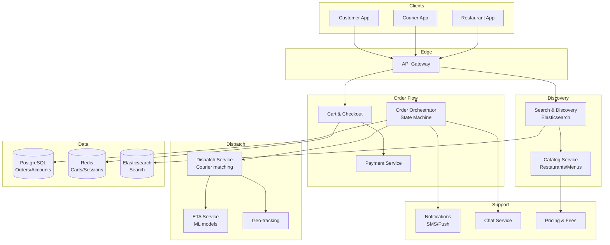

# 13-food-delivery-platform - Food Delivery Platform
Generated: 2025-11-02 20:38:44 -05:00

---

<!-- Source: 01-requirements.md -->
# 1) Functional & Non-Functional Requirements

## Functional Requirements

- Discovery: Restaurants, cuisines, filters (rating, price, diet), search, promos
- Menu & Availability: Real-time item availability, options (size, spice), prep times
- Cart & Checkout: Add items, fees/taxes, tips, coupons, payment methods
- Order Lifecycle: Place, confirm, prep start/ready, pickup, en-route, delivered; cancel/modify
- Courier Dispatch: Match orders to couriers; batching; hot bag constraints; pickup/delivery SLAs
- Live Tracking: Courier location, ETA updates, map view, chat (customer-courier-restaurant)
- Notifications: SMS/push for order status; driver app alerts
- Support: Refunds/adjustments; partial items; substitutions; issue resolution

## Non-Functional Requirements

- Latency: Search/list p95 < 300ms; checkout p95 < 800ms; ETA recompute < 2s
- Availability: 99.95% during meal peaks; degraded mode (read-only menus) on partial outages
- Scale: 500K concurrent orders; 200K couriers; 20K restaurants per metro
- Accuracy: ETA MAE < 5 min; inventory accuracy > 99%; payment capture 100% idempotent
- Reliability: Dispatch within 60s p95; order drop rate < 0.1%
- Safety: Fraud detection for payments; courier background checks; PII privacy

## Scale Estimate

- Orders/day: 5M; peak 25K/min (meal spikes)
- Courier telemetry: 200K × 1Hz → 200K location updates/sec (bursting)
- Menu data: 1M restaurants × avg 80 items → 80M SKUs; updates 1–2/day; hot items change hourly
- Chat: 5M orders/day × 10 msgs avg → 50M msgs/day (~600 msgs/sec)

## Constraints

- Geography-dependent constraints (traffic, weather, zones, regulations)
- Restaurants with legacy POS/phones; integrations vary
- Payments: PCI DSS; chargebacks; tips adjustments post-delivery

## Success Measures

- Delivery SLA met % (>95%) and ETA accuracy (MAE < 5 min)
- Order conversion rate; cart abandonment
- Courier utilization (>60%) and idle time
- Customer support contact rate (<2%) and refund cost (<2% GMV)
- Fraud loss rate (<0.1% of GMV)

---

<!-- Source: 02-architecture.md -->
# 2) High-Level Architecture (Most Detailed)

## Components

- Catalog Service: Restaurants, menus, hours, item availability; POS integrations
- Search & Discovery: Elasticsearch; ranking by distance, ETA, rating, promos
- Pricing & Fees: Delivery fees, surge (demand/supply), taxes, tips, promos
- Cart & Checkout: Order validation, promotions, fraud checks, payment auth/capture
- Order Orchestrator: State machine for order lifecycle; idempotent transitions
- Dispatch Service: Courier matching, batching; ETA prediction; constraints (vehicle, capacity)
- Courier App Backend: Geo-tracking, navigation, pickup/drop workflow; heatmaps
- ETA Service: ML models (travel time + prep time); realtime recalculations
- Notifications: SMS/Push; SLA alerts; proactive delay notifications
- Chat Service: Customer-courier-restaurant chat; translation; moderation
- Analytics & Ops: Dashboards; support tooling; incident response

## Data Flows

### A) Discovery & Checkout

1) User searches restaurants → Search queries Elasticsearch with geo filters and ranking
2) User adds items to cart → Cart validates availability, pricing, promotions
3) Checkout → Fraud check (risk score); payment authorization (PSP) with idempotency key
4) Order Orchestrator creates order (status=confirmed), notifies restaurant

### B) Restaurant Prep & Ready

1) Restaurant accepts order → POS integration or merchant app; provides prep time
2) Orchestrator updates status=prep_started; ETA recalculation
3) When ready, status=ready_for_pickup; signal Dispatch to prioritize assignment

### C) Courier Dispatch & Delivery

1) Dispatch selects courier using scoring: distance/time to pickup, utilization, batching potential, courier preferences
2) Courier assigned → app receives job; navigation to restaurant; in-app checklists
3) Pickup event; then en-route; live location updates at 1Hz; ETA recalculated factoring traffic/weather
4) Delivered → payment capture; tip adjustments; receipt

### D) Batching & Hot Areas

- Dispatch considers nearby orders for batching (same restaurant or route overlap); ensure food quality window
- Surge pricing when demand > supply; incentives for couriers to move to hot zones

## Data Model

- restaurants(id, name, location{lat,lng}, hours, rating, cuisines[], pos_integration)
- menu_items(id, restaurant_id, name, price, options_json, available)
- orders(id, user_id, restaurant_id, status, total, created_at, eta, courier_id)
- order_items(order_id, menu_item_id, qty, customizations_json)
- couriers(id, vehicle[type], capacity, rating, last_location{lat,lng}, status)
- dispatch_jobs(id, order_id, courier_id, assigned_at, accepted_at, picked_up_at, delivered_at)

## APIs

- GET /v1/search?lat=&lng=&q=&filters
- POST /v1/cart {items}
- POST /v1/checkout {cart, payment_method, tip}
- GET /v1/orders/:id
- WS /v1/orders/:id/tracking

Auth: OAuth; PCI vault tokens for payment; PII encrypted at rest.

## Why These Choices

- Elasticsearch for geo + text relevance at scale
- Separate ETA service to iterate ML models without touching orchestrator
- Idempotent order state machine prevents double charges and inconsistent states
- Scoring-based dispatch adaptable to local constraints and batching

## Monitoring

- Search latency; checkout p95; payment auth success rate
- Order funnel conversion; abandonment rate
- Dispatch time-to-assign; courier acceptance rate; delivery SLA
- ETA MAE; reassignments; cancellations

---

<!-- Source: 03-key-decisions.md -->
# 3) Key Design Decisions & Trade-Offs

## 1. Centralized vs. Regional Dispatch

**Decision**: Regional dispatch services per metro.

**Rationale**: Local traffic patterns and regulations; lower latency; resilience to region failures.

**Trade-off**: Harder cross-region load sharing; configuration drift.

**When to reconsider**: Small countries/cities; centralized is simpler initially.

---

## 2. Greedy vs. Global Optimization for Assignment

**Decision**: Greedy scoring with periodic re-optimization.

**Rationale**: Fast decisions under load; near-optimal with rebalancing.

**Trade-off**: Occasional suboptimal batching or assignments.

**When to reconsider**: For mega-events (Super Bowl), run global optimizer for hot zones.

---

## 3. ETA Modeling: Rule-Based vs. ML

**Decision**: ML (gradient boosting) for travel+prep; online calibration with telemetry.

**Rationale**: Captures nonlinear effects (weather, time-of-day, restaurant behavior).

**Trade-off**: Model drift; requires feature pipelines and monitoring.

**When to reconsider**: Early stage: rule-based baseline while gathering data.

---

## 4. Inventory Consistency: Push vs. Pull with Restaurants

**Decision**: Pull via periodic sync + push webhooks for live outages.

**Rationale**: POS systems unreliable; combine for better freshness.

**Trade-off**: Occasional stale items; require substitution flow.

**When to reconsider**: Deep POS integration with SLAs → push dominant.

---

## 5. Courier Telemetry Rate

**Decision**: 1Hz default; adapt down to 0.2Hz when idle, up to 2Hz near pickup/drop.

**Rationale**: Balance battery, bandwidth, and ETA accuracy.

**Trade-off**: Server complexity for adaptive rates.

**When to reconsider**: If network cost spikes or battery issues; adjust heuristics.

---

## 6. Payments: Auth-Then-Capture vs. Immediate Capture

**Decision**: Auth on place, capture on delivery (post-tip adjust window).

**Rationale**: Handle item changes/cancellations; better CX for tips.

**Trade-off**: Auth holds expire; capture failures need retries.

**When to reconsider**: Markets where immediate capture required by regulation.

---

<!-- Source: 04-wrap-up.md -->
# 4) Wrap-Up: Scaling, Failures, Interview Tips

## Scaling Playbook

**0 → 50K orders/day**
- Single region; PostgreSQL; Redis cache; basic dispatch
- SMS notifications; manual support tooling

**50K → 1M orders/day**
- Regional shards for dispatch; Kafka for events; Elasticsearch for search
- ML ETA service; dynamic pricing; proactive delay notifications
- POS integrations for top restaurants; fraud scoring

**1M → 5M orders/day**
- Multi-region active-active; regional catalogs; CDN for images
- Advanced batching/heatmaps; surge incentives; A/B tests on dispatch scoring
- Real-time telemetry pipeline (Flink) for ETA calibration; experimentation platform

---

## Failure Scenarios

| Failure | Impact | Detection | Mitigation |
|---|---|---|---|
| POS integration outage | Orders not acknowledged | Webhook failures | Fallback to phone/SMS confirmation; pause store temporarily |
| Dispatch overload | Slow assignments, cold food | Time-to-assign > SLO | Prioritize ready orders; pause low-rated restaurants; incentives to near couriers |
| Payment capture failure | Revenue loss | PSP errors | Retry with backoff; partial capture; manual follow-up |
| Telemetry gaps | ETA inaccurate | Missing pings | Extrapolate using last speed; prompt courier; map matching |
| Weather spike | Widespread delays | Weather alerts | Auto-extend ETAs; surge couriers; notify customers proactively |

---

## SLOs

- Search p95 < 300ms; checkout p95 < 800ms
- Dispatch time-to-assign p95 < 60s; on-time delivery > 95%
- ETA MAE < 5 min
- Payment auth success > 98%; capture retries resolved < 24h

---

## Common Pitfalls

1. Over-aggressive batching causing cold food; cap batch size/time windows
2. Ignoring prep variability per restaurant; learn per-venue prep times
3. No idempotency on order state transitions; double charges/refunds
4. Poor surge controls → customer backlash; transparency on fees and ETAs
5. Telemetry bandwidth drains courier batteries; adaptive rates needed

---

## Interview Talking Points

- Dispatch scoring features and trade-offs (utilization vs. SLA)
- ETA modeling and online calibration with telemetry
- Multi-tenant POS integration patterns and fallbacks
- Payments lifecycle: auth, capture, refunds, tip adjustments
- Operating during city-wide events and adverse weather

---

## Follow-Up Questions

- How to support groceries with substitutions and multi-stop routes?
- How to reduce cancellations with better readiness predictions?
- How to optimize courier incentives for balanced supply geography?
- How to integrate dark kitchens/virtual brands with different prep behaviors?

