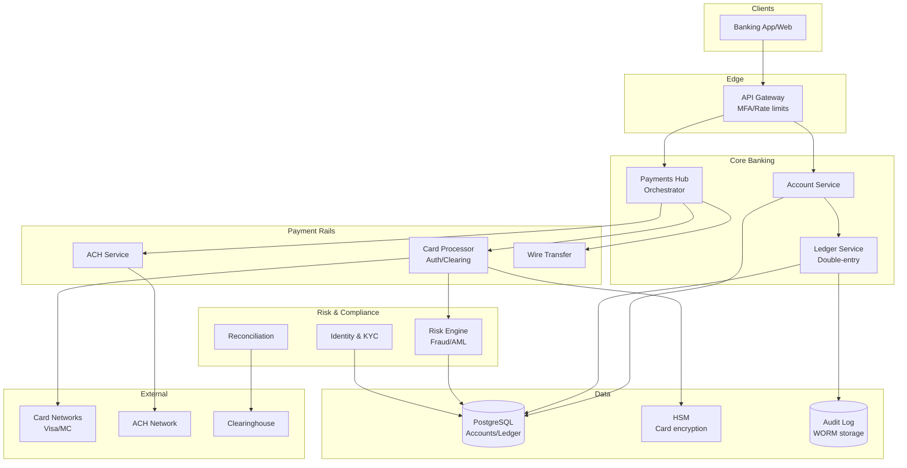

# 14-online-banking-system - Online Banking System
Generated: 2025-11-02 20:38:44 -05:00

---

<!-- Source: 01-requirements.md -->
# 1) Functional & Non-Functional Requirements

## Functional Requirements

- Accounts: Open/close; KYC onboarding; account types (checking, savings); statements
- Balances: Real-time available and ledger balances; holds; overdraft rules
- Transfers: Internal (A→B), ACH, wires, card transactions; scheduled and recurring
- Cards: Issuance, authorization, clearing, chargebacks; 3DS
- Payments: Bill pay, Zelle/SEPA equivalents; standing orders
- Limits & Controls: Per-transaction and daily limits; freezes; travel notices
- Fraud & AML: Real-time risk scoring; sanctions screening; SAR filing; case management
- Audit & Reporting: GL posting, reconciliations, regulatory reports
- Support: Disputes, chargebacks, refunds; account recovery

## Non-Functional Requirements

- Consistency: Strong for ledger and balances; idempotent operations
- Availability: 99.99% for payments auth; 99.9% for non-critical features
- Security: PCI DSS for cards, SOC2; encryption at rest/in transit; HSM for key mgmt
- Throughput: 200K TPS reads (balance checks), 20K TPS writes (transactions)
- Latency: Card auth p95 < 300ms; internal transfer p95 < 800ms
- Durability: Financial records 7+ years retention; WORM storage for audit

## Scale Estimate

- Accounts: 100M; avg 3 accounts per user
- Transactions/day: 200M; avg size 200B → 40GB/day (hot), 1TB/day with indexing
- Ledger size: 1–5TB hot; 100TB cold over years
- Fraud events: 50K/sec scoring; 1% escalations

## Constraints

- Regulatory: KYC/AML, OFAC, PCI DSS, GLBA; privacy (GDPR/CCPA)
- Settlement networks: Cutoff times (ACH batches), wire windows, card network SLAs
- Reconciliation with external systems (core banking, networks)

## Success Measures

- Zero double-spend; reconciliation diffs < 1 ppm
- Auth approval rate > 98% (good traffic); fraud loss < 5 bps of volume
- Incident rate for critical flows < 1/mo; MTTR < 30 min
- SLA adherence: Card auth p95 < 300ms; ACH file processing on-time % > 99.99%

---

<!-- Source: 02-architecture.md -->
# 2) High-Level Architecture (Most Detailed)

## Components

- Identity & KYC: Onboarding, identity verification, sanctions screening
- Account Service: Accounts, limits, controls, statements
- Ledger Service: Double-entry ledger; postings; balance snapshots; strong consistency
- Payments Hub: Orchestrates transfers (internal, ACH, wire, card, RTP/SEPA), cutoffs, retries
- Card Processor: Auth, clearing, chargebacks; HSM integration; tokenization
- Risk Engine: Real-time fraud scoring (features, ML), rules; AML screening; case mgmt
- Reconciliation: Daily matching with external networks (ACH, card, wire), diff resolution
- Reporting & GL: Financial reporting; GL feeds; WORM storage
- Support Tools: Disputes, refunds, adjustments; audit trail

## Data Flows

### A) Internal Transfer (A → B)

1) API: POST /transfers {from, to, amount, idempotency_key}
2) Account Service validates limits/controls; freeze checks
3) Ledger creates a Posting Batch (debit A, credit B) → ACID txn → commit
4) Balance snapshots updated; events emitted to Kafka (for notifications)
5) Return success; idempotency ensures retried requests do not duplicate postings

### B) Card Authorization

1) Merchant → Card Network → Card Processor: auth request
2) Risk Engine computes score; risk rules (velocity, geo, MCC) may decline
3) Ledger places hold on account (reduce available, not ledger balance)
4) Approve/decline within 300ms; response to network
5) Later, clearing file posts final amount; hold released; differences adjusted

### C) ACH Outbound

1) User schedules ACH transfer; Payments Hub validates
2) ACH batch file generated at cutoff; transmitted to bank; NACHA format
3) Settlement T+1/T+2; returns processed; ledger adjusted; user notified

### D) Reconciliation & GL

1) End-of-day: Compare ledger totals with network reports (card, ACH, wire)
2) Differences → reconciliation queue; auto-resolve common mismatches; manual cases
3) GL posting generated to enterprise accounting; WORM archived

## Data Model

- accounts(id, user_id, type, status, limits_json, created_at)
- ledger_entries(id, batch_id, account_id, amount, currency, direction[debit|credit], created_at)
- posting_batches(id, status, created_at, committed_at, idempotency_key)
- holds(id, account_id, amount, reason, created_at, released_at)
- transfers(id, from_account, to_account, amount, status, created_at)
- cards(id, account_id, pan_token, status, limits, last4)
- fraud_events(id, account_id, txn_id, score, features_json, decision)

## APIs

- POST /v1/transfers {from, to, amount, idempotency_key}
- GET /v1/accounts/:id/balance
- POST /v1/cards/:id/controls {freeze, limits}
- POST /v1/ach/outbound {dest, amount, schedule}

Auth: OAuth2 + device binding; HSM-backed keys; strong audit with tamper-proof logs.

## Why These Choices

- Double-entry ledger with ACID guarantees eliminates double-spend; easy audits
- Idempotency keys on all money-moving APIs prevent duplicate postings
- Holds model separates available vs. ledger balance for card flows
- Hub-and-spoke Payments Hub isolates network specifics and retries

## Monitoring

- Ledger write latency and contention; deadlocks
- Auth p95 latency; approval/decline rates; false positive rate
- ACH/wire file success; reconciliation diffs; GL posting success
- Fraud model drift; rules hit rates; case backlog

---

<!-- Source: 03-key-decisions.md -->
# 3) Key Design Decisions & Trade-Offs

## 1. Ledger Storage: RDBMS vs. Event Store

**Decision**: RDBMS (PostgreSQL) with strict ACID + append-only entries.

**Rationale**: Mature transactions; strong consistency; easy auditing.

**Trade-off**: Horizontal write scaling requires partitioning by account or batch.

**When to reconsider**: If throughput > 50K TPS writes; consider sharding or specialized ledger engines.

---

## 2. Idempotency Boundaries

**Decision**: Idempotency at API (client-provided key) and at Posting Batch level.

**Rationale**: Network retries common; ensures exactly-once effect.

**Trade-off**: Key management and dedupe windows; risk of key reuse mistakes.

**When to reconsider**: Never for money-moving APIs; keep strict.

---

## 3. Strong vs. Eventual Consistency

**Decision**: Strong for ledger/balances; eventual for analytics and notifications.

**Rationale**: Financial correctness > availability; analytics can lag.

**Trade-off**: May reduce availability during partitions.

**When to reconsider**: For read-only features during incidents, use stale reads from replicas.

---

## 4. Fraud: Rules vs. ML

**Decision**: Hybrid — rules for explainability; ML for recall.

**Rationale**: Compliance requires explainability; ML catches complex patterns.

**Trade-off**: Model governance and drift; false positives hurt UX.

**When to reconsider**: Start rules-only; add ML when data maturity allows.

---

## 5. Card Processing: Build vs. Buy

**Decision**: Buy (processor) initially; build abstraction for future.

**Rationale**: Compliance and network certifications are heavy; time-to-market.

**Trade-off**: Less control; fees.

**When to reconsider**: Scale and margin justify partial insourcing.

---

## 6. Reconciliation: Real-Time vs. Batch

**Decision**: Batch end-of-day with near-real-time sanity checks.

**Rationale**: Networks provide files on cadence; batch aligns with them.

**Trade-off**: Intraday drift must be tolerated; need alerts for anomalies.

**When to reconsider**: Real-time feeds (e.g., RTP) can support continuous reconciliation.

---

<!-- Source: 04-wrap-up.md -->
# 4) Wrap-Up: Scaling, Failures, Interview Tips

## Scaling Playbook

**0 → 1M accounts**
- Single-region PostgreSQL; read replicas; Kafka for events; basic fraud rules
- ACH/wires via partner bank; card processor integration

**1M → 20M accounts**
- Partition ledger by account range; hot/cold storage; snapshot balances
- Feature store + ML for fraud; case management tooling
- Active-active read paths; disaster recovery runbooks

**20M → 100M+ accounts**
- Multi-region active-active with strongly consistent ledger shards (per-region); global routing by account hash
- Reconciliation automation; GL at scale; regulatory reporting pipelines

---

## Failure Scenarios

| Failure | Impact | Detection | Mitigation |
|---|---|---|---|
| Ledger partition failure | Cannot post transactions | Write errors; latency spikes | Fail closed; read-only mode; promote standby shard; backlog replay |
| PSP outage | Card auth declines | Error rates spike | Failover to secondary PSP; risk-based soft declines |
| ACH file rejection | Settlement delays | NACHA return codes | Rebuild file; manual review; customer comms |
| Fraud model drift | False positives/negatives | Precision/recall drop | Retrain; rollback model; adjust thresholds |
| Reconciliation diffs | Financial risk | Diff > threshold | Auto-resolve; escalate to ops; freeze impacted accounts if necessary |

---

## SLOs

- Card auth p95 < 300ms; approval rate > 98% good traffic
- Internal transfer p95 < 800ms; zero double-spend
- Reconciliation diffs < 1 ppm; GL posting completion < 2h after close
- Fraud review backlog SLA < 24h

---

## Common Pitfalls

1. Missing idempotency on retries → duplicate postings
2. Blending available and ledger balance → confusion and overdrafts
3. Weak audit trails → compliance issues; use immutable logs (WORM)
4. Over-reliance on single PSP or bank partner → add redundancy
5. Skipping backtests on fraud model changes → revenue loss or user lockouts

---

## Interview Talking Points

- Double-entry ledger mechanics and ACID guarantees
- Holds vs. postings and available vs. ledger balance
- Idempotency strategy across APIs and ledger
- Reconciliation flow and why it's essential
- Hybrid fraud detection and model governance

---

## Follow-Up Questions

- How to support multi-currency and FX fees?
- How to implement real-time payments (RTP) with 24/7 availability?
- How to onboard business accounts with multi-user approvals?
- How to meet regional regulations (PSD2 SCA, GDPR data residency)?

