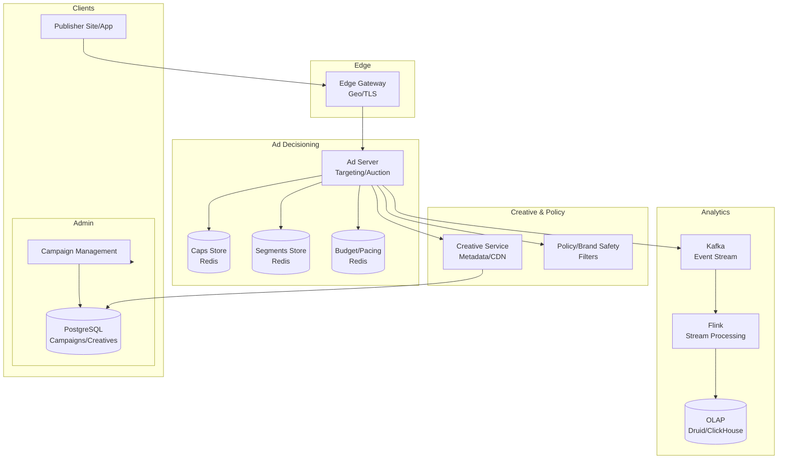

# 15-ad-serving-platform - Ad Serving Platform
Generated: 2025-11-02 20:38:44 -05:00

---

<!-- Source: 01-requirements.md -->
# 1) Functional & Non-Functional Requirements

## Functional Requirements

- Ad Request Handling: Parse page/app context; geo; device; user ID (if consented)
- Targeting: Contextual (page keywords), behavioral (segments), geo, time, frequency caps
- Auction: First-price or second-price with floors; brand safety filters
- Pacing & Budgets: Spend evenly, dayparting, throttling, delivery goals
- Frequency Capping: User-level caps (e.g., 3/day per campaign)
- Creative Delivery: Select creative variant; track impressions/clicks; CDN delivery
- Reporting: Near-real-time dashboards; breakdowns by campaign/geo/device/placement
- Fraud Prevention: IVT detection (bots, datacenter IPs), viewability, click spam detection
- Privacy: Consent management (TCF/CPRA), contextual fallback when no consent

## Non-Functional Requirements

- Latency: p95 < 100ms (end-to-end); ad decisioning < 50ms budget
- Scale: 2M QPS peak ad requests; 10M QPS KV lookups (caps, segments)
- Availability: 99.99% for ad serving; graceful degradation (contextual only)
- Accuracy: Pacing error < ±5%; frequency cap accuracy > 99.9%
- Cost: Optimize memory per user key; cache hit rate > 95%

## Scale Estimate

- Users: 500M unique/month; 100M/day
- Keys: Frequency cap KV ~ 2B keys (campaign×user); TTL 7–30 days
- Events: 50B impressions/day; 2B clicks/day; streaming to analytics

## Constraints

- Privacy regulations: GDPR/CCPA; consent strings; data minimization
- Supply chain: Header bidding, ads.txt/app-ads.txt; SSP/DSP integrations
- Brand safety: Blocklists; viewability standards (MRC)

## Success Measures

- Revenue (eCPM, fill rate, win rate)
- Pacing adherence; under/over-delivery
- Viewability rate and IVT rate
- p95 latency and timeouts avoided

---

<!-- Source: 02-architecture.md -->
# 2) High-Level Architecture (Most Detailed)

## Components

- Edge Gateways: Terminate TLS; geo detection; consent parsing; route to nearest ad server
- Ad Server (Decisioning): Targeting, auction, pacing, frequency caps; <50ms budget
- KV Stores:
  - Caps Store: User×campaign frequency counters (Redis/KeyDB/Ristretto) with TTL
  - Segments Store: User segments (read-only, memory-mapped or Redis)
  - Budget/Pacing Store: Per-campaign counters (strongly consistent writes)
- Creative Service: Creative metadata; A/B variants; CDN links
- Policy/Brand Safety: Blocklists, categories; unsafe content detector (NLP CV)
- Analytics Pipeline: Stream impressions/clicks to Kafka → Flink → OLAP (Druid/ClickHouse/BigQuery)
- Admin/Console: Campaigns, targeting, budgets, creatives; approvals

## Hot Path (Request → Response)

1) Bid request arrives at Edge; parse context (url/app, device, geo, consent)
2) Ad Server fetches user segments (if consented) and frequency caps
3) Retrieve eligible line items (pre-filtered by index); compute scores/bids
4) Apply brand safety and policy filters
5) Auction: rank; apply floors; choose winner
6) Pacing: Check budget delivery; throttle if ahead; allocate impression
7) Frequency Cap: Increment counter atomically; if exceeds, choose next candidate
8) Respond with ad markup (HTML/JS/VAST) and tracking pixels
9) Log impression (fire-and-forget to Kafka; with local disk buffer fallback)

## Data Model

- campaigns(id, budget, start/end, pacing, target_criteria_json, bids, creatives[])
- creatives(id, campaign_id, type, size, url, cdn_url, variants_json)
- freq_caps(key=user_id:campaign_id, count, ttl)
- budgets(campaign_id, spent, last_update)
- segments(user_id, segment_ids)

## APIs

- POST /ad/request {context, user, consent}
- POST /events/impression {req_id}
- POST /events/click {req_id}
- Admin: POST /campaigns, /creatives, /policies

Auth: mTLS between internal services; signed event beacons.

## Why These Choices

- In-memory KV for caps: microsecond reads/writes at 10M QPS
- Streaming analytics decouples hot path from heavy writes
- Pre-indexed line items speed up eligibility checks (bitmap indices)
- Edge presence reduces RTT; improves p95 latency

## Monitoring

- p50/p95/p99 decision latency; timeouts
- Fill rate; win rate; revenue/eCPM
- Pacing error; budget drift; cap miss rate
- KV hit rate; eviction; hot key alerts

---

<!-- Source: 03-key-decisions.md -->
# 3) Key Design Decisions & Trade-Offs

## 1. Latency Budget Allocation

**Decision**: 10ms edge → 20ms targeting → 10ms caps/pacing → 10ms auction → 10ms response.

**Rationale**: Fits p95 < 100ms including network.

**Trade-off**: Tight budgets require careful caching and precomputation.

**When to reconsider**: Mobile networks with high RTT; expand edge footprint.

---

## 2. Frequency Caps Storage

**Decision**: In-memory distributed KV with periodic snapshot to disk.

**Rationale**: 10M QPS counters require memory speed; TTL cleanup.

**Trade-off**: Memory cost; replication needed for durability.

**When to reconsider**: Use count-min sketch for approximate caps at extreme scale.

---

## 3. Auction Type: First vs. Second Price

**Decision**: First-price with bid shading; enforce floors.

**Rationale**: Market trend; simpler settlements.

**Trade-off**: Requires bidder trust and transparency.

**When to reconsider**: Partner ecosystems demanding second-price.

---

## 4. Pacing Consistency

**Decision**: Strong consistency per campaign counter (atomic increments), regional mirrors eventually consistent.

**Rationale**: Prevent overspend while enabling geo-scale.

**Trade-off**: Cross-region writes increase latency; mitigate with leader per campaign.

**When to reconsider**: Small budgets; allow slight drift with periodic reconciliation.

---

## 5. Privacy & Consent Handling

**Decision**: Consent-gated user data; contextual fallback.

**Rationale**: Regulatory compliance; user trust.

**Trade-off**: Lower CPM without personalization.

**When to reconsider**: Markets with explicit opt-in only; stricter gating.

---

## 6. Brand Safety

**Decision**: Multi-layer — publisher allowlists, NLP classifiers, 3rd-party verification.

**Rationale**: Reduce unsafe placements.

**Trade-off**: False positives reduce reach.

**When to reconsider**: High false positive rates → tune thresholds per vertical.

---

<!-- Source: 04-wrap-up.md -->
# 4) Wrap-Up: Scaling, Failures, Interview Tips

## Scaling Playbook

**0 → 100K QPS**
- Single-region ad servers; Redis for caps; ClickHouse for reporting
- Basic targeting; contextual fallback; single CDN

**100K → 1M QPS**
- Global edges; campaign sharding; bitmap indices for eligibility
- Multi-tenant KV cluster; Flink streaming to OLAP; near-real-time dashboards
- Fraud detection models; viewability measurement

**1M → 2M+ QPS**
- Anycast routing; per-campaign leaders for pacing; cross-region replication
- Hot key mitigation (user hashing, sharded caps)
- Stricter SLA monitors; automatic traffic shedding on overload

---

## Failure Scenarios

| Failure | Impact | Detection | Mitigation |
|---|---|---|---|
| KV node loss | Caps inaccurate | Error rates; replication lag | Replicate; fallback to approximate caps; rebuild from snapshots |
| Edge region outage | Latency spikes | RUM latency | Route to nearest healthy edge; adjust budgets |
| Analytics lag | Reporting delayed | Consumer lag | Backpressure; prioritize impression logs; degrade click enrichers |
| Policy service down | Unsafe placements | Health checks | Fail-safe: block unknown categories; conservative policies |

---

## SLOs

- p95 ad decision latency < 100ms; timeouts < 0.1%
- Pacing error < ±5%
- Frequency cap miss < 0.1%
- Reporting freshness p95 < 5 min

---

## Common Pitfalls

1. Hot user keys causing skew; shard keys and apply TTL
2. Overly complex targeting causing slow eligibility; precompute bitmaps
3. Logging synchronously on hot path; always async with disk buffer
4. Ignoring consent → regulatory risk; strict gating with contextual fallback
5. Single-region budget counters → overspend; elect per-campaign leaders

---

## Interview Talking Points

- Latency budgeting and edge footprint strategies
- Pacing algorithms under strong consistency constraints
- Frequency capping data structures at massive scale
- Real-time analytics pipeline architecture and backpressure
- Privacy-first design and contextual fallback quality

---

## Follow-Up Questions

- How to support video ads with viewability events (quartiles)?
- How to run multi-armed bandits for creative optimization?
- How to guarantee SLOs under header bidding traffic bursts?
- How to design anti-fraud features without adding hot path latency?

