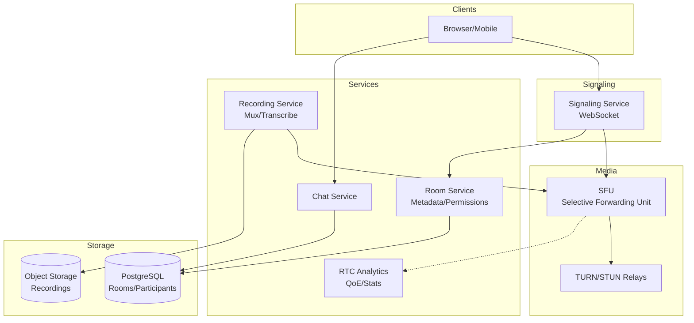

# 16-video-conferencing-platform - Video Conferencing Platform
Generated: 2025-11-02 20:38:44 -05:00

---

<!-- Source: 01-requirements.md -->
# 1) Functional & Non-Functional Requirements

## Functional Requirements

- Meeting Lifecycle: Create, join, leave; link/code entry; waiting room; lock/unlock
- Media: Audio/video (VP8/VP9/H.264/AV1); screenshare; simulcast/SVC; mute/unmute
- Signaling: ICE/STUN/TURN; SDP negotiation; renegotiation for layout changes
- Layouts: Speaker view, gallery, pin, spotlight; dynamic switching
- Recording: Cloud recording to S3; playback; transcription; highlights
- Chat: In-meeting text; file sharing; reactions; polls
- Breakout Rooms: Sub-rooms; host assign/shuffle; auto-return
- Controls: Host mute all, remove participant, disable screenshare, end for all
- Quality: Network probing, BWE (bandwidth estimation), adaptive bitrate, FEC/retransmit

## Non-Functional Requirements

- Latency: p95 E2E (mic → speaker) < 300ms; signaling < 500ms
- Availability: 99.9% meeting join success; graceful degradation (audio-only)
- Scale: 500K concurrent meetings; rooms up to 1000 participants; 10M DAU
- Quality: Packet loss < 1%; jitter < 30ms; MOS > 4.0
- Security: E2EE optional; signaling TLS; DTLS-SRTP for media; auth per meeting

## Scale Estimate

- Meetings/day: 5M; avg duration 30 min; peak 500K concurrent
- Participants: 5M online peak; avg 5/meeting → 2.5M active streams
- Bandwidth: 5M streams × 1.5 Mbps avg → 7.5 Tbps peak egress
- Recording: 100K meetings/day recorded × 500MB avg → 50TB/day storage

## Constraints

- NAT traversal: ~20% behind symmetric NAT; need TURN relays
- Mobile bandwidth: Variable; must degrade gracefully (audio-only fallback)
- Browser/device diversity: WebRTC quirks per browser; codec support varies
- Clock skew and jitter buffers complicate synchronization

## Success Measures

- Join success rate > 99.9%; time-to-join p95 < 3s
- Audio/video quality MOS > 4.0; packet loss < 1%
- E2E latency p95 < 300ms; jitter < 30ms
- Recording success rate > 99%; transcription accuracy > 90%

---

<!-- Source: 02-architecture.md -->
# 2) High-Level Architecture (Most Detailed)

## Components

- Signaling Service: WebSocket; SDP offer/answer exchange; ICE candidate relay; room state
- SFU (Selective Forwarding Unit): Routes RTP streams; per-participant subscription; simulcast/SVC selection
- TURN Relays: Media relay for symmetric NAT; STUN for public IP discovery
- Recording Service: Subscribe to SFU feeds; mux to single file; S3 upload; transcription via ASR
- Media Pipeline: Pre-processing (noise suppression, echo cancellation); post-processing for recordings
- Room Service: Meeting metadata, participants, permissions, breakout rooms
- Auth & Access Control: JWT-based meeting tokens; waiting room queue; host controls
- Analytics: RTC stats collection; QoE monitoring; network telemetry
- Chat Service: Pub/sub for in-meeting messages; file upload to S3

## Data Flows

### A) Join Meeting & ICE Negotiation

1) User clicks join → Auth service validates; issues JWT meeting token
2) Client connects to Signaling via WebSocket; sends join request
3) Signaling allocates SFU endpoint; returns SDP offer (IP, ports, codecs)
4) Client gathers ICE candidates (local, STUN reflexive, TURN relayed)
5) Client sends SDP answer + candidates to Signaling
6) Signaling relays to SFU; ICE connectivity checks run (STUN binding requests)
7) Best candidate pair selected; DTLS-SRTP handshake; media starts flowing

### B) Media Routing (SFU)

1) Participant A sends 3 simulcast layers (1080p, 720p, 360p) to SFU
2) SFU forwards to each subscriber based on their subscription (e.g., B requests 720p)
3) SFU performs BWE (TWCC feedback); signals layer switches if congestion detected
4) Participant B's client adapts send bitrate based on REMB/TWCC feedback

### C) Screenshare

1) User starts screenshare; generates new RTP stream (higher resolution, lower FPS)
2) Signaling renegotiates SDP (add m= line for screenshare track)
3) SFU forwards screenshare to all; clients switch layout to spotlight screenshare

### D) Recording

1) Host starts recording; Recording Service subscribes to SFU for all active streams
2) Muxes audio/video into single MP4 (FFmpeg); uploads chunks to S3 in parallel
3) ASR transcription runs async; generates VTT subtitles
4) Recording available in playback portal; host can download/share

## Data Model

- meetings(id, host_id, created_at, settings_json, recording_enabled)
- participants(meeting_id, user_id, joined_at, role, connection_id)
- recordings(meeting_id, s3_key, duration, transcript_url, created_at)
- analytics_events(meeting_id, user_id, event_type, metrics_json, timestamp)

## APIs

- WS /signaling/join {meeting_id, token}
- WS /signaling/offer {sdp}
- POST /meetings {settings}
- POST /meetings/:id/recording/start
- GET /recordings/:id

Auth: JWT with meeting scope; HMAC-signed TURN credentials; E2EE key exchange in-band (optional).

## Why These Choices

- SFU over MCU: Lower latency; scales horizontally; participants control layout client-side
- Simulcast/SVC: Adaptability without transcoding; saves CPU
- TURN for NAT: ~20% of users need relay; TURN autoscales with usage
- Cloud recording separate from SFU: Isolate load; can replay/edit later

## Monitoring

- Join success rate; time-to-first-frame; ICE failure rate
- E2E latency; jitter; packet loss per participant
- SFU CPU/bandwidth per meeting; TURN relay usage
- Recording success; transcription latency

---

<!-- Source: 03-key-decisions.md -->
# 3) Key Design Decisions & Trade-Offs

## 1. SFU vs. MCU

**Decision**: SFU (Selective Forwarding Unit).

**Rationale**: Lower latency; horizontal scale; client-side layout flexibility.

**Trade-off**: Higher egress bandwidth (each stream sent N-1 times); clients must decode multiple streams.

**When to reconsider**: If target is low-end devices (IoT, feature phones); MCU composites into single stream.

---

## 2. Simulcast vs. SVC

**Decision**: Simulcast (multiple independent layers) with SVC fallback for AV1.

**Rationale**: Broader codec support (VP8/H.264); simpler switching.

**Trade-off**: Higher bandwidth vs. SVC (which reuses base layer); AV1 SVC emerging.

**When to reconsider**: Once AV1 SVC is widely supported, prefer it for bandwidth savings.

---

## 3. TURN Placement: Centralized vs. Edge

**Decision**: Edge TURN relays in each region.

**Rationale**: Minimize latency for relayed media; reduce backbone load.

**Trade-off**: Operational complexity; need per-region capacity planning.

**When to reconsider**: Small-scale deployment; centralized TURN is simpler initially.

---

## 4. Recording: Server-Side vs. Client-Side

**Decision**: Server-side (SFU subscribes to all feeds).

**Rationale**: Reliability (client may crash); host can record without participants knowing.

**Trade-off**: SFU load increases; egress bandwidth for recordings.

**When to reconsider**: If privacy requires client-side; or if SFU capacity is constrained.

---

## 5. E2EE: Optional vs. Mandatory

**Decision**: Optional (default off; opt-in for sensitive meetings).

**Rationale**: Recording, transcription, and cloud features require plaintext; E2EE breaks them.

**Trade-off**: Privacy vs. features; need clear UX about tradeoffs.

**When to reconsider**: If targeting enterprise/healthcare; make E2EE default with feature limitations.

---

## 6. Jitter Buffer: Fixed vs. Adaptive

**Decision**: Adaptive (adjust based on network conditions).

**Rationale**: Lower latency in stable networks; resilient in lossy ones.

**Trade-off**: Complexity; can cause audio glitches if poorly tuned.

**When to reconsider**: Fixed buffer is simpler for controlled networks (corporate VPN).

---

## 7. Breakout Rooms: Separate SFUs vs. Same SFU

**Decision**: Same SFU with logical sub-rooms; WebRTC renegotiation.

**Rationale**: Fast room switches; no media reconnection.

**Trade-off**: SFU state complexity; if main room has 1000 and breakout 5, resource imbalance.

**When to reconsider**: Large meetings; spawn dedicated SFUs per breakout for isolation.

---

<!-- Source: 04-wrap-up.md -->
# 4) Wrap-Up: Scaling, Failures, Interview Tips

## Scaling Playbook

**0 → 10K DAU**
- Single-region SFU; basic signaling; STUN only (no TURN)
- Simple layouts; no recording; basic chat

**10K → 100K DAU**
- Add TURN relays; regional SFUs; signaling clusters
- Cloud recording; transcription; analytics pipeline
- Simulcast; BWE with TWCC

**100K → 10M DAU**
- Global edge SFUs; anycast signaling; TURN autoscaling
- E2EE optional; breakout rooms; advanced layouts; noise suppression
- Large meetings (1000+) use dedicated SFU clusters

---

## Failure Scenarios

| Failure | Impact | Detection | Mitigation |
|---|---|---|---|
| SFU crash | Participants disconnect | Health checks fail | Reconnect to standby SFU; client auto-rejoin |
| TURN relay overload | Increased packet loss | TURN CPU/bandwidth saturation | Autoscale TURN; ICE failover to next candidate |
| Signaling partition | Cannot join/leave | WebSocket errors | Retry with exponential backoff; route to healthy signaling node |
| Recording service lag | Recordings incomplete | Muxing errors; S3 failures | Buffer locally; retry upload; alert ops |
| Network congestion | Packet loss, jitter | TWCC reports; RTC stats | BWE downgrades bitrate; drop to audio-only if severe |

---

## SLOs

- Join success rate > 99.9%; time-to-join p95 < 3s
- E2E latency p95 < 300ms; jitter < 30ms
- Packet loss < 1%; MOS > 4.0
- Recording success > 99%; transcription latency < 5 min

---

## Common Pitfalls

1. Under-provisioned TURN → participants behind NAT cannot connect; autoscale TURN with usage
2. Fixed bitrate → network congestion causes packet loss; implement BWE (TWCC/REMB)
3. No simulcast → high-bandwidth participants force everyone to high bitrate; enable simulcast
4. Synchronous recording muxing → SFU CPU spikes; offload to dedicated recording workers
5. Ignoring ICE failures → silent join failures; monitor ICE state and surface errors

---

## Interview Talking Points

- SFU vs. MCU tradeoffs: latency, scale, bandwidth, CPU
- ICE/STUN/TURN and NAT traversal; candidate gathering and prioritization
- BWE algorithms (GCC, TWCC) and how they adapt to congestion
- Simulcast layer selection and switching; SVC emerging benefits
- Recording architecture and E2EE tradeoffs (features vs. privacy)

---

## Follow-Up Questions

- How to support 10K+ participant webinars (MCU with audience view)?
- How to implement noise suppression and background blur at scale?
- How to optimize for mobile networks (high latency, packet loss)?
- How to handle international calls with high RTT (200ms+)?
- How to design E2EE with cloud features like transcription?

