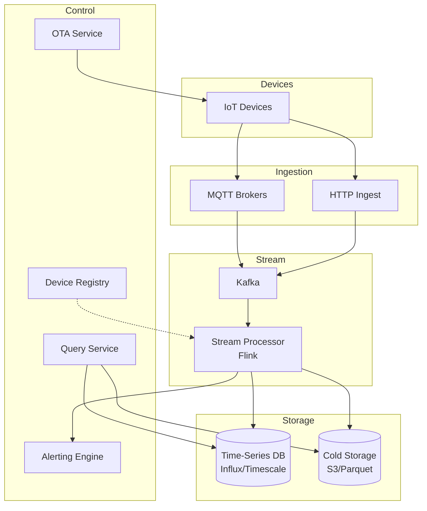

# 17-iot-data-processing-pipeline - Iot Data Processing Pipeline
Generated: 2025-11-02 20:38:45 -05:00

---

<!-- Source: 01-requirements.md -->
# 1) Functional & Non-Functional Requirements

## Functional Requirements

- Ingestion: MQTT, CoAP, HTTP; device auth (certs, tokens); protocol translation
- Data Validation: Schema enforcement, range checks, deduplication
- Stream Processing: Aggregation (1-min/5-min windows), enrichment, anomaly detection
- Storage: Time-series DB; hot (7 days), warm (90 days), cold (years)
- Alerting: Rule-based + ML anomalies; fan-out to SMS/email/webhooks; deduplication
- Device Management: Registry, twin state (desired/reported), OTA firmware updates
- Visualization: Dashboards, historical queries, drill-downs
- Data Export: Batch to data lake (Parquet/Avro) for analytics

## Non-Functional Requirements

- Throughput: 1M events/sec; bursts to 5M/sec
- Latency: Ingestion p95 < 500ms; alerting p95 < 2s
- Availability: 99.9% for ingestion; 99.5% for query
- Durability: Zero message loss; at-least-once delivery with idempotency
- Cost: Optimize storage tiering; compression; sampling for non-critical metrics

## Scale Estimate

- Devices: 100M; send telemetry every 10s avg → 10M events/sec baseline
- Event size: 500B avg → 5GB/sec → 400TB/day (compressed to ~100TB/day)
- Hot storage: 7 days × 100TB = 700TB SSD
- Warm/cold: 10PB total over years

## Constraints

- Device heterogeneity: Firmware versions, network (2G/3G/4G/5G/LTE-M/NB-IoT), power
- Clock skew: Devices may lack NTP; server-side timestamping required
- Bandwidth: Constrain payload size; batch when possible

## Success Measures

- Ingestion success rate > 99.9%; message loss < 0.01%
- Alert latency p95 < 2s; false positive rate < 1%
- Query p95 < 3s for 24h window; < 30s for 90-day
- Cost per device per month within budget ($0.10 target)

---

<!-- Source: 02-architecture.md -->
# 2) High-Level Architecture (Most Detailed)

## Components

- Ingestion Gateway: MQTT brokers (HiveMQ/Mosquitto), HTTP endpoints; TLS; device auth
- Message Queue: Kafka (partitioned by device_id or region); durability; replay
- Stream Processor: Flink/Kafka Streams; windowed aggregations; enrichment; anomaly detection
- Time-Series DB: InfluxDB/TimescaleDB; sharded by time+device; retention policies
- Device Registry: Device metadata, twin state, firmware versions; DynamoDB/Cassandra
- Alerting Engine: Rule evaluator + ML models; deduplication; fan-out via SNS/SQS
- Cold Storage: S3/GCS; Parquet/Avro; lifecycle policies (Glacier after 1 year)
- Query Service: Federated queries over hot/warm/cold; caching; downsampling for visualization
- OTA Service: Firmware storage; rollout policies; telemetry for rollback triggers

## Data Flows

### A) Device → Ingestion → Processing

1) Device sends telemetry via MQTT publish (topic: `devices/{id}/telemetry`)
2) Gateway authenticates (X.509 cert or JWT); validates schema
3) Enqueue to Kafka topic (partition by device_id for ordering)
4) Stream Processor (Flink):
   - Deserialize; enrich with device metadata (location, type)
   - Compute windowed aggregations (avg temp per 5 min)
   - Detect anomalies (z-score, threshold, ML model)
5) Write to Time-Series DB (InfluxDB); tag by device_id, location, type
6) If anomaly → trigger alert; fan-out to Alerting Engine

### B) Alerting & Notification

1) Alert triggered by rule or ML (e.g., temp > 80°C)
2) Alerting Engine deduplicates (same device+rule within 5 min → suppress)
3) Fetch notification preferences from Device Registry (SMS, email, webhook)
4) Fan-out via SNS; deliver to user; log alert history

### C) Historical Query

1) User queries dashboard: "Show device X temp for last 7 days"
2) Query Service checks cache (Redis); if miss → query Time-Series DB
3) If query spans > 7 days → federate to S3 (Parquet) via Presto/Athena
4) Downsample for visualization (10K points max); return to dashboard

### D) OTA Firmware Update

1) Admin uploads firmware blob to S3; creates rollout policy (canary 5%, full 100%)
2) Device polls OTA Service; checks firmware version
3) If update available → download delta patch; apply; report success/failure
4) If failure rate > 5% → auto-rollback; alert ops

## Data Model

- devices(id, type, location{lat,lng}, firmware_version, twin_state_json, created_at)
- telemetry(device_id, timestamp, metric_name, value, tags_json)
- aggregations(device_id, window_start, metric_name, avg, min, max, stddev)
- alerts(id, device_id, rule_id, triggered_at, resolved_at, severity)
- firmware(version, s3_key, checksum, rollout_policy_json)

## APIs

- MQTT: devices/{id}/telemetry (publish)
- POST /v1/alerts {device_id, rule}
- GET /v1/query?device_id=&metric=&start=&end=
- POST /v1/ota/rollout {firmware_version, policy}

Auth: Device certs (mutual TLS); API keys for admin; IAM roles for services.

## Why These Choices

- Kafka for durability and replay; Flink for stateful stream processing
- Time-Series DB optimized for tag queries and retention policies
- Partitioning by device_id ensures ordering per device; shard by time for queries
- S3 Parquet for cost-effective long-term storage; Athena for ad-hoc queries

## Monitoring

- Ingestion rate; Kafka lag; dead-letter queue depth
- Stream processor checkpoint lag; anomaly detection latency
- Time-Series DB write throughput; query p95 latency
- Alert delivery success; deduplication rate

---

<!-- Source: 03-key-decisions.md -->
# 3) Key Design Decisions & Trade-Offs

## 1. MQTT vs. HTTP for Ingestion

**Decision**: Support both; prefer MQTT for persistent connections.

**Rationale**: MQTT lower overhead for high-frequency telemetry; HTTP for simple devices.

**Trade-off**: Two protocols to maintain; MQTT brokers harder to scale.

**When to reconsider**: If devices are all cloud-native; HTTP-only is simpler.

---

## 2. Schema Enforcement: Strict vs. Flexible

**Decision**: Strict schema with versioning; reject invalid payloads.

**Rationale**: Prevent downstream errors; easier to evolve schema with versions.

**Trade-off**: Device firmware updates required for schema changes.

**When to reconsider**: Rapid prototyping; allow flexible JSON but validate critical fields only.

---

## 3. Stream Processing: Stateless vs. Stateful

**Decision**: Stateful (Flink with checkpoints).

**Rationale**: Windowed aggregations and anomaly detection require state (last N values).

**Trade-off**: Checkpoint overhead; recovery slower; operational complexity.

**When to reconsider**: Simple use cases (no aggregations); stateless processors are simpler.

---

## 4. Time-Series DB: Single vs. Sharded

**Decision**: Sharded by time (monthly) and device_id range.

**Rationale**: Queries typically scoped by time; even load distribution.

**Trade-off**: Cross-shard queries need federation; complex routing.

**When to reconsider**: If all queries are single-device; no sharding needed.

---

## 5. Alerting: Real-Time vs. Batched

**Decision**: Real-time with sub-second latency.

**Rationale**: Critical alerts (fire, equipment failure) need immediate action.

**Trade-off**: Higher infrastructure cost; alert storms risk.

**When to reconsider**: Non-critical metrics; batch every 1–5 min to reduce cost.

---

## 6. Cold Storage: Retention Forever vs. TTL

**Decision**: TTL (7 years) with option to export before expiry.

**Rationale**: Compliance (e.g., GDPR right to delete); cost control.

**Trade-off**: Data loss if not exported; need proactive archival.

**When to reconsider**: Regulatory requirements mandate longer retention; adjust TTL.

---

## 7. OTA Updates: Full vs. Delta Patches

**Decision**: Delta patches with fallback to full.

**Rationale**: Save bandwidth (critical for cellular devices); faster apply.

**Trade-off**: Complexity in diff generation; corruption risk.

**When to reconsider**: High-bandwidth devices (WiFi); full firmware is simpler.

---

<!-- Source: 04-wrap-up.md -->
# 4) Wrap-Up: Scaling, Failures, Interview Tips

## Scaling Playbook

**0 → 1M devices**
- Single MQTT broker; Kafka (3 brokers, 6 partitions); InfluxDB single node
- Basic rules for alerts; no ML; 30-day retention

**1M → 10M devices**
- Clustered MQTT brokers; Kafka (6 brokers, 24 partitions); sharded InfluxDB
- Flink for stream processing; anomaly detection ML models
- S3 cold storage; retention policies (hot 7d, warm 90d, cold 7y)

**10M → 100M devices**
- Regional MQTT gateways; Kafka multi-region; TimescaleDB with compression
- Auto-scaling Flink; dedicated alerting infrastructure; OTA with canary rollouts
- Cost optimization: sampling (non-critical metrics at 1/10 rate), downsampling for old data

---

## Failure Scenarios

| Failure | Impact | Detection | Mitigation |
|---|---|---|---|
| MQTT broker crash | Devices cannot send data | Broker health checks | Load balancer failover; devices reconnect with exponential backoff |
| Kafka partition leader failure | Ingestion paused | Kafka cluster alerts | Auto-elect new leader; ISR ensures no data loss |
| Flink checkpoint failure | State loss; duplicate processing | Checkpoint timeout | Retry from last successful checkpoint; idempotency prevents double-alerts |
| Time-Series DB overload | Write failures; query slow | Write latency spikes | Shard horizontally; reject non-critical writes; backpressure to Kafka |
| Alert storm (1000s/sec) | Notification saturation | Alert rate spike | Deduplication; rate-limit per user; batch digest emails |

---

## SLOs

- Ingestion success rate > 99.9%; message loss < 0.01%
- Alert latency p95 < 2s; false positive rate < 1%
- Query p95 < 3s (hot data); < 30s (warm data)
- OTA success rate > 98%; rollback within 5 min on failures

---

## Common Pitfalls

1. No server-side timestamping → device clock skew breaks windowed aggregations
2. Single Kafka partition per device → hot partition; shard by device_id range
3. No schema versioning → breaking changes brick old devices; use forward/backward compatibility
4. Unbounded state in stream processor → OOM; use TTL on state, evict old keys
5. Alert fatigue → too many false positives; tune thresholds; add deduplication

---

## Interview Talking Points

- MQTT vs. HTTP tradeoffs for IoT; persistent connections vs. stateless
- Stream processing state management (checkpoints, windows, TTL)
- Time-series DB sharding strategies (time, device, metric)
- Alerting deduplication and fan-out patterns
- OTA rollout strategies (canary, blue/green, rollback triggers)

---

## Follow-Up Questions

- How to support bidirectional communication (commands to devices)?
- How to handle devices with intermittent connectivity (offline buffering)?
- How to implement end-to-end encryption for device telemetry?
- How to scale anomaly detection models (per-device vs. fleet-wide)?
- How to support multi-tenancy (isolate customers' devices)?

