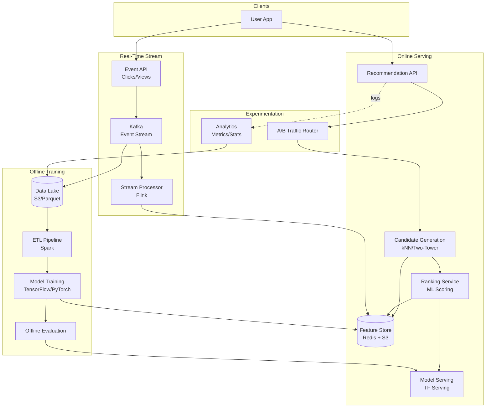

# 19-recommendation-engine - Recommendation Engine
Generated: 2025-11-02 20:38:45 -05:00

---

<!-- Source: 01-requirements.md -->
# 1) Functional & Non-Functional Requirements

## Functional Requirements

- Candidate Generation: Retrieve relevant items from 10M catalog; collaborative filtering, content-based
- Ranking: Score and re-rank candidates; personalization; business rules (diversity, freshness)
- Real-Time Signals: Incorporate clicks, views, purchases within seconds
- A/B Testing: Multiple model versions; traffic splitting; metrics tracking
- Exploration vs. Exploitation: Balance popular items with discovery
- Offline Training: Batch feature engineering; model training (daily/weekly)
- Feature Store: Precompute user/item features; low-latency lookup
- Explainability: "Because you watched X" reasoning

## Non-Functional Requirements

- Latency: p95 < 200ms end-to-end (candidate generation + ranking)
- Throughput: 50K recs/sec
- Freshness: Real-time signals reflected within 10s
- Coverage: >90% of items recommended at least once per week
- Diversity: No more than 30% from single category in top 10
- Cost: Optimize inference; cache popular user embeddings

## Scale Estimate

- Users: 100M; 10M DAU
- Items: 10M; new items 10K/day
- Interactions: 1B clicks/day; 100M purchases/day
- Features: 1K dimensions per user/item; 100M × 1K × 4B = 400GB embeddings

## Constraints

- Cold start: New users/items lack interaction history
- Data skew: Power users generate 80% of interactions
- Privacy: GDPR requires explainability and opt-out

## Success Measures

- CTR (click-through rate) > 5%; conversion rate > 2%
- Engagement: Session duration +10%; repeat visits +15%
- Offline metrics: Precision@10, Recall@10, NDCG > 0.7

---

<!-- Source: 02-architecture.md -->
# 2) High-Level Architecture (Most Detailed)

## Components

- Candidate Generation: Matrix factorization (ALS), two-tower model (user/item embeddings), kNN on embeddings
- Ranking Service: LambdaMART, deep neural net; features from Feature Store; score top 1000 → return top 10
- Feature Store: Precomputed embeddings, user history, item metadata; Redis/S3
- Real-Time Event Stream: Kafka; clicks, views, purchases; update features within seconds
- Offline Training Pipeline: Spark for ETL; TensorFlow/PyTorch for training; daily model retraining
- Model Serving: TensorFlow Serving/TorchServe; versioning; A/B traffic split
- Experimentation Platform: Traffic routing; metrics collection (CTR, conversion); statistical tests
- Logging & Analytics: Impression/click logs → data lake → offline evaluation

## Data Flows

### A) Offline Training (Daily)

1) ETL: Extract interactions from data lake; filter spam/bots; feature engineering
2) Train candidate model (two-tower): User/item embeddings via contrastive learning
3) Train ranker: Collect labels (click=1, no-click=0); train LambdaMART on features
4) Evaluate on holdout set; if metrics improve → deploy new model
5) Export embeddings to Feature Store (S3 + Redis); update model in Serving

### B) Online Recommendation (Request)

1) User requests recommendations → Ranking Service
2) Fetch user embedding from Feature Store (Redis); cache hit rate >95%
3) Candidate Generation: kNN on item embeddings → top 1000 candidates
4) Fetch item features (popularity, recency, category) from Feature Store
5) Ranker scores each candidate; applies business rules (diversity, freshness)
6) Return top 10; log impressions to Kafka

### C) Real-Time Signal Processing

1) User clicks item → event to Kafka
2) Stream processor (Flink) updates user's short-term history (last 10 actions)
3) Update Feature Store (Redis) with new user vector (incremental update)
4) Next recommendation request uses fresh features (<10s lag)

### D) A/B Testing

1) Traffic router assigns user to experiment group (control 50%, variant 50%)
2) Each group sees recommendations from different model version
3) Log impressions/clicks with experiment ID
4) Analytics: Compute CTR, conversion per group; statistical significance test
5) If variant wins → promote to production; if loses → rollback

## Data Model

- users(id, embedding_vector, last_10_actions[], cohort, created_at)
- items(id, embedding_vector, category, popularity_score, created_at)
- interactions(user_id, item_id, action[click|view|purchase], timestamp)
- experiments(id, model_version, traffic_pct, metrics_json)

## APIs

- GET /v1/recommendations?user_id=&count=10
- POST /v1/events {user_id, item_id, action}
- GET /v1/experiments/:id/metrics

Auth: OAuth; rate-limit per user; A/B experiment assignments via header.

## Why These Choices

- Two-tower model: Scales to 100M users × 10M items; precompute embeddings for fast inference
- Feature Store: Decouples training from serving; enables feature reuse across models
- Kafka for real-time: Low-latency updates; replay for backfill; fault-tolerant
- kNN on embeddings: Sub-50ms candidate generation; FAISS/Annoy for ANN search

## Monitoring

- p50/p95 recommendation latency; candidate generation time; ranking time
- CTR, conversion rate per model version
- Feature Store hit rate; stale feature rate
- Model drift: Offline eval metrics weekly

---

<!-- Source: 03-key-decisions.md -->
# 3) Key Design Decisions & Trade-Offs

## 1. Collaborative Filtering vs. Content-Based

**Decision**: Hybrid (CF for users with history; content-based for cold start).

**Rationale**: CF captures user behavior; content-based handles new items.

**Trade-off**: Complexity in blending; need both pipelines.

**When to reconsider**: If catalog is static; pure CF may suffice.

---

## 2. Matrix Factorization vs. Deep Learning

**Decision**: Two-tower deep learning for embeddings; MF as fallback.

**Rationale**: DL captures nonlinear patterns; scales better with features.

**Trade-off**: Higher training cost; need GPUs; interpretability harder.

**When to reconsider**: Small catalog (<100K items); MF (ALS) is simpler and faster.

---

## 3. Real-Time vs. Batch Feature Updates

**Decision**: Real-time for short-term history; batch for embeddings.

**Rationale**: Balance freshness with cost; embeddings stable over hours.

**Trade-off**: Eventually consistent features; requires stream processing infra.

**When to reconsider**: If latency budget allows; batch every 5 min may suffice.

---

## 4. kNN vs. Learned Index for Candidate Gen

**Decision**: kNN on embeddings (FAISS/Annoy).

**Rationale**: Fast ANN search (<50ms for 10M items); easy to update index.

**Trade-off**: Approximate (not exact top-K); index rebuild on embedding updates.

**When to reconsider**: If exact top-K needed; use learned index (slower but precise).

---

## 5. Centralized vs. Distributed Ranking

**Decision**: Centralized ranking service; shard by user cohort if needed.

**Rationale**: Simplifies model serving; most users fit in single instance.

**Trade-off**: Potential bottleneck; need horizontal scaling for high QPS.

**When to reconsider**: If >100K QPS; partition by user_id and route via proxy.

---

## 6. Precompute vs. On-Demand Embeddings

**Decision**: Precompute and cache in Feature Store.

**Rationale**: Sub-10ms lookup; batch updates sufficient for most users.

**Trade-off**: Stale embeddings (lag ~1 hour); storage cost.

**When to reconsider**: For power users; compute embeddings on-demand with real-time signals.

---

## 7. A/B Test Assignment: User-Level vs. Session-Level

**Decision**: User-level (consistent experience).

**Rationale**: Avoids confusion; metrics stable per user.

**Trade-off**: Cannot test within-session effects; longer ramp-up time.

**When to reconsider**: Short sessions (anonymous users); session-level is faster.

---

<!-- Source: 04-wrap-up.md -->
# 4) Wrap-Up: Scaling, Failures, Interview Tips

## Scaling Playbook

**0 → 1M users**
- Single model; batch training weekly; simple CF (ALS)
- Feature Store in PostgreSQL; no real-time signals

**1M → 10M users**
- Two-tower model; daily retraining; Kafka for real-time events
- Feature Store: Redis for hot embeddings; S3 for cold
- FAISS for ANN candidate generation; ranking service (10 instances)

**10M → 100M users**
- Multi-stage ranking: Candidate gen (kNN) → coarse ranker (100 candidates) → fine ranker (top 10)
- Distributed training (Horovod); model sharding by user cohort
- Experimentation platform; multi-armed bandits for exploration

---

## Failure Scenarios

| Failure | Impact | Detection | Mitigation |
|---|---|---|---|
| Feature Store cache miss | Slow recommendations | p95 latency spike | Fallback to batch embeddings in S3; populate cache asynchronously |
| Kafka lag | Stale features | Consumer lag > 10K msgs | Scale consumers; prioritize high-value users; backpressure |
| Model serving crash | No recommendations | Health check fails | Load balancer routes to healthy instances; fallback to popularity-based |
| Training pipeline failure | Outdated model | Daily job timeout | Use yesterday's model; alert ML eng; investigate ETL issues |
| Cold start (new user) | Poor recommendations | No interaction history | Content-based + trending items; prompt for preferences |

---

## SLOs

- p95 latency < 200ms; p50 < 100ms
- CTR > 5%; conversion rate > 2%
- Feature freshness < 10s for real-time signals
- Model update cadence: daily (weekly for large models)

---

## Common Pitfalls

1. Ignoring diversity → filter bubble; enforce category/creator diversity in top 10
2. Overfitting to clicks → optimize for downstream metrics (watch time, purchases)
3. No exploration → popular items dominate; use epsilon-greedy or Thompson sampling
4. Stale embeddings → poor recommendations; monitor feature freshness
5. No A/B testing → cannot measure impact; always test before full rollout

---

## Interview Talking Points

- Candidate generation vs. ranking two-stage pipeline
- Embedding learning (two-tower, contrastive loss, triplet loss)
- Real-time feature updates vs. batch precomputation tradeoffs
- Cold start strategies (content-based, trending, onboarding surveys)
- A/B testing mechanics and statistical significance

---

## Follow-Up Questions

- How to handle popularity bias and fairness in recommendations?
- How to support multi-objective optimization (CTR + revenue + diversity)?
- How to scale to 1B users with real-time personalization?
- How to implement explainability ("Recommended because...")?
- How to handle adversarial behavior (fake clicks, review bombing)?

