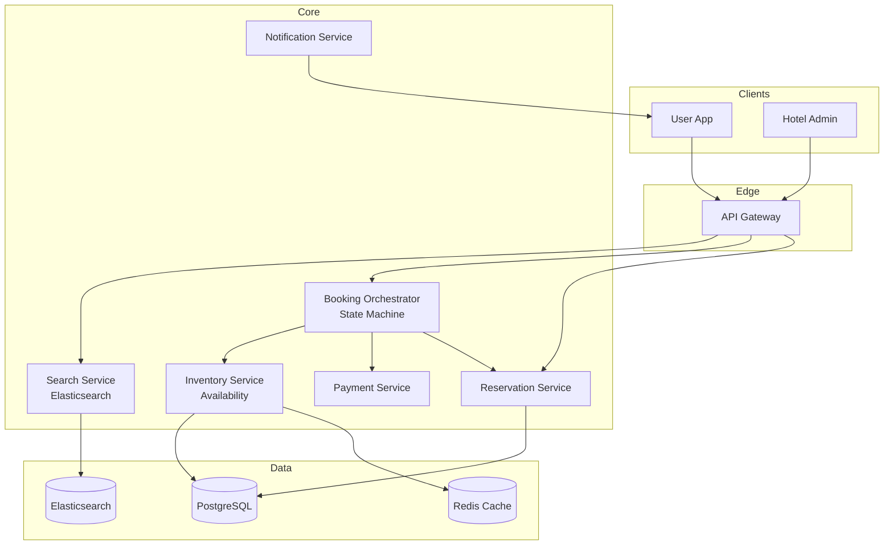

# 20-hotel-reservation-system - Hotel Reservation System
Generated: 2025-11-02 20:38:45 -05:00

---

<!-- Source: 01-requirements.md -->
# 1) Functional & Non-Functional Requirements

## Functional Requirements

- Search & Discovery: Location, dates, guests, filters (price, amenities, rating); map view
- Availability: Real-time room inventory; calendar view; rate plans (refundable, non-refundable)
- Booking: Select room; guest details; payment; confirmation; email/SMS
- Inventory Locking: Hold room during checkout (TTL 10 min); prevent double booking
- Cancellation: Policies (free, penalty); refunds; waitlist for sold-out dates
- Reviews & Ratings: Post-stay reviews; moderation; ranking impact
- Property Management: Hotel dashboard; rate/inventory updates; block dates
- Payments: Auth on book; capture post-stay or at check-in; refunds; fraud detection

## Non-Functional Requirements

- Availability: 99.9% for search/booking; graceful degradation (cache stale data)
- Latency: Search p95 < 500ms; booking p95 < 2s
- Consistency: Strong for inventory (no double booking); eventual for reviews
- Throughput: 10K bookings/min peak; 500K concurrent users searching
- Fraud Prevention: Stolen cards; fake bookings; rate-limiting

## Scale Estimate

- Properties: 1M hotels × 100 rooms avg = 100M room-night inventory
- Searches: 50M/day; peak 2K/sec
- Bookings: 1M/day; peak 10K/min
- Inventory updates: 10K/sec (rate/availability changes by hotels)

## Constraints

- Time zones: Check-in/out times vary; local time vs. UTC handling
- Concurrent bookings: Last room race condition; need locking or optimistic concurrency
- Payment holds: Auth expires after 7 days; extend or re-auth

## Success Measures

- Booking conversion rate > 10%
- Zero double bookings (strong consistency validated)
- Payment success rate > 98%
- Search-to-book latency p95 < 3s

---

<!-- Source: 02-architecture.md -->
# 2) High-Level Architecture (Most Detailed)

## Components

- Search Service: Elasticsearch; geo queries; filters; ranking (price, rating, availability)
- Inventory Service: Room availability by date; strong consistency (PostgreSQL + locks or Redis)
- Booking Orchestrator: State machine (search → hold → confirm → paid); idempotency
- Payment Service: PSP integration; auth/capture; refunds; fraud checks
- Reservation Service: CRUD on bookings; cancellations; confirmations; notifications
- Property Management: Hotel admin; rate/inventory updates; calendar management
- Review Service: CRUD reviews; moderation; ranking update pipeline
- Notification Service: Email/SMS confirmations; reminders; cancellations

## Data Flows

### A) Search & Availability

1) User searches: location, check-in/out dates, guests
2) Search Service queries Elasticsearch: geo + date range + filters
3) For each result, fetch real-time availability from Inventory Service (cache with 1-min TTL)
4) Rank by: availability, price, rating, distance; return top 20
5) User clicks property → detailed availability calendar fetched

### B) Booking Flow (Last Room Race)

1) User selects room+dates → Booking Orchestrator
2) Create booking record (status=pending); attempt inventory lock:
   - Pessimistic: `SELECT ... FOR UPDATE` on inventory row; if available → decrement; TTL 10 min
   - Optimistic: Read inventory version; on confirm, update with version check (CAS)
3) If lock acquired → redirect to payment
4) User enters payment → Payment Service auths card (hold funds)
5) On auth success → Booking Orchestrator confirms booking (status=confirmed); capture payment later
6) Release lock; send confirmation email/SMS
7) If TTL expires → release lock; booking auto-cancels

### C) Cancellation & Refund

1) User cancels booking → Reservation Service validates policy
2) If free cancellation → full refund; if penalty → partial refund
3) Payment Service processes refund (async; takes 5-7 days)
4) Inventory Service increments room count (make available again)
5) Notify user; update property availability in search index

### D) Property Rate/Inventory Updates

1) Hotel updates rate or blocks dates via Property Management UI
2) Write to Inventory Service; trigger cache invalidation
3) Async reindex in Elasticsearch (eventual consistency; OK for search)
4) Booking Orchestrator checks inventory before confirming (strong consistency)

## Data Model

- properties(id, name, location{lat,lng}, amenities[], rating, reviews_count)
- rooms(id, property_id, type, price, capacity)
- inventory(room_id, date, available_count, version, updated_at)
- bookings(id, user_id, room_id, check_in, check_out, status, total, payment_id, idempotency_key)
- payments(id, booking_id, amount, auth_code, captured_at, status)
- reviews(id, property_id, user_id, rating, text, created_at)

## APIs

- GET /v1/search?location=&check_in=&check_out=&guests=
- POST /v1/bookings {room_id, dates, guest_info, idempotency_key}
- POST /v1/bookings/:id/cancel
- GET /v1/properties/:id/availability?check_in=&check_out=

Auth: OAuth; payments via tokenized cards (PCI vault); admin via API keys.

## Why These Choices

- Elasticsearch for search: Geo queries, faceting, fast relevance ranking
- Pessimistic locking for last room: Prevents double booking; simple correctness
- Idempotency keys on bookings: Network retries safe; no duplicate charges
- Async payment capture: Reduces fraud (cancel if guest no-show); aligns with hotel check-in

## Monitoring

- Search latency; availability cache hit rate
- Booking funnel conversion (search → view → book → paid)
- Lock timeouts (inventory held but not confirmed)
- Payment auth/capture success rates; fraud blocks

---

<!-- Source: 03-key-decisions.md -->
# 3) Key Design Decisions & Trade-Offs

## 1. Pessimistic vs. Optimistic Locking

**Decision**: Pessimistic (SELECT FOR UPDATE) for last room inventory.

**Rationale**: Strong consistency; prevents double booking; acceptable contention at scale.

**Trade-off**: Locks held during checkout (~2 min); can block other users.

**When to reconsider**: If contention is high (>10% lock failures); use optimistic (CAS with retries).

---

## 2. Payment Auth vs. Capture Timing

**Decision**: Auth on booking; capture at check-in or post-stay.

**Rationale**: Aligns with hotel policy; reduces fraud (cancel if no-show); better CX.

**Trade-off**: Auth holds expire after 7 days; need to extend or re-auth.

**When to reconsider**: If cancellation rate is low; capture immediately to reduce auth management.

---

## 3. Search Index: Real-Time vs. Cached Availability

**Decision**: Cache availability in Elasticsearch (1-min TTL); fetch real-time on booking.

**Rationale**: Fast search without hitting Inventory DB; eventual consistency OK for browsing.

**Trade-off**: User may see unavailable room in search; corrected on booking attempt.

**When to reconsider**: If false positives hurt conversion; reduce cache TTL to 10s.

---

## 4. Inventory Storage: SQL vs. NoSQL

**Decision**: PostgreSQL with row-level locks.

**Rationale**: ACID transactions; strong consistency; well-understood locking semantics.

**Trade-off**: Vertical scaling limits; need partitioning by property_id for large scale.

**When to reconsider**: If >10M properties; shard by geography or use distributed DB (CockroachDB).

---

## 5. Booking TTL: Fixed vs. Adaptive

**Decision**: Fixed 10-min TTL for inventory hold.

**Rationale**: Simple; industry standard; balances user UX with inventory churn.

**Trade-off**: Power users may need more time; short TTL can frustrate.

**When to reconsider**: If checkout abandonment is high; offer extension option (click to extend 5 min).

---

## 6. Cancellation: Sync vs. Async Refund

**Decision**: Async refund processing (5-7 days).

**Rationale**: PSP constraint; immediate UX (confirmation); backend handles delay.

**Trade-off**: User waits for refund; need clear communication.

**When to reconsider**: If offering instant refunds as credits (Wallet balance); use for loyalty.

---

## 7. Reviews: Immediately Visible vs. Moderated

**Decision**: Moderated (approve within 24h).

**Rationale**: Prevents spam, fake reviews; maintains quality.

**Trade-off**: Delayed visibility; moderation cost.

**When to reconsider**: If trust is high; allow immediate with retroactive takedown.

---

<!-- Source: 04-wrap-up.md -->
# 4) Wrap-Up: Scaling, Failures, Interview Tips

## Scaling Playbook

**0 → 100K bookings/day**
- Single PostgreSQL; Elasticsearch single node; basic search/book
- Payment via Stripe; email notifications

**100K → 1M bookings/day**
- Shard inventory DB by property_id; read replicas for search
- Elasticsearch cluster (10 nodes); regional deployments
- Redis for inventory cache (1-min TTL); lock manager (Redlock)
- Payment orchestration with retry logic; fraud scoring

**1M → 10M bookings/day**
- Multi-region active-active (geo-routed); eventual consistency for reviews/ratings
- Distributed inventory locks (etcd/Consul); partition by region
- Advanced fraud detection (ML models); chargebacks handling
- A/B testing on checkout flow; conversion optimization

---

## Failure Scenarios

| Failure | Impact | Detection | Mitigation |
|---|---|---|---|
| Inventory DB outage | Cannot book | Write errors; timeout | Read-only mode; queue bookings; process when DB recovers |
| Search index stale | Wrong availability shown | Cache age > 5 min | Reindex; reduce TTL; fallback to DB for booking |
| Payment PSP down | Bookings fail | PSP API errors | Failover to secondary PSP; queue for retry |
| Lock timeout (user slow) | Inventory held unnecessarily | Booking TTL expired | Auto-release; notify user; allow restart |
| Double booking (race) | Customer dispute | Two confirmed bookings same room/date | Refund + upgrade; compensate; investigate lock failure |

---

## SLOs

- Search p95 < 500ms; booking p95 < 2s
- Zero double bookings (validated daily via reconciliation)
- Payment auth success > 98%; capture within 24h of check-in
- Booking confirmation delivery < 10s

---

## Common Pitfalls

1. No idempotency on bookings → duplicate charges on network retry
2. Weak locks → double booking; use strong consistency (SELECT FOR UPDATE or CAS with version)
3. Ignoring time zones → wrong check-in/out times; normalize to UTC, display local
4. No TTL on locks → inventory starved; enforce automatic release
5. Stale search results → user frustration; balance cache TTL with consistency needs

---

## Interview Talking Points

- Pessimistic vs. optimistic locking for inventory (last room problem)
- Idempotency strategies for payment and booking APIs
- Search vs. booking consistency models (eventual vs. strong)
- Payment auth/capture workflows and PSP failover
- Time zone handling and inventory calendar representation

---

## Follow-Up Questions

- How to support dynamic pricing (surge during high demand)?
- How to handle overbooking (common in airlines/hotels)?
- How to implement loyalty programs and points redemption?
- How to support multi-room bookings (group reservations)?
- How to integrate with channel managers (Expedia, Booking.com)?

