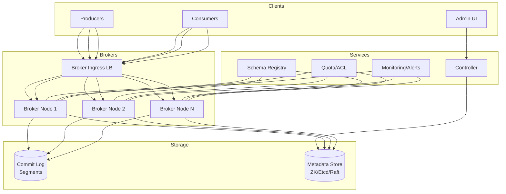

# 21-distributed-message-broker - Distributed Message Broker
Generated: 2025-11-02 20:38:45 -05:00

---

<!-- Source: 01-requirements.md -->
# 1) Functional & Non-Functional Requirements

## Functional Requirements

- Publish/Subscribe: Producers send messages to topics; consumers subscribe
- Ordering: Per-partition ordering (within partition); global ordering optional
- Durability: Persist messages to disk; replicated; configurable retention (time/size)
- Delivery Semantics: At-least-once, at-most-once, exactly-once (idempotent producer + transactional consumer)
- Consumer Groups: Multiple consumers share partition load; offset management
- Backpressure: Consumers pull at own pace; no message loss if consumer slow
- Dead Letter Queue: Unprocessable messages routed to DLQ after retries
- Compaction: Keep only latest value per key (for change-data-capture)

## Non-Functional Requirements

- Throughput: 10M messages/sec; 100MB/sec per partition
- Latency: p99 < 10ms producer; < 50ms end-to-end (producer → consumer)
- Availability: 99.99% with replication; leader election < 5s
- Durability: Zero message loss with replication factor 3 and acks=all
- Scalability: 100K topics; 1M partitions; horizontal scaling

## Scale Estimate

- Messages: 10M/sec × 1KB avg = 10GB/sec = 864TB/day
- Retention: 7 days × 864TB = 6PB total (compressed to ~2PB)
- Partitions: 1M partitions × 3 replicas = 3M partition replicas
- Consumers: 100K consumer groups; avg 10 consumers/group = 1M consumers

## Constraints

- Ordering within partition only (not across partitions)
- Replication lag: Typically <100ms; can spike to seconds under load
- Compaction not real-time: Runs periodically (minutes)

## Success Measures

- Zero message loss (validated via end-to-end counters)
- p99 latency < 10ms producer; < 50ms consumer
- Replication lag p99 < 200ms
- Leader election < 5s; no data loss on failover

---

<!-- Source: 02-architecture.md -->
# 2) High-Level Architecture (Most Detailed)

## Components

- Brokers: Store partitions; handle reads/writes; coordinate via ZooKeeper/KRaft (Kafka)
- Topics & Partitions: Logical grouping; each partition is ordered log; replicated across brokers
- Leader Election: Per-partition leader (writes); followers replicate; ZooKeeper/Raft for coordination
- Producer: Batches messages; compresses; partitions by key; acks config (0/1/all)
- Consumer Groups: Share partitions; track offsets; rebalance on member join/leave
- Offset Storage: Committed offsets in internal topic (__consumer_offsets); durable
- Replication: In-Sync Replicas (ISR); leader waits for ISR acks before commit
- Compaction: Background process; keeps latest message per key; tombstones for deletes

## Data Flows

### A) Publish (Producer → Broker)

1) Producer batches messages (e.g., 100 msgs or 16KB); compresses (gzip/snappy)
2) Partition by key (hash(key) % num_partitions) or round-robin if no key
3) Send to leader broker for partition
4) Leader writes to log (append-only); optionally waits for ISR replicas to ack
5) Return ack to producer (based on acks config: 0=fire-and-forget, 1=leader, all=ISR)

### B) Replication (Leader → Follower)

1) Follower continuously fetches from leader (high-water mark)
2) Follower appends to local log; sends ack to leader
3) Leader updates high-water mark (offset up to which all ISR have replicated)
4) Consumers can only read up to high-water mark (committed messages)

### C) Consume (Consumer → Broker)

1) Consumer subscribes to topic; joins consumer group
2) Coordinator assigns partitions to consumers (rebalance protocol)
3) Consumer fetches from partition leader; starts at last committed offset
4) Consumer processes message; commits offset (auto or manual)
5) On rebalance (consumer add/remove), partitions reassigned; consumers resume from last offset

### D) Leader Failover

1) Leader broker crashes; ZooKeeper/KRaft detects (heartbeat timeout)
2) Controller elects new leader from ISR; updates metadata
3) Producers/consumers refresh metadata; route traffic to new leader
4) No message loss (only ISR members eligible for leadership)

## Data Model

- topics(name, partitions_count, replication_factor, retention_ms)
- partitions(topic, partition_id, leader_broker_id, replicas[], isr[])
- messages(offset, key, value, timestamp, headers)
- offsets(consumer_group, topic, partition, committed_offset)

## APIs

- Producer: `send(topic, key, value)`
- Consumer: `subscribe(topics)`, `poll()`, `commit_offsets()`
- Admin: `create_topic(name, partitions, replication_factor)`, `describe_topic(name)`

Auth: SASL/SCRAM; mTLS; ACLs per topic.

## Why These Choices

- Append-only log: Sequential writes (fast); immutable; replay-friendly
- Per-partition ordering: Scales horizontally; global ordering doesn't scale
- Pull-based consumers: Natural backpressure; consumers control pace
- ISR replication: Balance durability and latency; configurable acks

## Monitoring

- Producer throughput; batch size; compression ratio
- Consumer lag (offset delta); rebalance frequency
- Replication lag per partition; ISR shrink/expand events
- Leader election time; broker under-replicated partitions

---

<!-- Source: 03-key-decisions.md -->
# 3) Key Design Decisions & Trade-Offs

## 1. Push vs. Pull for Consumers

**Decision**: Pull-based (consumers poll brokers).

**Rationale**: Natural backpressure; consumers control pace; no broker overload.

**Trade-off**: Consumers must loop; empty polls waste CPU (mitigated by long-poll).

**When to reconsider**: Real-time notifications; push via WebSocket may be better.

---

## 2. Replication: Sync vs. Async

**Decision**: Configurable (acks=all for sync ISR; acks=1 for async leader-only).

**Rationale**: Balance durability with latency; let producers choose.

**Trade-off**: acks=all adds 10-50ms latency; acks=1 risks message loss on leader crash.

**When to reconsider**: If all traffic is critical; enforce acks=all via broker config.

---

## 3. Partitioning: By Key vs. Round-Robin

**Decision**: Hash(key) % partitions if key provided; else round-robin.

**Rationale**: Ordering per key; load balancing when no key.

**Trade-off**: Hot keys cause partition skew; need re-partitioning or sub-partitioning.

**When to reconsider**: If keys are evenly distributed; hash partitioning works well.

---

## 4. Offset Storage: Broker vs. External

**Decision**: Store in broker (__consumer_offsets topic).

**Rationale**: Simplifies architecture; leverages broker durability; atomic commit with message processing (transactions).

**Trade-off**: Broker dependency; if broker down, cannot commit offsets.

**When to reconsider**: If external coordination needed (e.g., Flink checkpoints in S3).

---

## 5. Leader Election: ZooKeeper vs. KRaft

**Decision**: KRaft (Kafka-native Raft) for new clusters.

**Rationale**: Removes ZooKeeper dependency; faster recovery; simpler ops.

**Trade-off**: KRaft is newer (since Kafka 2.8); ZooKeeper more battle-tested.

**When to reconsider**: Legacy clusters; stick with ZooKeeper until KRaft is proven.

---

## 6. Retention: Time-Based vs. Size-Based

**Decision**: Both (whichever limit reached first).

**Rationale**: Flexibility; prevent disk full while honoring time requirements.

**Trade-off**: Complexity in cleanup logic; need monitoring for both.

**When to reconsider**: Pure streaming (no replay); short retention (hours) simplifies.

---

## 7. Compaction: Always vs. On-Demand

**Decision**: On-demand (enable per topic for CDC use cases).

**Rationale**: Most topics don't need compaction; adds overhead.

**Trade-off**: Compacted topics have higher read amplification; lag during compaction.

**When to reconsider**: If all topics are key-value stores (rare); enable by default.

---

<!-- Source: 04-wrap-up.md -->
# 4) Wrap-Up: Scaling, Failures, Interview Tips

## Scaling Playbook

**0 → 1M messages/sec**
- 3-broker cluster; 100 partitions; replication factor 3
- Single ZooKeeper ensemble; basic monitoring

**1M → 10M messages/sec**
- 20-broker cluster; 1000 partitions; rack-aware placement
- KRaft for leader election; tiered storage (S3 for old segments)
- Producer tuning (batching, compression, idempotence)

**10M → 100M messages/sec**
- Multi-cluster per region; 100+ brokers per cluster
- Federation or mirroring for cross-region replication
- Advanced monitoring (Prometheus, Grafana); quotas per client

---

## Failure Scenarios

| Failure | Impact | Detection | Mitigation |
|---|---|---|---|
| Leader broker crash | Partition unavailable briefly | Heartbeat timeout | Controller elects new leader from ISR (<5s); no data loss |
| ISR shrink (replica lag) | Durability risk | ISR count < min.insync.replicas | Alert; investigate slow replica; reject writes if ISR too small |
| Consumer lag spike | Delayed processing | Lag > threshold | Scale consumers; optimize processing; backpressure upstream |
| Disk full | Writes rejected | Disk usage > 90% | Retention cleanup; add brokers; alert |
| Network partition | Split-brain risk | ZooKeeper/KRaft quorum loss | Fencing via epoch; reject stale leaders; manual intervention |

---

## SLOs

- p99 producer latency < 10ms; end-to-end < 50ms
- Zero message loss with acks=all and replication factor 3
- Leader election < 5s; replication lag p99 < 200ms
- Consumer lag < 1M messages (or 10s lag for real-time)

---

## Common Pitfalls

1. Under-partitioned topics → throughput bottleneck; over-partition early (but not >1K/broker)
2. No idempotent producer → duplicates on retry; enable idempotence
3. Auto-commit offsets → message loss if consumer crashes before processing; use manual commit
4. Hot partitions (single key sends all traffic) → partition skew; use composite keys or sub-partition
5. Ignoring consumer lag → messages pile up; alert and autoscale consumers

---

## Interview Talking Points

- Append-only log mechanics and why it's fast (sequential I/O)
- ISR replication and acks tradeoffs (durability vs. latency)
- Consumer group rebalancing and offset management
- Leader election via ZooKeeper/KRaft and split-brain prevention
- Exactly-once semantics (idempotent producer + transactional consumer)

---

## Follow-Up Questions

- How to handle poison pill messages (consumer crashes on one message)?
- How to implement schema evolution (Avro, Protobuf) with registry?
- How to support multi-tenancy with quotas and isolation?
- How to mirror topics across data centers (active-passive vs. active-active)?
- How to implement tiered storage (hot on SSD, cold on S3)?

