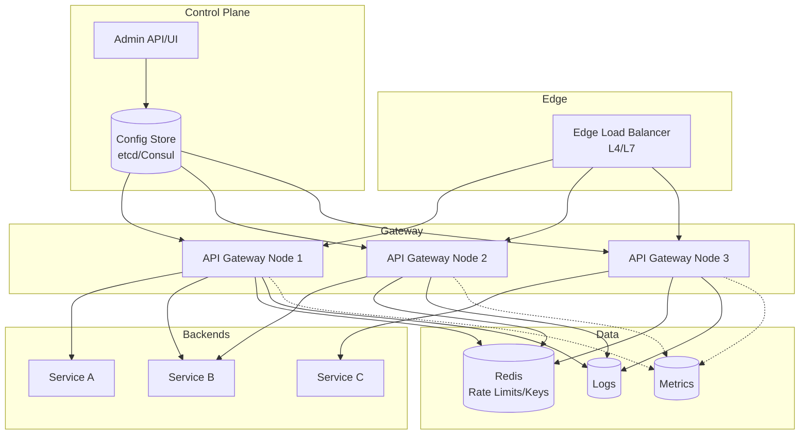

# 22-api-gateway-service - Api Gateway Service
Generated: 2025-11-02 20:38:45 -05:00

---

<!-- Source: 01-requirements.md -->
# Requirements & Scale

## Functional Requirements

### Core Capabilities
1. **Request Routing**: Route incoming HTTP/gRPC requests to appropriate backend services based on path, method, headers
2. **Authentication & Authorization**: Validate JWT/OAuth tokens, enforce RBAC/ABAC policies, integrate with identity providers
3. **Rate Limiting**: Enforce per-user, per-API, per-tenant quotas with token bucket/leaky bucket algorithms
4. **Protocol Translation**: Convert REST↔gRPC, HTTP/1.1↔HTTP/2, WebSocket upgrade support
5. **Load Balancing**: Distribute requests across backend instances with health checks and failover
6. **Circuit Breaking**: Detect unhealthy backends, fail fast, auto-recovery with exponential backoff
7. **Request/Response Transformation**: Header injection/removal, body rewriting, compression
8. **Observability**: Metrics (latency, throughput, errors), distributed tracing (OpenTelemetry), access logs

### Advanced Features
- API versioning (header/path-based)
- CORS handling with origin whitelisting
- GraphQL gateway with schema stitching
- Caching with per-route TTL policies
- Request validation with OpenAPI schemas
- Canary routing and A/B testing
- DDoS mitigation (IP blacklisting, geo-blocking)

## Non-Functional Requirements

### Performance
- **Latency Overhead**: <5ms p99 added latency for proxy path, <2ms p50
- **Throughput**: 100K+ RPS per gateway node (8 vCPU), horizontal scaling to 1M+ RPS
- **Connection Pooling**: Reuse backend connections, 10K concurrent connections per node

### Availability
- **Uptime**: 99.99% SLA (~4min downtime/month)
- **Redundancy**: Multi-AZ deployment with health-based routing
- **Zero-Downtime Deploys**: Rolling updates with connection draining

### Scalability
- **Backend Services**: Support 500+ services with 5K+ routes
- **Configuration Updates**: Propagate route changes within 30 seconds cluster-wide
- **Auto-Scaling**: Scale gateway nodes based on CPU/RPS metrics

### Security
- **TLS Termination**: TLS 1.3 at edge, optional mTLS to backends
- **Secret Management**: Rotate JWT signing keys without downtime
- **DoS Protection**: Rate limit per IP/subnet, global throttling under load

## Scale Estimates

### Traffic Profile
- **Peak Traffic**: 1M RPS globally across all regions
- **Per-Region**: 300K RPS (3 regions: US-East, EU-West, APAC)
- **Per-Gateway Node**: 100K RPS (3 nodes per region for N+1 redundancy)
- **Backend Services**: 500 services, 5K routes (10 routes/service average)
- **Request Size**: 2KB avg (1KB req + 1KB resp)

### Infrastructure
- **Gateway Nodes**: 9 nodes globally (3 per region × 3 regions), 8 vCPU each
- **Data Transfer**: 1M RPS × 2KB = 2GB/s = 172TB/day bandwidth
- **Configuration Storage**: 5K routes × 10KB/route = 50MB config (in-memory + etcd/Consul)
- **Metrics & Logs**: 1M RPS × 500 bytes/log = 500MB/s logs, 1M metrics/sec

### Cost Estimation
- **Compute**: 9 nodes × $200/mo = $1,800/mo (load balancer type instances)
- **Bandwidth**: 172TB/day × $0.08/GB = ~$400K/mo (inter-region + egress)
- **Observability**: $50K/mo (metrics, logs, traces at scale)

## Constraints
- **Stateless Gateway**: No local session state; all auth validation via remote calls or cached tokens
- **Configuration Drift**: Config updates must propagate via control plane (etcd/Consul), not manual SSH
- **Backward Compatibility**: API versioning must support 2 major versions simultaneously
- **Regulatory**: GDPR compliance for logging (no PII in access logs), data residency per region

## Success Measures
- **Latency SLA**: 99.9% of requests meet <5ms overhead target
- **Availability**: <1 incident/month with p95 MTTR <10min
- **Configuration Propagation**: 95% of route updates live within 30s
- **Backend Protection**: Circuit breakers prevent cascading failures (zero backend overload incidents)
- **Cost Efficiency**: <$0.001/request total infrastructure cost


---

<!-- Source: 02-architecture.md -->
# 2) High-Level Architecture (Most Detailed)



## Components (What & Why)

### 1. Edge Load Balancer (L4/L7)
**What**: Cloud-native load balancer (AWS ALB/NLB, GCP GCLB) that distributes incoming traffic across gateway nodes.

**Why**:
- **Health-Based Routing**: Removes unhealthy gateway nodes from rotation automatically
- **TLS Termination**: Offloads SSL/TLS handshake from gateway nodes (or passes through for mTLS)
- **DDoS Protection**: First line of defense with rate limiting and IP blacklisting

**Alternatives**: Nginx/HAProxy self-managed, but cloud LBs offer integrated WAF/DDoS

---

### 2. API Gateway Nodes (Stateless)
**What**: Golang/Rust-based proxy servers (e.g., Kong, Envoy, custom) that handle request routing, auth, rate limiting, transformations.

**Why**:
- **Low Latency**: Compiled languages (Go/Rust) keep overhead <2ms for hot path
- **Stateless Design**: Enables horizontal scaling without coordination overhead
- **Plugin Architecture**: Extend with custom logic (Lua scripts in Kong, WASM in Envoy)

**Key Responsibilities**:
- Route lookup from in-memory config (O(1) trie-based matching)
- JWT validation with cached public keys (refresh every 5min)
- Rate limiting with local token buckets (Redis for distributed state)
- Circuit breaker state machine (closed→open→half-open transitions)
- Backend connection pooling with HTTP/2 multiplexing

---

### 3. Configuration Control Plane (etcd/Consul)
**What**: Distributed key-value store that holds gateway configuration (routes, rate limits, auth policies).

**Why**:
- **Consistent Updates**: Watch mechanism pushes config changes to all gateway nodes within seconds
- **Versioning**: Track config history, rollback on bad deploys
- **Dynamic Discovery**: Backends register via service mesh (Consul Connect, Istio)

**Configuration Schema** (example):
```json
{
  "routes": [
    {
      "id": "user-service-v1",
      "path": "/api/v1/users/*",
      "methods": ["GET", "POST"],
      "backends": ["user-service:8080"],
      "auth": "jwt",
      "rate_limit": {"requests": 1000, "window": "1m"},
      "timeout": "5s",
      "retry": {"attempts": 2, "backoff": "exponential"}
    }
  ]
}
```

---

### 4. Rate Limiter (Redis Cluster)
**What**: Distributed Redis cluster storing token bucket counters per user/API/tenant.

**Why**:
- **Atomic Operations**: Redis INCR/EXPIRE commands provide accurate counting without race conditions
- **Low Latency**: <1ms p99 latency for counter reads/writes in same AZ
- **Sliding Window**: Use Redis sorted sets for sliding window counters (more accurate than fixed windows)

**Algorithm**: Token Bucket (default) or Leaky Bucket
- Each user gets N tokens, refilled at rate R
- Request consumes 1 token; reject if bucket empty
- Redis key: `rate_limit:{user_id}:{api_route}`, TTL = window duration

**Fallback**: Local in-memory rate limiting if Redis unreachable (eventual consistency)

---

### 5. Authentication Service Integration
**What**: Gateway validates JWT tokens by calling auth service or caching public keys.

**Why**:
- **JWT Validation**: Verify signature with cached public key (RSA/ECDSA), check expiry/claims
- **OAuth Introspection**: For opaque tokens, call auth service `/introspect` endpoint (cached 60s)
- **RBAC/ABAC**: Enforce permissions based on token claims (roles, scopes, attributes)

**Optimization**: Cache valid tokens in local LRU (60s TTL) to avoid repeated auth calls

---

### 6. Circuit Breaker (Local State Machine)
**What**: Per-backend state machine tracking failure rate and response times.

**Why**:
- **Fail Fast**: If backend error rate >50% over 10s window, open circuit (reject requests immediately)
- **Auto-Recovery**: After 30s timeout, enter half-open state (send 1 probe request)
- **Cascading Failure Prevention**: Stop sending traffic to dying backends, give them time to recover

**States**:
- **Closed**: Normal operation, requests flow through
- **Open**: Fail fast with 503 Service Unavailable
- **Half-Open**: Allow limited traffic to test recovery

**Thresholds** (configurable per route):
- Error rate: >50% errors in 10s window
- Latency: p99 >5s for 10 consecutive requests
- Timeout: 30s before half-open transition

---

### 7. Observability Stack
**What**: Prometheus (metrics), Loki/ELK (logs), Jaeger/Zipkin (traces).

**Why**:
- **Metrics**: Track per-route latency (p50/p95/p99), throughput, error rate, circuit breaker state
- **Logs**: Access logs with request ID, sanitized headers (no auth tokens), response status
- **Traces**: Distributed tracing with OpenTelemetry, correlate gateway→backend requests

**Key Metrics**:
- `gateway_request_duration_seconds{route, status}` (histogram)
- `gateway_requests_total{route, status}` (counter)
- `gateway_circuit_breaker_state{backend}` (gauge: 0=closed, 1=open, 2=half-open)
- `gateway_rate_limit_exceeded_total{user, route}` (counter)

---

## Data Flows

### Flow A: Happy Path Request (JWT Auth, No Rate Limit Hit)
1. **Client** → Edge LB (TLS termination)
2. **Edge LB** → Gateway Node (HTTP/2)
3. **Gateway Node**:
   - Route lookup in local config trie (O(1), <100μs)
   - JWT validation: Check local cache (hit) → validate signature → extract user_id
   - Rate limit check: Redis GET `rate_limit:{user_id}:{route}` → decrement token → OK
   - Circuit breaker check: Backend is "closed" state → proceed
   - Backend request: Connection pool → HTTP/2 request to backend service
4. **Backend Service** → Gateway Node (response)
5. **Gateway Node**:
   - Response transformation (add CORS headers, compress gzip)
   - Emit metrics (latency, status code)
   - Log access (request_id, user_id, route, status, duration)
6. **Gateway Node** → Edge LB → Client

**Latency Breakdown**:
- Route lookup: 100μs
- JWT validation (cached): 500μs
- Rate limit check (Redis): 1ms
- Backend request: 20ms (backend processing)
- Response processing: 500μs
- **Total**: ~22ms (2ms gateway overhead + 20ms backend)

---

### Flow B: Rate Limit Exceeded
1. **Client** → Gateway Node (same as Flow A steps 1-3)
2. **Gateway Node**:
   - Rate limit check: Redis GET `rate_limit:{user_id}:{route}` → token bucket empty
   - Return 429 Too Many Requests with Retry-After header
3. **Gateway Node** → Client (no backend call)

**Short-Circuit**: Rate limit check happens before backend call, saving backend load

---

### Flow C: Circuit Breaker Open (Backend Unhealthy)
1. **Client** → Gateway Node
2. **Gateway Node**:
   - Route lookup → Auth validation → Rate limit check (all pass)
   - Circuit breaker check: Backend is "open" state (>50% error rate in last 10s)
   - Return 503 Service Unavailable (no backend call)
3. **Gateway Node** → Client

**Background**: Separate goroutine monitors circuit breaker state:
- Every 30s in "open" state → transition to "half-open"
- In "half-open": Allow 1 request through → if success, close circuit; if fail, reopen for another 30s

---

### Flow D: Configuration Update (New Route)
1. **Admin** → Control Plane API (POST `/routes` with new config)
2. **Control Plane**:
   - Validate config (JSON schema check)
   - Store in etcd with version number
   - etcd triggers watch event to all gateway nodes
3. **Gateway Nodes** (all instances):
   - Receive etcd watch event within 1-5s
   - Reload in-memory route trie (atomic swap, zero downtime)
   - Emit metric `gateway_config_reload_timestamp`
4. **Control Plane** → Admin (ACK with propagation status)

**Rollback**: If validation fails post-deploy, control plane reverts to previous version automatically

---

## Minimal Data Model

### Configuration Storage (etcd/Consul)
```
routes:
  - id: UUID
    path: string (regex pattern)
    methods: [string]
    backends: [string] (service names or IPs)
    auth: enum (none, jwt, oauth, api_key)
    rate_limit:
      requests: int
      window: duration
    timeout: duration
    retries:
      attempts: int
      backoff: enum (fixed, exponential)
    circuit_breaker:
      error_threshold: float (0.5 = 50%)
      timeout: duration
      half_open_requests: int

auth_policies:
  - id: UUID
    type: enum (jwt, oauth)
    jwt_issuer: string
    jwt_public_key: string (cached)
    scopes: [string]

rate_limit_overrides:
  - user_id: UUID
    route_id: UUID
    custom_limit: int
```

### Runtime State (Redis)
```
rate_limit:{user_id}:{route_id} → int (token count)
  TTL: window duration (e.g., 60s)

circuit_breaker:{backend}:state → enum (closed, open, half_open)
  TTL: none (persistent until state change)

circuit_breaker:{backend}:error_count → int
  TTL: window duration (10s)
```

### Metrics (Prometheus)
```
gateway_request_duration_seconds{route, status, method} → histogram
gateway_requests_total{route, status} → counter
gateway_backend_connections{backend, state} → gauge
gateway_rate_limit_exceeded_total{user, route} → counter
gateway_circuit_breaker_state{backend} → gauge (0/1/2)
gateway_jwt_validation_failures_total{reason} → counter
```

---

## API Design

### Client-Facing (Proxied APIs)
Gateway proxies all client requests transparently—no gateway-specific API for clients.

Example proxied request:
```http
GET /api/v1/users/123 HTTP/1.1
Host: api.example.com
Authorization: Bearer eyJhbGc...
X-Request-ID: uuid-1234
```

Gateway adds internal headers to backend:
```http
GET /users/123 HTTP/1.1
Host: user-service:8080
X-User-ID: uuid-5678 (extracted from JWT)
X-Forwarded-For: 1.2.3.4
X-Request-ID: uuid-1234 (pass-through or generate)
```

---

### Admin/Control Plane API

**1. Route Management**
```http
POST /admin/routes
Content-Type: application/json

{
  "path": "/api/v2/orders/*",
  "backends": ["order-service-v2:8080"],
  "auth": "jwt",
  "rate_limit": {"requests": 500, "window": "1m"}
}
```

**2. Circuit Breaker Override**
```http
POST /admin/circuit-breaker/{backend}/reset
→ Manually close circuit (emergency override)
```

**3. Health Check**
```http
GET /health
→ 200 OK + {status: "healthy", uptime: "5d3h", config_version: "v123"}
```

**4. Metrics Endpoint** (for Prometheus scraping)
```http
GET /metrics
→ Prometheus text format with all gateway metrics
```

---

## Monitoring Cheat-Sheet

### Golden Signals
1. **Latency**: `gateway_request_duration_seconds` (p50/p95/p99)
   - Alert if p99 >5ms for 5 consecutive minutes
2. **Traffic**: `gateway_requests_total` (QPS)
   - Monitor 5-min rolling average, alert on 50% drop
3. **Errors**: `gateway_requests_total{status=~"5..|429"}`
   - Alert if error rate >1% for 5min
4. **Saturation**: CPU/memory per gateway node
   - Alert if CPU >80% for 10min (trigger auto-scale)

### Critical Dashboards
- **Per-Route Performance**: Latency/throughput heatmap by route
- **Circuit Breaker States**: Real-time view of open/half-open backends
- **Rate Limit Violations**: Top 10 users/IPs hitting rate limits
- **Configuration Propagation**: Time since last config update per node

### Log Queries (Sample)
- **Failed Requests**: `status >= 500 AND route = "/api/v1/orders"`
- **Slow Requests**: `duration > 5s`
- **Auth Failures**: `jwt_validation_failure = true`

### Alerts
- **High Latency**: p99 >5ms for 5min → page on-call
- **Circuit Breaker Open**: Any backend in "open" state for >2min → investigate backend health
- **Config Drift**: Node config version mismatch for >5min → check control plane connectivity
- **Rate Limit Abuse**: Single user hits rate limit >100 times/min → potential DDoS


---

<!-- Source: 03-key-decisions.md -->
# Key Technical Decisions

## 1. Stateless Gateway Nodes vs. Sticky Sessions

**Decision**: **Stateless gateway nodes** with all auth/rate-limit state in external stores (Redis, auth service).

**Rationale**:
- **Horizontal Scalability**: Add/remove nodes without state migration or connection draining complexity
- **Zero Downtime Deploys**: Rolling updates don't lose in-flight state (auth tokens cached in Redis, not locally)
- **Load Balancer Simplicity**: No session affinity needed, pure round-robin works

**Trade-offs**:
- **Latency**: Every request hits Redis for rate limit check (~1ms overhead vs. local memory)
- **Redis Dependency**: Rate limiting degrades if Redis is unavailable (fallback to local in-memory counters)
- **Cache Stampede**: JWT public key cache misses trigger auth service calls (mitigated with 5-min TTL)

**When to Reconsider**:
- If Redis latency >5ms p99, consider local rate limit caches with eventual consistency
- For extreme low-latency requirements (<1ms overhead), explore in-process state with gossip protocols

---

## 2. Token Bucket vs. Leaky Bucket Rate Limiting

**Decision**: **Token Bucket** as default with configurable Leaky Bucket per route.

**Rationale**:
- **Burst Tolerance**: Token bucket allows short bursts (e.g., 100 req/s sustained, burst to 200 for 1s)
- **User Experience**: Bursty clients (mobile apps reconnecting) don't hit rate limits unnecessarily
- **Simple Implementation**: Redis INCR + EXPIRE commands handle token refill atomically

**Leaky Bucket** (alternative for strict pacing):
- Used for abuse-prone APIs (e.g., SMS sending) where burst is undesirable
- Guarantees fixed rate (no bursts), better for backend protection

**Trade-offs**:
- **Token Bucket**: Bursts can overwhelm backends if too many users burst simultaneously
- **Leaky Bucket**: Rejects legitimate burst traffic during reconnection storms

**When to Reconsider**:
- If backend services can't handle bursts, switch to Leaky Bucket for those routes
- For DDoS-prone endpoints, use sliding window counters (more accurate but higher Redis load)

---

## 3. Local Circuit Breaker State vs. Distributed Coordination

**Decision**: **Local per-node circuit breaker** state with no cross-node coordination.

**Rationale**:
- **Zero Latency Overhead**: No remote calls to check circuit state (decision in <1μs)
- **Independent Failure Detection**: Each gateway independently detects backend issues (no coordination delay)
- **Simpler Implementation**: Avoids distributed consensus complexity

**Trade-offs**:
- **Inconsistent State**: Node A might have circuit open while Node B is closed (delayed convergence)
- **Redundant Health Checks**: All nodes probe backend during half-open state (extra load)
- **Slower Global Response**: Takes N×(detection_window) for all nodes to open circuit (N=node count)

**When to Reconsider**:
- If backend protection requires instant cluster-wide circuit opening, add Redis-based shared state
- For canary deployments, centralized circuit breaker prevents mixed states across gateway versions

---

## 4. In-Memory Route Config vs. Database Lookup

**Decision**: **In-memory route trie** with etcd-based updates (no per-request DB lookup).

**Rationale**:
- **Sub-Millisecond Latency**: O(1) route lookup from prefix trie in <100μs
- **High Throughput**: 100K RPS/node without external dependencies on hot path
- **Eventual Consistency**: Config updates propagate via etcd watch (1-5s delay acceptable)

**Trade-offs**:
- **Memory Footprint**: 5K routes × 10KB = 50MB per node (negligible on modern servers)
- **Propagation Delay**: New routes take 1-5s to reach all nodes (not instant)
- **Cold Start**: New gateway nodes must load full config from etcd on startup (~1s delay)

**When to Reconsider**:
- If route count exceeds 100K (50MB+ memory), consider tiered caching or database lookup for rarely-used routes
- For real-time routing changes (e.g., emergency rate limit adjustments), add Redis-based override layer

---

## 5. JWT Validation: Remote vs. Cached Public Keys

**Decision**: **Cache JWT public keys locally** with 5-min TTL, fallback to auth service on miss.

**Rationale**:
- **Latency**: Avoid auth service call on every request (20ms → 500μs validation time)
- **Availability**: Gateway can validate tokens even if auth service is degraded
- **Key Rotation**: 5-min TTL ensures rotated keys propagate within acceptable window

**Trade-offs**:
- **Revocation Delay**: Revoked tokens remain valid until cache expires (5min max)
- **Cache Stampede**: Key rotation triggers all nodes to call auth service simultaneously (mitigated with staggered refresh)
- **Memory**: Each key ~2KB, 10 keys = 20KB per node (negligible)

**When to Reconsider**:
- For high-security APIs (banking, healthcare), use OAuth introspection endpoint on every request (accept 20ms latency)
- If immediate revocation is required, add Redis-based token blacklist check

---

## 6. HTTP/2 vs. HTTP/1.1 for Backend Connections

**Decision**: **HTTP/2 with multiplexing** to backends by default.

**Rationale**:
- **Connection Efficiency**: Single TCP connection per backend (vs. 100s with HTTP/1.1 keep-alive)
- **Lower Latency**: No head-of-line blocking with request multiplexing
- **Cost Savings**: Fewer open sockets reduces TCP state overhead (memory, file descriptors)

**Trade-offs**:
- **Backend Compatibility**: Not all legacy backends support HTTP/2 (fallback to HTTP/1.1)
- **Debugging Complexity**: Single connection makes request tracing harder (need stream IDs)
- **Failure Impact**: Connection failure drops all in-flight requests (vs. isolated failures in HTTP/1.1)

**When to Reconsider**:
- If backend uses HTTP/1.1-only features (chunked encoding edge cases), disable HTTP/2 per route
- For low-QPS backends (<10 RPS), HTTP/1.1 keep-alive is simpler and sufficient

---

## 7. Centralized vs. Embedded Gateway (Sidecar Pattern)

**Decision**: **Centralized gateway cluster** at edge (not sidecar per service).

**Rationale**:
- **Cost Efficiency**: 9 gateway nodes vs. 500 sidecars (one per backend service)
- **Simplified Operations**: Single control plane for all routing/auth/rate-limiting policies
- **East-West Traffic**: Backend services communicate directly (no sidecar overhead for internal calls)

**Sidecar Pattern** (alternative for service mesh):
- Each backend has co-located Envoy proxy (Istio/Linkerd pattern)
- Benefits: mTLS per service, fine-grained observability, circuit breaking at service level
- Cost: 500 sidecars × 0.5 vCPU = 250 vCPU overhead

**Trade-offs**:
- **Centralized**: Single point of failure (mitigated with multi-AZ), no per-service circuit breaking
- **Sidecar**: Higher cost/complexity, but better security isolation and observability

**When to Reconsider**:
- If adopting service mesh for mTLS everywhere, migrate to sidecar pattern (Envoy as both gateway + sidecar)
- For microservices with heterogeneous rate limits per service, sidecar pattern simplifies policy management

---

## 8. Synchronous vs. Asynchronous Request Logging

**Decision**: **Asynchronous logging** with buffered writes to avoid blocking request path.

**Rationale**:
- **Latency**: Logging to disk/network is slow (10ms+); async ensures <100μs impact on request
- **Throughput**: Batch log writes (1000 logs/batch) reduces I/O overhead
- **Resilience**: If log sink is down, buffer logs in memory (100K logs = ~50MB) and retry

**Trade-offs**:
- **Log Loss**: Gateway crash loses buffered logs not yet flushed (trade-off for performance)
- **Debugging**: Async logs may arrive out-of-order in centralized logging (use request_id for correlation)
- **Memory**: Buffer size must be tuned (too small = frequent flushes, too large = memory pressure)

**When to Reconsider**:
- For compliance-critical APIs (payments, healthcare), use synchronous logging with WAL (write-ahead log)
- If log loss is unacceptable, add local disk buffer with fsync before returning response (accept latency hit)

---

**Summary Table**:

| Decision | Chosen Approach | Main Benefit | Main Cost | Reconsider If... |
|----------|----------------|--------------|-----------|------------------|
| Gateway State | Stateless | Horizontal scale | Redis dependency | Redis latency >5ms |
| Rate Limiting | Token Bucket | Burst tolerance | Can overwhelm backend | Backends can't handle bursts |
| Circuit Breaker | Local per-node | Zero latency | Inconsistent state | Need instant cluster-wide action |
| Route Lookup | In-memory trie | <100μs latency | 1-5s propagation delay | >100K routes |
| JWT Validation | Cached keys (5min) | 500μs vs 20ms | 5min revocation delay | High-security API |
| Backend Protocol | HTTP/2 multiplex | Connection efficiency | Backend compatibility | Backend is HTTP/1.1-only |
| Gateway Topology | Centralized edge | Cost/simplicity | No per-service policies | Adopting service mesh |
| Request Logging | Async buffered | <100μs overhead | Potential log loss | Compliance requires durability |


---

<!-- Source: 04-wrap-up.md -->
# Wrap-Up & Deep Dives

## Scaling Playbook

### Stage 1: MVP (0 → 10K RPS)
**Infrastructure**:
- 3 gateway nodes (single region), 1 Redis instance
- Basic route config in JSON file (manual reload)
- JWT validation with hardcoded public key

**Key Additions**:
- Basic rate limiting (fixed window per user)
- Circuit breaker with manual reset
- Access logs to stdout (Elasticsearch aggregation)

**Limitations**:
- Manual config deploys (SSH + reload)
- No multi-region support
- Rate limiting only per user (not per API)

---

### Stage 2: Production (10K → 100K RPS)
**Infrastructure**:
- 9 gateway nodes (3 per region × 3 regions)
- Redis cluster with 3 master + 3 replica shards
- etcd cluster for config storage

**Key Additions**:
- Distributed config updates via etcd watch (30s propagation)
- Per-route rate limiting with Redis token buckets
- Automatic circuit breaker recovery (half-open state)
- Prometheus metrics + Grafana dashboards
- TLS termination at edge LB with mTLS to backends (optional)

**Optimizations**:
- HTTP/2 connection pooling to backends
- JWT public key caching (5min TTL)
- Async logging with 1000-log batches
- Health checks every 10s with 3-failure threshold

---

### Stage 3: Scale (100K → 1M+ RPS)
**Infrastructure**:
- 30+ gateway nodes with auto-scaling (CPU >80%)
- Redis cluster with 12 shards (geographic distribution)
- Multi-region etcd clusters with cross-region replication

**Key Additions**:
- GraphQL gateway with schema stitching (federated backends)
- Canary routing with weighted traffic splits (10% → 50% → 100%)
- Advanced rate limiting: sliding window counters, hierarchical quotas (tenant > user > API)
- DDoS mitigation: IP reputation scoring, geo-blocking, CAPTCHA integration
- Distributed tracing with 1% sampling (OpenTelemetry → Jaeger)

**Optimizations**:
- L7 load balancing with least-connection algorithm (vs. round-robin)
- Cached responses with Varnish/Nginx (CDN-like caching for GET requests)
- Request coalescing: Dedupe identical in-flight requests to backends
- WASM-based custom plugins for per-customer logic (vs. hardcoded Lua)

**Operational Maturity**:
- Chaos engineering: Kill gateway nodes, partition Redis, throttle backends
- SLO-based alerting: Burn-rate alerts (5% error budget consumed in 1h)
- Cost optimization: Spot instances for gateway nodes (stateless = interruptible)

---

## Failure Scenarios

| Failure | Detection | Impact | Mitigation | Recovery Time |
|---------|-----------|--------|------------|---------------|
| **Gateway Node Crash** | Health check failure (3 consecutive) | Traffic shifts to healthy nodes | Edge LB removes node from rotation | <30s (health check interval) |
| **Redis Cluster Down** | Connection timeout (1s) | Rate limiting degrades to local in-memory | Fallback to per-node token buckets (eventual consistency) | <10s (automatic failover to replica) |
| **Backend Service Overload** | p99 latency >5s for 10 requests | Circuit breaker opens, fail fast with 503 | Stop sending traffic, retry after 30s | 30s-2min (backend scales/recovers) |
| **etcd Partition** | Watch connection lost | Config updates stop propagating | Gateway uses last-known-good config | <5min (etcd leader election) |
| **Auth Service Down** | JWT validation cache miss timeout (2s) | New users can't authenticate (cached users OK) | Extend JWT cache TTL to 15min during incident | <5min (auth service failover) |
| **DDoS Attack** | Rate limit violations spike (>100/s) | Legitimate users hit rate limits | IP blacklisting, geo-blocking, global throttling | Minutes to hours (depends on attack sophistication) |
| **Config Rollout Bug** | Error rate spikes after deploy | All traffic affected if validation missed | Automatic rollback to previous config version | <2min (control plane detects + reverts) |
| **TLS Cert Expiry** | Edge LB health check fails (TLS handshake error) | All traffic blocked | Automated cert rotation with Let's Encrypt (7-day renewal) | <1min (control plane pushes new cert) |

---

## SLO Commitments

### Latency
- **Target**: p99 gateway overhead <5ms, p50 <2ms
- **Measurement**: `gateway_request_duration_seconds` histogram (excludes backend time)
- **Error Budget**: 0.1% of requests can exceed 5ms → ~86K/1M requests/day

### Availability
- **Target**: 99.99% uptime (4min downtime/month)
- **Measurement**: `(total_requests - 5xx_errors) / total_requests`
- **Error Budget**: 43 minutes/month

### Throughput
- **Target**: Handle 1M RPS globally without degradation
- **Measurement**: QPS per gateway node <100K (headroom for spikes)
- **Error Budget**: Auto-scale should trigger before 80% CPU utilization

### Configuration Propagation
- **Target**: 95% of config updates propagate within 30s
- **Measurement**: `gateway_config_version` metric lag across nodes
- **Error Budget**: 5% of updates can take up to 60s

---

## Common Pitfalls

### 1. **Underestimating Gateway Latency Overhead**
**Problem**: Adding auth, rate limiting, logging adds 10ms+ per request (unacceptable for low-latency APIs).

**Solution**:
- Profile hot path: Route lookup, JWT validation, rate limit check should each be <1ms
- Use in-memory caches aggressively (JWT keys, rate limit counters)
- Benchmark: `wrk -t12 -c400 -d30s --latency http://gateway/health` (expect <2ms p99)

---

### 2. **Rate Limiting Without Backpressure**
**Problem**: Gateway enforces rate limits, but backends still overload (gateway itself generates too much traffic).

**Solution**:
- Implement global rate limits (cluster-wide, not just per-user)
- Circuit breakers should trigger before backend CPU >80%
- Use token bucket with burst limits sized to backend capacity

---

### 3. **Circuit Breaker Flapping**
**Problem**: Circuit breaker oscillates between open/closed (half-open probes succeed, then fail again).

**Solution**:
- Increase half-open probe count (test 10 requests, not 1)
- Add hysteresis: Require 5 consecutive successes to close circuit (not just 1)
- Set higher error threshold (75% instead of 50%) if backend has transient errors

---

### 4. **Config Propagation Race Conditions**
**Problem**: Admin deploys new route, but some gateway nodes still use old config (requests fail with 404).

**Solution**:
- Use config version numbers in etcd (gateway nodes log version on reload)
- Monitor `gateway_config_version` metric across nodes (alert if drift >1 version)
- Implement config validation in control plane (reject invalid configs before deploy)

---

### 5. **JWT Cache Stampede**
**Problem**: Auth service crashes briefly → all gateway nodes simultaneously fetch JWT keys → auth service overloaded.

**Solution**:
- Stagger JWT key refresh (jitter: random 0-60s delay per node)
- Extend cache TTL during degradation (5min → 15min if auth service is slow)
- Implement exponential backoff for key fetch retries

---

### 6. **Ignoring Backend Connection Pooling**
**Problem**: Gateway opens 100 new TCP connections per request → backend runs out of file descriptors.

**Solution**:
- HTTP/2 connection pooling (1 connection per backend, multiplexed)
- Set `MaxIdleConnsPerHost` to 100+ (Go http.Transport config)
- Monitor `gateway_backend_connections{state}` gauge (alert if >1000 per backend)

---

### 7. **No Timeout Enforcement**
**Problem**: Backend hangs → gateway waits indefinitely → all gateway connections exhausted.

**Solution**:
- Set aggressive timeouts per route (default 5s, critical APIs 1s)
- Use context deadlines in Go: `ctx, cancel := context.WithTimeout(ctx, 5*time.Second)`
- Circuit breaker should count timeouts as errors (trigger open state)

---

### 8. **Logging PII in Access Logs**
**Problem**: Access logs contain full JWT tokens, user emails → GDPR violation.

**Solution**:
- Redact sensitive headers: `Authorization: Bearer ***`, `Cookie: ***`
- Hash user IDs in logs: `user_id: sha256(user_id)` (still correlatable, but not PII)
- Implement log retention policies (delete after 30 days)

---

## Interview Talking Points

When discussing API Gateway design in interviews, emphasize:

### 1. **Latency-Driven Tradeoffs**
- "We cache JWT public keys locally to avoid 20ms auth service calls on every request—trade-off is 5min revocation delay."
- "In-memory route lookup with O(1) trie gives <100μs vs. 10ms database lookup."

### 2. **Distributed Systems Challenges**
- "Circuit breaker state is per-node (no coordination) → eventual consistency across gateway cluster."
- "etcd watch mechanism propagates config updates within 1-5s → eventual consistency is acceptable for routes, not for emergency rate limits."

### 3. **Rate Limiting Deep Dive**
- "Token bucket allows bursts (better UX) vs. leaky bucket strict pacing (better backend protection)."
- "Redis sorted sets for sliding window counters are more accurate but 3× slower than fixed window."

### 4. **Failure Handling**
- "Circuit breaker half-open state sends probe requests to test backend recovery—need 5 consecutive successes to avoid flapping."
- "If Redis is down, we fall back to local in-memory rate limiting with eventual consistency."

### 5. **Observability**
- "We emit per-route latency histograms (not just averages) to catch p99 issues."
- "Distributed tracing with 1% sampling (100% sampling would overwhelm Jaeger at 1M RPS)."

### 6. **Security**
- "TLS termination at edge LB with optional mTLS to backends for sensitive services."
- "JWT validation caches public keys but checks signature + expiry on every request."

---

## Follow-Up Questions to Explore

1. **GraphQL Gateway**: How would you add schema stitching to federate multiple GraphQL backends?
2. **Multi-Tenancy**: How do you enforce per-tenant rate limits and circuit breakers without cross-tenant interference?
3. **Request Coalescing**: How would you deduplicate identical in-flight requests to backends (cache stampede protection)?
4. **Global Rate Limiting**: How would you implement cluster-wide rate limits (not just per-node) with Redis?
5. **Canary Routing**: Design weighted traffic splitting (10% new version, 90% old) with automatic rollback on error rate spike.
6. **WebSocket Support**: How does the gateway handle WebSocket upgrades and long-lived connections?
7. **gRPC Transcoding**: Design REST→gRPC translation layer (map HTTP path/body to Protobuf fields).
8. **Cost Optimization**: When would you use serverless gateway (AWS API Gateway, GCP Cloud Endpoints) vs. self-managed?
9. **Zero Trust Architecture**: How do you add mTLS per-request authentication when gateway is inside VPC?
10. **Compliance**: Design PCI-DSS compliant gateway for payment APIs (no card data logging, TLS 1.3 only, audit trails).

---

**Final Thought**: API Gateway is the "front door" to your microservices—optimize for latency (caching, in-memory state), resilience (circuit breakers, retries), and observability (metrics, traces). The key trade-off is **centralized simplicity** (one gateway for all services) vs. **decentralized control** (sidecar per service). Most teams start centralized and migrate to service mesh (sidecar) as they scale to hundreds of services.


