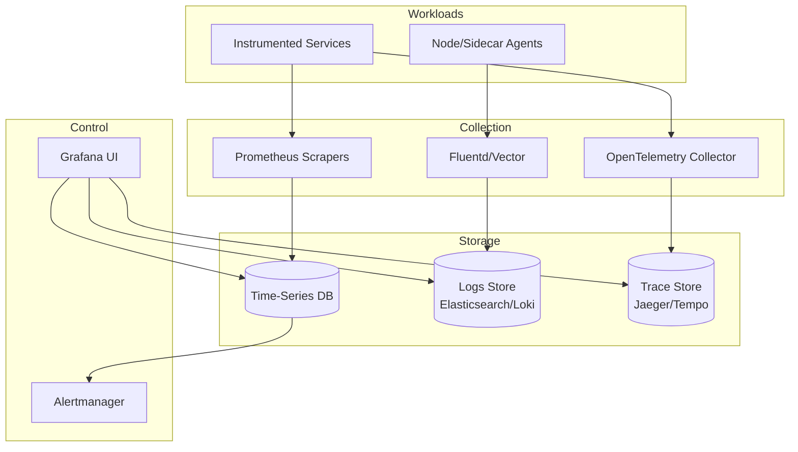

# 23-observability-monitoring-platform - Observability Monitoring Platform
Generated: 2025-11-02 20:38:45 -05:00

---

<!-- Source: 01-requirements.md -->
# Requirements & Scale

## Functional Requirements

### Core Capabilities
1. **Metrics Collection**: Scrape Prometheus exporters from services (pull model) or accept push via remote_write API
2. **Logs Aggregation**: Ingest structured logs (JSON) and unstructured logs (syslog) via agents (Fluentd, Vector)
3. **Distributed Tracing**: Collect spans (OpenTelemetry) with parent-child relationships, visualize request flows
4. **Alerting**: Evaluate alert rules (PromQL/LogQL) every 1min, send notifications via PagerDuty/Slack/email
5. **Dashboards**: Pre-built dashboards (CPU, memory, latency) and custom ad-hoc queries with Grafana
6. **Service Maps**: Auto-generate dependency graphs from trace data (service A → service B → database C)
7. **Log Search**: Full-text search with filters (timestamp, log level, service name, trace ID)

### Advanced Features
- **Anomaly Detection**: ML-based detection of metric/log anomalies (unsupervised learning)
- **SLO Tracking**: Define SLOs (99.9% availability), track error budgets, burn-rate alerts
- **Capacity Planning**: Trend analysis for resource utilization (predict when to scale)
- **Cost Attribution**: Break down observability costs per team/service (storage, query volume)
- **Multi-Tenancy**: Isolate metrics/logs/traces per tenant with RBAC
- **Long-Term Storage**: Archive old data to S3/GCS (90-day hot, 1-year warm, 7-year cold)

## Non-Functional Requirements

### Performance
- **Ingestion Throughput**: 10M metrics/sec, 1TB logs/day, 100K traces/sec
- **Query Latency**: p95 <3s for dashboard queries (7-day range), <10s for 90-day historical queries
- **Real-Time Alerting**: Alert rule evaluation within 1min of metric/log arrival

### Availability
- **Uptime**: 99.9% SLA (43min downtime/month)
- **Data Durability**: 99.999999999% (11 9's) via S3/GCS replication
- **Redundancy**: Multi-AZ deployment, no single point of failure

### Scalability
- **Services Monitored**: 5K services, 100K hosts/containers
- **Cardinality**: 100M unique metric time series (service × metric × labels)
- **Retention**: 30 days hot (queryable), 90 days warm (slower queries), 1 year cold (archived)
- **Users**: 1K concurrent dashboard users, 10K alert rules

### Cost Efficiency
- **Compression**: 10:1 compression for metrics (Gorilla encoding), 5:1 for logs (zstd)
- **Downsampling**: Aggregate 1s metrics to 1min after 7 days, 1h after 30 days
- **Smart Sampling**: Sample 1% of traces (high-volume services) vs. 100% (critical services)

## Scale Estimates

### Metrics (Prometheus-Compatible)
- **Ingestion Rate**: 10M metrics/sec = 600M metrics/min
- **Storage Per Metric**: 1 sample = 16 bytes (timestamp + float64 value)
- **Raw Storage**: 10M × 60s × 16 bytes = 9.6GB/min = 13.8TB/day (before compression)
- **Compressed Storage**: 13.8TB ÷ 10 = **1.4TB/day** (Gorilla encoding)
- **30-Day Retention**: 1.4TB × 30 = **42TB** hot storage

### Logs (Structured JSON)
- **Ingestion Rate**: 1TB/day = 11.6MB/s
- **Log Size**: 500 bytes/log avg (timestamp, level, service, message, trace_id)
- **Log Count**: 1TB ÷ 500 bytes = **2 billion logs/day**
- **Compressed Storage**: 1TB ÷ 5 = **200GB/day** (zstd compression)
- **30-Day Retention**: 200GB × 30 = **6TB** hot storage

### Traces (OpenTelemetry)
- **Ingestion Rate**: 100K traces/sec = 6M traces/min
- **Spans Per Trace**: 10 spans avg (frontend → backend → database → cache)
- **Span Size**: 2KB avg (service name, operation, duration, tags, logs)
- **Storage**: 100K × 10 × 2KB = 2GB/s = **172.8TB/day** (before sampling/compression)
- **Sampled Storage**: 172.8TB × 1% sampling = **1.7TB/day**
- **7-Day Retention**: 1.7TB × 7 = **12TB** (traces are short-lived, deleted faster than metrics/logs)

### Infrastructure
- **Time-Series DB** (VictoriaMetrics/Thanos): 42TB hot + 100TB warm (S3-backed)
- **Log Storage** (Elasticsearch/Loki): 6TB hot + 50TB warm
- **Trace Storage** (Jaeger/Tempo): 12TB hot
- **Query Nodes**: 50 nodes for metrics, 20 for logs, 10 for traces
- **Total Storage**: ~210TB hot/warm + 1PB cold (S3)

### Cost Estimation (Monthly)
- **Compute**: 80 nodes × $300/mo = $24K (c5.2xlarge equivalent)
- **Storage**: 210TB hot (SSD) × $0.10/GB = $21K, 1PB cold (S3) × $0.02/GB = $20K
- **Network**: 200TB/mo ingestion × $0.08/GB = $16K
- **Total**: **~$80K/mo** for entire observability platform

## Constraints
- **Cardinality Explosion**: Unbounded label values (e.g., user IDs in metrics) can create billions of time series → enforce label limits
- **Query Cost**: Ad-hoc queries on 90-day data can scan 100TB+ → enforce query timeouts (30s) and require time range filters
- **Data Sovereignty**: GDPR requires logs to stay in-region (EU data in EU, US data in US)
- **Sampling Trade-offs**: Aggressive trace sampling (0.1%) can miss rare errors → use adaptive sampling (sample 100% of errors)

## Success Measures
- **Detection Speed**: 95% of incidents detected within 2min of occurrence
- **MTTD (Mean Time To Detect)**: <5min via automated alerts
- **MTTR (Mean Time To Resolve)**: <30min with trace-based root cause analysis
- **Query Performance**: 95% of dashboard queries return in <3s
- **Cost Per Service**: <$50/mo per monitored service (all observability costs)


---

<!-- Source: 02-architecture.md -->
# 2) High-Level Architecture (Most Detailed)



## Components (What & Why)

### 1. Metrics Collection (Prometheus Scraper + Remote Write)
**What**: Prometheus-compatible agents scrape `/metrics` endpoints from services every 15s, push to central storage via `remote_write`.

**Why**:
- **Pull Model Benefits**: Service discovery via Kubernetes/Consul, auto-detect new services
- **Remote Write**: Decouple collection from storage (scale independently)
- **Prometheus Compatibility**: Industry standard, huge ecosystem of exporters

**Alternatives**: Push-based (StatsD, Telegraf) requires agents on every host, but works better for ephemeral workloads (AWS Lambda)

---

### 2. Time-Series Database (VictoriaMetrics/Thanos)
**What**: Distributed TSDB optimized for high-cardinality metrics with Gorilla compression.

**Why**:
- **Compression**: Gorilla encoding reduces 16-byte samples to ~1.3 bytes (10:1 ratio)
- **Horizontal Scaling**: Shard by metric name hash, query across shards with federated querying
- **Long-Term Storage**: Tiered storage (hot SSD → warm S3) with automatic compaction

**VictoriaMetrics vs. Thanos**:
- **VictoriaMetrics**: Single-binary, simpler ops, better query performance
- **Thanos**: Prometheus-native, better for multi-cluster federation, S3-first architecture

---

### 3. Logs Collection (Fluentd/Vector Agents)
**What**: Agents running on each host/container tail log files, parse JSON, forward to centralized log storage.

**Why**:
- **Decoupling**: Services write logs to stdout/file, agents handle aggregation/forwarding
- **Structured Logs**: Enforce JSON schema (timestamp, level, service, message, trace_id)
- **Buffering**: Agents buffer logs during network outages (10GB local disk)

**Alternatives**: Direct logging to API (HTTP POST) adds latency and coupling to log backend

---

### 4. Log Storage (Elasticsearch/Loki)
**What**: 
- **Elasticsearch**: Full-text search with inverted indexes (every field indexed)
- **Loki**: Log aggregation with label-based indexing (only metadata indexed, not log content)

**Why**:
- **Elasticsearch**: Rich search (regex, fuzzy matching), but expensive at scale (index overhead)
- **Loki**: 10× cheaper storage (no content indexing), optimized for Grafana queries

**Trade-off**: Loki requires labels for filtering (can't search arbitrary text unless label exists)

---

### 5. Trace Collection (OpenTelemetry Collector)
**What**: Services instrument code with OpenTelemetry SDKs, send spans to collector via OTLP (gRPC/HTTP).

**Why**:
- **Vendor-Neutral**: OpenTelemetry is CNCF standard, works with Jaeger/Zipkin/Tempo
- **Batching**: Collector batches spans (1000 spans/batch) before forwarding to storage
- **Sampling**: Collector applies sampling rules (tail-based sampling: keep 100% of error traces)

---

### 6. Trace Storage (Jaeger/Tempo)
**What**: Distributed tracing backend storing spans with parent-child relationships.

**Why**:
- **Jaeger**: Mature, supports Elasticsearch/Cassandra backends, rich UI for trace visualization
- **Tempo**: Grafana-native, S3-only storage (cheap), integrates with Loki/Prometheus

**Storage Model**: Spans stored by trace_id (primary key), indexed by service/operation/tags

---

### 7. Alerting Engine (Prometheus Alertmanager / Custom)
**What**: Evaluates alert rules (PromQL/LogQL) every 1min, routes alerts via PagerDuty/Slack/email.

**Why**:
- **PromQL**: Expressive query language for metrics (e.g., `rate(http_requests_total[5m]) > 1000`)
- **Grouping**: Batch alerts (e.g., "10 services down" → 1 alert, not 10)
- **Silencing**: Temporarily mute alerts during deployments

**Alert Rule Example**:
```yaml
- alert: HighErrorRate
  expr: |
    rate(http_requests_total{status=~"5.."}[5m]) / rate(http_requests_total[5m]) > 0.05
  for: 5m
  labels:
    severity: critical
  annotations:
    summary: "Service {{ $labels.service }} has 5% error rate"
```

---

### 8. Visualization (Grafana)
**What**: Dashboard platform querying metrics (PromQL), logs (LogQL), traces (Jaeger API).

**Why**:
- **Unified UI**: Single pane of glass for metrics + logs + traces
- **Pre-Built Dashboards**: USE method (Utilization, Saturation, Errors), RED method (Rate, Errors, Duration)
- **Ad-Hoc Queries**: Explore mode for debugging without pre-built dashboards

---

### 9. Service Mesh Integration (Istio/Linkerd)
**What**: Service mesh sidecars (Envoy) auto-generate metrics/traces for all HTTP/gRPC traffic.

**Why**:
- **Zero Instrumentation**: No code changes, mesh emits latency/throughput/error metrics
- **Distributed Tracing**: Mesh propagates trace context (B3 headers) automatically
- **Golden Signals**: Rate, errors, duration (RED method) out-of-the-box

---

## Data Flows

### Flow A: Metric Ingestion (Scrape + Store)
1. **Prometheus Agent** scrapes `/metrics` from service every 15s (pull model)
2. **Agent** batches metrics (10K samples), pushes to **Time-Series DB** via `remote_write` (HTTP POST)
3. **TSDB** compresses with Gorilla encoding, writes to WAL (write-ahead log) for durability
4. **TSDB** flushes WAL to immutable blocks (2h chunks), uploads to S3 for long-term storage
5. **Alerting Engine** queries TSDB every 1min, evaluates alert rules, sends notifications

**Latency**: 15s scrape + 30s write + 60s alert eval = **~105s** from metric emission to alert

---

### Flow B: Log Ingestion (Agent + Index)
1. **Service** writes JSON log to stdout: `{"timestamp": "...", "level": "ERROR", "service": "api", "trace_id": "...", "message": "..."}`
2. **Fluentd Agent** (daemonset) tails container logs, parses JSON, enriches with Kubernetes labels
3. **Agent** buffers logs (10s buffer), sends batch (1000 logs) to **Log Storage** (Elasticsearch/Loki)
4. **Log Storage**:
   - **Elasticsearch**: Indexes all fields, creates inverted index
   - **Loki**: Indexes only labels (service, level), stores log content as chunks
5. **User** queries logs via Grafana: `{service="api", level="ERROR"} |= "timeout"` (LogQL)

**Latency**: 10s buffer + 5s index = **~15s** from log write to searchable

---

### Flow C: Trace Ingestion (Spans + Storage)
1. **Service A** receives HTTP request, creates span with trace_id, span_id
2. **Service A** calls **Service B**, propagates trace context via HTTP headers (`traceparent: 00-trace_id-parent_span_id-01`)
3. **Service B** creates child span, links to parent via `parent_span_id`
4. **Both Services** send spans to **OpenTelemetry Collector** (gRPC, batched)
5. **Collector** applies sampling:
   - **Head-Based**: Sample 1% of all traces (fast, but misses rare errors)
   - **Tail-Based**: Buffer spans 30s, sample 100% of error traces (slow, but complete)
6. **Collector** forwards spans to **Trace Storage** (Jaeger/Tempo)
7. **User** queries trace via Grafana: Search by trace_id, visualize waterfall diagram

**Latency**: 30s tail-based buffer + 10s storage = **~40s** from span creation to queryable

---

### Flow D: Alert Notification (Rule Evaluation + Routing)
1. **Alerting Engine** queries TSDB every 1min: `rate(http_requests_total{status="500"}[5m]) > 100`
2. **Rule Matches**: Error rate exceeds threshold for 5 consecutive evaluations (5min)
3. **Alert Triggered**: Engine sends alert to **Alertmanager**
4. **Alertmanager**:
   - Groups similar alerts (10 services down → 1 notification)
   - Routes to PagerDuty (severity=critical), Slack (severity=warning)
   - Applies silences (no alerts during 2am-4am maintenance window)
5. **PagerDuty** pages on-call engineer, Slack posts to #alerts channel

**Latency**: 1min eval + 5min threshold = **6min** from issue start to page

---

## Minimal Data Model

### Metrics (Time-Series DB)
```
metric_name: http_requests_total
labels: {service="api", method="GET", status="200"}
samples: [(timestamp1, value1), (timestamp2, value2), ...]
```

**Cardinality**: `metric_name × label_combinations`
- Example: `http_requests_total` with 10 services, 5 methods, 3 statuses = 10 × 5 × 3 = **150 time series**
- **Danger**: Adding user_id label (1M users) → 150M time series (cardinality explosion)

### Logs (Log Storage)
```json
{
  "timestamp": "2024-01-01T12:00:00Z",
  "level": "ERROR",
  "service": "api",
  "host": "pod-123",
  "trace_id": "abc123",
  "message": "Database connection timeout",
  "error": {
    "type": "TimeoutError",
    "stack": "..."
  }
}
```

**Indexed Fields** (Loki): service, level, host (labels only)
**Full-Text Search** (Elasticsearch): All fields indexed

### Traces (Trace Storage)
```json
{
  "trace_id": "abc123",
  "span_id": "def456",
  "parent_span_id": "ghi789",
  "service": "api",
  "operation": "GET /users/:id",
  "start_time": "2024-01-01T12:00:00Z",
  "duration": 0.05,
  "tags": {
    "http.method": "GET",
    "http.status_code": 200,
    "db.query": "SELECT * FROM users WHERE id=?"
  },
  "logs": [
    {"timestamp": "...", "message": "Cache miss"}
  ]
}
```

**Indexes**: trace_id (primary), service+operation (secondary), tags (optional)

---

## API Design

### Metrics Query (PromQL)
```http
GET /api/v1/query?query=rate(http_requests_total[5m])&time=2024-01-01T12:00:00Z
→ Returns: {"metric": {...}, "values": [[timestamp, value]]}
```

**Advanced**: Range query for dashboard graphs:
```http
GET /api/v1/query_range?query=...&start=2024-01-01T00:00:00Z&end=2024-01-01T23:59:59Z&step=1m
```

### Logs Query (LogQL)
```http
GET /loki/api/v1/query_range?query={service="api"} |= "error"&start=...&end=...
→ Returns: [{"stream": {"service": "api"}, "values": [[timestamp, log_line]]}]
```

**Aggregation**: Count logs per minute:
```
sum(rate({service="api"}[1m])) by (level)
```

### Trace Query (Jaeger API)
```http
GET /api/traces/{trace_id}
→ Returns: {"data": [{"traceID": "...", "spans": [...]}]}
```

**Search**: Find slow traces:
```http
GET /api/traces?service=api&operation=GET%20/users&minDuration=1s&limit=20
```

### Alert Rules (YAML Config)
```yaml
groups:
  - name: example
    interval: 1m
    rules:
      - alert: HighMemory
        expr: node_memory_usage > 0.9
        for: 5m
        labels:
          severity: warning
        annotations:
          summary: "Host {{ $labels.instance }} memory >90%"
```

---

## Monitoring Cheat-Sheet

### Golden Signals (per service)
1. **Latency**: `histogram_quantile(0.99, rate(http_request_duration_seconds_bucket[5m]))`
2. **Traffic**: `sum(rate(http_requests_total[5m]))`
3. **Errors**: `sum(rate(http_requests_total{status=~"5.."}[5m]))`
4. **Saturation**: `node_memory_usage`, `node_cpu_usage`

### Critical Alerts
- **Observability Platform Down**: TSDB/Log Storage unreachable for 5min
- **Cardinality Explosion**: Active time series >100M (rate of growth >10% per hour)
- **Query Overload**: Query latency p95 >10s for 10min
- **Disk Full**: TSDB storage >90% (auto-delete old data or scale storage)

### Cost Optimization Queries
- **Top 10 High-Cardinality Metrics**: `topk(10, count by (__name__)({__name__=~".+"}))`
- **Storage Growth**: `rate(tsdb_storage_bytes_total[1h])` (TB/day)
- **Query Cost**: `sum(rate(tsdb_query_duration_seconds_sum[5m])) by (user)` (who runs expensive queries)


---

<!-- Source: 03-key-decisions.md -->
# Key Technical Decisions

## 1. Pull-Based (Prometheus) vs. Push-Based (StatsD) Metrics Collection

**Decision**: **Pull-based Prometheus scraping** as default with push gateway for batch jobs.

**Rationale**:
- **Service Discovery**: Prometheus auto-discovers services via Kubernetes/Consul (no manual agent config)
- **Health Checks**: Scrape failures indicate service issues (implicit monitoring)
- **Target Control**: Centralized scrape config prevents metrics spam (vs. any service can push anything)

**Trade-offs**:
- **Ephemeral Workloads**: Short-lived jobs (AWS Lambda) can't be scraped → push gateway needed
- **Network Overhead**: Scraping 1000 services × 15s = 66 requests/sec (vs. push batching)
- **Firewall Issues**: Pull requires inbound connectivity to services (vs. push only needs outbound)

**When to Reconsider**:
- If >50% of workloads are ephemeral (Lambda, batch jobs), switch to push-based (Telegraf/Vector)
- For multi-region deployments, push to regional collectors to avoid cross-region scraping

---

## 2. Elasticsearch vs. Loki for Log Storage

**Decision**: **Loki** for cost efficiency, **Elasticsearch** for rich search use cases.

**Rationale**:
- **Loki**: 10× cheaper storage (no content indexing), optimized for label-based queries
  - Use case: Tailing logs by service/pod, aggregating error counts
- **Elasticsearch**: Full-text search with regex, fuzzy matching
  - Use case: Security logs (search for "failed login attempt from IP 1.2.3.4")

**Trade-offs**:
- **Loki**: Can't search arbitrary text unless it's a label (e.g., can't search "timeout" in message)
- **Elasticsearch**: Index size = 50% of raw logs (vs. Loki 5%), slow writes at high cardinality

**Architecture**: Hybrid approach
- **Loki** for application logs (service, level, pod labels)
- **Elasticsearch** for security/audit logs (need full-text search)

**When to Reconsider**:
- If users demand arbitrary full-text search on all logs, accept 10× cost and use Elasticsearch everywhere
- If log volume <100GB/day, cost difference is negligible—simplify with Elasticsearch only

---

## 3. Head-Based vs. Tail-Based Trace Sampling

**Decision**: **Tail-based sampling** with 30s buffering for error retention.

**Rationale**:
- **Head-Based**: Sample 1% at span creation (fast, low overhead)
  - Problem: Misses rare errors (0.01% error rate × 1% sampling = 0.0001% of errors captured)
- **Tail-Based**: Buffer spans 30s, decide after seeing full trace
  - Benefit: Keep 100% of error traces, sample 1% of success traces

**Trade-offs**:
- **Latency**: 30s delay before traces visible in UI (vs. <5s with head-based)
- **Memory**: Buffer 30s × 100K traces/s = 3M traces in memory (~6GB)
- **Complexity**: Collector must correlate spans from distributed services (require trace_id)

**When to Reconsider**:
- For real-time debugging (need traces <5s after request), use head-based sampling with higher rate (10%)
- If memory cost is prohibitive, use adaptive sampling (sample errors at 100%, reduce success rate dynamically)

---

## 4. Single Cluster vs. Federated Multi-Cluster TSDB

**Decision**: **Single global TSDB cluster** (VictoriaMetrics) with regional Prometheus scrapers.

**Rationale**:
- **Simplicity**: One query endpoint for all metrics (no federation complexity)
- **Cost**: Centralized storage allows global deduplication (same metric from 3 regions → store once)
- **Query Speed**: Single cluster avoids cross-region queries (no federation latency)

**Trade-offs**:
- **Cross-Region Ingestion**: Regional scrapers push to global cluster (higher network cost)
- **Single Point of Failure**: Cluster outage loses all metrics (mitigated with multi-AZ + S3 backup)
- **Data Residency**: GDPR/CCPA may require metrics to stay in-region (not globally centralized)

**When to Reconsider**:
- If data residency laws require regional isolation, use Thanos with per-region clusters + global query layer
- For >10 regions, federation prevents excessive cross-region traffic (push to regional, query globally)

---

## 5. Real-Time vs. Batched Alert Evaluation

**Decision**: **1-minute evaluation interval** with batched notifications.

**Rationale**:
- **Balance**: 1min is fast enough for most incidents (5min threshold = alert fires at 6min)
- **Cost**: 1min interval reduces TSDB query load vs. 10s evaluation (6× fewer queries)
- **Noise Reduction**: Batch alerts (10 pods crash → 1 alert "deployment X failing")

**Trade-offs**:
- **Detection Delay**: 1min eval + 5min threshold = 6min MTTD (vs. 10s eval = 5.17min)
- **Flapping**: 1min interval may miss transient spikes (e.g., 30s error spike that self-heals)

**When to Reconsider**:
- For critical SLOs (payments, authentication), use 10s evaluation with 30s threshold (alert at 40s)
- If TSDB can handle load, reduce to 30s evaluation for faster detection

---

## 6. Downsample Metrics vs. Keep Full Resolution

**Decision**: **Automatic downsampling** after 7 days (1s → 1min), after 30 days (1min → 1h).

**Rationale**:
- **Storage Savings**: 1h resolution = 3600× fewer samples vs. 1s (TB → GB)
- **Query Speed**: Aggregating 1h chunks vs. 3600s samples = 100× faster
- **Use Case**: Long-term trends (capacity planning) don't need 1s resolution

**Trade-offs**:
- **Lost Granularity**: Can't debug 2-week-old spike at 1s resolution (only 1min resolution available)
- **Irreversible**: Downsampling deletes original samples (can't reconstruct 1s data later)

**Retention Policy**:
- **0-7 days**: Full resolution (1s for 1s metrics, 15s for Prometheus default)
- **7-30 days**: 1min resolution (delete 1s samples)
- **30-90 days**: 1h resolution (delete 1min samples)
- **90+ days**: Archive to S3 (cold storage, slow queries)

**When to Reconsider**:
- If debugging often requires historical 1s resolution, extend full-resolution retention to 14 days
- For compliance (audit logs), keep full resolution for 1 year (accept 10× storage cost)

---

## 7. Local Aggregation (Agent-Side) vs. Centralized Aggregation

**Decision**: **Centralized aggregation** in TSDB for flexibility.

**Rationale**:
- **Query Flexibility**: Users can aggregate metrics any way (by service, by pod, by region) without re-configuring agents
- **Raw Data**: Store raw samples, compute aggregates at query time (e.g., p99 latency requires histogram buckets)
- **No Agent Complexity**: Agents just forward metrics, no local computation

**Trade-offs**:
- **Network Cost**: Sending raw metrics (10M/s) vs. pre-aggregated (1M/s) = 10× bandwidth
- **Query Load**: Aggregating at query time adds latency (vs. pre-computed aggregates)

**Agent-Side Aggregation** (alternative):
- Use case: Mobile/IoT devices with limited bandwidth
- Agents compute p50/p99/p999 locally, send only summary stats
- Cost: Lose ability to aggregate across different dimensions (can't recalculate after ingestion)

**When to Reconsider**:
- If network costs >$100K/mo, enable agent-side aggregation for high-volume metrics (e.g., per-request latency → per-minute summary)
- For edge deployments (IoT), local aggregation is mandatory (bandwidth constraint)

---

## 8. Cardinality Limits: Enforce vs. Educate

**Decision**: **Enforce hard limits** (100M active time series) with automated alerts.

**Rationale**:
- **TSDB Protection**: Unbounded cardinality (e.g., user_id in labels) crashes TSDB (OOM)
- **Cost Control**: 100M series × 10 bytes/sample = 1GB/sample → 86TB/day (unacceptable)
- **Immediate Feedback**: Reject metrics with high-cardinality labels at ingestion time

**Enforcement**:
- **Scrape-Time Validation**: Prometheus agents drop metrics with labels matching `user_id`, `request_id` (blacklist)
- **Global Limit**: TSDB rejects writes if active series >100M (return HTTP 429)
- **Per-Tenant Quotas**: Each team gets 10M series quota (prevent one team from consuming all capacity)

**Trade-offs**:
- **Legitimate Use Cases**: Sometimes high cardinality is needed (e.g., per-customer billing metrics)
- **Operational Overhead**: Teams get paged when hitting limits (requires education on cardinality best practices)

**When to Reconsider**:
- If teams need high-cardinality metrics (e.g., per-user latency), use separate TSDB for high-cardinality data (accept 10× cost)
- For billing/analytics use cases, send high-cardinality data to OLAP (ClickHouse) instead of TSDB

---

**Summary Table**:

| Decision | Chosen Approach | Main Benefit | Main Cost | Reconsider If... |
|----------|----------------|--------------|-----------|------------------|
| Metrics Collection | Pull (Prometheus) | Auto-discovery | Can't scrape ephemeral jobs | >50% workloads are ephemeral |
| Log Storage | Loki (labels only) | 10× cheaper | No full-text search | Need arbitrary text search |
| Trace Sampling | Tail-based (30s buffer) | 100% error retention | 30s latency + memory | Need real-time traces <5s |
| TSDB Topology | Single global cluster | Simplicity | Cross-region network cost | Data residency laws |
| Alert Evaluation | 1min interval | Cost/noise balance | 6min MTTD | Critical APIs need <1min |
| Downsampling | Auto (7d→1min, 30d→1h) | Storage savings | Lost granularity | Debug needs historical 1s data |
| Aggregation | Centralized (query-time) | Flexibility | Network/query cost | Bandwidth >$100K/mo |
| Cardinality | Hard limits (100M series) | TSDB protection | Rejects legitimate high-cardinality | Separate high-cardinality TSDB |


---

<!-- Source: 04-wrap-up.md -->
# Wrap-Up & Deep Dives

## Scaling Playbook

### Stage 1: MVP (10 Services, 1K Metrics/sec)
**Infrastructure**:
- Single Prometheus server (local storage, 15-day retention)
- Loki with 100GB local disk (7-day retention)
- Jaeger all-in-one (in-memory storage, 1-day retention)
- Grafana with pre-built dashboards (USE/RED method)

**Key Additions**:
- Basic alerting: CPU >90%, memory >90%, service down
- Log shipping via Fluentd daemonset
- OpenTelemetry auto-instrumentation for Java/Go services

**Limitations**:
- No long-term retention (all data lost after 15 days)
- Single point of failure (Prometheus crash = no monitoring)
- Manual dashboard creation (no service catalog)

---

### Stage 2: Production (100 Services, 100K Metrics/sec)
**Infrastructure**:
- VictoriaMetrics cluster (3 nodes, 30-day hot + 90-day warm on S3)
- Loki cluster (3 ingesters, 3 queriers, S3 backend)
- Tempo distributed tracing (S3-backed, 7-day retention)
- Grafana with LDAP auth + RBAC

**Key Additions**:
- **Thanos** (optional): Multi-cluster federation, global query layer
- **SLO Tracking**: Define SLOs (99.9% availability), error budget burn-rate alerts
- **Service Mesh**: Istio auto-generates RED metrics (no code instrumentation)
- **Cost Attribution**: Track storage/query costs per team (chargeback)

**Optimizations**:
- Tail-based trace sampling (30s buffer, 100% error retention)
- Downsample metrics after 7 days (1s → 1min)
- Cardinality enforcement (reject metrics with user_id labels)
- Alert grouping (10 pods crash → 1 alert)

---

### Stage 3: Scale (1K Services, 10M Metrics/sec)
**Infrastructure**:
- VictoriaMetrics cluster (50 nodes, sharded by metric hash)
- Elasticsearch + Loki hybrid (Elasticsearch for security logs, Loki for app logs)
- Tempo with 100TB S3 storage (14-day retention with 1% sampling)
- Grafana with SSO, org-based multi-tenancy

**Key Additions**:
- **Anomaly Detection**: ML-based anomaly detection (Prometheus + Grafana ML)
- **Adaptive Sampling**: Sample 0.1% of success traces, 100% of errors, 10% of slow requests (p99 >1s)
- **Capacity Planning**: Trend analysis dashboards (predict when to scale based on 90-day growth rate)
- **Service Catalog**: Auto-generate dashboards per service (template-based)

**Optimizations**:
- **Regional Scrapers**: Prometheus agents in each region push to global VictoriaMetrics (reduce cross-region traffic)
- **Query Caching**: Cache dashboard queries (1min TTL) to reduce TSDB load
- **Pre-Aggregation**: Store pre-computed rollups (e.g., per-service p99 latency) for faster queries
- **Compression Tuning**: Gorilla encoding for metrics, zstd level 9 for logs (maximize compression)

**Operational Maturity**:
- **Self-Service**: Teams create dashboards/alerts via Terraform (GitOps)
- **Chaos Engineering**: Simulate TSDB node failure, network partition, scrape timeout
- **Cost Optimization**: Auto-delete low-value metrics (e.g., unused metrics for 30 days)

---

## Failure Scenarios

| Failure | Detection | Impact | Mitigation | Recovery Time |
|---------|-----------|--------|------------|---------------|
| **Prometheus Scraper Down** | No metrics for 2 scrape intervals (30s) | Gaps in metrics for affected services | Multiple scrapers in HA mode (same targets, dedupe at TSDB) | <1min (failover to backup scraper) |
| **TSDB Node Crash** | Health check failure, cluster monitoring | Queries fail for sharded metrics | Replication (3× RF), query across replicas | <5min (automatic failover) |
| **S3 Outage** (long-term storage) | TSDB write errors to S3 | Can't query >30-day data | Multi-region S3 replication, local cache for recent queries | Hours (S3 recovery) |
| **Log Ingestion Overload** | Agent buffer full (10GB disk) | Logs dropped (data loss) | Back-pressure: Slow down log emission, alert on buffer usage >80% | 10min (scale Loki ingesters) |
| **Trace Collector Crash** | No spans received for 1min | Traces missing for affected services | Multiple collectors (load-balanced), retry on failure | <2min (container restart) |
| **Cardinality Explosion** | Active time series >100M, memory pressure | TSDB OOM crash, query failures | Hard limits (reject writes), auto-cleanup of stale series (24h TTL) | <30min (enforce limits, cleanup) |
| **Alert Fatigue** | >100 alerts/hour | On-call ignores critical alerts | Alert grouping, silence low-priority alerts, escalation policies | Days (tune alert rules) |
| **Dashboard Query Timeout** | Query exceeds 30s | Dashboard fails to load | Query optimization (reduce time range, add filters), pre-aggregated metrics | <5min (kill expensive queries) |

---

## SLO Commitments

### Ingestion Availability
- **Target**: 99.9% of metrics/logs/traces ingested successfully
- **Measurement**: `(total_samples - dropped_samples) / total_samples`
- **Error Budget**: 86K samples/day can be dropped (out of 86M samples/day)

### Query Latency
- **Target**: p95 dashboard queries <3s for 7-day range
- **Measurement**: `histogram_quantile(0.95, rate(tsdb_query_duration_seconds_bucket[5m]))`
- **Error Budget**: 5% of queries can exceed 3s

### Alert Latency (MTTD)
- **Target**: 95% of incidents detected within 5min
- **Measurement**: Time from incident start to alert fired
- **Error Budget**: 5% of incidents can take >5min to detect

### Data Retention
- **Target**: 100% of data retained for committed period (30 days hot, 90 days warm)
- **Measurement**: Audit S3 backups monthly, verify no data loss
- **Error Budget**: Zero tolerance for data loss (11 9's durability via S3)

---

## Common Pitfalls

### 1. **Cardinality Explosion from User IDs in Labels**
**Problem**: Adding `user_id` label creates 1M time series per metric (vs. 10 without).

**Solution**:
- **Blacklist High-Cardinality Labels**: Reject metrics with `user_id`, `request_id`, `session_id` at scrape time
- **Use Exemplars**: Store sparse examples (1 per 1000 samples) instead of full-resolution labels
- **Educate Teams**: Publish cardinality best practices (labels should have <100 unique values)

---

### 2. **Ignoring Downsampling → Storage Costs Explode**
**Problem**: Keeping 1s resolution for 90 days = 100TB storage (vs. 1TB with downsampling).

**Solution**:
- **Automatic Downsampling**: 7 days → 1min, 30 days → 1h (configured in VictoriaMetrics)
- **Retention Policies**: Delete raw data after downsampling (no duplication)
- **Cost Alerts**: Alert when storage growth >10% per week

---

### 3. **Alert Fatigue from Noisy Rules**
**Problem**: 100+ alerts/day → on-call ignores critical alerts → incidents escalate.

**Solution**:
- **Alert Grouping**: Batch related alerts (e.g., "10 pods down in deployment X" → 1 alert)
- **Silence Maintenance Windows**: Auto-silence alerts during known deployments
- **Escalation Policies**: Low-priority alerts to Slack, high-priority to PagerDuty

---

### 4. **No Query Timeout → Expensive Queries Kill TSDB**
**Problem**: User runs `rate(http_requests_total[365d])` → scans 13TB, crashes TSDB.

**Solution**:
- **Hard Timeout**: Kill queries after 30s (configurable per user)
- **Query Validation**: Require time range <7 days for ad-hoc queries, >7 days requires approval
- **Pre-Aggregated Metrics**: Store pre-computed rollups for long-term queries (e.g., daily p99 latency)

---

### 5. **Trace Sampling Misses Rare Errors**
**Problem**: 1% head-based sampling + 0.01% error rate = 1 in 10,000 errors captured.

**Solution**:
- **Tail-Based Sampling**: Buffer 30s, keep 100% of error traces
- **Adaptive Sampling**: Dynamically increase sampling rate for low-traffic services (e.g., 10% for <100 RPS services)
- **Always Sample Errors**: Override sampling for any span with `error=true` tag

---

### 6. **Log Indexing Costs Exceed Budget**
**Problem**: Elasticsearch indexes 1TB/day logs → $50K/mo (indexing = 50% of raw log size).

**Solution**:
- **Loki for App Logs**: Index only labels (service, level), not log content (10× cheaper)
- **Elasticsearch for Security Logs**: Use for critical logs that need full-text search (10% of volume)
- **Retention Tiers**: 7 days hot, 30 days warm (S3), 90 days cold (S3 Glacier)

---

### 7. **No Service Discovery → Manual Scrape Config**
**Problem**: Adding new service requires manual Prometheus config update (error-prone).

**Solution**:
- **Kubernetes Service Discovery**: Prometheus auto-discovers pods via Kubernetes API (labels: `prometheus.io/scrape: "true"`)
- **Consul Service Discovery**: Services register with Consul, Prometheus scrapes all registered services
- **Dynamic Config Reload**: Prometheus reloads config every 30s (no restart needed)

---

### 8. **Not Correlating Metrics/Logs/Traces**
**Problem**: User sees high latency in metrics, but can't find corresponding logs/traces.

**Solution**:
- **Trace ID in Logs**: Include `trace_id` in every log line (structured logging)
- **Exemplars**: Store sparse trace IDs in metric samples (1 per 1000 samples)
- **Grafana Correlation**: Click metric spike → auto-query logs with same time range + trace ID

---

## Interview Talking Points

When discussing observability in interviews, emphasize:

### 1. **Three Pillars: Metrics, Logs, Traces**
- "Metrics tell you **what** is broken (high error rate), logs tell you **why** (database timeout), traces tell you **where** (which service in the chain)."
- "Metrics are aggregated (avg/p99), logs are raw events, traces are correlated spans."

### 2. **Cardinality Trade-offs**
- "Adding user_id to metric labels creates 1M time series → TSDB crashes. Use exemplars (sparse samples) instead."
- "Labels should have <100 unique values; use tags for high-cardinality fields (indexed differently)."

### 3. **Sampling Strategies**
- "Head-based sampling (1%) is fast but misses rare errors. Tail-based sampling (30s buffer) keeps 100% of errors but adds latency."
- "Adaptive sampling: 0.1% for success, 100% for errors, 10% for slow requests (p99 >1s)."

### 4. **Pull vs. Push**
- "Pull (Prometheus) enables service discovery and health checks but can't scrape ephemeral jobs (Lambda). Push gateway solves this."
- "Push (StatsD) works for any workload but requires firewall outbound rules and loses implicit health monitoring."

### 5. **Query Optimization**
- "Downsample metrics after 7 days (1s → 1min) → 60× storage savings. Long-term queries use pre-aggregated rollups."
- "Query timeout (30s) prevents expensive queries from crashing TSDB. Require time range filters (<7 days for ad-hoc)."

### 6. **SLO-Based Alerting**
- "Alert on error budget burn rate, not absolute values. E.g., if 5% error budget consumed in 1h → critical alert."
- "Group related alerts (10 pods crash → 1 alert). Silence during maintenance windows."

---

## Follow-Up Questions to Explore

1. **Distributed Tracing at Scale**: How do you correlate spans from 10K microservices with out-of-order arrival?
2. **Real-Time Anomaly Detection**: Design ML pipeline for detecting metric anomalies (unsupervised learning on time series).
3. **Cost Optimization**: How do you identify and delete unused metrics (no queries in 30 days)?
4. **Multi-Tenancy**: Design RBAC for observability platform (1000 teams, isolated metrics/logs/traces per team).
5. **Compliance (GDPR)**: How do you anonymize logs (PII redaction) while retaining debugging utility?
6. **High-Cardinality Metrics**: When would you use OLAP (ClickHouse) instead of TSDB for per-user metrics?
7. **Service Mesh Integration**: Compare Istio (sidecar) vs. eBPF (kernel-level) for metrics collection.
8. **Log Aggregation at Edge**: Design log pipeline for IoT devices with limited bandwidth (local aggregation, compression).
9. **Alert Routing**: Design complex alert routing (severity + team + region + time-of-day).
10. **Capacity Planning**: Predict when to scale based on 90-day metric trends (linear regression, seasonality detection).

---

**Final Thought**: Observability is about **reducing MTTR** (mean time to resolve) via fast correlation of metrics/logs/traces. The key trade-offs are **cost** (cardinality/retention/sampling) vs. **fidelity** (granularity/completeness). Most teams over-collect initially (waste $$$) and under-query (miss insights)—the goal is to ruthlessly prioritize high-signal data and delete the rest.


