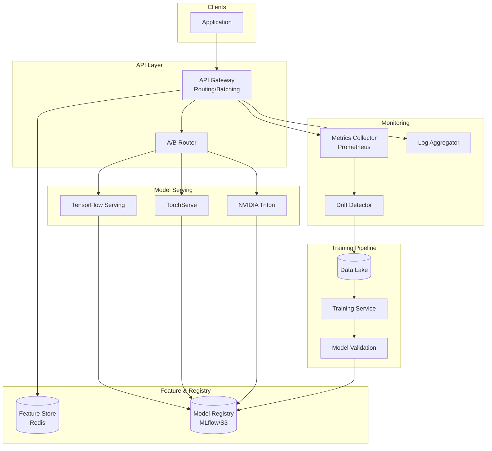

# 24-ml-model-inference-service - Ml Model Inference Service
Generated: 2025-11-02 20:38:45 -05:00

---

<!-- Source: 01-requirements.md -->
# Requirements & Scale

## Functional Requirements

### Core Capabilities
1. **Real-Time Inference**: Serve predictions via REST/gRPC API (<100ms p99 latency)
2. **Batch Inference**: Process large datasets offline (millions of records, hourly/daily jobs)
3. **Model Versioning**: Deploy multiple model versions simultaneously (v1, v2, v3), route traffic by version
4. **A/B Testing**: Split traffic between models (80% v1, 20% v2), track metrics per model
5. **Feature Preprocessing**: Transform raw input (e.g., normalize, one-hot encode) before inference
6. **Model Registry**: Store trained models with metadata (framework, version, accuracy, training date)
7. **Auto-Scaling**: Scale inference servers based on QPS and GPU utilization
8. **Model Warm-Up**: Preload models into memory/GPU on server startup (avoid cold start latency)

### Advanced Features
- Multi-model serving (single server hosts multiple models to amortize GPU cost)
- Dynamic batching (batch requests within 10ms window for GPU efficiency)
- Model caching (cache predictions for identical inputs with TTL)
- Canary deployments (deploy v2 to 5% traffic, auto-rollback if error rate spikes)
- Explainability (SHAP values, feature importance for model predictions)
- Model monitoring (detect drift, data quality issues, biased predictions)

## Non-Functional Requirements

### Performance
- **Latency**: p99 <100ms for real-time models (fraud detection, ad ranking), p99 <500ms for non-critical (recommendations)
- **Throughput**: 100K predictions/sec globally, 10K predictions/sec per GPU server
- **Batch Processing**: Process 10M predictions in <1 hour (offline batch jobs)

### Availability
- **Uptime**: 99.95% SLA (~22min downtime/month)
- **Redundancy**: Multi-AZ deployment, min 3 replicas per model
- **Graceful Degradation**: Fallback to cached predictions or simpler models if primary model fails

### Scalability
- **Models**: Support 1000+ models deployed (mix of TensorFlow, PyTorch, ONNX, XGBoost)
- **Model Size**: Handle models from 10MB (logistic regression) to 10GB (large transformers)
- **Traffic Growth**: Auto-scale from 10K → 100K → 1M predictions/sec as business grows

### Resource Efficiency
- **GPU Utilization**: >80% GPU utilization via batching (avoid idle GPU cycles)
- **Cost**: <$0.01/1000 predictions (optimize instance types, spot instances for batch)
- **Model Sharing**: Co-locate compatible models on same GPU (e.g., 5 small models per GPU)

## Scale Estimates

### Traffic Profile
- **Real-Time Inference**: 100K predictions/sec peak (fraud detection, ad serving)
- **Batch Inference**: 10M predictions/hour (overnight recommendation generation)
- **Model Count**: 1000 models (100 critical real-time, 900 batch/experimental)
- **Request Size**: 2KB avg input (features: JSON array), 500 bytes output (prediction + confidence)

### Infrastructure
- **Real-Time Servers**: 
  - CPU-based (simple models): 50 nodes × 16 vCPU = 800 vCPU
  - GPU-based (deep learning): 20 nodes × 1 GPU (NVIDIA T4/A10) = 20 GPUs
  - Throughput: 10K predictions/sec per GPU node → 20 GPUs = 200K predictions/sec capacity
- **Batch Servers**: 
  - Spot instances with 100 GPUs (V100/A100) for overnight batch jobs
  - Process 10M predictions in 1 hour → 2.8K predictions/sec per GPU
- **Model Storage**: 
  - 1000 models × 500MB avg = 500GB total (stored in S3/GCS)
  - Hot models cached on inference servers (10GB per server)

### Cost Estimation (Monthly)
- **Real-Time Servers**: 
  - CPU: 50 nodes × $200/mo = $10K
  - GPU: 20 nodes × $1,500/mo = $30K (on-demand T4 instances)
- **Batch Servers**: 100 spot GPU instances × $300/mo = $30K (80% discount vs on-demand)
- **Model Storage**: 500GB × $0.023/GB = $12/mo (S3 Standard)
- **Data Transfer**: 100K pred/s × 2.5KB × 2.6M sec/mo = 650TB × $0.08/GB = $52K
- **Total**: **~$122K/mo**

## Constraints
- **Cold Start Latency**: Loading 5GB transformer model from S3 takes ~30s (unacceptable for real-time)
- **GPU Memory Limits**: NVIDIA T4 = 16GB VRAM → limits model size + batch size
- **Framework Lock-In**: TensorFlow models need TF Serving, PyTorch needs TorchServe (no universal runtime)
- **Model Drift**: Production data distribution changes over time → model accuracy degrades without retraining
- **Explainability Cost**: Generating SHAP values adds 50-100ms latency (trade-off with latency SLA)

## Success Measures
- **Latency SLA**: 99% of real-time predictions return in <100ms
- **Availability**: <1 incident/month with model serving outage
- **GPU Utilization**: >80% GPU utilization (minimize idle time)
- **Cost Per Prediction**: <$0.01/1000 predictions (optimize for cost efficiency)
- **Model Deployment Speed**: Deploy new model version in <10min (CI/CD pipeline)
- **A/B Test Duration**: Run A/B tests for 7 days with statistical significance (p<0.05)


---

<!-- Source: 02-architecture.md -->
# 2) High-Level Architecture (Most Detailed)



 

## Components (What & Why)

### 1. API Gateway / Prediction Service
**What**: REST/gRPC API layer that receives prediction requests, routes to appropriate model servers, returns results.

**Why**:
- **Routing Logic**: Routes requests to correct model version based on A/B test rules or canary weights
- **Load Balancing**: Distributes traffic across replicas (round-robin, least-connections)
- **Request Batching**: Buffers requests for 10ms, batches them for GPU efficiency
- **Fallback**: Returns cached prediction or simpler model if primary model times out

**Responsibilities**:
- Input validation (schema check, feature count, data types)
- Feature preprocessing (normalize, encode, missing value imputation)
- Model routing (v1 vs v2, CPU vs GPU)
- Response aggregation (ensemble multiple models if needed)

---

### 2. Model Serving Runtime (TensorFlow Serving / TorchServe / Triton)
**What**: Framework-specific runtimes that load models, execute inference, manage GPU memory.

**Why**:
- **Optimized Inference**: TF Serving optimizes TensorFlow graphs, TorchServe JIT-compiles PyTorch models
- **GPU Management**: Handles CUDA contexts, memory allocation, concurrent execution streams
- **Dynamic Batching**: Automatically batches requests within latency budget (e.g., batch up to 32 requests, wait max 10ms)

**Runtime Comparison**:
- **TensorFlow Serving**: Best for TensorFlow models, supports SavedModel format, gRPC/REST API
- **TorchServe**: PyTorch models, supports TorchScript, ONNX export
- **NVIDIA Triton**: Multi-framework (TF, PyTorch, ONNX, TensorRT), best GPU utilization, ensemble support

---

### 3. Model Registry (MLflow / SageMaker Model Registry)
**What**: Centralized repository storing trained models with metadata (version, accuracy, framework, training data).

**Why**:
- **Versioning**: Track all model versions (v1, v2, v3), enable rollback
- **Lineage**: Link model to training data, hyperparameters, code version (reproducibility)
- **Approval Workflow**: Stage models (dev → staging → production) with approval gates

**Metadata Stored**:
```json
{
  "model_id": "fraud_detection_v2",
  "framework": "tensorflow",
  "version": "2.0.1",
  "accuracy": 0.95,
  "training_date": "2024-01-01",
  "artifact_uri": "s3://models/fraud_detection_v2.tar.gz",
  "model_size": "2.3GB",
  "input_schema": {"features": ["amount", "merchant_id", ...]},
  "stage": "production"
}
```

---

### 4. Feature Store (Feast / Tecton)
**What**: Low-latency storage for precomputed features (user embeddings, aggregates) with online/offline APIs.

**Why**:
- **Precomputation**: Features computed once (batch), reused across models (e.g., user's 30-day transaction average)
- **Consistency**: Same features in training and serving (avoid train/serve skew)
- **Low Latency**: <10ms p99 lookup for real-time features from Redis/DynamoDB

**Architecture**:
- **Online Store** (Redis): Real-time features (user_id → [age, location, purchase_count])
- **Offline Store** (S3/Snowflake): Historical features for training
- **Feature Pipeline**: Spark/Flink jobs compute features, sync to online store

---

### 5. A/B Testing & Traffic Splitter
**What**: Proxy layer that routes X% traffic to model v1, Y% to model v2, tracks metrics per variant.

**Why**:
- **Experimentation**: Test new model versions without full rollout (gradual ramp 5% → 20% → 100%)
- **Statistical Significance**: Collect metrics (accuracy, latency, revenue) until p<0.05
- **Auto-Rollback**: Revert to v1 if v2 error rate >2% (automated guardrails)

**Routing Rules**:
- **User-Level**: Hash(user_id) % 100 < 20 → route to v2 (20% traffic, consistent per user)
- **Request-Level**: Random() < 0.2 → route to v2 (20% traffic, non-consistent)
- **Canary**: Route 5% of production traffic to v2 for 1 hour, monitor errors

---

### 6. Model Cache (Redis/Memcached)
**What**: In-memory cache storing recent predictions keyed by input hash.

**Why**:
- **Duplicate Requests**: Ad ranking often sees same ad+user combo → cache hit avoids inference
- **Cost Savings**: Cache hit = $0 inference cost (vs. $0.01 per GPU inference)
- **Latency**: Redis lookup <1ms vs. 50ms GPU inference

**Cache Strategy**:
- **Key**: SHA256(model_id + input_features)
- **Value**: {prediction, confidence, timestamp}
- **TTL**: 1 hour for real-time models, 24 hours for batch models

**Trade-offs**:
- **Stale Predictions**: Cached prediction may be outdated if model retrained
- **Cache Stampede**: Popular input causes many simultaneous cache misses → rate-limit model calls

---

### 7. Dynamic Batching Queue
**What**: Request buffer that accumulates requests for up to 10ms, batches them for GPU inference.

**Why**:
- **GPU Efficiency**: Single request = 5% GPU utilization, batch of 32 = 80% utilization
- **Throughput**: Batching increases throughput 10× (1K → 10K predictions/sec per GPU)
- **Latency Budget**: 10ms batching + 50ms inference = 60ms total (within 100ms SLA)

**Algorithm**:
1. Request arrives → add to queue
2. If queue size ≥32 OR wait_time ≥10ms → process batch
3. Run batch inference (all 32 requests in single GPU call)
4. Return individual predictions to each request

---

### 8. Model Monitoring & Drift Detection
**What**: Background job that analyzes prediction distribution, input features, model performance.

**Why**:
- **Data Drift**: Production data changes (e.g., COVID shifts shopping patterns) → model accuracy drops
- **Concept Drift**: Relationship between features and target changes (e.g., fraud tactics evolve)
- **Biased Predictions**: Model favors certain groups (gender, race) → compliance risk

**Metrics Tracked**:
- **Prediction Distribution**: P(fraud=1) should match historical baseline (e.g., 2% fraud rate)
- **Feature Distribution**: Mean/stddev of features should be stable (alert if >3 sigma shift)
- **Model Accuracy**: Sample 1% of predictions, get ground truth labels (delayed), compare with prediction

**Alerting**:
- **Accuracy Drop**: Model accuracy drops >5% over 7 days → retrain model
- **Feature Drift**: Input features shift >2 sigma → investigate data pipeline issue
- **Latency Spike**: p99 >200ms for 10min → auto-scale inference servers

---

## Data Flows

### Flow A: Real-Time Prediction (Single Request)
1. **Client** → API Gateway: `POST /predict {"model": "fraud_detection_v2", "features": [...]}`
2. **API Gateway**:
   - Validate input (schema check, feature count)
   - Fetch real-time features from Feature Store (Redis): `user_id → [age, purchase_count]`
   - Check Model Cache (Redis): `SHA256(model_id + features)` → cache miss
   - Route to Model Serving Runtime (based on A/B test rule: 80% v1, 20% v2)
3. **Model Serving Runtime** (TensorFlow Serving):
   - Add request to dynamic batching queue
   - Wait up to 10ms for batch to fill (or until batch size = 32)
   - Run batch inference on GPU (50ms for 32 predictions)
4. **Model Serving Runtime** → API Gateway: `{"prediction": 0.92, "confidence": 0.85}`
5. **API Gateway**:
   - Cache prediction in Redis (TTL = 1 hour)
   - Log prediction to Kafka (for monitoring/retraining)
6. **API Gateway** → Client: `{"prediction": 0.92, "is_fraud": true}`

**Latency Breakdown**:
- Input validation: 1ms
- Feature fetch: 5ms
- Cache lookup: 1ms
- Batching wait: 10ms (worst case)
- GPU inference: 50ms (batch of 32)
- Response: 1ms
- **Total**: ~68ms (p50), ~90ms (p99 with queueing)

---

### Flow B: Batch Inference (Offline Job)
1. **Batch Job** reads 10M user IDs from S3
2. **Job** queries Feature Store (offline) for precomputed features: `SELECT * FROM features WHERE user_id IN (...)`
3. **Job** chunks data into batches of 1000, sends to Batch Inference Service
4. **Batch Inference Service** loads model from S3 (once), processes batches sequentially on GPU
5. **Service** writes predictions to S3: `user_id, recommendation_1, recommendation_2, recommendation_3`
6. **Job** completes in 1 hour (10M predictions ÷ 100 GPUs ÷ 2.8K pred/sec/GPU = 36 min)

**Optimization**: Use Spark for parallelization (100 executors × 100 GPUs)

---

### Flow C: Model Deployment (New Version)
1. **Data Scientist** trains model, registers in Model Registry: `mlflow log-model fraud_detection_v3`
2. **CI/CD Pipeline** (GitLab/Jenkins):
   - Validate model (smoke test on sample data)
   - Package model (Docker image with TF Serving + model artifacts)
   - Push image to ECR/GCR
3. **Deployment Service** (Kubernetes Operator):
   - Create new deployment: `fraud_detection_v3` with 3 replicas
   - Wait for health checks to pass (model loaded, test prediction succeeds)
   - Update A/B test config: Route 5% traffic to v3 (canary)
4. **Monitoring Service** watches v3 metrics for 1 hour:
   - Error rate: <1% (pass)
   - Latency p99: <100ms (pass)
   - Accuracy (sampled): 95% (pass)
5. **Deployment Service** ramps traffic: 5% → 20% → 50% → 100% over 24 hours
6. **Deployment Service** marks v2 as deprecated, keeps it running for 7 days (rollback safety)

**Rollback**: If v3 error rate >2%, instantly route 100% traffic back to v2

---

### Flow D: Feature Computation & Sync
1. **Batch Feature Pipeline** (Spark/Flink) runs daily:
   - Compute user features: `user_id → [total_purchases, avg_amount, last_login]`
   - Write to Offline Store (S3/Snowflake) for training
2. **Online Store Sync** (Change Data Capture):
   - Read new features from Offline Store
   - Upsert to Online Store (Redis): `HSET user:123 total_purchases 50 avg_amount 75.5`
3. **Real-Time Features** (Streaming Flink):
   - User makes purchase → Kafka event → Flink → update Redis: `HINCRBY user:123 total_purchases 1`

---

## Minimal Data Model

### Model Registry (Postgres/DynamoDB)
```
models:
  - model_id: UUID
    name: string
    version: string
    framework: enum (tensorflow, pytorch, onnx, xgboost)
    artifact_uri: string (S3 path)
    model_size_bytes: int
    input_schema: json
    output_schema: json
    accuracy_metrics: json (precision, recall, f1, auc)
    stage: enum (dev, staging, production)
    created_at: timestamp
    approved_by: string
```

### Feature Store (Redis/DynamoDB)
```
Redis:
  user:{user_id} → hash {age: 25, location: "US", purchase_count: 10}
  TTL: 24 hours (refreshed by batch job)

DynamoDB:
  partition_key: user_id
  attributes: {age, location, purchase_count, last_login, ...}
```

### Prediction Logs (Kafka → S3)
```json
{
  "prediction_id": "uuid",
  "model_id": "fraud_detection_v2",
  "model_version": "2.0.1",
  "features": [0.5, 0.3, ...],
  "prediction": 0.92,
  "confidence": 0.85,
  "latency_ms": 65,
  "cache_hit": false,
  "timestamp": "2024-01-01T12:00:00Z"
}
```

---

## API Design

### Real-Time Prediction
```http
POST /v1/predict
Content-Type: application/json

{
  "model": "fraud_detection_v2",
  "features": {
    "amount": 150.0,
    "merchant_id": "12345",
    "user_age": 30
  }
}

Response 200 OK:
{
  "prediction_id": "uuid",
  "prediction": 0.92,
  "label": "fraud",
  "confidence": 0.85,
  "latency_ms": 68,
  "model_version": "2.0.1"
}
```

### Batch Prediction
```http
POST /v1/batch_predict
Content-Type: application/json

{
  "model": "recommendation_v1",
  "input_uri": "s3://data/users.csv",
  "output_uri": "s3://predictions/recs.csv",
  "batch_size": 1000
}

Response 202 Accepted:
{
  "job_id": "uuid",
  "status": "running",
  "progress": "10%",
  "eta_seconds": 3600
}
```

### Model Deployment
```http
POST /v1/models/{model_id}/deploy
Content-Type: application/json

{
  "version": "3.0.0",
  "replicas": 3,
  "instance_type": "gpu.t4.large",
  "traffic_percentage": 5
}

Response 200 OK:
{
  "deployment_id": "uuid",
  "status": "healthy",
  "endpoint": "https://api.example.com/v1/predict?model=fraud_detection_v3"
}
```

---

## Monitoring Cheat-Sheet

### Golden Signals (per model)
1. **Latency**: p50/p95/p99 inference time (target: p99 <100ms)
2. **Throughput**: Predictions/sec (target: >100K globally)
3. **Error Rate**: Failed predictions / total (target: <0.1%)
4. **GPU Utilization**: % GPU busy (target: >80%)

### Model-Specific Metrics
- **Prediction Distribution**: P(class=1) over time (detect drift)
- **Feature Distribution**: Mean/stddev of input features (detect data quality issues)
- **Cache Hit Rate**: % requests served from cache (target: >30% for ad ranking)
- **Batch Size**: Avg requests per batch (target: >16 for GPU efficiency)

### Cost Metrics
- **Cost Per Prediction**: Total inference cost ÷ predictions (target: <$0.01/1000)
- **GPU Idle Time**: % time GPU waiting for requests (target: <20%)
- **Spot Instance Failures**: # batch jobs interrupted by spot termination

### Alerts
- **High Latency**: p99 >200ms for 10min → auto-scale or investigate slow model
- **Model Drift**: Prediction distribution shifts >10% → retrain model
- **A/B Test Failure**: Variant B error rate >2× variant A → auto-rollback
- **GPU OOM**: Model fails with CUDA out-of-memory → reduce batch size or model size


---

<!-- Source: 03-key-decisions.md -->
# Key Technical Decisions

## 1. Dynamic Batching vs. Fixed-Size Batching

**Decision**: **Dynamic batching** with 10ms timeout and max batch size 32.

**Rationale**:
- **Variable Traffic**: Traffic varies 10× between peak/off-peak → fixed batching wastes GPU cycles during low traffic
- **Latency Control**: 10ms timeout ensures p99 <100ms (10ms wait + 50ms inference + 30ms overhead)
- **Throughput**: Batch size 32 achieves 80% GPU utilization (sweet spot for NVIDIA T4)

**Trade-offs**:
- **Complexity**: Dynamic batching requires queue management (vs. simple fixed-size batches)
- **Latency Variability**: First request in batch waits 10ms, last request waits 0ms (p99 >p50)
- **Underutilization**: Low traffic (<3 req/10ms) means small batches (batch=1 → 5% GPU utilization)

**When to Reconsider**:
- If traffic is perfectly predictable (e.g., batch jobs), use fixed batching with optimal batch size
- For ultra-low latency (<20ms p99), disable batching and accept lower GPU utilization

---

## 2. Multi-Model Serving vs. Single-Model-Per-Server

**Decision**: **Single-model-per-server** for real-time, **multi-model** for batch/low-QPS models.

**Rationale**:
- **Resource Isolation**: Critical models (fraud detection) get dedicated GPUs (no interference from other models)
- **Cost Optimization**: 900 low-QPS models share 10 GPUs (90 models/GPU) via multi-model serving
- **Operational Simplicity**: Single model = predictable memory/latency, easier to debug

**Multi-Model Serving** (for low-QPS models):
- **Benefits**: Amortize GPU cost across 10-100 models, reduce infrastructure by 10×
- **Challenges**: Models compete for GPU memory (OOM risk), one slow model blocks others

**When to Reconsider**:
- If GPU costs >$100K/mo, aggressively co-locate models (accept complexity for cost savings)
- For heterogeneous models (TensorFlow + PyTorch), use NVIDIA Triton (supports mixed frameworks on one server)

---

## 3. Model Caching: Predictions vs. Models

**Decision**: **Cache predictions** (Redis) for duplicate inputs, NOT model artifacts.

**Rationale**:
- **Prediction Caching**: 30% cache hit rate for ad ranking (same ad+user seen multiple times) → 30% cost savings
- **Model Caching**: Models are loaded once at server startup (preloaded in GPU memory), no need to re-cache
- **Cold Start Avoidance**: Keep models in memory 24/7 (dedicated servers), avoid S3 load latency (30s for 5GB model)

**Trade-offs**:
- **Stale Predictions**: Cached prediction may be outdated if model retrained (mitigated with 1h TTL)
- **Cache Overhead**: Redis lookup adds 1ms latency (negligible vs. 50ms inference)

**When to Reconsider**:
- For low-QPS models (<10 RPS), unload model from memory after 1h idle → cache model in S3, reload on demand
- If cache hit rate <5%, disable caching to avoid Redis cost/complexity

---

## 4. A/B Testing: User-Level vs. Request-Level Hashing

**Decision**: **User-level hashing** for consistent experience.

**Rationale**:
- **User Consistency**: Same user always sees same model version (no confusing experience)
- **Statistical Validity**: User-level randomization ensures unbiased comparison (vs. request-level may favor one variant if user makes multiple requests)
- **Reproducibility**: User 123 always in variant B → can debug by replaying user's requests

**Request-Level** (alternative):
- **Faster Convergence**: Each request is independent → reach statistical significance faster
- **Use Case**: Non-user-facing APIs (internal batch jobs) where consistency doesn't matter

**When to Reconsider**:
- For non-logged-in users (anonymous traffic), use request-level hashing (no user_id available)
- If A/B test must conclude in 1 day (urgency), use request-level for faster data collection

---

## 5. Feature Store: Precompute vs. Real-Time Computation

**Decision**: **Precompute batch features** (daily), **real-time features** for critical signals.

**Rationale**:
- **Batch Features** (precomputed): User's 30-day transaction average, purchase history → computed once daily, cached in Redis
  - Benefit: Low latency (<5ms Redis lookup vs. 500ms SQL aggregation)
  - Trade-off: Features are 0-24h stale
- **Real-Time Features**: Last 5 clicks, current cart items → computed on-the-fly from Kafka stream
  - Benefit: Always fresh
  - Trade-off: Higher latency (20ms Flink query)

**Hybrid Approach**: 80% features precomputed, 20% real-time

**When to Reconsider**:
- If all features must be real-time (e.g., fraud detection needs instant signal), compute everything on-the-fly (accept 100ms latency)
- For batch inference (offline recommendations), use 100% precomputed features (no real-time needed)

---

## 6. Model Format: Native vs. ONNX vs. TensorRT

**Decision**: **ONNX** for portability, **TensorRT** for GPU optimization.

**Rationale**:
- **ONNX**: Framework-agnostic (TensorFlow → ONNX → PyTorch) enables vendor flexibility
  - Trade-off: 10-20% slower than native format
- **TensorRT**: NVIDIA's optimized runtime (2-5× faster than native TensorFlow)
  - Trade-off: Vendor lock-in (NVIDIA GPUs only), conversion complexity

**Strategy**: Use ONNX for development/staging, TensorRT for production GPU inference

**When to Reconsider**:
- For CPU-only inference, use native formats (TensorFlow SavedModel, PyTorch TorchScript) for simplicity
- If training framework changes frequently, stick with ONNX (avoid repeated TensorRT conversions)

---

## 7. Auto-Scaling: Request-Based vs. GPU-Utilization-Based

**Decision**: **GPU utilization-based** with 80% target.

**Rationale**:
- **Resource Efficiency**: Scale when GPU >80% busy (vs. request count which may not correlate with GPU load)
- **Cost Control**: Avoid over-provisioning (request count can spike but GPU still idle if requests are cached)
- **Predictive Scaling**: Use 5-min moving average to smooth spikes (avoid flapping)

**Request-Based** (alternative):
- **Simpler**: Scale based on QPS threshold (e.g., >10K RPS → add node)
- **Problem**: Doesn't account for cache hits (10K RPS with 90% cache hit = 1K actual inferences)

**When to Reconsider**:
- For CPU-based models (no GPU), use request-based scaling (CPU utilization is noisier metric)
- If GPU utilization data is unavailable (cloud provider limitation), fall back to request-based

---

## 8. Canary Deployment: Traffic-Based vs. Shadow Mode

**Decision**: **Traffic-based canary** (5% live traffic) with shadow mode for validation.

**Rationale**:
- **Traffic-Based Canary**: Route 5% real traffic to v2, compare metrics with v1
  - Benefit: Real-world testing with actual users
  - Risk: 5% users see potential bugs
- **Shadow Mode**: Send 100% traffic to both v1 and v2, but only return v1 results
  - Benefit: Test v2 with zero user impact
  - Limitation: Can't measure business metrics (revenue, conversions) since v2 results are discarded

**Strategy**: Shadow mode for 1 day (validate latency, errors) → traffic-based canary for 7 days (validate business metrics)

**When to Reconsider**:
- For critical models (fraud detection), use extended shadow mode (7 days) before any real traffic
- If shadow mode shows identical results, skip canary and go straight to full rollout (blue-green deployment)

---

**Summary Table**:

| Decision | Chosen Approach | Main Benefit | Main Cost | Reconsider If... |
|----------|----------------|--------------|-----------|------------------|
| Batching | Dynamic (10ms timeout) | Adapts to traffic | Latency variability | Ultra-low latency <20ms |
| Model Serving | Single-model per server (real-time) | Resource isolation | Higher cost | GPU costs >$100K/mo |
| Caching | Predictions (Redis) | 30% cost savings | 1ms latency overhead | Cache hit <5% |
| A/B Testing | User-level hashing | Consistent UX | Slower convergence | Anonymous traffic |
| Features | Precompute batch, real-time critical | Low latency | 0-24h staleness | All features must be fresh |
| Model Format | ONNX (dev), TensorRT (prod) | Portability + speed | Conversion complexity | CPU-only inference |
| Auto-Scaling | GPU utilization (80%) | Cost efficiency | Metric lag (1min) | CPU-based models |
| Canary | Traffic-based (5%) + shadow | Real-world testing | 5% user risk | Critical models |


---

<!-- Source: 04-wrap-up.md -->
# Wrap-Up & Deep Dives

## Scaling Playbook

### Stage 1: MVP (10 Models, 1K Predictions/sec)
**Infrastructure**:
- 3 CPU servers (t3.xlarge) for simple models (logistic regression, XGBoost)
- TensorFlow Serving for 2 deep learning models
- S3 for model storage (manual upload)
- Redis for prediction caching (single-node)

**Key Additions**:
- REST API with input validation
- Basic monitoring (latency, throughput, errors)
- Manual model deployment (SCP model to server, restart service)

**Limitations**:
- No A/B testing (deploy overwrites old model)
- No feature store (features passed in request)
- No GPU optimization (CPU inference only)

---

### Stage 2: Production (100 Models, 10K Predictions/sec)
**Infrastructure**:
- 20 GPU servers (g4dn.xlarge with NVIDIA T4)
- NVIDIA Triton for multi-framework support (TensorFlow, PyTorch, ONNX)
- MLflow Model Registry for versioning
- Feature Store (Feast): Redis for online, S3 for offline
- Kubernetes for orchestration (auto-scaling, health checks)

**Key Additions**:
- **A/B Testing**: Route 80/20 split between v1/v2, track metrics in Datadog
- **Dynamic Batching**: 10ms timeout, batch size up to 32 for GPU efficiency
- **CI/CD Pipeline**: GitLab → model validation → Docker image → Kubernetes deploy
- **Model Monitoring**: Drift detection (feature distribution shifts), accuracy tracking

**Optimizations**:
- Preload models on server startup (avoid cold start)
- Cache predictions for duplicate inputs (30% hit rate)
- Multi-model serving for low-QPS models (10 models per GPU)

---

### Stage 3: Scale (1000 Models, 100K Predictions/sec)
**Infrastructure**:
- 100 GPU servers for real-time (T4/A10)
- 500 spot GPU instances for batch inference (V100/A100)
- Model Registry with approval workflows (Airflow DAGs)
- Advanced Feature Store (Tecton): Streaming + batch features, point-in-time correctness
- Service Mesh (Istio) for traffic splitting and observability

**Key Additions**:
- **Canary Deployments**: Automatic rollback if error rate >2× baseline
- **Explainability**: SHAP values for fraud detection (optional, adds 50ms latency)
- **Model Ensembles**: Combine 3 models (voting, stacking) for higher accuracy
- **Cost Optimization**: Spot instances for batch, auto-scale down GPU servers during off-peak

**Optimizations**:
- **TensorRT Conversion**: 2-5× faster inference vs. native TensorFlow
- **Model Compression**: Quantization (FP32 → INT8) reduces model size 4×, latency 2×
- **Adaptive Batching**: Increase batch size to 64 during high traffic (80% util → 95% util)
- **Edge Inference**: Deploy lightweight models to edge (mobile, IoT) for <10ms latency

**Operational Maturity**:
- **Self-Service**: Data scientists deploy models via CLI (`mlflow deploy fraud_detection_v3 --replicas 3`)
- **Cost Attribution**: Track inference costs per team/model (chargeback)
- **Chaos Engineering**: Kill GPU servers, introduce 500ms latency, test fallback to cached predictions

---

## Failure Scenarios

| Failure | Detection | Impact | Mitigation | Recovery Time |
|---------|-----------|--------|------------|---------------|
| **GPU Server Crash** | Health check failure (3 consecutive) | 10% capacity loss (1 of 10 servers) | Kubernetes restarts pod, traffic shifts to healthy servers | <2min (pod restart + model load) |
| **Model Load OOM** | CUDA out-of-memory error on startup | Model unavailable | Reduce batch size or deploy to larger GPU (T4 16GB → A10 24GB) | <10min (reconfigure + redeploy) |
| **Batch Job Spot Interruption** | Spot instance termination notice (2min warning) | Batch job paused mid-execution | Checkpoint progress to S3 every 10min, resume on new instance | <5min (new instance + reload checkpoint) |
| **Feature Store Down** | Redis timeout (1s) | Predictions fail (missing features) | Fallback to default features (user_age=30, location="US") or cached features | <1min (Redis failover to replica) |
| **Model Registry Unavailable** | S3 connection timeout | Can't deploy new models (existing models unaffected) | Keep last-deployed model cached on servers, retry S3 with exponential backoff | <5min (S3 recovery) |
| **A/B Test Failure** | Variant B error rate >2× variant A | 20% users see errors | Auto-rollback to 100% variant A, alert ML team | <30s (instant traffic shift) |
| **Model Drift** | Prediction distribution shifts >10% | Accuracy degrades over days/weeks | Retrain model with recent data, deploy v3 | Days (retrain + validate + deploy) |
| **Cache Stampede** | Popular input, cache TTL expires, 1000 simultaneous requests | Redis overload, increased latency | Request coalescing (dedupe in-flight requests), probabilistic early expiration | <5min (cache repopulated) |

---

## SLO Commitments

### Latency
- **Target**: p99 <100ms for real-time models, p99 <500ms for non-critical
- **Measurement**: `histogram_quantile(0.99, rate(inference_latency_seconds_bucket[5m]))`
- **Error Budget**: 1% of requests can exceed 100ms

### Availability
- **Target**: 99.95% uptime (22min downtime/month)
- **Measurement**: `(successful_predictions + cached_predictions) / total_requests`
- **Error Budget**: 43 minutes/month

### Throughput
- **Target**: Handle 100K predictions/sec globally
- **Measurement**: Auto-scale should maintain <80% GPU utilization
- **Error Budget**: QPS can drop to 90K for up to 5min during scaling events

### Model Deployment Speed
- **Target**: Deploy new model in <10min (code commit → production)
- **Measurement**: CI/CD pipeline duration
- **Error Budget**: 5% of deploys can take up to 30min (if manual approval required)

---

## Common Pitfalls

### 1. **Ignoring Cold Start Latency**
**Problem**: Loading 5GB transformer from S3 takes 30s → first request times out.

**Solution**:
- Preload models on server startup (liveness probe waits for model load)
- Keep models in memory 24/7 (don't unload after idle time)
- Use readiness probe: Only route traffic after test prediction succeeds

---

### 2. **Not Using Dynamic Batching**
**Problem**: Single requests → 5% GPU utilization → 20× more GPUs needed.

**Solution**:
- Enable dynamic batching (TensorFlow Serving: `--batching_parameters_file`, Triton: `max_batch_size`)
- Tune timeout (10ms for <100ms SLA, 50ms for <500ms SLA)
- Monitor batch size: Alert if avg <8 (underutilized GPU)

---

### 3. **High-Cardinality Metrics Explode**
**Problem**: Logging `prediction` value as metric label → 1M unique values → Prometheus crashes.

**Solution**:
- Use histograms for continuous values (latency, prediction confidence)
- Limit labels to low-cardinality dimensions (model_version, instance_id, status)
- Log full prediction details to S3 (not metrics system)

---

### 4. **No Feature Store → Train/Serve Skew**
**Problem**: Training uses SQL aggregation (user's 30-day avg), serving recomputes in Python → different results.

**Solution**:
- Use Feature Store (Feast/Tecton) for both training and serving
- Store feature computation logic (SQL/Spark) in version control
- Validate feature consistency: Compare training vs. serving features for same user

---

### 5. **A/B Test Without Statistical Significance**
**Problem**: Deploy v2 after 1 day with 1000 predictions → insufficient data → false positive.

**Solution**:
- Calculate required sample size: `n = (Z * σ / margin_of_error)^2` (e.g., 10K predictions for 95% confidence)
- Use sequential testing (Bayesian A/B test) for faster decisions
- Don't stop test early even if results look good (wait for planned duration)

---

### 6. **Model Drift Goes Undetected**
**Problem**: Production data changes (COVID shifts shopping patterns) → model accuracy drops from 95% → 70% over months.

**Solution**:
- Track prediction distribution: Alert if P(fraud=1) shifts >10% from baseline (2% → 2.2%)
- Sample 1% predictions, collect ground truth labels (delayed), measure accuracy weekly
- Set up champion/challenger: Run old model in shadow mode, compare with new model

---

### 7. **GPU OOM During Peak Traffic**
**Problem**: Traffic spikes → batch size increases → GPU out of memory → crash.

**Solution**:
- Set hard `max_batch_size` limit (32 for T4, 64 for A10)
- Monitor GPU memory: Alert if >90% utilized
- Use gradient checkpointing (training) or model quantization (inference) to reduce memory

---

### 8. **No Fallback for Model Failures**
**Problem**: Primary model crashes → all predictions fail → revenue loss.

**Solution**:
- **Cached Predictions**: Return last-known prediction for same input (stale but better than error)
- **Simpler Model Fallback**: If deep learning model fails, fall back to XGBoost (faster, lower accuracy)
- **Default Prediction**: For non-critical models (recommendations), return popular items

---

## Interview Talking Points

When discussing ML inference in interviews, emphasize:

### 1. **Latency vs. Throughput Trade-offs**
- "Dynamic batching increases throughput 10× but adds 10ms latency—acceptable for 100ms SLA, not for 20ms SLA."
- "TensorRT optimizations give 2-5× speedup on GPU but require NVIDIA lock-in and complex conversion pipeline."

### 2. **Feature Store Importance**
- "Feature store prevents train/serve skew—same feature computation code for training and serving."
- "Precompute batch features (daily) for low latency, use real-time features (Kafka/Flink) for critical signals."

### 3. **A/B Testing Mechanics**
- "User-level hashing (hash(user_id) % 100 < 20 → variant B) ensures consistent experience per user."
- "Shadow mode tests latency/errors with zero user impact, then traffic-based canary tests business metrics."

### 4. **GPU Optimization**
- "Single request = 5% GPU utilization → batch 32 requests = 80% utilization → 16× cost savings."
- "Multi-model serving amortizes GPU cost: 10 low-QPS models per GPU vs. 10 GPUs for 10 models."

### 5. **Model Monitoring**
- "Track prediction distribution (P(fraud=1) should match historical baseline), alert on >10% drift."
- "Sample 1% of predictions, get ground truth labels (delayed), measure accuracy weekly."

### 6. **Failure Handling**
- "GPU server crash → Kubernetes restarts pod, preloads model from S3 (30s), health check passes, traffic resumes."
- "A/B test failure (variant B error rate >2×) → auto-rollback to 100% variant A within 30s."

---

## Follow-Up Questions to Explore

1. **Model Compression**: Compare quantization (FP32→INT8), pruning, distillation for 4× smaller models.
2. **Edge Inference**: Design offline inference for mobile devices (Core ML, TensorFlow Lite, ONNX Runtime).
3. **Multi-Armed Bandits**: Use contextual bandits for dynamic A/B testing (vs. static 80/20 split).
4. **Explainability**: Add SHAP values to predictions—how to keep latency <100ms?
5. **Model Serving on Kubernetes**: Compare Seldon, KServe, BentoML for model deployment.
6. **Cost Optimization**: When to use spot instances, reserved instances, savings plans for GPU workloads?
7. **Real-Time Retraining**: Design online learning system that updates model every hour (streaming data).
8. **Fraud Detection**: Handle imbalanced classes (99% legit, 1% fraud) in model training and serving.
9. **Recommendation Systems**: Design two-tower model serving with candidate generation + ranking.
10. **Privacy-Preserving ML**: Use federated learning or differential privacy for sensitive data (healthcare, finance).

---

**Final Thought**: ML inference is about **latency** (batching, GPU optimization), **cost** (multi-model serving, spot instances), and **reliability** (A/B testing, monitoring). The key challenge is **train/serve skew**—models perform well offline but fail in production due to feature inconsistencies or data drift. Feature stores and rigorous A/B testing are critical to closing this gap.


