# 25-payment-gateway-processor - Payment Gateway Processor
Generated: 2025-11-02 20:38:45 -05:00

---

<!-- Source: 01-requirements.md -->
# Requirements & Scale

## Functional Requirements

### Core Capabilities
1. **Payment Authorization**: Validate card details, check balance/limits, get auth code from issuing bank (<500ms)
2. **PSP Routing**: Route transactions to optimal PSP (Stripe, Adyen, Braintree) based on card type, region, cost
3. **Fraud Detection**: Real-time scoring with rules engine + ML model, block high-risk transactions before auth
4. **Capture & Settlement**: Capture funds after auth (e.g., at shipping), batch settle with banks daily
5. **Reconciliation**: Match payment gateway records with PSP/bank statements, detect discrepancies
6. **Multi-Currency**: Support 150+ currencies with real-time FX rates, handle cross-border fees
7. **3D Secure**: Implement Strong Customer Authentication (SCA) for EU transactions (PSD2 compliance)
8. **Tokenization**: Replace card numbers with tokens (PCI DSS compliance), store tokens in vault

### Advanced Features
- Payment methods: Credit card, debit, ACH, wire transfer, digital wallets (Apple Pay, Google Pay)
- Recurring billing (subscriptions) with retry logic for failed payments
- Partial captures (authorize $100, capture $80 if item out of stock)
- Refunds and chargebacks (dispute handling, representment to banks)
- Smart retry (retry declined transactions after 24h with different PSP)
- Multi-PSP failover (if PSP A is down, failover to PSP B within 1s)

## Non-Functional Requirements

### Performance
- **Authorization Latency**: p99 <500ms (includes fraud check + PSP call)
- **Throughput**: 10K TPS peak (Black Friday), 2K TPS sustained
- **Fraud Check**: <100ms p99 for ML scoring (not blocking critical path)

### Availability
- **Uptime**: 99.99% (43 min/year downtime, $1M penalty per hour downtime)
- **Redundancy**: Multi-region active-active, min 3 replicas per component
- **Graceful Degradation**: If fraud ML model down, fall back to rules engine

### Security & Compliance
- **PCI DSS Level 1**: No card data stored (tokenization), encrypted in transit (TLS 1.3)
- **PII Protection**: Mask card numbers in logs (show only last 4 digits)
- **Audit Trails**: Immutable logs for all transactions (7-year retention for compliance)
- **Key Rotation**: Rotate encryption keys every 90 days without downtime

### Financial Accuracy
- **Zero Data Loss**: Every transaction must be recorded (dual writes to DB + ledger)
- **Idempotency**: Duplicate API calls must not create duplicate charges
- **Reconciliation**: 100% of transactions reconciled within 24 hours

## Scale Estimates

### Traffic Profile
- **Peak TPS**: 10K TPS (Black Friday) = 36M transactions/hour
- **Sustained TPS**: 2K TPS avg = 172M transactions/day
- **Geographic Distribution**: 40% US, 30% EU, 20% APAC, 10% rest
- **Payment Methods**: 70% credit card, 20% debit, 5% digital wallet, 5% ACH/wire

### Transaction Sizes
- **Authorization**: 2KB request (card details, billing address), 500 bytes response (status, auth code)
- **Fraud Check**: 5KB (100+ features: IP, device fingerprint, transaction history)
- **Ledger Entry**: 1KB (transaction_id, amount, currency, timestamp, status)

### Infrastructure
- **API Servers**: 100 nodes (8 vCPU each) = 800 vCPU for 10K TPS
- **Fraud ML Service**: 20 GPU nodes (NVIDIA T4) for real-time scoring
- **Database**: PostgreSQL with 50TB storage (7 years × 172M tx/day × 1KB)
- **Token Vault**: HSM (Hardware Security Module) cluster for encryption

### Cost Estimation (Monthly)
- **Compute**: 120 nodes × $300/mo = $36K
- **Database**: 50TB × $0.10/GB = $5K
- **PSP Fees**: 172M tx/day × 30 days × $0.10/tx = $516K (2.9% + $0.30 typical)
- **HSM**: $10K/mo (dedicated hardware)
- **Total**: **~$567K/mo** (dominated by PSP fees)

## Constraints
- **PCI DSS**: Cannot store CVV (even encrypted), must use tokenization
- **3D Secure Latency**: SCA adds 2-5s latency (user redirected to bank for auth)
- **PSP Lock-In**: Each PSP has custom API (Stripe ≠ Adyen) → multi-PSP routing is complex
- **Chargeback Risk**: Merchant liable for fraudulent transactions → must minimize fraud rate <0.1%

## Success Measures
- **Authorization Success Rate**: >98% (2% legitimate declines acceptable)
- **Fraud Rate**: <0.1% of transaction volume (balance fraud prevention vs. false positives)
- **Reconciliation**: 100% match rate within 24 hours (zero missing transactions)
- **Latency SLA**: 99% of authorizations in <500ms (including fraud check)
- **Uptime**: 99.99% (measured monthly, penalties for violations)


---

<!-- Source: 02-architecture.md -->
# 2) High-Level Architecture (Most Detailed)

```mermaid
flowchart TB
  subgraph Clients
    Merch[Merchant]
    Shopper[Shopper]
  end

  subgraph Gateway
    PayAPI[Payment API Gateway]
    Idem[Idempotency Store]
  end

  subgraph Core
    Fraud[Fraud Engine\nRules + ML]
    Router[PSP Router]
    Vault[Token Vault\nHSM]
    Ledger[Ledger/DB]
  end

  subgraph PSPs
    PSP1[PSP A]
    PSP2[PSP B]
    PSP3[PSP C]
  end

  subgraph Messaging
    Kafka[Event Bus]
  end

  Merch --> PayAPI
  Shopper --> PayAPI
  PayAPI --> Idem
  PayAPI --> Vault
  PayAPI --> Fraud
  Fraud --> Router
  Router --> PSP1
  Router --> PSP2
  Router --> PSP3
  
  PSP1 --> Ledger
  PSP2 --> Ledger
  PSP3 --> Ledger
  
  PayAPI --> Kafka
  PSP1 -.-> Kafka
  PSP2 -.-> Kafka
  PSP3 -.-> Kafka
```



## Components (What & Why)

### 1. Payment API Gateway
**What**: REST API layer that validates requests, enforces idempotency, routes to PSPs.

**Why**: Decouple clients from PSP-specific APIs, enforce security/validation, provide unified interface.

**Responsibilities**: Rate limiting, authentication (API keys/JWT), input validation, idempotency keys, audit logging.

---

### 2. Tokenization Vault (HSM)
**What**: Hardware Security Module stores encrypted card data, returns tokens for PCI compliance.

**Why**: Never store raw card numbers (PCI DSS requirement), encrypt at rest with FIPS 140-2 certified HSMs.

**Flow**: Card number → HSM encrypts → token returned → token stored in DB → card number discarded.

---

### 3. Fraud Detection Engine
**What**: Real-time scoring with rules (velocity checks, geolocation) + ML model (XGBoost/neural net).

**Why**: Block fraudulent transactions before authorization (save PSP fees), reduce chargeback liability.

**Scoring**: <100ms ML inference (fraud_score 0-100) → block if >80, manual review if 50-80, approve if <50.

---

### 4. PSP Router
**What**: Intelligent routing to select optimal PSP based on card type, region, cost, success rate.

**Why**: Multi-PSP strategy reduces dependency, optimizes cost (route to cheapest PSP), improves auth rates (PSP B may approve what PSP A declines).

**Routing Logic**: 
- VISA → Stripe (lowest fees for US)
- Mastercard EU → Adyen (best EU auth rate)
- Failover: If PSP A timeout >500ms, retry with PSP B

---

### 5. PSP Adapters (Stripe, Adyen, Braintree)
**What**: Per-PSP integration layer that translates unified API to PSP-specific formats.

**Why**: Normalize PSP differences (auth codes, error formats, retry logic) behind common interface.

**Example**: Stripe uses `card[number]`, Adyen uses `cardNumber` → adapter translates.

---

### 6. Ledger Service (Double-Entry)
**What**: Immutable append-only ledger recording all money movements (debits/credits).

**Why**: Financial accuracy (audit trail), detect discrepancies, regulatory compliance (SOX, GDPR).

**Schema**:
```
- transaction_id: UUID
- debit_account: merchant_balance
- credit_account: customer_card
- amount: 100.00 USD
- status: pending | captured | refunded
```

---

### 7. Settlement & Reconciliation
**What**: Daily batch job that settles funds with banks, reconciles gateway records vs. PSP/bank statements.

**Why**: Ensure all transactions accounted for (zero missing), detect fraud/errors, trigger investigations.

**Reconciliation Flow**:
1. Gateway: 10,000 transactions, $1M total
2. PSP Statement: 9,999 transactions, $999,900 total
3. Alert: 1 missing transaction ($100) → manual investigation

---

### 8. Retry & Recovery Service
**What**: Asynchronous retry logic for failed payments (network timeout, PSP downtime).

**Why**: Transient failures (5% of declines) can succeed on retry → improve success rate from 95% → 98%.

**Strategy**: Exponential backoff (retry after 1min, 5min, 1h, 24h), switch PSP on 2nd retry.

---

## Data Flows

### Flow A: Successful Payment Authorization
1. **Client** → API Gateway: `POST /payments {"amount": 100, "currency": "USD", "card": "tok_visa_1234"}`
2. **API Gateway**:
   - Validate input (amount >0, currency valid, token exists)
   - Check idempotency key (dedupe duplicate requests)
   - Log request to audit trail
3. **Fraud Engine**:
   - Fetch user history (last 10 transactions, IP geolocation, device fingerprint)
   - Run rules (velocity check: max 5 tx/hour, geolocation: IP matches billing address)
   - ML scoring (fraud_score: 15/100 → approve)
4. **PSP Router**: Select Stripe (optimal for VISA + US)
5. **Stripe Adapter** → Stripe API: Authorize $100
6. **Stripe** → Gateway: `{"status": "approved", "auth_code": "ABC123"}`
7. **Ledger Service**: Record pending transaction (not yet captured)
8. **API Gateway** → Client: `{"status": "success", "payment_id": "pay_123", "auth_code": "ABC123"}`

**Latency**: 50ms fraud + 200ms PSP + 50ms overhead = **300ms total**.

---

### Flow B: Fraud Blocked Transaction
1. Steps 1-3 same as Flow A
2. **Fraud Engine**: fraud_score: 85/100 → block (high risk)
3. **API Gateway** → Client: `{"status": "declined", "reason": "fraud_suspected"}`
4. **Notification**: Alert fraud team for manual review

**No PSP call** → save $0.10 fee per blocked transaction.

---

### Flow C: PSP Failover (Timeout)
1. Steps 1-3 same as Flow A
2. **PSP Router**: Select Stripe
3. **Stripe Adapter** → Stripe: 500ms timeout (no response)
4. **PSP Router**: Failover to Adyen (retry same transaction)
5. **Adyen** → Gateway: `{"status": "approved"}`
6. Continue with steps 7-8 from Flow A

**Total Latency**: 500ms (Stripe timeout) + 200ms (Adyen) = **700ms** (breaches SLA, acceptable for failover).

---

### Flow D: Capture & Settlement (Post-Authorization)
1. **Merchant** ships product → calls `POST /payments/pay_123/capture`
2. **API Gateway** → PSP Adapter: Capture $100 (previously authorized)
3. **PSP** → Gateway: `{"status": "captured"}`
4. **Ledger Service**: Update transaction status (pending → captured)
5. **Settlement Job** (runs daily at 2am):
   - Aggregate all captured transactions per PSP
   - Initiate bank transfer (Stripe → Merchant bank account)
   - Record settlement in ledger
6. **Reconciliation Job** (runs daily at 6am):
   - Download PSP statement (all transactions from yesterday)
   - Compare gateway ledger vs. PSP statement (10,000 tx = 10,000 tx ✓)
   - Alert if mismatch

---

## Minimal Data Model

### Transactions (PostgreSQL)
```sql
CREATE TABLE transactions (
  id UUID PRIMARY KEY,
  idempotency_key VARCHAR(64) UNIQUE NOT NULL,
  merchant_id UUID NOT NULL,
  amount DECIMAL(19,4) NOT NULL,
  currency CHAR(3) NOT NULL,
  status VARCHAR(20), -- pending, authorized, captured, refunded, failed
  card_token VARCHAR(64) NOT NULL, -- HSM token, not raw card
  psp_name VARCHAR(20), -- stripe, adyen, braintree
  psp_transaction_id VARCHAR(64),
  auth_code VARCHAR(16),
  fraud_score INT,
  created_at TIMESTAMP NOT NULL,
  captured_at TIMESTAMP,
  INDEX idx_merchant_created (merchant_id, created_at)
);
```

### Ledger (Append-Only, Immutable)
```sql
CREATE TABLE ledger_entries (
  id BIGINT PRIMARY KEY AUTO_INCREMENT,
  transaction_id UUID NOT NULL,
  entry_type VARCHAR(10), -- debit, credit
  account VARCHAR(50), -- merchant_balance, customer_card, psp_fee
  amount DECIMAL(19,4),
  currency CHAR(3),
  created_at TIMESTAMP NOT NULL,
  -- No UPDATE/DELETE allowed (append-only)
);
```

### Fraud Scores (Cassandra for fast writes)
```
PRIMARY KEY (transaction_id)
COLUMNS: user_id, ip_address, device_fingerprint, fraud_score, risk_factors (JSON)
TTL: 90 days
```

---

## API Design

### Create Payment
```http
POST /v1/payments
Headers: 
  Authorization: Bearer <api_key>
  Idempotency-Key: <uuid>
Body:
{
  "amount": 100.00,
  "currency": "USD",
  "card_token": "tok_visa_1234", -- from tokenization
  "customer_id": "cus_123",
  "metadata": {"order_id": "ord_456"}
}

Response 201 Created:
{
  "payment_id": "pay_789",
  "status": "authorized",
  "auth_code": "ABC123",
  "created_at": "2024-01-01T12:00:00Z"
}
```

### Capture Payment
```http
POST /v1/payments/{payment_id}/capture
Body: {"amount": 80.00} -- partial capture

Response 200 OK:
{
  "payment_id": "pay_789",
  "status": "captured",
  "captured_amount": 80.00
}
```

### Refund Payment
```http
POST /v1/payments/{payment_id}/refund
Body: {"amount": 50.00, "reason": "customer_return"}

Response 200 OK:
{
  "refund_id": "ref_999",
  "status": "refunded",
  "refunded_amount": 50.00
}
```

---

## Monitoring Cheat-Sheet

### Golden Signals
1. **Authorization Success Rate**: `(approved / total) × 100` → target >98%
2. **Fraud Rate**: `(fraudulent_tx / total) × 100` → target <0.1%
3. **Latency**: p50/p95/p99 auth time → target p99 <500ms
4. **PSP Availability**: Uptime per PSP → auto-failover if <99%

### Financial Metrics
- **GMV (Gross Merchandise Value)**: Total payment volume per day
- **Chargeback Rate**: `(chargebacks / total_tx) × 100` → target <0.5%
- **Reconciliation Gaps**: # transactions unmatched after 24h → target = 0

### Alerts
- **High Fraud**: Fraud rate >0.5% for 10min → alert security team
- **Authorization Failures**: Success rate <95% for 5min → check PSP health
- **Reconciliation Mismatch**: Daily reconciliation finds >10 missing tx → escalate to finance
- **HSM Failure**: Tokenization vault unreachable → critical alert (can't process payments)


---

<!-- Source: 03-key-decisions.md -->
# Key Technical Decisions

## 1. Tokenization: Vault-Based vs. Format-Preserving Encryption (FPE)

**Decision**: **Vault-based tokenization** with HSM for PCI DSS compliance.

**Rationale**:
- **Security**: Card numbers never stored in application DB (only tokens), HSM is FIPS 140-2 certified
- **Detokenization**: Vault API returns original card for PSP calls (encrypted channel)
- **Compliance**: Reduces PCI scope (app is not in scope if no card data stored)

**Format-Preserving Encryption** (alternative):
- Encrypts card maintaining format (1234567890123456 → 6789012345678901, both 16 digits)
- Benefit: Can use encrypted card in legacy systems expecting card format
- Trade-off: Weaker security (deterministic encryption), not recommended for PCI

**When to Reconsider**: For non-PCI use cases (gift cards), FPE is simpler than vault.

---

## 2. Fraud Detection: Synchronous vs. Asynchronous Scoring

**Decision**: **Synchronous fraud check** (<100ms) before PSP authorization.

**Rationale**:
- **Block Before PSP**: Save $0.10 PSP fee per blocked transaction (5% of traffic)
- **Real-Time Decision**: Can't approve payment if fraud score unknown
- **Latency Budget**: 100ms fraud + 200ms PSP = 300ms total (within 500ms SLA)

**Asynchronous** (alternative):
- Approve first, check fraud after → faster (no fraud latency) but higher chargeback risk

**When to Reconsider**: If fraud model >200ms, make it async and refund fraudulent transactions later.

---

## 3. PSP Routing: Static vs. Dynamic (Smart Routing)

**Decision**: **Dynamic routing** based on card type, region, PSP performance.

**Rationale**:
- **Cost Optimization**: Route VISA to lowest-fee PSP (Stripe 2.9% vs. Adyen 3.1%)
- **Success Rate**: Route EU Mastercard to Adyen (95% auth rate vs. Stripe 92%)
- **Failover**: If PSP A timeout, retry with PSP B (improve success rate 95% → 98%)

**Static Routing** (alternative):
- Simplicity: All transactions → Stripe (no routing logic)
- Trade-off: Higher costs, single point of failure

**When to Reconsider**: For small volume (<1M tx/mo), single PSP is simpler (multi-PSP overhead not worth it).

---

## 4. Idempotency: Client-Side Keys vs. Server-Side Deduplication

**Decision**: **Client-side idempotency keys** (UUID in header).

**Rationale**:
- **Prevent Duplicate Charges**: Network timeout → client retries → idempotency key prevents double charge
- **Stateless**: Server checks DB for existing payment with same key (no in-memory state needed)
- **Standard**: Industry best practice (Stripe, Adyen all use idempotency keys)

**Server-Side Deduplication** (alternative):
- Dedupe based on (merchant_id, amount, timestamp) → risky (legitimate duplicate amounts)

**When to Reconsider**: For internal APIs (not client-facing), server-side dedupe is acceptable.

---

## 5. Settlement: Real-Time vs. Batch (Daily)

**Decision**: **Batch settlement** (daily at 2am) for cost efficiency.

**Rationale**:
- **Cost**: Single bank transfer (10K transactions) vs. 10K individual transfers (10K × $0.25 wire fee)
- **Standard Practice**: Banks settle ACH/wire in batches (not real-time)
- **Merchant Expectation**: Merchants expect T+1 or T+2 settlement (not instant)

**Real-Time Settlement** (alternative):
- Instant payouts (Stripe Instant Payouts) for premium merchants
- Trade-off: 1.5% fee for instant vs. 0% for batch

**When to Reconsider**: For gig economy (Uber drivers), offer real-time settlement as premium feature.

---

## 6. Ledger: RDBMS vs. Blockchain

**Decision**: **RDBMS (PostgreSQL)** with append-only ledger table.

**Rationale**:
- **ACID Transactions**: Double-entry ledger requires atomic debits/credits (RDBMS strength)
- **Query Performance**: SQL queries for reconciliation reports (vs. blockchain's slow queries)
- **Cost**: PostgreSQL is free/cheap vs. blockchain infrastructure costs

**Blockchain** (alternative):
- Immutable audit trail, no single point of trust
- Trade-off: Complex, slow (10 TPS vs. 10K TPS for Postgres), overkill for centralized payment gateway

**When to Reconsider**: For decentralized payments (crypto), blockchain is required.

---

## 7. Retry Logic: Immediate vs. Delayed (Exponential Backoff)

**Decision**: **Exponential backoff** (1min, 5min, 1h, 24h) with PSP rotation.

**Rationale**:
- **Transient Failures**: 5% of declines are temporary (insufficient funds → user adds funds → retry succeeds)
- **PSP Rotation**: Retry with different PSP (PSP B may approve what PSP A declined)
- **User Experience**: Async retry (via webhook) doesn't block checkout

**Immediate Retry** (alternative):
- Retry within same request (3 attempts × 500ms = 1.5s total latency)
- Trade-off: Increases checkout latency, PSP may rate-limit

**When to Reconsider**: For high-value transactions ($10K+), immediate retry with multiple PSPs is worth latency hit.

---

## 8. 3D Secure: Always-On vs. Adaptive (Risk-Based)

**Decision**: **Adaptive 3D Secure** (enable only for high-risk transactions).

**Rationale**:
- **Conversion Rate**: 3DS adds 2-5s latency + extra step → 10-20% abandoned checkouts
- **SCA Exemptions**: EU PSD2 allows exemptions (low-value <€30, trusted merchants, low fraud rate)
- **Risk-Based**: Enable 3DS only if fraud_score >50 (balance security vs. UX)

**Always-On 3DS** (alternative):
- Maximum security, shift fraud liability to bank
- Trade-off: Lower conversion, user friction

**When to Reconsider**: For high-fraud merchants (digital goods), always-on 3DS is mandatory.

---

**Summary Table**:

| Decision | Chosen Approach | Main Benefit | Main Cost | Reconsider If... |
|----------|----------------|--------------|-----------|------------------|
| Tokenization | Vault-based HSM | PCI compliance | HSM cost ($10K/mo) | Non-PCI use case |
| Fraud Detection | Synchronous (<100ms) | Block before PSP | Added latency | Model >200ms |
| PSP Routing | Dynamic smart routing | Cost + success rate | Complexity | Volume <1M tx/mo |
| Idempotency | Client-side keys | Prevent duplicates | Client must send key | Internal APIs only |
| Settlement | Daily batch | Cost efficiency | T+1 delay | Gig economy (instant needed) |
| Ledger | PostgreSQL RDBMS | ACID + query speed | Centralized trust | Decentralized crypto |
| Retry Logic | Exponential backoff | Recover transient failures | Delayed resolution | High-value tx need instant retry |
| 3D Secure | Adaptive (risk-based) | Conversion vs. security | Complex rules | High-fraud merchants |


---

<!-- Source: 04-wrap-up.md -->
# Wrap-Up & Deep Dives

## Scaling Playbook

### Stage 1: MVP (1K TPS, Single PSP)
**Infrastructure**: 10 API servers, PostgreSQL primary + replica, Stripe integration, basic fraud rules (velocity checks).

**Limitations**: No multi-PSP, no ML fraud detection, manual reconciliation.

---

### Stage 2: Production (5K TPS, Multi-PSP)
**Infrastructure**: 50 API servers, PostgreSQL with read replicas, Stripe + Adyen, fraud ML model (XGBoost), HSM tokenization vault, automated reconciliation.

**Key Additions**: PSP failover, smart routing (cost + success rate), async retry service, 3D Secure for EU.

---

### Stage 3: Scale (10K TPS, Global)
**Infrastructure**: 100+ API servers across 3 regions, PostgreSQL sharded by merchant_id, 3+ PSPs, ensemble fraud models (XGBoost + neural net), multi-region HSMs.

**Optimizations**: Local PSP routing (US transactions → US PSP), currency-aware routing (EUR → EU PSP), predictive retry (ML predicts optimal retry time), real-time settlement for premium merchants.

---

## Failure Scenarios

| Failure | Detection | Impact | Mitigation | Recovery Time |
|---------|-----------|--------|------------|---------------|
| **PSP Timeout** | 500ms timeout | Failed authorizations | Auto-failover to backup PSP | <1s |
| **Fraud Model Down** | Health check failure | Fall back to rules engine | Rules block obvious fraud (velocity, geolocation) | <5min (model restart) |
| **HSM Unavailable** | Tokenization API error | Cannot process new payments | Use cached tokens (existing customers), queue new tokens | <10min (HSM failover) |
| **Database Overload** | Query latency >1s | Slow authorizations | Read replicas, cache frequently accessed data | <2min (add replicas) |
| **Reconciliation Mismatch** | Daily batch job alert | Missing transactions | Manual investigation, contact PSP | Hours to days |

---

## SLO Commitments

**Authorization Latency**: p99 <500ms (includes fraud + PSP)
**Success Rate**: >98% of legitimate transactions approved
**Fraud Rate**: <0.1% of transaction volume
**Reconciliation**: 100% match within 24 hours
**Uptime**: 99.99% (43 min/year downtime)

---

## Common Pitfalls

1. **No Idempotency → Duplicate Charges**: Always require idempotency keys, dedupe in DB.
2. **Storing CVV**: PCI violation (never store CVV, even encrypted). Use tokenization.
3. **Synchronous Settlement**: Don't wire transfer per transaction (use daily batches).
4. **Ignoring 3DS**: EU merchants must support SCA (PSD2 law) or face declines.
5. **No PSP Failover**: Single PSP = single point of failure (timeout → lost sales).
6. **Weak Fraud Detection**: High fraud rate → chargebacks → PSP termination.
7. **Manual Reconciliation**: Automate daily reconciliation or miss discrepancies.
8. **Hardcoded PSP Logic**: Use adapter pattern for multi-PSP (easy to add new PSP).

---

## Interview Talking Points

1. **Idempotency**: "Client sends UUID in header → server checks DB → if exists, return original response (no double charge)."
2. **Tokenization**: "HSM encrypts card → returns token → app stores token (PCI compliant, card never in DB)."
3. **Smart Routing**: "Route VISA to Stripe (2.9% fee), Mastercard EU to Adyen (95% auth rate)."
4. **Fraud Detection**: "Rules (velocity, geo) + ML (XGBoost) → score 0-100 → block if >80, <100ms latency."
5. **Reconciliation**: "Daily batch: Compare gateway ledger (10K tx, $1M) vs. PSP statement → alert if mismatch."
6. **Failover**: "If Stripe timeout (500ms) → retry with Adyen → total latency 700ms (acceptable for failover)."

---

## Follow-Up Questions

1. **Multi-Currency**: How do you handle FX rate updates (real-time vs. daily batch)?
2. **Chargebacks**: Design dispute resolution flow (merchant evidence submission, representment to bank).
3. **PCI Compliance**: What are PCI DSS SAQ (Self-Assessment Questionnaire) levels (A vs. D)?
4. **Subscription Billing**: Handle recurring payments with retry logic (failed → retry after 3 days).
5. **Split Payments**: Design marketplace payment routing (platform fee + merchant payout).
6. **Cross-Border Fees**: Calculate international transaction fees (1.5% + FX spread).
7. **Strong Customer Authentication (SCA)**: Implement 3D Secure 2.0 (biometric auth).
8. **Payment Method Orchestration**: Support ACH, wire, SEPA, local payment methods (Alipay, iDEAL).
9. **Real-Time Fraud Feedback**: Chargeback data → retrain ML model (close feedback loop).
10. **Cost Optimization**: When to use PSP cascading (retry multiple PSPs) vs. single PSP?

---

**Final Thought**: Payment gateway design is about **reliability** (idempotency, failover), **compliance** (PCI DSS, tokenization), and **cost optimization** (smart PSP routing). The critical trade-off is **fraud prevention vs. false positives**—block too much, lose legitimate sales; block too little, lose to chargebacks.


