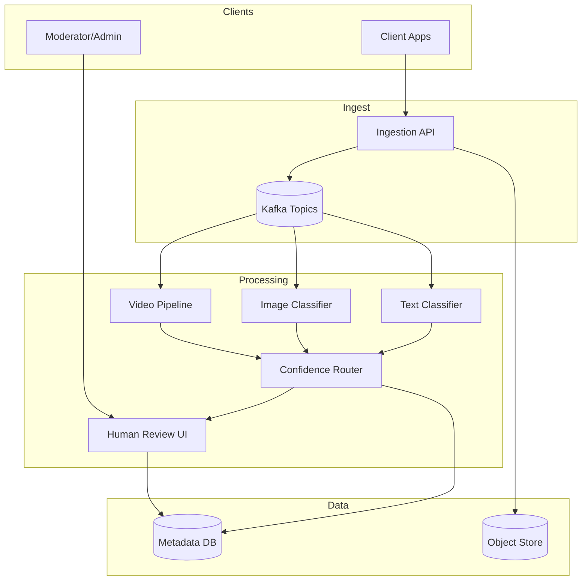

# 26-content-moderation-system - Content Moderation System
Generated: 2025-11-02 20:38:45 -05:00

---

<!-- Source: 01-requirements.md -->
# Requirements & Scale

## Functional Requirements
1. **AI Classification**: Text (hate speech, spam), Images (NSFW, violence), Video (frame-by-frame + audio analysis)
2. **Human Review Queue**: Escalate uncertain cases (confidence 50-80%) to moderators
3. **Appeals Process**: Users can appeal takedowns, secondary review by senior moderators
4. **Feedback Loop**: Moderator decisions retrain ML models (active learning)
5. **Multi-Language**: Support 100+ languages with locale-specific policies
6. **Real-Time**: Moderate content before publishing (pre-moderation) or immediately after (post-moderation)

## Non-Functional Requirements
**Performance**: <1s AI classification, <10s human review assignment
**Accuracy**: 99.5% precision (minimize false positives), 95% recall (catch harmful content)
**Scalability**: 100M items/day, 10K concurrent moderators
**Compliance**: GDPR (data retention 90 days), CSAM reporting (NCMEC)

## Scale Estimates
**Traffic**: 100M posts/day = 1,157 posts/sec avg, 5K posts/sec peak
**Content Mix**: 60% text, 30% images, 10% video
**Moderation**: AI handles 90% (pass/block), humans review 10% (1M items/day)
**Moderators**: 10K moderators × 100 reviews/day = 1M reviews/day capacity

**Infrastructure**:
- AI Servers: 100 GPU nodes (NVIDIA T4) for image/video classification
- Text NLP: 50 CPU nodes (BERT/GPT models)
- Review Platform: 20 web servers for moderator UI

**Cost**: ~$150K/mo (compute) + $10M/year (moderator labor @ $15/hr × 10K moderators)


---

<!-- Source: 02-architecture.md -->
# 2) High-Level Architecture (Most Detailed)



## Components

### 1. Content Ingestion API
Receives posts/comments/images/videos, queues for moderation, returns immediately (async moderation).

### 2. AI Classifiers
- **Text**: BERT-based hate speech/spam detection (50ms inference)
- **Images**: ResNet/EfficientNet for NSFW/violence (100ms inference)
- **Video**: Frame sampling (1 FPS) + audio transcription + classifier ensemble

### 3. Confidence-Based Routing
- High confidence (>80%): Auto-approve or auto-block
- Medium confidence (50-80%): Human review
- Low confidence (<50%): Re-classify with ensemble models

### 4. Human Review Queue
**Prioritization**: CSAM (P0, <5min SLA) > violence (P1) > hate speech (P2) > spam (P3)
**Load Balancing**: Assign tasks to moderators based on language, specialization (CSAM team), workload.

### 5. Appeals System
User submits appeal → senior moderator reviews → overturn or uphold → update training data.

### 6. Feedback Loop (Active Learning)
Moderator decisions → label queue → retrain models weekly → A/B test new model (shadow mode) → deploy.

## Data Flows

### Flow A: Text Moderation
1. User posts comment → Ingestion API → Kafka topic
2. Text Classifier (BERT) → confidence 65% (hate speech)
3. Route to Human Review Queue (medium confidence)
4. Moderator reviews → marks as hate speech → content blocked
5. Decision logged → training data for model retraining

### Flow B: Image Moderation (Auto-Block)
1. User uploads image → Ingestion API → S3
2. Image Classifier (ResNet) → confidence 95% (NSFW)
3. Auto-block (high confidence) → user notified
4. Log decision for audit

## API Design

**Submit Content**:
```http
POST /v1/moderate
{"type": "text", "content": "..."}
→ {"moderation_id": "uuid", "status": "pending"}
```

**Check Status**:
```http
GET /v1/moderate/{id}
→ {"status": "approved|blocked", "reason": "hate_speech", "confidence": 0.92}
```

## Monitoring
- **AI Accuracy**: Precision/recall per classifier (weekly audits)
- **Moderator Performance**: Reviews/hour, accuracy (spot-check by QA team)
- **Queue Latency**: p95 time-to-assignment (target <10s)
- **Appeals Rate**: % of blocks appealed (target <5%)


---

<!-- Source: 03-key-decisions.md -->
# Key Technical Decisions

## 1. Pre-Moderation vs. Post-Moderation
**Decision**: **Post-moderation** (publish first, moderate after) for user experience.
**Rationale**: Pre-moderation adds 1-10s delay (AI + human) → hurts UX. Post-moderation allows instant publish, take down within 1min if harmful.
**Reconsider**: For high-risk platforms (kids' apps), use pre-moderation.

## 2. Confidence Thresholds: Fixed vs. Adaptive
**Decision**: **Adaptive thresholds** based on content type/region.
**Rationale**: CSAM requires 99.9% recall (low threshold 30%) vs. spam tolerates false positives (high threshold 80%).
**Reconsider**: For simple use cases, fixed threshold (70%) is easier to tune.

## 3. Human Review: Centralized Queue vs. Per-Moderator Assignment
**Decision**: **Centralized queue** with load balancing.
**Rationale**: Avoids idle moderators (uneven workload), enables prioritization (CSAM first).
**Reconsider**: For specialized teams (CSAM experts), use dedicated queues.

## 4. Model Retraining: Batch vs. Online Learning
**Decision**: **Batch retraining** (weekly) with new labeled data.
**Rationale**: Online learning risks concept drift (model forgets old patterns). Batch allows validation before deploy.
**Reconsider**: For fast-evolving threats (new spam tactics), use daily retraining.

## 5. Video Moderation: Frame Sampling vs. Full Video
**Decision**: **Frame sampling** (1 FPS) + audio transcription.
**Rationale**: Full video analysis = 1000× cost (10 min video = 600 frames). Sampling catches most violations.
**Reconsider**: For high-risk content (live streams), use real-time full-frame analysis.

## 6. Appeals: Automatic Re-Review vs. Human Escalation
**Decision**: **Human escalation** to senior moderators.
**Rationale**: Appeals are low-volume (<5% of blocks), high-stakes (user trust). Humans provide empathy, nuance.
**Reconsider**: For spam/low-severity, use automatic re-classification.

## 7. CSAM Detection: Perceptual Hashing vs. ML Classification
**Decision**: **Both** (perceptual hashing for known images, ML for new variants).
**Rationale**: PhotoDNA hash catches 99% of known CSAM (instant lookup). ML catches new images (95% recall).
**Reconsider**: For non-CSAM use cases, ML-only is sufficient.

## 8. Multi-Language: Single Model vs. Per-Language Models
**Decision**: **Single multilingual model** (mBERT) for common languages, **per-language** for critical markets.
**Rationale**: Single model is simpler (one deployment), but per-language models are more accurate (99% vs. 95%).
**Reconsider**: For <10 languages, use per-language models (higher accuracy).


---

<!-- Source: 04-wrap-up.md -->
# Wrap-Up & Deep Dives

## Scaling Playbook

**Stage 1 (MVP)**: Single hate speech classifier (BERT), manual review queue, 10 moderators.
**Stage 2 (Production)**: Multi-class classifiers (hate, NSFW, spam), 1K moderators, appeals system, weekly retraining.
**Stage 3 (Scale)**: Ensemble models, 10K moderators, real-time video moderation, active learning, regional compliance (GDPR, CCPA).

## Failure Scenarios
- **Classifier Down**: Fall back to human review for all content (100× queue backlog).
- **False Positive Spike**: Retrain model immediately, manual review of recent blocks.
- **CSAM Miss**: Report to NCMEC within 24h (legal requirement), audit model.

## SLO Commitments
- **CSAM Detection**: 99.9% recall (catch harmful content)
- **False Positive Rate**: <0.5% (minimize wrongful blocks)
- **Human Review Latency**: p95 <10s assignment, <5min resolution for P0 (CSAM)
- **Appeals Turnaround**: <24h for standard, <1h for urgent

## Common Pitfalls
1. **Overfitting to Training Data**: Model memorizes examples, fails on new patterns. Use diverse training data.
2. **Moderator Burnout**: Viewing harmful content daily causes PTSD. Rotate moderators, provide counseling.
3. **No Appeals Process**: Users feel helpless when wrongfully blocked. Always allow appeals.
4. **Ignoring Edge Cases**: Sarcasm, satire, cultural context confuse AI. Use human review for borderline cases.
5. **Static Thresholds**: Spam tactics evolve → model accuracy degrades. Retrain weekly.

## Interview Talking Points
- **AI + Human Hybrid**: "AI handles 90% (high-confidence), humans review 10% (uncertain cases) → cost-efficient scaling."
- **Confidence-Based Routing**: "Score 95% → auto-block, 65% → human review, 30% → approve (CSAM uses lower threshold for recall)."
- **Active Learning**: "Moderator decisions → training data → retrain weekly → improve model accuracy from 95% → 97%."
- **CSAM Compliance**: "Perceptual hashing (PhotoDNA) for known images + ML for new variants → report to NCMEC within 24h."

## Follow-Up Questions
1. **Adversarial Attacks**: How do you detect users bypassing filters (leetspeak: "h4t3" instead of "hate")?
2. **Multi-Modal**: Combine text + image (meme with hateful caption) for holistic moderation?
3. **Real-Time Video**: Moderate live streams with <1s latency (frame-by-frame + audio)?
4. **Explainability**: Show users why content was blocked (SHAP values for transparency)?
5. **Cross-Platform**: Moderate content across web, mobile, VR (different abuse patterns)?

**Final Thought**: Content moderation balances **safety** (catch harmful content) with **freedom of speech** (minimize false positives). The key challenge is **context**—same word can be harmless or hateful depending on tone, culture, intent. AI provides scale, humans provide nuance.


